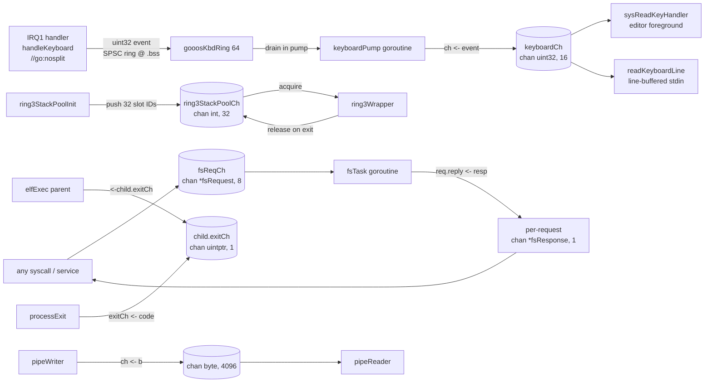
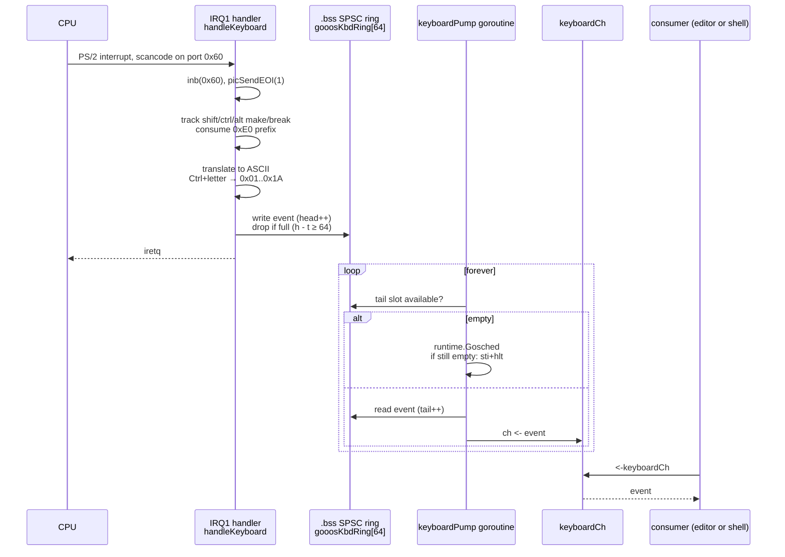
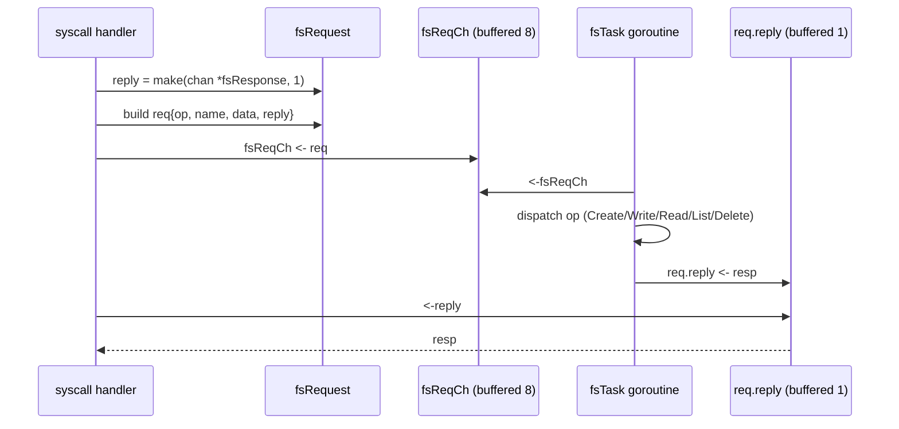
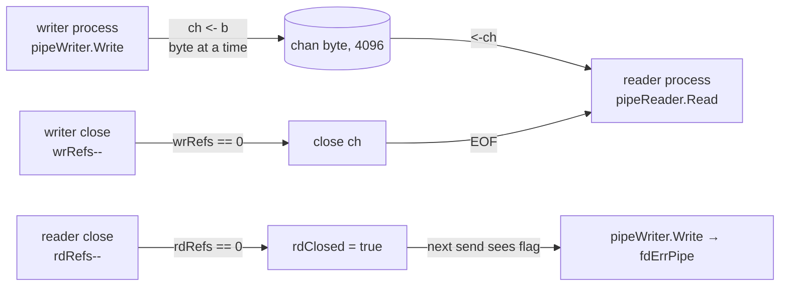
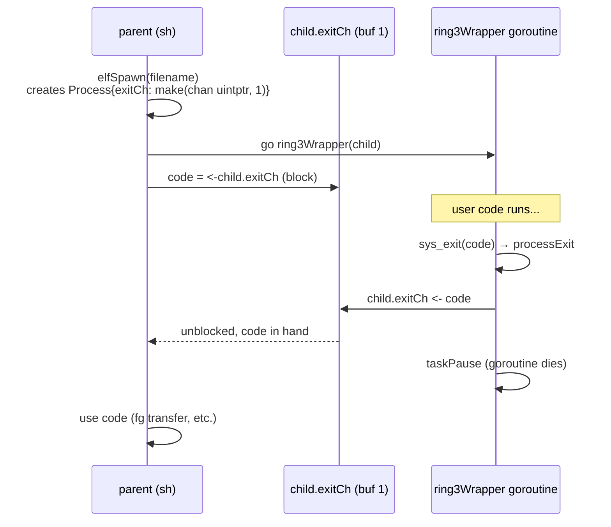
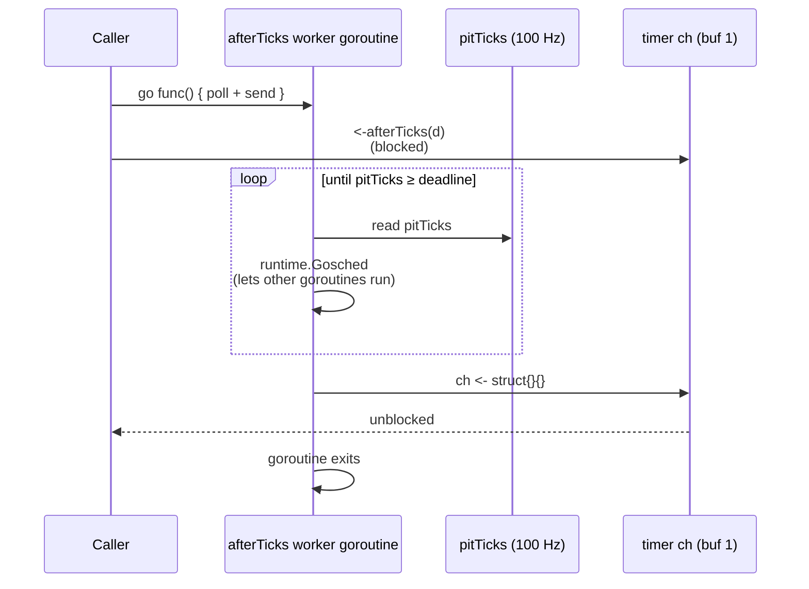

# Inter-Goroutine Communication (IPC)

gooos does not implement any bespoke IPC primitive. Every
message-passing channel is a **native Go `chan`** constructed
by the TinyGo runtime; every service is a goroutine. The
scheduler, block/unblock, and select logic live in TinyGo's
`runtime/scheduler_*.go` — we wire gooos state into those
primitives rather than building alternatives.

## Channel Topology



Every arrow is a TinyGo `chan` send or receive. The
scheduler's `runqueue` / `sleepQueue` / `timerQueue` handle all
blocking.

## Package-Level Channels

| Name | Type | Buffer | Source | Purpose |
|---|---|---|---|---|
| `keyboardCh` | `chan uint32` | 16 | `src/keyboard_irq.go:31` | drained by `keyboardPump`; fed from the `.bss` SPSC ring that the IRQ1 handler writes |
| `fsReqCh` | `chan *fsRequest` | 8 | `src/fs.go:186` | serializes every FS op through the single `fsTask` goroutine |
| `ring3StackPoolCh` | `chan int` | 32 | `src/ring3_pool.go:28` | free list of pre-allocated Ring-3 kernel stacks |

Every other channel is **per-request / per-process**:

- `fsRequest.reply`: `chan *fsResponse, 1` — created per FS
  op so the caller gets its own reply without races.
- `Process.exitCh`: `chan uintptr, 1` — one per spawned
  process; the parent blocks on `<-child.exitCh`.
- Pipe backing channel: `chan byte, 4096` — one per pipe.
- `afterTicks(d)` return channel: `chan struct{}, 1` — one
  per timer.

## Keyboard Input Path



Key design: **the ISR never touches a Go `chan`.** Channel
sends under `//go:nosplit` are not safe (TinyGo's runtime may
alloc during hash ops). The lock-free SPSC ring + pump goroutine
bridges IRQ context to goroutine context cleanly.

## Filesystem Service



A single `fsTask` goroutine serializes all FS access — no lock
on the 32-entry `FileSystem` array needed. Wrappers in
`src/fs.go:211+` (`fsSendCreate`, `fsSendRead`, `fsSendWrite`,
`fsSendList`, `fsSendDelete`) hide the channel dance from
handlers.

## Pipes (`src/pipe.go`)



- **Backing**: one 4 KiB `chan byte` per pipe.
- **Refcounted ends**: `pipe.rdRefs` and `pipe.wrRefs` (one per
  fd holding that end). `fdAddRef` bumps on fd inheritance; the
  end closes only when all refs go to 0.
- **Writer-close → reader EOF**: the last `pipeWriter.Close()`
  calls `close(ch)`, so the reader's `<-ch` sees channel closed.
- **Reader-close → writer EPIPE**: the last `pipeReader.Close()`
  sets `rdClosed = true`; the writer's next `Write` sees it
  and returns `fdErrPipe`.

Pipes are the backbone of `cmd1 | cmd2 | ... | cmdN` N-stage
pipelines. Each stage runs in its own process (with its own
PML4) and connects via `Dup2` onto fd 0 / fd 1.

## Process Exit Synchronization



Buffered capacity 1 so the child's send never blocks — even if
the parent is still unwinding housekeeping.

## `afterTicks` — Timer Replacement for `time.After`

`src/afterticks.go`:

```go
func afterTicks(d uint64) <-chan struct{} {
    ch := make(chan struct{}, 1)
    go func() {
        deadline := pitTicks + d
        for pitTicks < deadline {
            runtime.Gosched()
        }
        ch <- struct{}{}
    }()
    return ch
}
```



Why not `time.After`? The TinyGo `time` package (through
`reflect`) pulls in SSE-using code that we keep disabled.
`afterTicks` is a 10-line replacement that uses only `pitTicks`
(a plain uint64) and `runtime.Gosched`.

The `sysSleepHandler` uses `afterTicks` too — if it used
`time.Sleep`, it would route through the kernel's patched
`sleepTicks` (a `sti; hlt; cli` busy loop), stalling every
other goroutine.

## Select Usage

Native `select` is available and used internally by the
scheduler, but gooos service code rarely needs it. The one
notable call site is Ring-3 `sys_read` on a pipe: the
`pipeReader.Read` wrapper uses a `select` over `pipe.ch` and a
close-detection path (simplified; see `src/pipe.go`).

Userspace programs — `gochan.elf` in particular — exercise
`select` directly from Ring 3, proving the end-to-end path
works.

## Reviewer MINOR notes

(Filled after the reviewer pass; none initially.)
