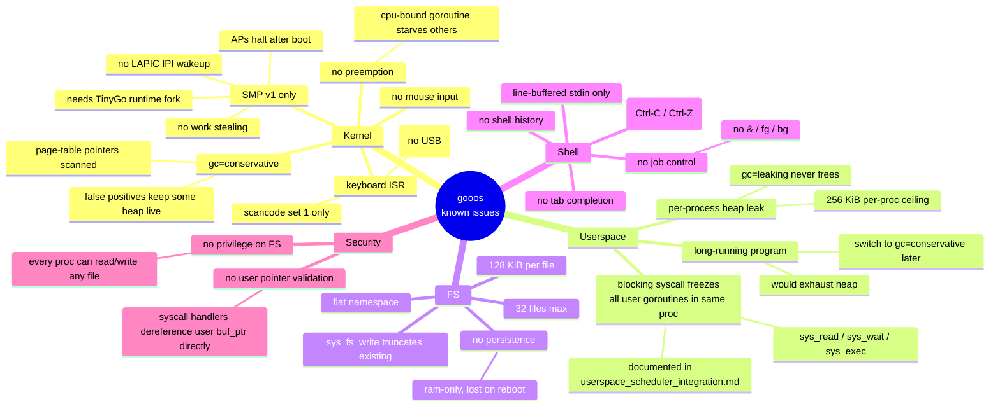
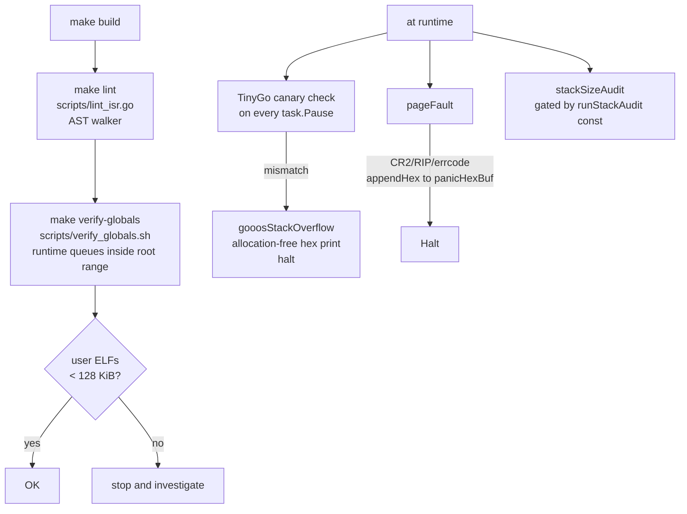

# Known Issues, Limitations, and Deferred Items

## Risk Taxonomy



## Active Limitations (by subsystem)

### Kernel

| Limitation | Impact | Tracking |
|---|---|---|
| SMP v1: APs halt after boot | BSP runs every goroutine; no true parallelism | `impldoc/deferred_smp_v2.md` |
| No preemption | CPU-bound goroutine starves the scheduler | mitigated by channel-driven design |
| Keyboard is PS/2 scancode set 1 only | No USB HID support; depends on QEMU/BIOS providing PS/2 | N/A — v1 target is QEMU only |
| `time` package broken (SSE dependency) | Can't use `time.After`, `time.Sleep` is parking-unsafe in handlers | worked around by `afterTicks` (`src/afterticks.go`) |
| No mouse input | Editor is keyboard-only | intentional |
| Cursor/VGA: 80×25 text mode only | No graphics, no Unicode | `impldoc/editor_overview.md` §11 |

### Userspace

| Limitation | Impact | Tracking |
|---|---|---|
| `gc=leaking` on user target | Every allocation permanent; 256 KiB heap ceiling | user_gc_and_stacks.md §1 |
| Blocking syscall freezes co-goroutines in same process | A goroutine parked in `sys_read` holds the whole process's ring3Wrapper; other user goroutines can't run | `impldoc/userspace_scheduler_integration.md` §4 |
| `fib(10)` exhausts heap | 177 recursive calls × Env allocations > 256 KiB | tinyc tests use fib(7) |
| `edit.elf` max file ≈ 128 KiB | bounded by `maxFileData` in `src/fs.go:12` | `src/fs.go:12` |

### Shell & I/O

| Limitation | Impact |
|---|---|
| Line-buffered stdin | No `Ctrl-C` to kill, no arrow-key history recall |
| No shell history / tab completion / job control | interactive UX is minimal |
| No signals of any kind | `sys_sleep` cannot be interrupted; `sys_wait` always completes |
| No `&` / `fg` / `bg` | every pipeline stage is blocking-waited |

### Security

| Issue | Risk |
|---|---|
| No user-pointer validation | syscall handlers dereference user-provided addresses without bounds-checking; malicious Ring-3 could read/write kernel memory |
| No per-process file permissions | any process can read/write/delete any file in the FS |
| No ASLR, no stack canaries (user-side), no SMEP/SMAP | accepted for a toy OS |

## Active Workarounds

### `sys_sleep` uses `afterTicks`, not `time.Sleep`

`src/userspace.go:sysSleepHandler`:

```go
<-afterTicks(ticks)
```

Why: the kernel's patched `sleepTicks` (runtime_gooos.go) is a
`sti; hlt; cli` busy loop used by the scheduler idle path — it
doesn't park the calling goroutine. If `sysSleepHandler` used
`time.Sleep`, it would call `sleepTicks` and stall every other
kernel goroutine until the delay expired. `afterTicks` spawns a
yielding worker and parks the caller on a channel.

### `gooosOnResume` `//go:nosplit` + cached proc pointer

`src/goroutine_tss.go:175`. Map lookup on every goroutine
resume is expensive and technically unsafe under nosplit — the
cached `gi.proc` in the `gInfo` struct lets the CR3 swap
proceed without a second map probe.

### Ring-3 kernel-stack pool

`src/ring3_pool.go`. Each Ring-3 process needs an 8 KiB kernel
stack for the TSS.RSP0. Under `gc=conservative` the stack
would eventually be collected, but the 8 KiB per exec is a
measurable leak during normal shell sessions. The pool (32
slots) recycles the stacks.

### VGA hardware cursor disable on clear

`src/vga.go:vgaConsoleClear`. When the editor exits via
`VgaClear`, we disable the hardware cursor by setting bit 5 of
CRTC register 0x0A. Otherwise the cursor lingers on the shell
in its last editor position after `:q`.

### `fib(10)` → `fib(7)` in Tiny C tests

`src/main.go`. Documented as a heap-budget limit, not a
correctness issue. The interpreter supports deeper recursion;
the default 256 KiB user heap doesn't.

### ReadFile buffer expanded to 128 KiB

`user/gooos/fs.go`. Previously 64 KiB, silently truncated any
file > 64 KiB even though `maxFileData` is 128 KiB. Bumped to
131072 as part of the editor work.

### `afterTicks` single-dispatcher timer wheel

`src/afterticks.go`. The naive `afterTicks` implementation —
one goroutine spawn per call — accumulated unreclaimed Task
structs because gooos's patched TinyGo runtime (both the
former `scheduler=tasks` and the current `scheduler=cores`
builds) has no task free-list. Repeated hot-loop callers
(TCP RTO scanner, kernel echo idle poll, netsock wait loops)
produced a late-timing RX stall: kernel-goroutine scheduling
collapsed ~12-16 s after Ring-3 startup and
`scripts/test_tcp_latetiming.sh` FAILed. The fix replaces the
per-call spawn with one long-lived `timerDispatcher` goroutine
that walks a fixed-size `[256]timerEntry` list on every
Gosched cycle and fires matured channels. Signature of
`afterTicks(uint64) <-chan struct{}` unchanged so all call
sites stay as-is. Lock-order rank 12 for the timer list.
Overflow (>256 pending waiters) fires immediately rather than
blocking. See `TODO_NET4.md` and
`tcp_problem_review2/` for the investigation trail.

## Deferred Items (post-v1 features)

Grouped by origin:

### From `impldoc/userspace_goroutines_*`

- Preemptive scheduling inside a user process.
- Non-blocking syscall variants (`sys_poll`, async I/O).
- Multi-thread user processes (cross-CPU).
- Runtime stack-audit on first exec.

### From `impldoc/editor_*`

- Undo/redo (heap-cost concern under `gc=leaking`).
- Horizontal scrolling for lines > 80 chars.
- Syntax highlighting.
- Multiple buffers / split panes.
- Search (`/`, `?`).
- Mouse input (no PS/2 mouse driver).
- Unicode / multi-byte characters.

### From `impldoc/tinyc_*`

- Interactive REPL mode.
- String-typed variables.
- `&&` / `||` operators.
- Runtime error line numbers (needs Line field on AST nodes).

### From `impldoc/deferred_*` (historic)

- Proper preemption (timer-driven user-goroutine yield).
- `runtime.LockOSThread`.
- ACPI shutdown (`sys_halt` / power off).
- Dynamic heap growth (switch user to `gc=conservative`).
- Filesystem persistence (ATA driver, block layer).

## Monitoring and Guard Rails



Build-time: `lint_isr` rejects string-concat, channel ops, and
`go` statements inside ISR-reachable functions. `verify-globals`
ensures `runqueue`/`sleepQueue`/`timerQueue` live inside
`_globals_start..end` so the conservative GC's root scan covers
them.

Runtime: canary check fires `gooosStackOverflow`
(`src/panic.go`) with a no-alloc hex dump; page faults land in
`handlePageFault` with CR2/RIP/errcode formatted into
`panicHexBuf` in `.bss`. Both halt cleanly.

## What Is NOT a Known Issue

Common questions that arise from skimming the code but are
intentional / worked around:

| Looks suspicious | Actually |
|---|---|
| User target has `gc=leaking` | Intentional for short-lived programs; `gc=conservative` costs ≥20 KiB ELF + scan overhead |
| SMP v1 only has one core running anything | Per design; v2 needs a TinyGo runtime fork |
| `sys_sleep` uses `afterTicks` not `time.Sleep` | Required — kernel `sleepTicks` does not park |
| Ring-3 wrapper is `//go:nosplit` sensitive | Map lookup inside is safe under TinyGo's hashmap |
| Editor only works at 80×25 | That's the VGA text-mode we target |
| `fib(7)` instead of `fib(10)` in test | Heap ceiling — the interpreter handles deeper recursion if the heap is larger |

## Reviewer MINOR notes

Reviewer pass (subagent, 2026-04-16):
**CRITICAL=0, MAJOR=3 (all fixed), MINOR=7 (4 fixed, 3 noted).**

Fixed:
- `userland.md` classDiagram dots → underscores (Mermaid
  treats `.` as namespace sep; diagram failed to render).
- `syscalls.md` clarified `sys_read_key` writes 4 bytes (buffer
  is 8B in the userspace wrapper for alignment).
- `memory.md` split the combined allocPage/freePage
  stateDiagram into two separate diagrams (both had `[*]` entry,
  which fused them).
- `scheduler.md` `checkTaskOffset` line ref 71 → 77.
- `overview.md` preemption source path clarified to note
  `runtime_gooos.go` is under `~/.local/tinygo/`, not `src/`.
- `overview.md` CR3-swap phrasing narrowed to Ring-3 goroutines.
- `known_issues.md` `maxFileData` wording clarified (the FS
  entry is 32 pages, not "single-page").

Noted (not fixed):
- `README.md:17,21` still says "12 syscalls" / "18 syscalls";
  out of scope for this doc-only rewrite, but mention for the
  next README touch-up.
- `src/userspace.go:3` file header still says "12-syscall ABI";
  source-comment fix, not a docs issue.
- No dedicated section on `lint_isr.go` grammar (mentioned in
  passing only).
