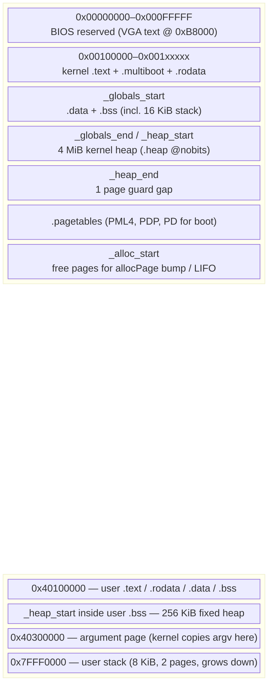
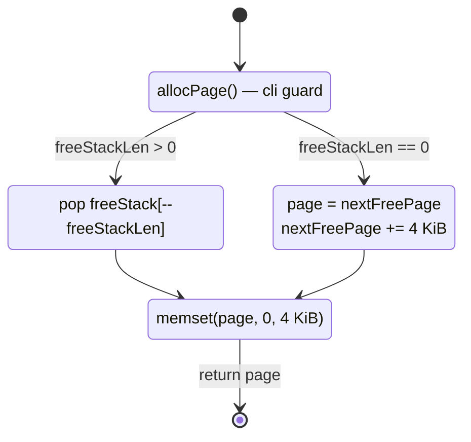
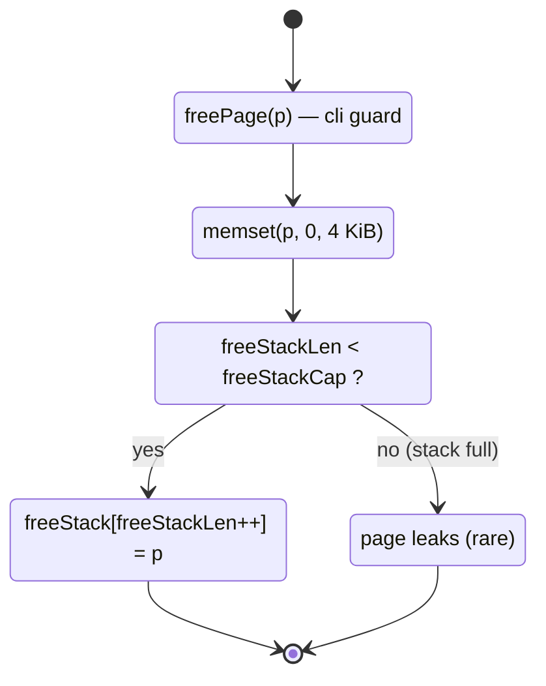
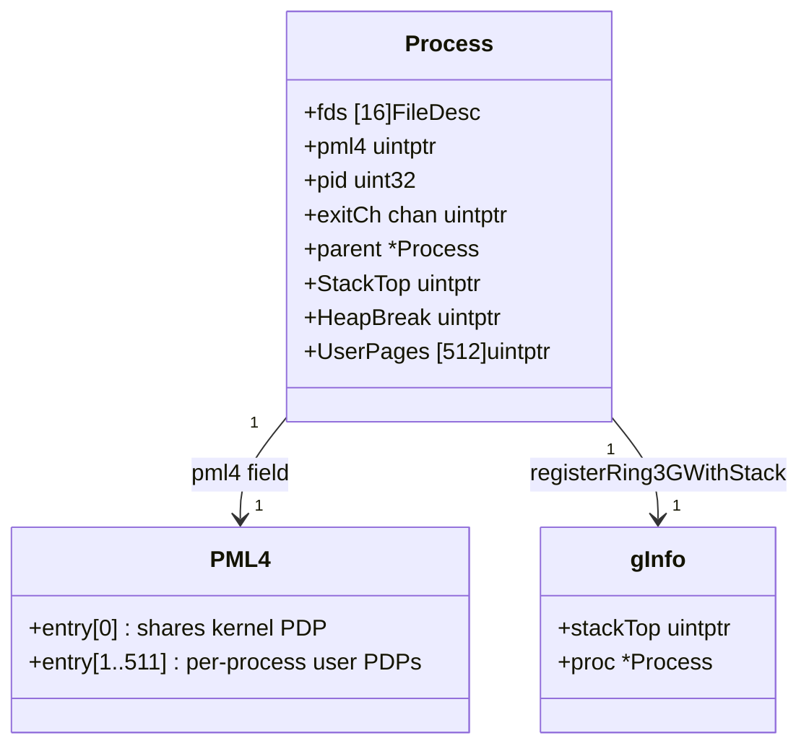
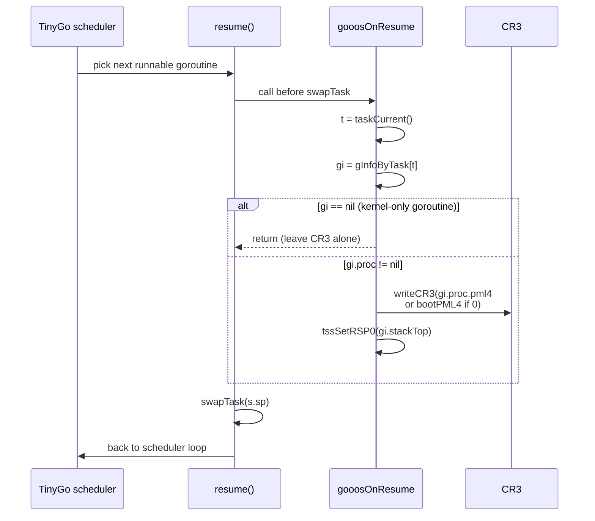
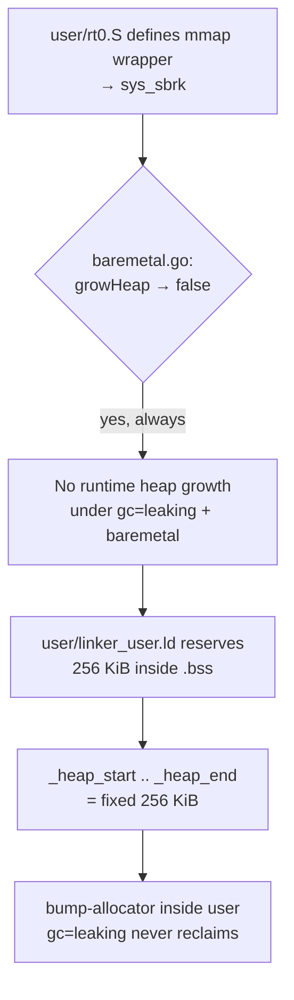
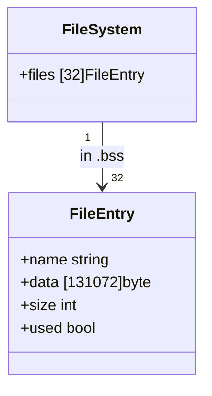

# Memory Management

gooos runs in 64-bit long mode with a single identity-mapped
kernel region and per-process user page tables layered on top.

## Physical / Virtual Memory Map



### Kernel Linker Script (`src/linker.ld`)

```ld
SECTIONS {
    . = 0x100000;                       /* load @ 1 MiB */
    .multiboot : ALIGN(4)  { KEEP(*(.multiboot)) }
    .text      : ALIGN(16) { *(.text .text.*) }
    .rodata    : ALIGN(16) { *(.rodata .rodata.*) }
    _globals_start = .;                 /* conservative-GC root range begin */
    .data      : ALIGN(16) { *(.data .data.*) }
    .bss       : ALIGN(4096) { *(COMMON) *(.bss .bss.*) }
    _globals_end = .;
    .heap      : ALIGN(4096) {          /* 4 MiB reserved for kernel heap */
        _heap_start = .;
        *(.heap)
        _heap_end = .;
    }
    . += 4096;                          /* guard gap */
    .pagetables : ALIGN(4096) { *(.pagetables) }
    . = ALIGN(4096);
    _alloc_start = .;                   /* bump allocator base */
    _stack_top = stack_top;             /* re-exported for GC stack scan */
}
```

- **Identity map**: `boot.S` builds a single PML4 + PDP + PD
  covering `[0, 1 GiB)` with 512 × 2 MiB huge pages.
- **User pages** (0x40000000 and above) are mapped at 4 KiB
  granularity by `elfSpawn` / `elfLoad`, each with
  `pagePresent | pageWrite | pageUser`.
- **`_globals_start..end`** is the range the conservative GC
  scans for live pointers. `scripts/verify_globals.sh` asserts
  every TinyGo runtime queue (`runqueue`, `sleepQueue`,
  `timerQueue`) lands inside this window.

## Page Allocator (`src/vm.go`)

Bump + LIFO free-stack hybrid. Freed pages are pushed onto a
`.bss`-resident stack; the next `allocPage()` pops the most
recently freed page. The stack is bounded to keep metadata
small (`freeStackCap = 4096`, i.e. 32 KiB of `.bss`).

**`allocPage` path**:



**`freePage` path**:



### API Summary

| Function | Purpose | Notes |
|---|---|---|
| `allocPage() uintptr` | 4 KiB page | Free-stack first, then bump |
| `freePage(p)` | Return a page | Zeroes; drops if stack full |
| `allocPagesContig(n)` | `n` contiguous pages | Bump only (bypasses stack) — used for kernel stacks |
| `mapPage(va, pa, flags)` | Map into current PML4 (boot CR3) | 4 KiB granularity |
| `unmapPage(va)` | Unmap + `invlpg` | |
| `mapPageInto(pml4, va, pa, flags)` | Map into a specific PML4 | Used by `elfSpawn` for child processes |
| `walkAndGetPaddrIn(pml4, va)` | Walk a per-process PML4 | Read-only |

All allocation/mapping functions run with CLI set
(`readFlags` + `restoreFlags`) so an ISR cannot observe
half-written page tables.

## Per-Process PML4

Since 4e (commit `b96f83d`), each user process owns its own PML4
page. The PML4 shares PDP[0] with the kernel's boot PML4, so
kernel addresses (< 1 GiB) remain valid in every process. User
virtual addresses (≥ 1 GiB) are per-process.



### CR3 Swap on Goroutine Resume



`gooosOnResume` is `//go:nosplit` and must not allocate — the
map lookup is the only heap touch, and the cached `gi.proc`
pointer lets us avoid a second map probe for the CR3 swap.

## User Heap Model



- **256 KiB user heap** per process, reserved at link time
  inside `.bss` so the kernel's ELF loader maps it as
  PT_LOAD memsz pages.
- **`gc=leaking`**: every `make`, `append`, `new`, goroutine
  stack allocation is permanent. Fine for short-lived user
  programs; larger programs should escalate to `gc=conservative`.
- `sys_sbrk` exists and `HeapBreak` is tracked per-process,
  but the current user runtime (baremetal.go) never calls
  `mmap`/`sbrk` — the fixed reservation is enough.

## In-Memory Filesystem (`src/fs.go`)

The FS is a flat 32-entry table in `.bss`. Each entry holds
`maxFileData = 131072` bytes (128 KiB) → 4 MiB total FS
footprint. Served by the `fsTask` goroutine over the
`fsReqCh` channel (see `ipc.md`).



Sized to absorb the current largest user binary
(`tinyc.elf` at ~124 KiB) with a doubling-ahead headroom per
policy.

## Reviewer MINOR notes

(Filled after the reviewer pass; none initially.)
