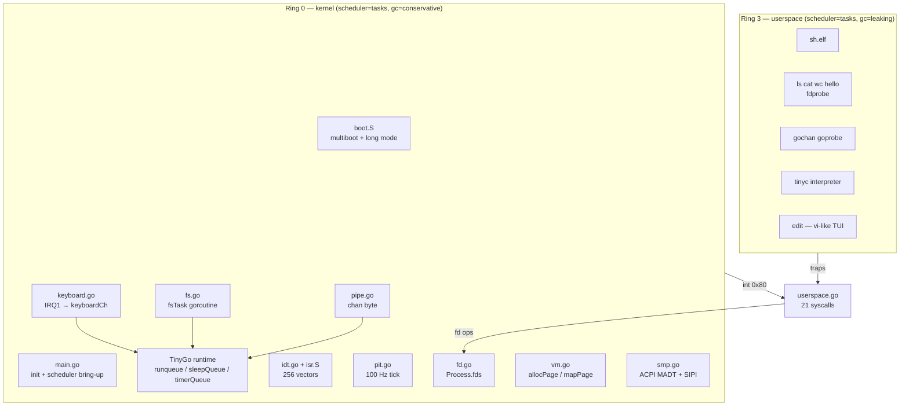
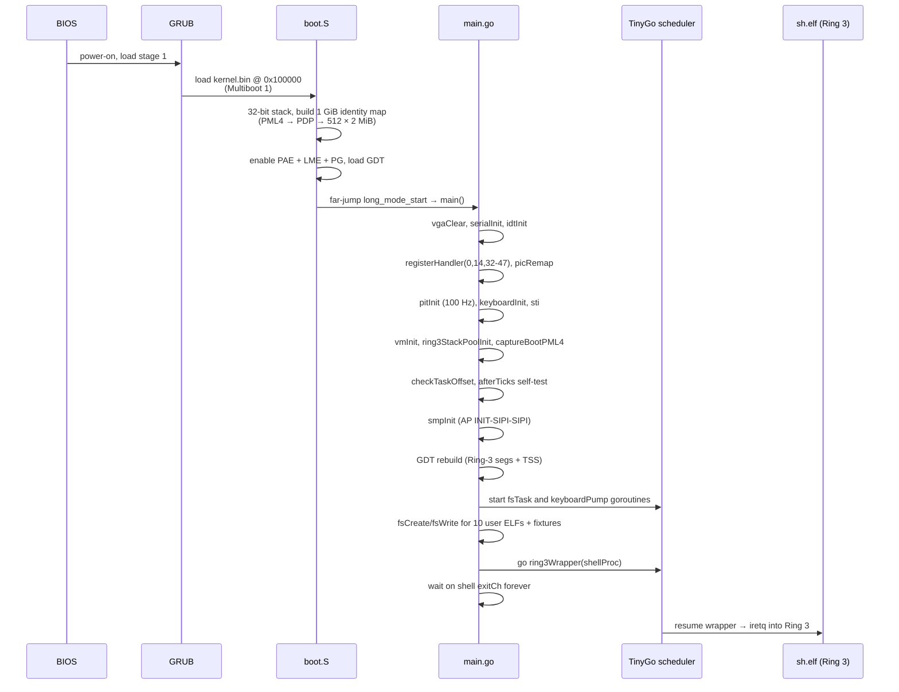

# gooos Architecture Overview

## What is gooos

An experimental x86_64 operating system written in **Go (TinyGo
0.33.0) + GNU assembly**. The kernel runs on **TinyGo's native
goroutine runtime** (`scheduler=tasks`, `gc=conservative`):
service loops are plain `go func()` goroutines, IPC uses Go's
built-in `chan` and `select`, and Ring-3 processes are
goroutines that `iretq` into userspace. User binaries run on
their own TinyGo tasks runtime with native `go`/`chan`/
`select`/`time.Sleep` enabled.

## Component Map

Every service (FS, keyboard pump, per-process Ring-3 wrapper)
is a goroutine. Communication is by native `chan`. The kernel
image contains **no custom scheduler** — `src/scheduler.go`,
`src/channel.go`, and the hand-rolled wait-queue code from
early gooos were retired when the TinyGo-tasks migration
landed (commit `7a5ef02`, "Phase B big-bang").

## Boot Sequence

Key invariant: `long_mode_start` does **not** call gooos
code directly; it jumps through TinyGo's `main` entry
(`runtime_gooos.go`, installed by
`scripts/tinygo_runtime.patch`), which runs package inits and
then invokes `main.main()`. Our kernel `main()` lives in
`src/main.go`.

## Build Pipeline

```mermaid
flowchart LR
    UserSrc[user/cmd/*.go<br/>user/gooos/*.go] -->|tinygo build<br/>target=user/target.json| UserO[user/build/*_go.o]
    UserAsm[user/rt0.S<br/>task_stack_amd64.S<br/>runtime_asm_amd64.S] -->|as --64| UserAsmO[user/build/*.o]
    UserO -->|ld.lld<br/>linker_user.ld| UserElf[user/build/*.elf<br/>10 binaries]
    UserElf -->|scripts/embed_elfs.sh| UserBins[src/user_binaries.go<br/>Go byte arrays]

    KernelSrc[src/*.go] -->|tinygo build<br/>target=src/target.json| KernelGo[tmp/kernel_go.o]
    KernelAsm[src/boot.S isr.S stubs.S<br/>switch.S trampoline.S<br/>task_stack_amd64.S<br/>runtime_asm_amd64.S] -->|as --64| KernelAsmO[tmp/*.o]
    UserBins --> KernelSrc
    KernelGo --> Link[ld.lld<br/>src/linker.ld]
    KernelAsmO --> Link
    Link --> KernelBin[tmp/kernel.bin]
    KernelBin -->|scripts/verify_globals.sh| Verified[verify-globals: OK]
    KernelBin -->|grub-mkrescue| Iso[tmp/kernel.iso]
    Iso -->|qemu-system-x86_64| Run
```

- **`make build`** runs lint → embed-user → kernel build → verify-globals.
- **`make iso`** wraps the kernel in a bootable ISO.
- **`make run`** boots the ISO in QEMU with serial→stdio.

## Scheduler Model

| Property | Value | Source |
|---|---|---|
| Kernel scheduler | TinyGo `scheduler=tasks` | `src/target.json:9` |
| Kernel GC | `conservative` | `src/target.json:8` |
| User scheduler | TinyGo `scheduler=tasks` | `user/target.json:9` |
| User GC | `leaking` | `user/target.json:8` |
| Preemption | **cooperative** — PIT IRQ fires but doesn't preempt goroutines | `src/pit.go` + `~/.local/tinygo/src/runtime/runtime_gooos.go` (patched) |
| Goroutine count | unbounded (heap-allocated tasks) | TinyGo runtime |
| Active kernel goroutines at shell-start | `fsTask`, `keyboardPump`, `ring3Wrapper(sh)`, plus transient `afterTicks` workers | `src/main.go` |

A Ring-3 process is a kernel goroutine running
`ring3Wrapper(proc)` (`src/process.go:164`). That goroutine
owns a pool-allocated 8 KiB kernel stack (used for TSS.RSP0
during int 0x80), then `iretq`s into Ring 3. On every Ring-3
goroutine resume, the patched TinyGo scheduler calls
`gooosOnResume` (`src/goroutine_tss.go:175`), which sets
TSS.RSP0 and swaps CR3 to the process's per-process PML4.
Kernel-only goroutines (fsTask, keyboardPump, afterTicks
workers) have `gInfoByTask[t] == nil` and the hook is a no-op
for them.

## Key Design Decisions

| Decision | Rationale | Source |
|---|---|---|
| TinyGo (not standard Go) | Bare-metal support, small binary, `gc`/`scheduler` control | `src/target.json` |
| `scheduler=tasks` for kernel AND user | Native `go`/`chan`/`select` in both rings; no custom scheduler to maintain | commit `7a5ef02` (Phase B) |
| `gc=conservative` for kernel | Mark/sweep keeps the `.bss` heap bounded | `src/target.json:8` |
| `gc=leaking` for user | No mark/sweep overhead for short-lived processes | `user/target.json:8` |
| `kernelspace` build tag | Split kernel vs user runtime bodies in the same patched TinyGo tree | `impldoc/userspace_tinygo_runtime.md` |
| Per-process PML4 | Separate user address spaces; CR3 swap on every goroutine resume | `src/process.go` + `goroutine_tss.go` |
| Embedded user ELFs | No disk I/O; binaries compiled into kernel `.rodata` via `src/user_binaries.go` | `scripts/embed_elfs.sh` |
| `afterTicks` instead of `time.After` | The TinyGo `time` package depends on SSE instructions we keep disabled | `src/afterticks.go` |
| Ring-3 kernel-stack pool | Reclaim 8 KiB per exec; avoids per-exec heap leak | `src/ring3_pool.go` |
| Static `verify-globals` check | Asserts every TinyGo runtime queue lives inside the conservative-GC root range | `scripts/verify_globals.sh` |

## Feature Status (abridged, Apr 2026)

See `README.md` for the full progress table. Highlights:

- **Shell I/O**: `<`, `>`, `>>` redirection and N-stage `|` pipes.
- **Multi-process**: `sys_spawn` + `sys_wait`, per-process PML4.
- **Userspace goroutines**: `scheduler=tasks` in Ring 3 — native
  `go func()`, `chan`, `select`, `time.Sleep` inside user
  programs.
- **Tiny C interpreter** (`tinyc.elf`): tree-walking interpreter
  for a C-subset toy language.
- **vi-like text editor** (`edit.elf`): modal TUI editor using
  raw keyboard input + VGA cell/cursor syscalls.
- **SMP v1**: ACPI MADT discovery + INIT-SIPI-SIPI; APs halt
  after reporting (no per-CPU runqueue; deferred to SMP v2).

## Document Set

| File | Scope |
|---|---|
| `overview.md` (this file) | Big picture, boot, build |
| `memory.md` | Memory layout, page allocator, per-process PML4 |
| `scheduler.md` | TinyGo scheduler integration, Ring-3 wrapper |
| `ipc.md` | Channels, fsTask, keyboardPump, pipes |
| `syscalls.md` | 21-syscall ABI + dispatch |
| `userland.md` | User target, SDK, ELF lifecycle, user programs |
| `known_issues.md` | Active limitations + deferred items |

Per-feature design docs (e.g., the userspace-goroutines set, the
Tiny C interpreter design, the editor raw-input design) live
under `impldoc/` and are the detailed historical record for
each landing.
