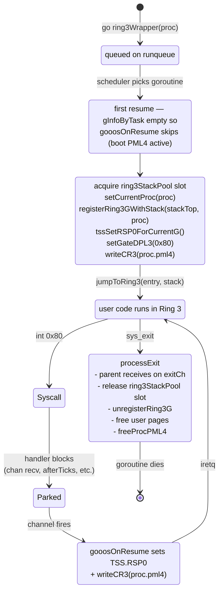

# Scheduler and Process Lifecycle

gooos **does not have a custom scheduler**. Every running
thing in the kernel — service loops, Ring-3 wrappers,
`afterTicks` timers, per-process exit watchers — is a TinyGo
goroutine. TinyGo's `scheduler=tasks` runtime (loaded from
`~/.local/tinygo/src/runtime/scheduler_any.go` + a few gooos
patches) does all the context-switching.

## Scheduler Anatomy

```mermaid
block-beta
    columns 2
    block:queues
        columns 1
        RQ[runqueue<br/>FIFO of runnable tasks]
        SQ[sleepQueue<br/>delta-encoded]
        TQ[timerQueue<br/>whenTicks-ordered]
    end
    block:hooks
        columns 1
        Pause[task.Pause<br/>canary check<br/>→ swapTask]
        Resume[task.resume<br/>gooosOnResume<br/>swapTask]
        SleepTicks[sleepTicks<br/>sti/hlt/cli busy wait]
    end
    queues --> hooks : drive
```

- **`runqueue`**: ready-to-run goroutines. `Gosched()` pushes
  the current task and pops the next.
- **`sleepQueue`**: tasks blocked via `time.Sleep` (or rather
  `runtime.sleep` → `addSleepTask`). Delta-encoded; wake
  conditions: `now - sleepQueueBaseTime >= sleepQueue.Data`.
- **`timerQueue`**: armed `time.Timer`/`time.After` callbacks.
  gooos uses **`afterTicks`** (see `ipc.md`) rather than
  `time.After` because the `time` package brings SSE-using
  code that we've disabled.

## gooos Hooks into TinyGo's Runtime

Patched files under `~/.local/tinygo/src/` (via
`scripts/tinygo_runtime.patch`):

| File | Hook |
|---|---|
| `runtime/runtime_gooos.go` | kernel bodies: `sleepTicks`, `ticks`, `putchar`, `exit`, `main` |
| `runtime/runtime_gooos_user.go` | userspace bodies (same symbols, via syscalls) |
| `runtime/interrupt/interrupt_gooos.go` | kernel `Disable`/`Restore`/`In` |
| `runtime/interrupt/interrupt_gooos_user.go` | userspace no-ops |
| `internal/task/task_stack.go` | adds `state.stackTop` + `gooosStackOverflow` call on canary mismatch |
| `internal/task/task_stack_amd64.go` | calls `gooosOnResume` from `resume()` |

The two runtime bodies are gated by the `kernelspace` build tag
(on kernel `src/target.json`). User builds omit it, so the
userspace file is selected.

## `gooosOnResume` — The Critical Hook

Called from `internal/task/task_stack_amd64.go:resume()` on
every goroutine switch, BEFORE `swapTask` loads the new stack.


`gooosOnResume` lives at `src/goroutine_tss.go:175` and is
`//go:nosplit` — the entire body must be heap-touch-free
(except the one `gInfoByTask` map read; see
`impldoc/phase_b_ring3_and_exec.md` for why the map path is
safe in practice).

## Ring-3 Wrapper Lifecycle

Every Ring-3 process is a goroutine running `ring3Wrapper(proc)`
(`src/process.go:164`):



Critical ordering in `ring3Wrapper` setup:

1. `ring3StackAcquire()` — grab a pool-owned 8 KiB kernel stack (becomes TSS.RSP0 during int 0x80).
2. `setCurrentProc(proc)` — so `currentProc()` from any handler resolves correctly.
3. `registerRing3GWithStack(stackTop, proc)` — populates `gInfoByTask[t]` so the NEXT `gooosOnResume` sees us.
4. `tssSetRSP0ForCurrentG()` — immediate TSS.RSP0 programming (since we won't see a resume before the first syscall).
5. `setGateDPL3(0x80)` — allow Ring-3 `int 0x80`.
6. `writeCR3(proc.pml4)` — install the per-process PML4 before `iretq`.
7. `jumpToRing3(EntryPoint, StackTop)` — the one-way ticket.

## Ring-3 Kernel-Stack Pool (`src/ring3_pool.go`)

Each Ring-3 process needs an 8 KiB kernel stack for the TSS
RSP0 (the stack the CPU switches to on int 0x80 / interrupts).
Allocating these on the Go heap would leak 8 KiB per exec under
`gc=leaking` — so we pre-allocate 32 stacks and reuse them.

```mermaid
flowchart LR
    Init[ring3StackPoolInit<br/>alloc 32 × 8 KiB stacks<br/>push all indices into chan int] --> Free[ring3StackPoolCh<br/>32 slot free list]
    Free -->|ring3StackAcquire<br/>(<-ch)| Used[slot in use by ring3Wrapper]
    Used -->|processExit<br/>ring3StackRelease<br/>(ch <- idx)| Free
```

- `maxRing3Procs = 32` → 32 concurrent Ring-3 processes max.
- Channel-backed free list keeps the pool goroutine-safe and
  lets acquires block cleanly if the pool runs dry.

## Preemption (or lack thereof)

- **Cooperative**. The PIT fires at 100 Hz (`src/pit.go`) but
  the ISR only increments `pitTicks`; it does not force a
  goroutine switch. A CPU-bound goroutine that never calls
  `Gosched()` or channel ops will starve the scheduler — this
  is accepted for a single-CPU v1 since all kernel loops are
  channel-driven.
- **Idle path**: TinyGo's scheduler calls `sleepTicks(timeLeft)`
  when the runqueue is empty and a timer is pending. Our
  kernel `sleepTicks` (`src/runtime_gooos.go` via the patch) is
  a `sti; hlt; cli` busy loop — NOT a parking primitive. That
  matters for syscall handlers: parking via `time.Sleep` from
  inside a handler holds the CPU, so gooos uses `afterTicks`
  (see `ipc.md`) instead.

## SMP v1 (`src/smp.go`)

```mermaid
sequenceDiagram
    participant BSP as main.go:smpInit
    participant ACPI as detectAPsFromACPI
    participant Tramp as trampoline.S @ 0x8000
    participant AP as AP core

    BSP->>ACPI: parse RSDP → RSDT → MADT
    ACPI-->>BSP: expected AP count
    BSP->>Tramp: copy 16-bit trampoline to 0x8000
    BSP->>AP: INIT IPI (broadcast or targeted)
    Note over AP: 10 ms wait
    BSP->>AP: SIPI vec=0x08
    Note over AP: 200 µs wait
    BSP->>AP: SIPI retry
    AP->>AP: real → protected → long mode<br/>reload GDT<br/>jumpTo AP entry
    AP->>BSP: serialPrintln "AP N online"
    AP->>AP: sti; hlt loop forever
    BSP->>BSP: report "SMP: N cores online"
```

APs do **nothing useful** after bring-up — they halt with
interrupts enabled. The BSP runs every goroutine. SMP v2
(per-CPU runqueues + work stealing + LAPIC IPI wakeup) is
deferred; it would require a TinyGo runtime fork.

## Boot-Time Checks

- **`checkTaskOffset()`** (`goroutine_tss.go:77`): spawns a
  throwaway goroutine and verifies `state.stackTop` sits at
  byte offset 40 inside the `Task` struct. If TinyGo ever
  changes the layout, boot halts with a clear message.
- **`stackSizeAudit()`** (gated by `const runStackAudit`):
  walks every known goroutine once post-boot and reports
  high-water-mark usage on serial.
- **`afterTicks: OK`** self-test: `<-afterTicks(2)` at boot
  proves the timer + scheduler idle path work.

## Reviewer MINOR notes

(Filled after the reviewer pass; none initially.)
