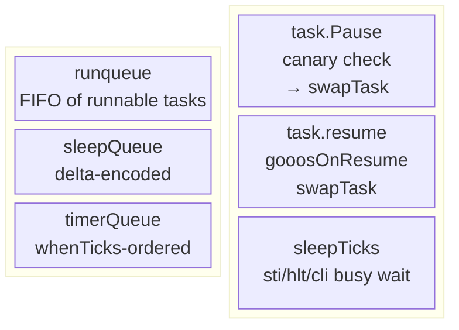
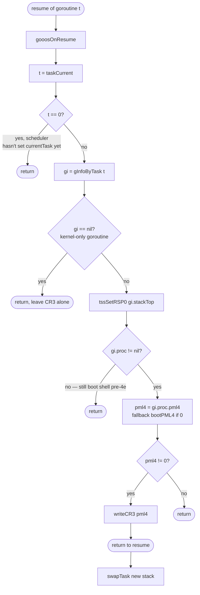
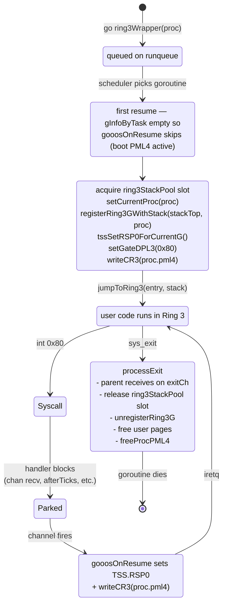
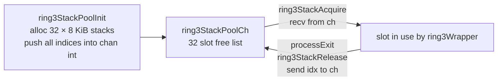
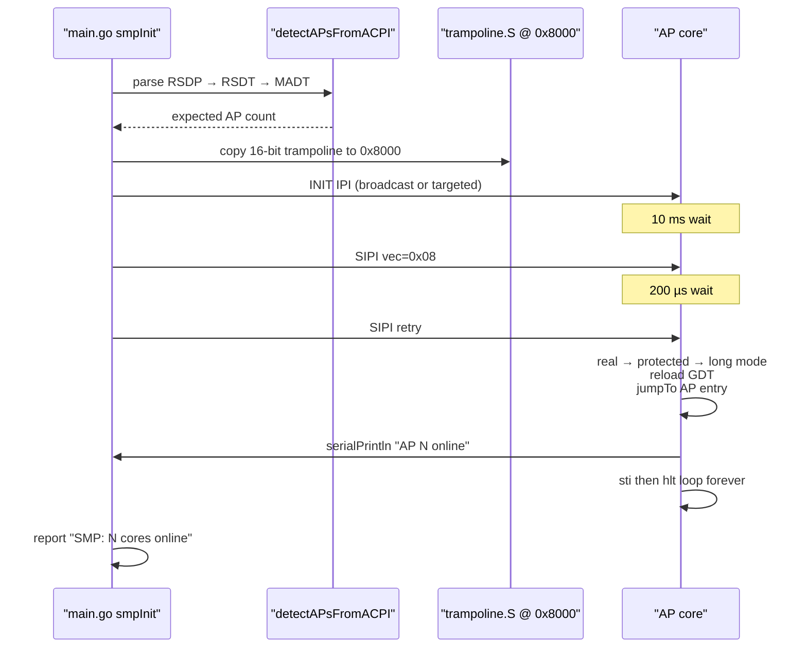

# Scheduler and Process Lifecycle

gooos **does not have a custom scheduler**. Every running
thing in the kernel — service loops, Ring-3 wrappers,
`afterTicks` timers, per-process exit watchers — is a TinyGo
goroutine. TinyGo's `scheduler=cores` runtime (loaded from
`~/.local/tinygo0.40.1/src/runtime/scheduler_cores.go` +
`scheduler.go` common + a few gooos patches; see
`impldoc/smp_migration_overview.md` for the 0.33.0 → 0.40.1
migration background and `impldoc/smp_m3_cores_promotion.md`
for the tasks → cores promotion) does all the
context-switching.

## Scheduler Anatomy

- **`runqueue`**: ready-to-run goroutines. `Gosched()` pushes
  the current task and pops the next.
- **`sleepQueue`**: tasks blocked via `time.Sleep` (or rather
  `runtime.sleep` → `addSleepTask`). Delta-encoded; wake
  conditions: `now - sleepQueueBaseTime >= sleepQueue.Data`.
- **`timerQueue`**: armed `time.Timer`/`time.After` callbacks.
  gooos uses **`afterTicks`** (see `ipc.md`) rather than
  `time.After` because the `time` package brings SSE-using
  code that we've disabled.

## gooos Hooks into TinyGo's Runtime

Patched files under `~/.local/tinygo0.40.1/src/` (via
`scripts/tinygo_runtime.patch`):

| File | Hook |
|---|---|
| `runtime/runtime_gooos.go` | kernel bodies: `sleepTicks`, `ticks`, `putchar`, `exit`, `main` |
| `runtime/runtime_gooos_user.go` | userspace bodies (same symbols, via syscalls) |
| `runtime/interrupt/interrupt_gooos.go` | kernel `Disable`/`Restore`/`In` |
| `runtime/interrupt/interrupt_gooos_user.go` | userspace no-ops |
| `internal/task/task_stack.go` | adds `state.stackTop` + `gooosStackOverflow` call on canary mismatch |
| `internal/task/task_stack_amd64.go` | calls `gooosOnResume` from `resume()` |

The two runtime bodies are gated by the `kernelspace` build tag
(on kernel `src/target.json`). User builds omit it, so the
userspace file is selected.

## `gooosOnResume` — The Critical Hook

Called from `internal/task/task_stack_amd64.go:resume()` on
every goroutine switch, BEFORE `swapTask` loads the new stack.

`gooosOnResume` lives at `src/goroutine_tss.go:175` and is
`//go:nosplit` — the entire body must be heap-touch-free
(except the one `gInfoByTask` map read; see
`impldoc/phase_b_ring3_and_exec.md` for why the map path is
safe in practice).

## Ring-3 Wrapper Lifecycle

Every Ring-3 process is a goroutine running `ring3Wrapper(proc)`
(`src/process.go:164`):

Critical ordering in `ring3Wrapper` setup:

1. `ring3StackAcquire()` — grab a pool-owned 8 KiB kernel stack (becomes TSS.RSP0 during int 0x80).
2. `setCurrentProc(proc)` — so `currentProc()` from any handler resolves correctly.
3. `registerRing3GWithStack(stackTop, proc)` — populates `gInfoByTask[t]` so the NEXT `gooosOnResume` sees us.
4. `tssSetRSP0ForCurrentG()` — immediate TSS.RSP0 programming (since we won't see a resume before the first syscall).
5. `setGateDPL3(0x80)` — allow Ring-3 `int 0x80`.
6. `writeCR3(proc.pml4)` — install the per-process PML4 before `iretq`.
7. `jumpToRing3(EntryPoint, StackTop)` — the one-way ticket.

## Ring-3 Kernel-Stack Pool (`src/ring3_pool.go`)

Each Ring-3 process needs an 8 KiB kernel stack for the TSS
RSP0 (the stack the CPU switches to on int 0x80 / interrupts).
Allocating these on the Go heap would leak 8 KiB per exec under
`gc=leaking` — so we pre-allocate 32 stacks and reuse them.

- `maxRing3Procs = 32` → 32 concurrent Ring-3 processes max.
- Channel-backed free list keeps the pool goroutine-safe and
  lets acquires block cleanly if the pool runs dry.

## Preemption

As of 2026-04-20 (features 2.1 + 2.2 landed), gooos is **preemptive**.

- **Kernel goroutines** (feature 2.1) — the BSP's 100 Hz LAPIC
  timer broadcasts a preempt IPI (vector 0xFB = `ipiPreemptVector`)
  to every online AP. Each AP's `handlePreemptIPI`
  (`src/goroutine_irq.go`) checks safe-points:
  - `InterruptDepth > 1` → nested ISR, bail.
  - `PreemptDisable > 0` → spinlock held, set `WantReschedule` and
    bail (the spinlock asm in `src/stubs.S:437-459` bumps
    `%gs:48 PreemptDisable` on every `spinlockAcquire`, drops on
    `spinlockRelease` — covers both kernel Spinlock and TinyGo
    runtime-side queue/scheduler spinlocks).
  - `SyscallDepth > 1` → nested syscall, bail.
  - `taskCurrent() == 0` → CPU is in scheduler loop, nothing to
    preempt; bail.
  Otherwise `runtime.Gosched()` is called directly. The preempt
  vector 0xFB is treated like 0x80 by `src/isr.S` — both prologue
  and epilogue bump+drop `SyscallDepth` so `interrupt.In()`
  returns false during the preempt handler and `task.Pause()`
  from Gosched is allowed. The 15 GPRs and hardware iretq frame
  pushed on ISR entry sit untouched at the top of the task's
  kernel stack while the task is paused; they're correctly popped
  + iretq-ed by the normal ISR epilogue when the scheduler
  eventually resumes the task. Enabled via
  `const preemptEnabled = true` in `src/preempt_config.go`.
- **BSP self-delivery**. `broadcastPreemptIPI` skips the sending
  CPU (no self-IPI). So if a Ring-3 user goroutine is running on
  the BSP when its own timer fires, the BSP timer handler
  (`src/lapic_timer.go`) performs an inline `maybeDeliverSignal`
  against the interrupted Ring-3 frame. Kernel BSP-pinned
  goroutines are NOT self-preempted (bail per the taskCurrent
  safe-point above); the cooperative yield path remains for them.
- **User goroutines** (feature 2.2) — kernel-delivered SIGALRM via
  trap-frame rewrite. When a preempt ISR fires while a Ring-3
  context (`CS.RPL == 3`) is running AND the process has registered
  a SIGALRM handler via `sys_sigaction` #35 AND the 10-tick
  quantum has expired (tracked per-process by
  `maybeSignalUserPreempt` in `src/user_signal.go`), the kernel
  pushes a 13-word `sigFrame` (magic `0xDEADBEEF` + saved
  RIP/RSP/RFLAGS/caller-saved GPRs) onto the user stack and
  rewrites `frame.RIP` to the user handler, `frame.RSP` to just
  below the sigFrame. When iretq returns, user code starts at the
  handler. The handler MUST tail-call `gooos.Sigreturn()`
  (`user/gooos/signal.go`) which issues `sys_sigreturn` #36; the
  kernel restores the saved context from the sigFrame on the user
  stack and iretq-s back to the interrupted RIP.
- **Idle path**: TinyGo's scheduler calls `sleepTicks(timeLeft)`
  when the runqueue is empty and a timer is pending. Our
  kernel `sleepTicks` (`src/runtime_gooos.go` via the patch) is
  a `sti; hlt; cli` busy loop — NOT a parking primitive. Still
  relevant for syscall handlers: parking via `time.Sleep` from
  inside a handler holds the CPU, so gooos uses `afterTicks`
  (see `ipc.md`) instead.
- **Known limitations**: BSP-pinned kernel goroutines with no
  cooperative yield still starve (BSP doesn't self-IPI for kernel
  preempt; only BSP self-delivery to Ring 3 is wired). AP LAPIC
  timer remains deferred; quantum is bounded by BSP tick + IPI
  latency. See `impldoc/preempt_kernel_goroutines.md §Future:
  per-CPU AP timer`.

## SMP v1 (`src/smp.go`)

### SMP v2 (current, post-M3 unblock landing, 2026-04-20)

**In one line**: goroutines and the Ring-3 processes that
wrap them actually run on multiple CPU cores in parallel.
Work-stealing is live under `scheduler=cores`; the one
remaining limitation is that a compute-bound goroutine on
an AP cannot be preempted from outside, so cooperative
yield points (channel ops, `sys_sleep`, syscalls,
`runtime.Gosched()`) are what distribute work in practice.

#### How it works

1. **Per-CPU runqueues.** Every `scheduleTask` push targets
   `runqueues[gooosCpuID()]` — the queue of the CPU that
   called `go func()` or wrote to the channel. There is no
   shared global runqueue. `schedulerRunQueue()` returns the
   caller's per-CPU queue so GC's mark phase scans only the
   local one.

2. **AP bring-up into the TinyGo scheduler.** After
   per-CPU init (GS base, GDT/TSS, IDT — the IDT load was
   the M4 fix for the Ring-3 triple-fault), an AP enters
   `runtime.apScheduler` → `scheduler(false)`. The scheduler
   is the same function BSP runs; each CPU loops over its
   own runqueue, resumes tasks, handles its own sleep/timer
   accounting.

3. **Work-stealing.** When the local runqueue is empty,
   `scheduler()` calls `stealWork()`, which round-robin
   scans peer queues (`(me+1) … (me+numCPU-1)` mod numCPU)
   and pops one task from the first non-empty peer. The
   stolen task is then `Resume()`'d on the stealer's CPU
   like any local task — no special migration dance
   (TinyGo tasks already store their own stack + register
   state, so they run on whichever CPU resumes them).

4. **Cross-CPU wakeup over IPI.** When a push wakes an AP
   that is halted in `schedulerUnlockAndWait()` (i.e. `hlt`
   waiting for an interrupt), `scheduleTask` calls
   `schedulerWake()`. That broadcasts an IPI to vector 0xFC
   on every online AP via `gooosWakeupCPU(i)` for `i` in
   `[0, main.numCoresOnline)`. The IPI handler
   (`handleWakeupIPI` in `src/ipi.go`) is a one-line EOI;
   the wake happens naturally by returning from `hlt` back
   to the scheduler loop, which then calls `stealWork` and
   finds the freshly-pushed task.

5. **GC under `scheduler=cores`.** `gcLock` (the lock
   serialising `runtime.alloc` and `runGC`) is a real
   `task.PMutex` (upstream `tinygo.unicore`-gated no-op is
   gone). To prevent deadlock inside `runGC`, a companion
   fix disables escape-analysis on the gooos-specific
   `gooos_spinlockAcquire` / `gooos_spinlockRelease`
   externs (both `internal/task/queue.go` and
   `runtime/runtime_gooos.go` carry `//go:noescape`). Without
   it, `var markedTaskQueue task.Queue` in upstream
   `gc_blocks.go` would escape to the heap, reach
   `runtime.alloc`, re-enter `gcLock`, and Pause forever.

#### How to verify

- `bash scripts/test_smp_basic.sh` — boots `-smp 4`, waits
  for a kernel goroutine (`smpBasicProbe`) to report
  `smp_basic_cpu=N` with `N != 0`, and separately for the
  shell goroutine to print `ring3Wrapper: cpuID=N` with
  `N != 0`. Either signal is enough for PASS; both are
  routinely observed.
- `bash scripts/test_net.sh` and
  `bash scripts/test_tcp_phase{1..5}.sh` — regression
  suite under `-smp 4`, all PASS.

#### The remaining constraint: AP preemption

BSP is the sole clock. `hasSleepingCore()` returns false,
and only BSP runs the 100 Hz LAPIC timer; re-enabling
`lapicTimerInit()` on APs currently hangs boot after
"Scheduler: TinyGo goroutines active" (second-order issue
that was not the original racy global counter — the race
is fixed; the remaining hang is in the AP timer ISR
dispatch path and still under investigation). See
`impldoc/smp_deferred_and_known_issues.md §2.2` and
`TODO_SMP4.md` for the deferred work under M2-4.

The practical consequence is that **APs have no
independent preemption source**. An AP currently running
a goroutine cannot be interrupted to run a different one
until the running goroutine yields. Yield happens at:

- channel operations (`ch <- x`, `<-ch`);
- `time.Sleep` / `sys_sleep` / `<-afterTicks(n)`;
- syscalls from Ring-3 (the `int 0x80` path goes through
  the scheduler);
- explicit `runtime.Gosched()`;
- the return of `go func() { ... }()` bodies.

Every goroutine gooos actually spawns today — service
loops, Ring-3 wrappers, TCP/UDP dispatchers, timer-wheel
drainers — yields often enough that work migrates across
cores in practice. A pathological CPU-bound goroutine
without yields would pin whichever AP it lands on.

#### Related docs

- `impldoc/smp_unblock_overview.md` — design write-up for
  the M2/M3/M4 unblock work. Start here for the "why" of
  each commit.
- `impldoc/smp_m3_cores_promotion.md` — the step-by-step
  `scheduler=tasks` → `scheduler=cores` promotion plan.
- `impldoc/smp_m4_ring3_fault.md` — the QEMU-only
  investigation playbook that nailed the M4 IDT-not-loaded
  root cause.
- `impldoc/smp_deferred_and_known_issues.md` — current
  status of every known gap (§2.1 RESOLVED, §2.2 PARTIAL,
  §5 remaining GC stop-the-world work).
- `impldoc/smp_migration_overview.md` — 0.33.0 → 0.40.1
  migration background.

## Boot-Time Checks

- **`checkTaskOffset()`** (`goroutine_tss.go:77`): spawns a
  throwaway goroutine and verifies `state.stackTop` sits at
  byte offset 40 inside the `Task` struct. If TinyGo ever
  changes the layout, boot halts with a clear message.
- **`stackSizeAudit()`** (gated by `const runStackAudit`):
  walks every known goroutine once post-boot and reports
  high-water-mark usage on serial.
- **`afterTicks: OK`** self-test: `<-afterTicks(2)` at boot
  proves the timer + scheduler idle path work.

## Reviewer MINOR notes

(Filled after the reviewer pass; none initially.)
