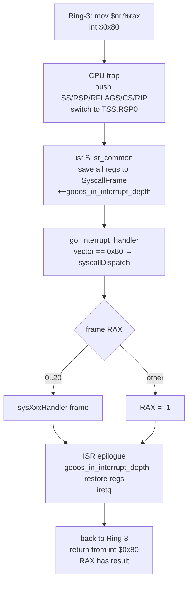
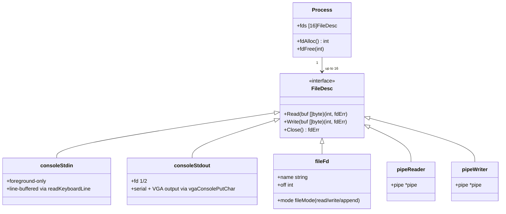
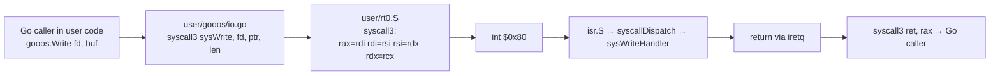
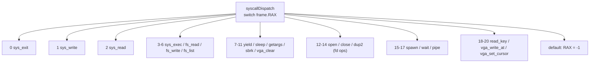

# Syscall ABI

gooos exposes 21 syscalls through a single software-interrupt
gate (`int 0x80`). The table lives in `src/userspace.go`; the
userspace wrappers live in `user/gooos/`.

## Calling Convention

Ring-3 code issues `int $0x80` after loading:

| Register | Role |
|---|---|
| `RAX` | syscall number on entry; return value on exit |
| `RDI` | arg 1 |
| `RSI` | arg 2 |
| `RDX` | arg 3 |
| `R10` | arg 4 (not `RCX` — that's clobbered by `syscall`) |

Return: non-negative value on success, `0xFFFFFFFFFFFFFFFF`
(-1 as uintptr) on generic error. Fd-aware syscalls return
negated errno values — see `fdErrOK`/`fdErrBad`/`fdErrEOF`/
`fdErrPipe` below.

Callee-saved registers (`RBX`, `RBP`, `R12`-`R15`) are
preserved across syscalls — the kernel's ISR stub saves them
in `SyscallFrame` before dispatching.

## Dispatch Flow



`gooos_in_interrupt_depth` is a `.bss` counter the scheduler
inspects via `interrupt.In()` — `task.Pause` panics with
"blocked inside interrupt" if a handler tries to park while
the counter is non-zero. In practice our handlers park on
channels outside interrupt context: the ISR prologue/epilogue
manages the counter, and long-blocking handlers
(`sys_read`, `sys_sleep`, `sys_wait`, `sys_exec`) run on the
ring3Wrapper goroutine's own stack — not the TSS.RSP0 stack —
so `interrupt.In()` reads 0 when they park.

## The 21 Syscalls

| # | Name | RDI / RSI / RDX / R10 | Handler | Notes |
|---|---|---|---|---|
| 0 | `sys_exit` | code | `sysExitHandler` | terminates current process |
| 1 | `sys_write` | fd, buf, len | `sysWriteHandler` | dispatches via `Process.fds[fd].Write` |
| 2 | `sys_read` | fd, buf, max | `sysReadHandler` | fd-aware; line-buffered for stdin |
| 3 | `sys_exec` | path, plen, arg, alen | `sysExecHandler` | spawn child + wait; foreground transfer |
| 4 | `sys_fs_read` | path, plen, buf, max | `sysFsReadHandler` | read entire file (kernel FS) |
| 5 | `sys_fs_write` | path, plen, buf, len | `sysFsWriteHandler` | create/replace file contents |
| 6 | `sys_fs_list` | buf, max | `sysFsListHandler` | NUL-separated filenames |
| 7 | `sys_yield` | — | `sysYieldHandler` | `runtime.Gosched()` |
| 8 | `sys_sleep` | ticks | `sysSleepHandler` | `<-afterTicks(ticks)` |
| 9 | `sys_getargs` | buf, max | `sysGetargsHandler` | copy Process.ArgString |
| 10 | `sys_sbrk` | delta | `sysSbrkHandler` | returns old break; maps pages |
| 11 | `sys_vga_clear` | — | `sysVgaClearHandler` | clears VGA + disables hw cursor |
| 12 | `sys_open` | path, plen, mode | `sysOpenHandler` | returns fd ≥ 0 or fdErr |
| 13 | `sys_close` | fd | `sysCloseHandler` | refcounted pipe close |
| 14 | `sys_dup2` | oldfd, newfd | `sysDup2Handler` | closes newfd first |
| 15 | `sys_spawn` | path, plen, arg, alen | `sysSpawnHandler` | async exec — returns pid |
| 16 | `sys_wait` | pid | `sysWaitHandler` | blocks on child's exitCh |
| 17 | `sys_pipe` | fds_ptr | `sysPipeHandler` | writes {readFd, writeFd} |
| 18 | `sys_read_key` | buf_ptr | `sysReadKeyHandler` | raw keystroke for editor; foreground only. Kernel writes 4 bytes (scancode, ascii, mods, flags); the userspace wrapper allocates an 8-byte buffer for alignment |
| 19 | `sys_vga_write_at` | row, col, ch, attr | `sysVgaWriteAtHandler` | direct VGA cell write |
| 20 | `sys_vga_set_cursor` | row, col | `sysVgaSetCursorHandler` | CRTC program + enable cursor |

See `user/gooos/syscall.go` (constants) and `user/gooos/io.go`,
`user/gooos/fs.go`, `user/gooos/proc.go` (wrappers).

## File Descriptor Table



`procMaxFDs = 16` per process. Fd numbers 0/1/2 are
preset to `consoleStdin`/`consoleStdout`/`consoleStdout` at
`ring3Wrapper` entry.

### Error Codes (`src/fd.go`)

| Constant | Value | Meaning |
|---|---|---|
| `fdErrOK` | 0 | success |
| `fdErrEOF` | 1 | read hit EOF |
| `fdErrPipe` | 2 | write to a pipe whose read ends are all closed |
| `fdErrBad` | 3 | invalid fd |

Wire format: `sysFail(err) = -int64(err)` → negative values on
return, so Ring-3 sees `r < 0` as "error" and `-r` as the
errno.

## Fd Inheritance on Exec / Spawn

```mermaid
sequenceDiagram
    participant Parent as parent Process
    participant Child as child Process (new)
    participant Pipe as pipe refcount

    Parent->>Child: elfSpawn copies fds array (shallow)
    loop for each fd i in Parent.fds[0..15]
        Child->>Child: child.fds[i] = parent.fds[i]
        alt fds[i] is pipeReader or pipeWriter
            Child->>Pipe: fdAddRef(fds[i])
        end
    end
    Note over Child: child now holds every ref parent had
    Parent->>Parent: may then Close(fd) to drop its copy
    Child->>Child: may Close(fd) too; last ref closes pipe end
```

This is what lets `cmd1 | cmd2` build a pipeline: the shell
opens a pipe, spawns `cmd1` with its write-end on fd 1, spawns
`cmd2` with its read-end on fd 0, closes its own copies of
both ends; each child closes its own copy on exit; when both
are gone the pipe dies cleanly.

## Ring-3 ABI Wrappers (`user/gooos/`)



`syscall0`/`syscall1`/`syscall2`/`syscall3`/`syscall4` in
`user/rt0.S` shuffle SysV-ABI caller args into the kernel
register layout. The userspace API (`user/gooos/`) exposes
typed wrappers: `Write`, `Read`, `Open`, `Close`, `Dup2`,
`Pipe`, `Exec`, `Spawn`, `Wait`, `Exit`, `Args`, `Yield`,
`Sleep`, `Print`, `Println`, `ReadLine`, `ReadKey`,
`VgaClear`, `VgaWriteAt`, `VgaSetCursor`, `ReadFile`,
`ListDir`.

## Blocking Behaviour

Some syscalls block the ring3Wrapper goroutine on a channel:

| Syscall | Blocks on | Wakes on |
|---|---|---|
| `sys_read` (fd 0, foreground) | `keyboardCh` via `readKeyboardLine` | Enter scancode |
| `sys_read_key` (foreground) | `keyboardCh` directly | next keystroke |
| `sys_read` (pipe) | pipe's `chan byte` | bytes arriving |
| `sys_sleep` | `<-afterTicks(d)` | PIT ticks |
| `sys_exec` / `sys_wait` | `child.exitCh` | child's `processExit` |
| `sys_write` (full pipe) | pipe's `chan byte` | reader draining |

Parking is safe: these handlers run on the ring3Wrapper
goroutine's kernel stack (acquired via `ring3StackPool`), not
on the ISR-entry TSS.RSP0 stack. `interrupt.In()` reads 0, so
`task.Pause` does not panic.

## Syscall Dispatch Table Footprint



Adding a new syscall is: define const, add case, write handler —
no dispatch-table restructuring.

## Reviewer MINOR notes

(Filled after the reviewer pass; none initially.)
