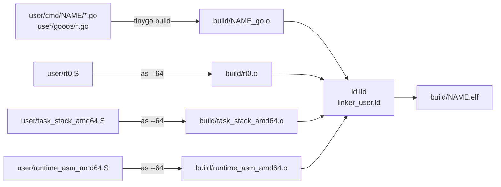
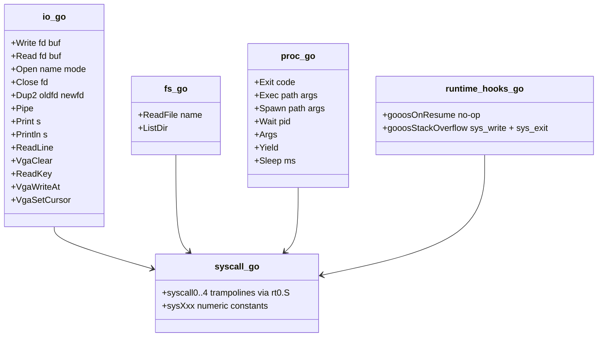
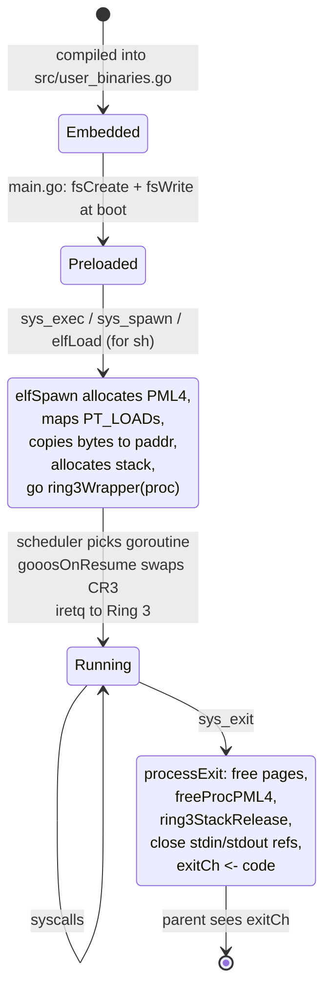
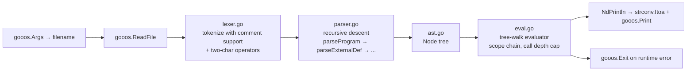
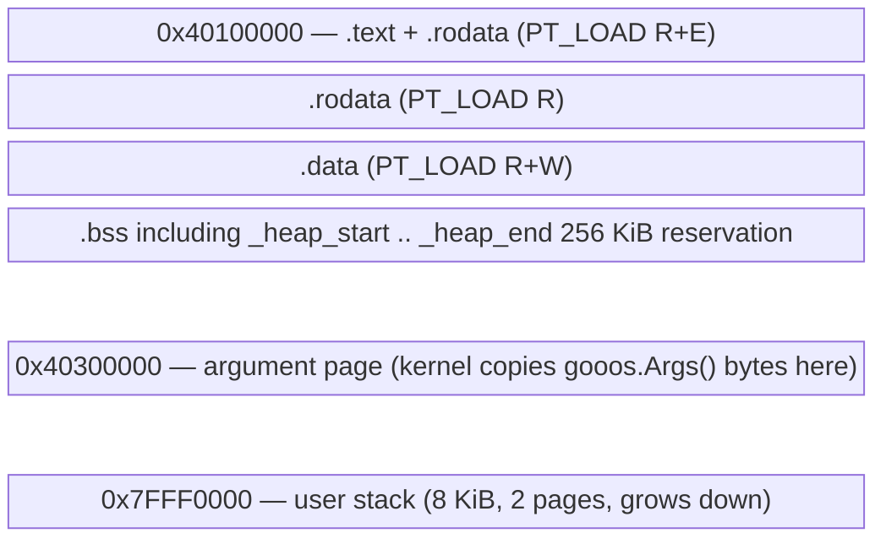

# Userland, SDK and User Programs

All user programs are TinyGo binaries compiled against a
Ring-3 target with its own full goroutine scheduler.

## User Target (`user/target.json`)

```json
{
  "llvm-target": "x86_64-unknown-none-elf",
  "cpu": "x86-64",
  "features": "-mmx,-sse,-sse2,-sse3,-ssse3,-sse4.1,-sse4.2,-avx,-avx2,-avx512f",
  "build-tags": ["gooos", "baremetal"],
  "goos": "linux",
  "goarch": "amd64",
  "gc": "leaking",
  "scheduler": "tasks",
  "panic-strategy": "trap",
  "linker": "ld.lld",
  "rtlib": "compiler-rt",
  "default-stack-size": 8192,
  "automatic-stack-size": true
}
```

Key: `scheduler=tasks` + `build-tags=["gooos","baremetal"]`
means the user build picks up
`~/.local/tinygo/src/runtime/runtime_gooos_user.go` — a sibling
of the kernel's `runtime_gooos.go` that routes `sleepTicks`
through `sys_sleep` and `putchar` through `sys_write(fd=1)`.
See `impldoc/userspace_goroutines_overview.md`.

## User Build Chain



`user/linker_user.ld` lays out the ELF at 0x40100000 with a
256 KiB fixed heap nested inside `.bss` (since
baremetal.go:growHeap returns false, the heap cannot grow).

## User SDK (`user/gooos/`)



(Mermaid class names here use `_go` suffix because the
classDiagram grammar treats `.` as a namespace separator — the
actual files are `io.go`, `fs.go`, `proc.go`, `syscall.go`,
`runtime_hooks.go`.)

Everything Ring-3 Go code needs for I/O, process control, and
TUI output lives in `user/gooos/`. `runtime_hooks.go` supplies
the Ring-3-safe bodies for the two TinyGo hooks
(`gooosOnResume`, `gooosStackOverflow`) that the kernel-side
runtime resolves differently.

## User ELF Lifecycle



- **Boot shell** goes through a shorter path: `elfLoad`
  (`src/elf.go`) at the end of `main()` builds the first
  `Process`, spawns its `ring3Wrapper`, and the kernel main
  goroutine blocks on `<-shell.exitCh` forever.
- **Subsequent processes** use `elfSpawn` (`src/process.go:201`)
  which differs from `elfLoad` in that it allocates a fresh
  per-process PML4 rather than reusing the boot PML4.

## Shell (`user/cmd/sh`)

```mermaid
flowchart TD
    Prompt[Print "$ "] --> Read[gooos.ReadLine]
    Read --> Parse[parse.go: tokenize + redirect + pipe split]
    Parse --> Pipeline{pipeline<br/>len ≥ 2?}
    Pipeline -->|yes| Pipes[build N-1 pipes<br/>spawn each stage<br/>with dup2'd fds]
    Pipeline -->|no| Single[execute single cmd<br/>with redirections]

    Single --> Builtin{built-in?<br/>help/echo/clear/exit}
    Builtin -->|yes| RunBuiltin
    Builtin -->|no| Exec[sys_exec + wait]

    Pipes --> WaitAll[sys_wait on each child pid]
    RunBuiltin --> Prompt
    Exec --> Prompt
    WaitAll --> Prompt
```

- **Built-ins**: `help`, `echo`, `clear`, `exit`.
- **External**: anything with a `.elf` in the FS. The shell
  appends `.elf` to the command name and calls `sys_exec`
  (for single commands, blocking) or `sys_spawn` + `sys_wait`
  (for pipeline stages, parallel).

### Redirection Flow

```mermaid
sequenceDiagram
    participant Shell
    participant FD as fd table (parent)
    participant FS as filesystem
    participant Child

    Shell->>Shell: parse "cmd > out.txt"
    Shell->>FS: sys_open("out.txt", OpenWrite) → fd3
    Shell->>FD: sys_dup2(fd3, 1) — stdout now points to out.txt
    Shell->>FD: sys_close(fd3) — only fd 1 holds the file
    Shell->>Child: sys_exec("cmd")
    Note over Child: child inherits fds; writes to stdout land in out.txt
    Child->>Child: processExit
    Shell->>FS: post-child: restore stdout by dup2(saved, 1)
```

### Pipe Flow (N-stage)

```mermaid
flowchart LR
    Shell[shell parses N stages] --> Loop[for i in 0..N-2<br/>create pipe i]
    Loop --> P0[pipe0 r/w]
    Loop --> P1[pipe1 r/w]

    subgraph Spawn
        S0[stage 0:<br/>stdout → pipe0.w<br/>spawn]
        S1[stage 1:<br/>stdin ← pipe0.r<br/>stdout → pipe1.w<br/>spawn]
        S2[stage 2 (last):<br/>stdin ← pipe1.r<br/>stdout → terminal<br/>spawn]
    end
    Shell --> S0
    Shell --> S1
    Shell --> S2
    Shell --> CloseAll[shell closes all pipe fds<br/>after every child has them]
    CloseAll --> Wait[wait on each child pid]
```

Every stage runs in its own per-process PML4, so there's no
address-space contention. The pipe ends die when the last
holder closes.

## User Programs

| Command | Dir | Role |
|---|---|---|
| `sh` | `user/cmd/sh/` | shell with redirection + N-stage pipes |
| `hello` | `user/cmd/hello/` | minimal smoke test |
| `ls` | `user/cmd/ls/` | list FS entries via `sys_fs_list` |
| `cat` | `user/cmd/cat/` | read file (or stdin) → stdout |
| `wc` | `user/cmd/wc/` | POSIX-ish line/word/byte counts |
| `fdprobe` | `user/cmd/fdprobe/` | verify fd table syscalls |
| `goprobe` | `user/cmd/goprobe/` | PASS/FAIL probe for user-space goroutines + channels + select + time.Sleep |
| `gochan` | `user/cmd/gochan/` | user-visible goroutine + chan demo (pipeline + select) |
| `tinyc` | `user/cmd/tinyc/` | tree-walking interpreter for a C-subset language |
| `edit` | `user/cmd/edit/` | vi-like modal TUI editor |

Total: 10 user ELFs, all embedded in `src/user_binaries.go`.

## Tiny C Interpreter (`user/cmd/tinyc`)



See `impldoc/tinyc_interpreter.md` for the full spec.

## Editor (`user/cmd/edit`)

```mermaid
stateDiagram-v2
    [*] --> Load: main.go: Args → loadFile
    Load --> Draw: VgaClear → render()
    Draw --> Normal
    Normal: Normal mode<br/>hjkl / 0 / $ / gg / G / w / b<br/>i / a / o / O → Insert<br/>: → Command
    Normal --> Insert: i / a / o / O
    Insert: Insert mode<br/>printable → insertChar<br/>Enter → newline<br/>Backspace → deleteBack<br/>Esc → Normal
    Insert --> Normal: Escape
    Normal --> Command: :
    Command: Command mode<br/>cmdBuf accumulates<br/>Enter → execute
    Command --> Normal: Enter (no :q) / Esc
    Command --> Save: :w / :wq
    Command --> Quit: :q / :q! / :wq
    Save: saveFile → Open(OpenWrite) + Write + Close
    Save --> Normal: :w only
    Save --> Quit: :wq
    Quit --> [*]: VgaClear on exit<br/>hardware cursor disabled
```

See `impldoc/editor_overview.md` + `impldoc/editor_raw_input.md`
for the full spec.

## Userspace Goroutines (`gochan`, `goprobe`)

Ring-3 TinyGo with `scheduler=tasks` means user code can:

```go
ch := make(chan int)
go func() { ch <- 42 }()
v := <-ch
```

…and it just works. Any idle path inside the user scheduler
(no runnable goroutine, a timer pending) calls user
`sleepTicks` → `sys_sleep` → kernel `<-afterTicks(d)`. The
kernel parks the ring3Wrapper; other kernel goroutines
continue; when the timer fires, the wrapper resumes, iretq
back to Ring 3, and the user scheduler picks up its own tasks
again.

See `impldoc/userspace_goroutines_overview.md` for the
complete design set.

## User Page Layout per Process



`elfSpawn` maps every PT_LOAD page with `allocPage` + fills
from the ELF file data via the paddr (the kernel half of the
identity map). That keeps the kernel out of the child's
virtual address space until the child is ready to execute.

## Reviewer MINOR notes

(Filled after the reviewer pass; none initially.)
