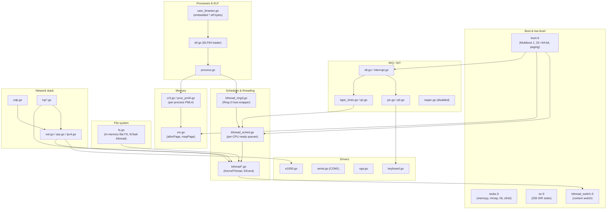
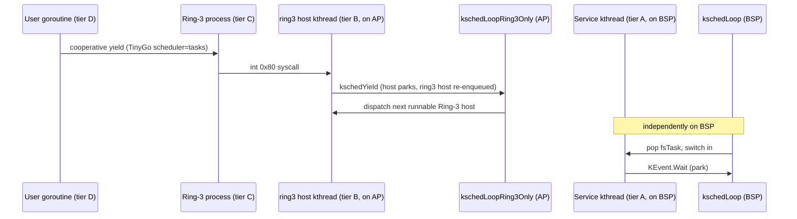

# Chapter 01 — Architecture Overview

## Overview

`gooos` is a small, educational, x86_64 hobby operating system built with TinyGo and a sliver of GNU assembly. It boots through Multiboot 1, installs a 1 GiB identity map, and brings up a single Bootstrap Processor (BSP) plus optional Application Processors (APs) up to roughly four Central Processing Units (CPUs). User programs are stand-alone Executable and Linkable Format (ELF) binaries embedded into the kernel image at build time and copied into a flat in-memory file system at boot. A minimal e1000 Ethernet driver feeds an Internet Protocol version 4 (IPv4) stack with User Datagram Protocol (UDP) and Transmission Control Protocol (TCP) on top. The most distinctive architectural decision is that the kernel does not use Go goroutines: every long-lived service runs as a gooos-owned **kernel thread** (`KernelThread`) under TinyGo's `scheduler=none`. This chapter walks through that design at a bird's-eye level so the rest of the documentation set has a shared vocabulary.

## Prerequisites

- Operating-system textbook understanding of processes, virtual memory, the Memory Management Unit (MMU), preemptive scheduling, file systems, system calls, and interrupts.
- Reading-level fluency in Go. You do **not** need to be familiar with TinyGo bare-metal runtime patches, the conservative Garbage Collector (GC), or the `scheduler=none` task model — those are explained in later chapters.
- No prior x86 firmware or kernel-source experience required. The Multiboot 1 boot sequence, the Local Advanced Programmable Interrupt Controller (LAPIC), and the Inter-Processor Interrupt (IPI) flow are all introduced as needed.

## What gooos is, in one paragraph

`gooos` is a TinyGo-based educational hobby OS for x86_64. It boots from a GRUB-built ISO via Multiboot 1, runs an optional Symmetric Multi-Processing (SMP) configuration of up to ~4 CPUs (the project's tested ceiling), executes Ring-3 user programs from embedded ELF binaries, exposes a flat in-memory file system, and ships an Intel e1000 Network Interface Card (NIC) driver feeding a small IPv4/UDP/TCP stack. The whole project lives in one repository at `/home/ryo/work/gooos`. Kernel sources are in `src/`, user-space programs are in `user/cmd/`, and the linker scripts in `src/linker.ld` and `user/linker_user.ld` define the two distinct address spaces.

## Top-level kernel block diagram

The kernel is a flat package (`package main` in `src/*.go`), but it factors into clearly separable modules. The diagram below shows the runtime relationships, not file-level imports.



**Where**: The orchestration that wires these modules together is `src/main.go:122` (`func main`), which initializes them roughly in the order shown above. Each subgraph corresponds to a small group of files (typically one to four `.go` files plus an optional `.S` companion).

## The four scheduling tiers

The single most important fact to internalize is that `gooos` schedules four different kinds of executable contexts, and they are **not** interchangeable. They sit at different privilege levels, run under different TinyGo build flags, and are dispatched by different schedulers.

### What

| Tier | Name | Privilege | Where it runs | Dispatched by |
|------|------|-----------|---------------|---------------|
| A | Kernel thread on BSP | Ring 0 | BSP only | `kschedLoop` / `kschedLoopOnce` (service-tier queue `kschedQueues[0]`) |
| B | Kernel thread on AP (Ring-3 host wrapper) | Ring 0 | Each AP | `kschedLoopRing3Only` (Ring-3 tier queue `kschedQueuesRing3[cpu]`) |
| C | Ring-3 process | Ring 3 | The CPU hosting its tier-B kthread | The host kthread `iretq`s into user code |
| D | In-process user goroutine | Ring 3 | Same CPU as tier C | TinyGo `scheduler=tasks` cooperative scheduler inside the user binary |

### Why

- Tier A holds Ring-0 services: the timer wheel dispatcher, the file-system server, the network receive loop, the UDP/TCP echo servers, the TCP retransmission scanner, and the network diagnostics dump. They cannot live on APs because hardware Interrupt Requests (IRQs) — Programmable Interrupt Timer (PIT), keyboard, e1000 — are still delivered to the BSP via the legacy 8259A Programmable Interrupt Controller (PIC) pass-through path.
- Tier B exists because a Ring-3 process needs a Ring-0 host thread to install its CR3 (control register 3, holds the Page Map Level 4 (PML4) physical address) and to provide a kernel stack for system-call entry. That host wrapper is itself a kernel thread named `ring3` (so `ps` shows it) and it is the entity actually scheduled.
- Tier C is the user program proper, executing with `CS.RPL = 3` after an `iretq`.
- Tier D exists because each user binary can spawn its own goroutines via `go f(...)`. The user-side TinyGo target uses `scheduler=tasks`, so those goroutines are cooperatively multiplexed inside the same Ring-3 process. The kernel knows nothing about them individually; from tier B's perspective, the whole user binary is one preemptible context.

### How

Tiers A and B share the same `KernelThread` data type and the same context-switch routine. They differ only in **which queue** they enqueue onto: service kthreads land on `kschedQueues[cpu]`, Ring-3 hosts land on `kschedQueuesRing3[cpu]`. The BSP runs both queues by interleaving `kschedLoopOnce(0)` with `kschedLoopRing3OnlyOnce(0)` from a "combined pump" in `src/elf.go`. APs only run the Ring-3 tier.



### Where

- `src/kthread_sched.go:23` declares `kschedQueues [maxCPUs]kschedReadyQueue` (service tier) and `src/kthread_sched.go:38` declares `kschedQueuesRing3 [maxCPUs]kschedReadyQueue` (Ring-3 tier).
- `src/kthread_ring3.go:40` is `kschedSpawnRing3Wrapper` (exec'd children -> AP queues) and `src/kthread_ring3.go:85` is `kschedSpawnRing3WrapperOnBSP` (boot shell -> BSP).
- `src/target.json:9` pins the kernel build to `"scheduler": "none"`. `user/target.json:9` pins the user build to `"scheduler": "tasks"`.

## The "no goroutines in kernel Ring 0" decision (Route C)

### What

The kernel was originally written using ordinary Go goroutines (`go fsTask()`, `go netRxLoop()`, etc.) on top of a patched TinyGo `scheduler=tasks` runtime extended with multi-core wakeups. That model was scrapped. Today every long-lived Ring-0 worker is a `KernelThread` allocated from a static pool, dispatched by a per-CPU ready queue, and context-switched by `src/kthread_switch.S`. The kernel build is locked to `scheduler=none`, which means the `go` keyword is a **compile-time error** in `src/*.go`. A `make lint` step actively enforces this.

### Why

Cross-CPU goroutine wakeups under the patched TinyGo task scheduler were flaky: a goroutine parked on a `chan` could be observed runnable on one CPU while another CPU re-pushed the same task pointer onto its run queue, causing rare double-dispatches and kernel page faults. Reproducing it required SMP plus interrupt pressure plus particular timing, so a defensive rewrite (call it Route C) was preferred over chasing the bug case-by-case.

### How

- A `KernelThread` (`src/kthread.go:43`) holds `SavedRSP`, `State`, `OwnerCPU`, an embedded 16 KiB `KernelStack`, and bookkeeping. The struct layout is asserted at boot (`checkKernelThreadOffset`).
- Every CPU has its own ready queue and its own bootstrap anchor (`kschedBootstrap[cpu]`). New threads are placed via `kschedPush`; running threads can be **stolen** between CPUs (`kschedSteal`) when local queues drain. Park / wake uses a hand-rolled `KEvent` (`src/kthread_event.go`) and bounded Multi-Producer Single-Consumer (MPSC) queues such as `fsReqQueue` (`src/kthread_queue.go`).
- Because there is no Go scheduler in the kernel, the `tinygo_task_exit` symbol that TinyGo's task assembly references is provided as an unreachable halt stub (`src/scheduler_none_stubs.go:18`). It exists only to satisfy the linker.

### Where

- Decision and rationale: `src/kthread.go:1` (top-of-file comment), `src/kthread_sched.go:1`.
- Build-flag enforcement: `src/target.json:9` (`"scheduler": "none"`).
- Link-time stub: `src/scheduler_none_stubs.go:18`.
- Lint enforcement (no `chan`, `select`, `go` in `src/*.go`): `Makefile:69` (`lint:` target) calling `scripts/lint_isr.go`.

## Kernel address space

The kernel is loaded by GRUB at physical (and, thanks to the 1 GiB identity map, virtual) `0x100000` — the classic "1 MiB" point. The linker script `src/linker.ld` lays sections out in the order shown below. The map is **not** drawn to scale.

```
high addresses
+-------------------------------------------+
|             (rest of physical RAM,        |
|              available for allocPage)     |
+--- _alloc_start (4-KiB-aligned bump base) +
|             .pagetables                   |  written by boot.S; CR3 root
|             (PML4, PDP, PD, ...)          |  excluded from GC scan
+--- (4 KiB guard gap)                      +
|--- _heap_end ----------------------------+|
|             .heap (4 MiB, NOBITS)         |  TinyGo conservative-GC heap
|--- _heap_start --------------------------+|
+--- _globals_end --------------------------+
|             .bss                          |  4-KiB aligned: stack + .bss vars
|             (16 KiB kernel stack first,   |
|              then ordinary uninitialized  |
|              globals)                     |
+                                           +
|             .data                         |  initialized globals
+--- _globals_start ------------------------+
|             .rodata                       |  GDT, ISR tables, string literals
+                                           +
|             .text                         |  kernel code
+                                           +
|             .multiboot                    |  4-byte aligned, within first 8 KiB
+--- 0x00100000 (1 MiB load address) -------+
|             low-1MiB BIOS region          |
+-------------------------------------------+
low addresses
```

Key facts the rest of the documentation will assume:

- **Kernel stack**: 16 KiB, declared in `src/boot.S:38` between `stack_bottom` and `stack_top`, and re-exported as `_stack_top` by the linker script for the conservative GC's stack scanner.
- **Heap**: a fixed 4 MiB region. `src/stubs.S` reserves it with `.section .heap,"aw",@nobits` followed by `.skip 0x400000`. TinyGo's `runtime_unix.preinit` calls our `mmap` stub once at startup; the stub returns `_heap_start` if the request fits, else `MAP_FAILED`.
- **Page tables** sit **after** `.heap` with a 4 KiB guard gap (`src/linker.ld:71`). This is deliberate: the conservative GC scans `_globals_start.._globals_end` and the kernel stack as roots, but page-table entries (e.g. flag byte `0x83` on a 2 MiB huge page) look like plausible kernel pointers and would otherwise be treated as live references. Excluding them is a precision improvement, **not** a memory-safety property — false positives over-retain heap blocks; they cannot corrupt page-table memory.
- **1 GiB identity map**: `src/boot.S:90` fills `pd[0..511]` with 2 MiB huge-page entries `(i * 0x200000) | 0x83`, mapping virtual `0..1 GiB` to physical `0..1 GiB`. That is enough to cover the kernel image, the heap, the page tables themselves, and the LAPIC Memory-Mapped Input/Output (MMIO) page once it is added.

## CPU role split under SMP (M6 + M7 invariants)

The project went through two named milestones that together describe the current SMP behaviour. M6 ("uniprocessor kernel") and M7 ("userspace SMP on APs") are not external dependencies — they are simply the two compile-time constants `uniprocessorKernel` and `userspaceSMP` in `src/preempt_config.go:128` and `:146`, both default `true`.

### What

```
                +-------------------+    +-------------------+
                |       BSP         |    |   AP1 .. APn-1    |
                |    (CPU 0)        |    |                   |
                +-------------------+    +-------------------+
                | service kthreads: |    | Ring-3 hosts only |
                |   fsTask          |    |   (ring3 wrapper  |
                |   timerDispatcher |    |    kthreads, one  |
                |   netRxLoop       |    |    per exec'd     |
                |   udpEchoServer   |    |    user proc)     |
                |   tcpEcho         |    |                   |
                |   tcpRTOScanner   |    | also hosts no     |
                |   netDiagLoop     |    | hardware IRQs     |
                |                   |    |                   |
                | + boot shell      |    |                   |
                |   ring3 host      |    |                   |
                |                   |    |                   |
                | hardware IRQs:    |    | LAPIC timer +     |
                |   PIT IRQ0        |    | preempt IPI 0xFB  |
                |   PS/2 IRQ1       |    | wake IPI 0xFC     |
                |   e1000 IRQ11     |    |                   |
                +-------------------+    +-------------------+
                          |                        |
                          +-- LAPIC timer 100 Hz on every CPU
                          +-- BSP broadcasts preempt IPI 0xFB
                          +-- kschedPush remote -> wake IPI 0xFC
```

### Why

- All hardware IRQs land on the BSP because the IO-APIC steering path is disabled (see Out-of-scope below). PIC pass-through routes legacy IRQs to the BSP only.
- APs are kept idle in kernel mode (`sti; hlt; cli`) so that they cannot accidentally be the recipient of a service kthread that needs BSP-only resources. Cross-CPU `kschedPush` from BSP to an AP fires a wake IPI on vector `0xFC`, which the AP's idle loop receives and which kicks it back into `kschedLoopRing3Only`.
- The boot shell is a special case: it is a Ring-3 process, so structurally it is a tier-B host kthread, but it is **pinned to BSP** (`kschedSpawnRing3WrapperOnBSP`). That is because the boot shell owns the foreground keyboard (PS/2 IRQ1 lands on BSP) and inputs would otherwise have to travel cross-CPU on every keystroke.
- Children spawned via `sys_spawn` from the shell go to APs round-robin, **excluding BSP**.

### How

- Round-robin target for an exec'd child:

```go
target = 1 + (kschedSpawnRRCounter % (numCoresOnline - 1))
kschedSpawnRRCounter++
```

  This formula intentionally never produces `0` (BSP) on multi-core systems. Source: `src/kthread_ring3.go:57`.

- The BSP combined pump in `src/elf.go:258` interleaves both tiers:

```go
for proc.Exited == 0 {
    kschedLoopOnce()             // service tier
    kschedLoopRing3OnlyOnce(0)   // Ring-3 tier on BSP
    runtime.Gosched()
}
```

- Each AP entry runs `kschedLoopRing3Only(cpuID())`, which is the non-returning version — APs never service Ring-0 work tickets.
- The 100 Hz LAPIC timer fires per-CPU, but only **BSP** broadcasts the preempt IPI (vector `0xFB`). Receiving APs run `handlePreemptIPI` and call `kschedYield()` if the safe-point check passes. Source: `src/lapic_timer.go`, `src/ipi.go:14`.
- Cross-CPU wake on remote enqueue: `kschedPushRing3` calls `gooosWakeupCPU(cpu)` whenever the target CPU is not the caller. Source: `src/kthread_sched.go:341`.

### Where

- BSP-only service spawns: `src/main.go:444` (fsTask), `src/main.go:459` (netDiagLoop), `src/net.go:72` (netRxLoop), `src/net.go:74` (udpEcho), `src/tcp.go:1348` (tcpEcho).
- AP entry: `src/smp.go` exposes `apSchedulerEntry`; under M7 it dispatches `kschedLoopRing3Only`.
- Round-robin formula: `src/kthread_ring3.go:55-58`.
- BSP-pinned boot shell: `src/elf.go:257` (`kschedSpawnRing3WrapperOnBSP`).

## Out-of-scope items (deliberate, not bugs)

| Feature | Status | Why omitted |
|---------|--------|-------------|
| On-disk filesystem (ATA/AHCI driver, ext2, FAT) | Absent | The project goal is to study OS internals from boot to networking, not block-storage drivers. The 32-entry × 256 KiB in-memory FS is sufficient for the embedded ELFs and user-program scratch space. |
| Swapping / page eviction | Absent | The 4 MiB heap and `userHeapLimit` (2 MiB per process) keep working-set pressure low enough that demand paging would be theatrical. |
| Dynamic linking (`.so`, `dlopen`) | Absent | All user programs are statically linked TinyGo binaries embedded into `src/user_binaries.go`. There is no loader for `PT_INTERP`. |
| IO-APIC IRQ steering | Disabled | `ioapicInit()` is commented out in `src/main.go:414`. QEMU's IO-APIC IRQ0 redirection did not deliver PIT timer IRQs reliably when the kernel switched away from PIC pass-through, which broke `afterTicks` and `sys_sleep`. PIC pass-through via `LINT0` (External Interrupt) on the BSP works and is kept as the default. |
| Per-CPU IRQ delivery | Absent | A direct consequence of disabling IO-APIC steering. Every hardware IRQ lands on BSP. |
| Dynamic process migration | Absent | Once a Ring-3 host kthread has been placed on an AP, it stays there for the life of the process. AP↔AP work-stealing is enabled (`kschedStealRing3`) but BSP is excluded as a steal source so the boot shell never migrates off BSP. |

These are scope boundaries, not regressions. If you find behaviour that violates one of the rows above (e.g. a service kthread accidentally landing on an AP) you have found a bug; otherwise the limitation is by design.

## Theory-to-implementation coverage matrix

The rest of the documentation set in `design_intro_doc/` covers the following textbook topics. Use this as a roadmap.

| Textbook topic | Chapter |
|----------------|---------|
| Build, boot, run | `./02_build_and_run.md` |
| Boot loader handoff, IDT, identity map | `./03_boot_and_init.md` |
| Virtual memory: paging, per-process PML4, page allocator | `./04_memory_management.md` |
| Scheduler: kernel-thread tiers, context switch | `./05_kernel_thread_runtime.md` |
| SMP, IPIs, preemption, LAPIC | `./06_smp_and_preemption.md` |
| Process model, ELF loader, Ring 3 entry | `./07_processes_and_userspace.md` |
| System call Application Binary Interface (ABI), signals | `./08_syscalls.md` |
| Synchronization primitives (`Spinlock`, `KEvent`, MPSC queues) | `./09_synchronization.md` |
| Drivers, file system, networking (e1000, ARP, IPv4, UDP, TCP) | `./10_drivers_filesystem_network.md` |
| TinyGo bare-metal specifics (GC, scheduler=none, runtime patches) | `./11_tinygo_baremetal.md` |

## Summary

- `gooos` is a TinyGo + assembly hobby OS for x86_64, single-repo, optional SMP up to ~4 CPUs.
- The kernel runs under TinyGo `scheduler=none`; **no goroutines in Ring 0**. Long-lived workers are `KernelThread`s.
- Four scheduling tiers: BSP service kthreads (A), AP Ring-3 host kthreads (B), the Ring-3 user process itself (C), and intra-process user goroutines (D, TinyGo `scheduler=tasks`).
- BSP hosts every hardware IRQ and the boot shell. APs host only Ring-3 user processes; service kthreads are BSP-pinned.
- Round-robin placement for `exec`'d children excludes BSP: `target = 1 + (counter % (numCoresOnline - 1))`.
- Address space is laid out by `src/linker.ld`: code, rodata, globals, 4 MiB heap, guard gap, then page tables. The conservative GC scans globals + stack but **not** page tables.
- IO-APIC, on-disk FS, swap, and dynamic linking are deliberately out of scope.

## Cross-references

- [Documentation index](./README.md)
- [Build and run](./02_build_and_run.md)
- [Boot and initialization](./03_boot_and_init.md)
- [Memory management](./04_memory_management.md)
- [Kernel thread runtime (Route C)](./05_kernel_thread_runtime.md)
- [SMP and preemption](./06_smp_and_preemption.md)
- [Processes and userspace](./07_processes_and_userspace.md)
- [System calls](./08_syscalls.md)
- [Synchronization primitives](./09_synchronization.md)
- [Drivers, filesystem, and networking](./10_drivers_filesystem_network.md)
- [TinyGo bare-metal specifics](./11_tinygo_baremetal.md)
