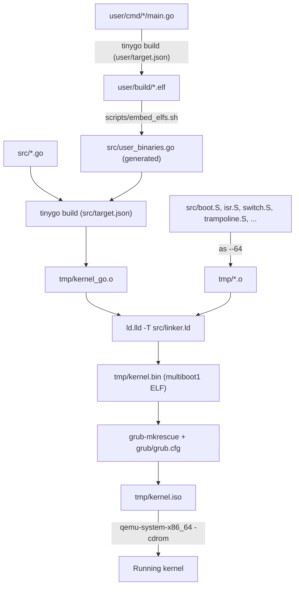
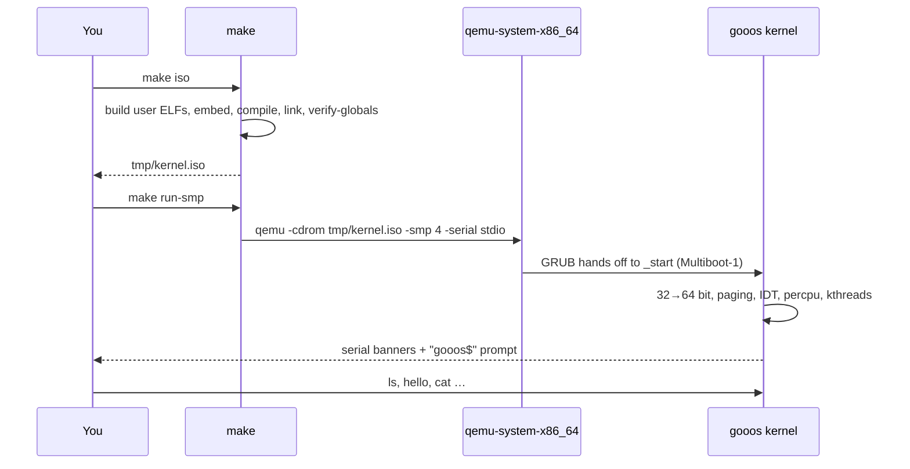

# Chapter 02 — Building and Running gooos

## Overview

This chapter shows how the gooos source tree turns into a bootable
ISO 9660 filesystem image (ISO) and how to launch it under
qemu-system-x86_64. By the end of the chapter you should have a
serial-console banner and an interactive shell prompt running in
QEMU within thirty minutes.

gooos is built in two stages. First the userspace command suite
(under `user/`) is compiled to position-independent ELF
(Executable and Linkable Format) binaries. A shell script then
embeds each ELF as a Go byte-array constant inside the kernel
source tree. Second, the kernel itself is compiled by a patched
TinyGo, linked together with hand-written assembly, packaged into
an ISO with GRUB (GRand Unified Bootloader), and booted under
QEMU.

The two stages share the same toolchain — TinyGo, GNU `as`, and
ld.lld (LLVM linker, the LLD project's linker driver) — but use
different `target.json` files because the kernel runs with
`scheduler=none` while user processes run with
`scheduler=tasks`.



## Prerequisites

Before anything else, install the following on the build host:

- `qemu-system-x86_64` reachable on `$PATH`. Tested against the
  upstream 7.x and 8.x series; older builds without
  `-device e1000` will fail the network targets.
- `grub-mkrescue` plus `xorriso` and `mtools` so it can author
  the ISO. On Debian-family systems these come from
  `grub-pc-bin`, `grub-common`, `xorriso`, and `mtools`.
- GNU `as` (the binutils assembler) and `ld.lld`. The kernel
  Makefile hard-codes `LD := ld.lld` because GNU make ships a
  builtin `LD=ld` value that must be overridden
  (`Makefile:19`).
- A user-writable copy of TinyGo 0.40.1 at
  `$HOME/.local/tinygo0.40.1/`. The Makefile expects
  `TINYGOROOT` to point there
  (`Makefile:15-17`). 0.40.1 is mandatory because it ships the
  `scheduler.cores` runtime that the gooos SMP (Symmetric
  Multi-Processing) work depends on.
- Go 1.21 or newer for the `lint` helper at
  `scripts/lint_isr.go`, which is built with the host `go`
  toolchain (`Makefile:67`).
- The gooos runtime patch must be applied to the TinyGo tree
  before the first build — see the next section.

## The TinyGo runtime patch

### What

`scripts/tinygo_runtime.patch` installs a set of gooos-specific
files and edits into the TinyGo source tree. The patch creates
six new files plus targeted hunks against four existing files,
splitting the runtime into kernel-mode and user-mode bodies via
a `kernelspace` build tag.

The script `scripts/patch_tinygo_runtime.sh` is the canonical
applier. It is idempotent and re-runs cleanly after a TinyGo
refresh (`scripts/patch_tinygo_runtime.sh:22-28`).

| File added by the patch | Build tag | Role |
|---|---|---|
| `runtime/runtime_gooos.go` | `gooos && baremetal && kernelspace` | Kernel runtime hooks, `numCPU=17`, `atomicsLock`, `futexLock` |
| `runtime/runtime_gooos_user.go` | `gooos && baremetal && !kernelspace` | Userspace counterparts (no IRQ work) |
| `runtime/wait_gooos.go` | kernel | `waitForEvents()` = `sti; hlt; cli` |
| `runtime/wait_gooos_user.go` | user | `waitForEvents()` = no-op |
| `runtime/interrupt/interrupt_gooos.go` | kernel | `gooos_readInterruptDepth`, `gooos_readSyscallDepth` |
| `runtime/interrupt/interrupt_gooos_user.go` | user | no-op interrupt shims |

The patch also edits four existing files
(`scripts/patch_tinygo_runtime.sh:246-267`):

| File modified | What changes |
|---|---|
| `internal/task/task_stack.go` | Adds `state.stackTop` field |
| `internal/task/task_stack_amd64.go` | Adds `gooosOnResume` hook + `runtime_systemStackPtr` linkname |
| `internal/task/task_stack_unicore.go` | Per-CPU `currentTasks[17]` + `gooosStackOverflow` |
| `internal/task/queue.go` | Per-`Queue` spinlock (`gooos_spinlockAcquire`) |
| `runtime/scheduler_cooperative.go` | Per-CPU `runqueues[17]`, `stealWork`, `apScheduler` |
| `runtime/scheduler_cores.go` | Same per-CPU artifacts for `scheduler=cores` |
| `runtime/gc_blocks.go` | `gcLockWord` heap spinlock |
| `runtime/wait_other.go` | Adds `&& !gooos` so it does not match the gooos build |

### Why

Stock TinyGo targets microcontrollers and WebAssembly. It has no
notion of an Application Processor (AP) wakeup, no IRQ-aware
goroutine queueing, no kernel-side syscall depth bookkeeping,
and no spinlocks for cross-CPU exclusion. The patch supplies
exactly those primitives by linking the runtime against
kernel-side symbols defined in `src/stubs.S`, `src/isr.S`,
`src/percpu.go`, and friends. Without the patch, the kernel
build either fails with unresolved symbols
(`gooosWakeupCPU`, `gooosOnResume`, `gooosNotePush`,
`gooosNotePop`, `gooos_readInterruptDepth`, …) or — worse —
links against the unpatched stock runtime and silently produces
a kernel that hangs the moment a goroutine yields.

### How

```
bash scripts/patch_tinygo_runtime.sh
```

The script auto-detects the TinyGo source tree under
`$HOME/.local/tinygo0.40.1/src` and refuses to run if the tree
is missing (`scripts/patch_tinygo_runtime.sh:34-48`). It can be
re-run after every `git pull` of the upstream TinyGo tree; an
already-patched tree exits at the early "already-applied"
short-circuit (`scripts/patch_tinygo_runtime.sh:83-108`).

### Where

- `scripts/tinygo_runtime.patch` — the unified diff itself.
- `scripts/patch_tinygo_runtime.sh` — applier with
  pre/post-condition checks.
- `src/stubs.S`, `src/isr.S`, `src/percpu.go`,
  `src/goroutine_tss.go`, `src/panic.go` — kernel symbols the
  patched runtime resolves against
  (`scripts/patch_tinygo_runtime.sh:268-277`).

## Two-stage build pipeline

### What

`make build` (the default target) walks two halves of the tree
in order: it first compiles user programs into ELFs, embeds the
bytes into a generated Go file, then compiles and links the
kernel image. The pipeline above visualises the steps; this
section ties each arrow to a specific Makefile line.

| Step | Inputs | Outputs | Driver |
|---|---|---|---|
| 1. Build user ELFs | `user/cmd/*/main.go`, `user/rt0.S`, `user/linker_user.ld` | `user/build/*.elf` | `make -C user all` (`Makefile:56-57`) |
| 2. Embed ELFs | `user/build/*.elf` | `src/user_binaries.go` | `bash scripts/embed_elfs.sh` (`Makefile:59-60`) |
| 3. Lint ISR table | `src/isr.S`, `src/isr_dispatch.go` | OK / fail | `scripts/lint_isr.go` (`Makefile:67-70`) |
| 4. Assemble kernel asm | `src/boot.S`, `src/stubs.S`, `src/isr.S`, `src/switch.S`, `src/trampoline.S`, `src/task_stack_amd64.S`, `src/runtime_asm_amd64.S`, `src/kthread_switch.S` | `tmp/*.o` | `as --64` (`Makefile:83-105`) |
| 5. Compile kernel Go | `src/*.go` + `src/target.json` | `tmp/kernel_go.o` | `tinygo build -target=src/target.json` (`Makefile:107-108`) |
| 6. Link kernel ELF | every `tmp/*.o` + `src/linker.ld` | `tmp/kernel.bin` | `ld.lld -m elf_x86_64 -n -T src/linker.ld` (`Makefile:110-111`) |
| 7. Verify globals | `tmp/kernel.bin` | OK / fail | `bash scripts/verify_globals.sh` (`Makefile:77-78`) |
| 8. Wrap as ISO | `tmp/kernel.bin` + `grub/grub.cfg` | `tmp/kernel.iso` | `grub-mkrescue` (`Makefile:118-123`) |

Step 7 (`verify-globals`) runs `nm` over the linked kernel and
confirms that the conservative-GC roots — `runtime.runqueues`,
`runtime.sleepQueue`, `runtime.timerQueue`, plus the kthread
globals defined under `scheduler=none` — fall inside the
`[_globals_start, _globals_end)` range that `findGlobals` will
later scan (`scripts/verify_globals.sh:33-53`). A TinyGo upgrade
that silently shifts section layout would lose live `*Task`
pointers; the build refuses to produce an ISO in that
condition.

### How embedding works

`scripts/embed_elfs.sh` writes a generated Go file (header
"DO NOT EDIT") with one `var userElf_<cmd> = [...]byte{0x.., …}`
declaration per ELF (`scripts/embed_elfs.sh:14-44`). The
script enforces a 256 KiB cap per binary, mirroring `maxFileData`
in `src/fs.go:12` so an over-sized ELF fails the build instead
of being rejected at boot
(`scripts/embed_elfs.sh:22-35`).

### Where

- `Makefile` — driver for everything above.
- `user/Makefile` — user-side compile + link.
- `scripts/embed_elfs.sh` — ELF → Go-byte-array bridge.
- `scripts/verify_globals.sh` — post-link GC-roots invariant.
- `src/linker.ld` — kernel layout, including
  `_globals_start`/`_globals_end` markers
  (`src/linker.ld:26-49`).

## Decoded `src/target.json`

The kernel's TinyGo target file is small but every field is
load-bearing. Read alongside `src/target.json:1-15`.

| Field | Value | Purpose |
|---|---|---|
| `llvm-target` | `x86_64-unknown-linux-elf` | LLVM (Low Level Virtual Machine) target triple. The "linux" part is cosmetic; we override syscalls. |
| `cpu` | `x86-64` | Generic 64-bit baseline. No CPU-specific tuning. |
| `features` | `-mmx,-sse,-sse2,-sse3,-ssse3,-sse4.1,-sse4.2,-avx,-avx2,-avx512f` | Disables every SIMD extension. Kernel never enables `CR0.MP`/`CR4.OSFXSR`, so SIMD instructions would `#UD`. |
| `build-tags` | `gooos`, `baremetal`, `kernelspace` | Selects the patched runtime's kernel-mode bodies. |
| `goos` | `linux` | Required by TinyGo's tooling. Has no runtime effect. |
| `goarch` | `amd64` | 64-bit Intel/AMD. |
| `gc` | `conservative` | Mark-sweep over global+stack+heap roots. Required because the precise GC needs allocator metadata we don't keep. |
| `scheduler` | `none` | Goroutines run on hand-managed kthreads (see Chapter 04). The TinyGo cooperative scheduler is bypassed. |
| `default-stack-size` | `8192` | 8 KiB per goroutine. |
| `automatic-stack-size` | `true` | TinyGo picks per-goroutine stack sizes based on call-graph analysis when possible, falling back to 8 KiB. |
| `panic-strategy` | `trap` | `panic()` lowers to `int 3` rather than printing through stdio. |
| `linker` | `ld.lld` | LLVM linker driver, picked because it understands TinyGo-emitted relocations. |
| `rtlib` | `compiler-rt` | LLVM's runtime library for soft-float helpers and intrinsics. |

Note that `linkerscript` is **not** set in this JSON. The kernel
target intentionally relies on the explicit `ld.lld -T
src/linker.ld` invocation in the Makefile (`Makefile:111`) so
TinyGo emits a relocatable object that we link by hand against
the kernel layout, rather than letting TinyGo drive the final
link.

## Decoded `user/target.json`

The user target shares almost every field with the kernel
target but differs in three crucial ways
(`user/target.json:1-15`).

| Field | Kernel value | User value | Why different |
|---|---|---|---|
| `llvm-target` | `x86_64-unknown-linux-elf` | `x86_64-unknown-none-elf` | `none` is the freestanding triple; user binaries do not link against any host libc. |
| `build-tags` | `gooos, baremetal, kernelspace` | `gooos, baremetal` | Omitting `kernelspace` selects `runtime_gooos_user.go` / `interrupt_gooos_user.go` — the no-op interrupt and HLT-less wait shims. |
| `scheduler` | `none` | `tasks` | User binaries use TinyGo's stock cooperative `tasks` scheduler. The kernel disables it because gooos owns kthread scheduling itself. |

All other fields (`cpu`, `features`, `gc`, `panic-strategy`,
`linker`, `rtlib`, `goos`, `goarch`, `default-stack-size`,
`automatic-stack-size`) match the kernel's. The userspace
build, like the kernel, hand-links against
`user/linker_user.ld` rather than relying on TinyGo's default
link step (`user/Makefile:50-52`).

## Make targets

Every target a regular contributor needs sits in `Makefile`.
The table below summarises them; QEMU command lines are
verbatim from the corresponding rule.

| Target | One-line purpose | QEMU invocation (where applicable) |
|---|---|---|
| `build` (default) | Lint, embed user ELFs, compile + link kernel, run `verify-globals` (`Makefile:62`) | — |
| `user` | Build all userspace ELFs into `user/build/` (`Makefile:56-57`) | — |
| `embed-user` | Re-run `scripts/embed_elfs.sh` to regenerate `src/user_binaries.go` after changing user code (`Makefile:59-60`) | — |
| `lint` | Run `scripts/lint_isr.go` to check IDT/ISR consistency (`Makefile:69-70`) | — |
| `verify-globals` | `nm`-based GC-roots invariant check on the linked kernel (`Makefile:77-78`) | — |
| `iso` | Wrap `tmp/kernel.bin` + `grub/grub.cfg` into `tmp/kernel.iso` via `grub-mkrescue` (`Makefile:116-123`) | — |
| `check-multiboot` | `grub-file --is-x86-multiboot tmp/kernel.bin` (`Makefile:113-114`) | — |
| `run` | Boot the ISO under one CPU (`Makefile:125-126`) | `qemu-system-x86_64 -cdrom tmp/kernel.iso -serial stdio -no-reboot -no-shutdown` |
| `run-kernel` | Bypass GRUB; load `tmp/kernel.bin` directly via QEMU's `-kernel` (`Makefile:128-129`) | `qemu-system-x86_64 -kernel tmp/kernel.bin -serial stdio -no-reboot -no-shutdown` |
| `run-smp` | Same as `run` plus `-smp 4` (`Makefile:131-132`) | `qemu-system-x86_64 -cdrom tmp/kernel.iso -serial stdio -no-reboot -no-shutdown -smp 4` |
| `run-net` | Boot with an emulated Intel 82540EM Network Interface Controller (NIC) attached to slirp user-mode networking, with four hostfwd ports (`Makefile:141-144`) | `qemu-system-x86_64 -cdrom … -device e1000,netdev=n0 -netdev user,id=n0,hostfwd=udp::9999-:7,hostfwd=udp::19999-:17,hostfwd=tcp::10080-:8080,hostfwd=tcp::10081-:8081` |
| `test-net` | Drive `scripts/test_net.sh` over an `iso` build to validate ICMP, ARP, UDP echo, TCP echo, and netDiag markers (`Makefile:150-151`) | wraps `run-net` |
| `test-net-tap` | TAP-mode network test against `10.0.0.2`. Requires root or `CAP_NET_ADMIN`; not part of the default gate (`Makefile:156-157`) | wraps a TAP-backed netdev |
| `clean` | `rm -rf tmp` and `make -C user clean` (`Makefile:159-161`) | — |

The handful of `scripts/test_*.sh` files that are not wired to
make targets (for example `test_preempt_user.sh`,
`test_ring3_distribution.sh`, `test_smp_basic.sh`) are run
directly with `bash`. The next two sections cover them.

## GRUB Multiboot-1 hand-off

### What

`grub/grub.cfg` is the entire boot menu (`grub/grub.cfg:1-7`):

```
set timeout=0
set default=0

menuentry "gooos: Hello World" {
    multiboot /boot/kernel.bin
    boot
}
```

`timeout=0` means GRUB does not pause; it transfers control
straight to the entry. The `multiboot` command tells GRUB that
`/boot/kernel.bin` is a Multiboot-1 image (note: not the newer
Multiboot-2). GRUB validates the magic word in the kernel's
Multiboot header, sets up a flat 32-bit memory map, and jumps
to the kernel's ELF entry point.

### Why

Multiboot-1 lets a Go-emitted ELF skip the legacy 16-bit BIOS
boot dance entirely. The boot CPU enters the kernel in 32-bit
protected mode with a known register state and pointer to the
Multiboot info block. The patched-up assembly in `src/boot.S`
takes it from there.

### How (the contract)

| Layer | Constraint | Source |
|---|---|---|
| Kernel ELF | `.multiboot` section emitted first, 4-byte aligned, within first 8 KiB of file | `src/linker.ld:9-14` |
| Kernel ELF | Contains the magic triple `MB_MAGIC=0x1BADB002`, `MB_FLAGS=0`, `MB_CHECKSUM=-(MB_MAGIC+MB_FLAGS)` | `src/boot.S:9-20` |
| Kernel ELF | Entry symbol `_start` is in 32-bit code | `src/linker.ld:3` (`ENTRY(_start)`) and `src/boot.S` `.code32` block |
| ISO | Contains `boot/kernel.bin` and `boot/grub/grub.cfg` | `Makefile:118-123` |

`make check-multiboot` runs `grub-file --is-x86-multiboot
tmp/kernel.bin` after every link; the `run` and `run-smp`
targets depend on it (`Makefile:113-114`, `Makefile:125`,
`Makefile:131`).

### Where

- `grub/grub.cfg` — menu definition.
- `src/linker.ld:7-14` — `.multiboot` section placement.
- `src/boot.S:9-40` — Multiboot header bytes and 32-bit entry
  trampoline.
- The deeper handoff path — including the 32→64 bit switch,
  paging setup, and the call into TinyGo `main` — is the
  subject of Chapter 03.

## Test scripts

The scripts directory hosts forty-odd `test_*.sh` harnesses.
The table below highlights the ones the chapter brief calls
out plus the close cousins they cooperate with. All paths are
under `scripts/`.

| Script | Purpose |
|---|---|
| `test_net.sh` | Boots `run-net`, `grep`s for PCI/MAC/link/NET/ARP/ICMP/UDP/netDiag markers, and round-trips a payload through host port 9999 → guest UDP port 7 (`scripts/test_net.sh:1-15`). Wired to `make test-net`. |
| `test_preempt_user.sh` | Runs the `userpreempt` user ELF under QEMU and checks that the marker goroutine is preempted at least five times in fifteen seconds (`scripts/test_preempt_user.sh:1-13`). Run directly with `bash`. |
| `test_preempt_kernel.sh` | Sibling of the above that flips `preemptEnabled` to exercise the kernel-side preempt path. |
| `test_ring3_distribution.sh` | Ring-3 SMP gate: asserts that auto-loaded `markerprint.elf` lands on at least one Application Processor (cpuID ≠ 0) within fifteen seconds (`scripts/test_ring3_distribution.sh:1-15`). |
| `test_smp_basic.sh` | Boots `-smp 4` and looks for `smp_basic_cpu=N` (kernel goroutine on a non-Bootstrap-Processor core) plus a non-zero `cpuID` from `ring3Wrapper` (`scripts/test_smp_basic.sh:1-13`). |
| `verify_globals.sh` | Post-link `nm` check that runtime/kthread queue globals fall inside `[_globals_start, _globals_end)` (`scripts/verify_globals.sh:33-53`). Wired to `make verify-globals`. |
| `verify_globals_user.sh` | The userspace counterpart, run by `user/Makefile` after every user-ELF link (`user/Makefile:53`). |

Other harnesses (network phases, shell, kthread smoke,
sleeptest variants) follow the same pattern: build an ISO, boot
QEMU under user-mode networking or `-smp`, grep the serial log
for known markers, exit 0 on PASS.

## A 30-minute first run

This is the exact path from a fresh checkout to a live shell
prompt. Steps 1–3 are one-time setup; 4–6 are the daily loop.

1. **Confirm the source checkout.** You already have it at
   `/home/ryo/work/gooos`. Just `cd` there.
2. **Install host packages.**
   ```
   sudo apt install qemu-system-x86 grub-pc-bin grub-common xorriso mtools build-essential
   ```
   Confirm `qemu-system-x86_64`, `grub-mkrescue`, `as`, and
   `ld.lld` are on `$PATH`.
3. **Install TinyGo 0.40.1 + apply the runtime patch.** Drop
   the upstream binary release into
   `$HOME/.local/tinygo0.40.1/`. Then:
   ```
   bash scripts/patch_tinygo_runtime.sh
   ```
   The script prints `tinygo runtime patched at …` on success
   (`scripts/patch_tinygo_runtime.sh:242-243`).
   Without this step the build will fail at link time with
   missing `gooos*` symbols.
4. **Build the ISO.**
   ```
   make iso
   ```
   On a recent laptop this completes in under a minute. The
   command compiles every userspace ELF, regenerates
   `src/user_binaries.go`, links `tmp/kernel.bin`, runs
   `verify-globals`, then bundles the ISO at `tmp/kernel.iso`.
5. **Boot under QEMU with four virtual CPUs.**
   ```
   make run-smp
   ```
   This invokes `qemu-system-x86_64 -cdrom tmp/kernel.iso
   -serial stdio -no-reboot -no-shutdown -smp 4`
   (`Makefile:131-132`). Standard out becomes the gooos
   serial console.
6. **Expected serial output.** Within roughly two seconds you
   should see boot banners — Multiboot info dump, paging map,
   per-CPU bring-up lines for cores 1..3, network/PCI probe
   markers (none active without `-device e1000`), then the
   shell prompt:
   ```
   gooos$
   ```
   Try `ls`, `hello`, or `cat /etc/motd` to drive the embedded
   user binaries. Detailed boot tracing is covered in
   Chapter 03.



To stop the guest: `Ctrl+A` then `X` in the `-serial stdio`
session, or kill QEMU from another terminal.

## Summary

- gooos builds in two stages: user ELFs first, embedded as Go
  byte arrays, then the kernel itself.
- Both stages use TinyGo 0.40.1 with a mandatory runtime patch
  that installs gooos-specific kernel and user runtime hooks
  (`scripts/tinygo_runtime.patch`,
  `scripts/patch_tinygo_runtime.sh`).
- The kernel target uses `scheduler=none` and the
  `kernelspace` build tag; the user target uses
  `scheduler=tasks` and omits `kernelspace`.
- `make iso` produces a Multiboot-1 ELF bundled into an ISO via
  GRUB (`Makefile:118-123`, `grub/grub.cfg`).
- `make run-smp` boots the ISO under QEMU with four virtual
  CPUs and dumps the serial console on stdout.
- A handful of helper scripts (`scripts/test_net.sh`,
  `scripts/verify_globals.sh`, `scripts/test_smp_basic.sh`,
  `scripts/test_ring3_distribution.sh`,
  `scripts/test_preempt_user.sh`) gate the build against a
  per-feature regression matrix; some are wired to make
  targets (`test-net`, `verify-globals`), the rest run via
  `bash`.

## Cross-references

- `./03_boot_and_init.md` — what happens after GRUB hands off
  control: 32→64 bit transition, paging map, IDT/GDT setup,
  per-CPU bring-up, the call into TinyGo `runtime.main`.
- `./07_processes_and_userspace.md` — how the embedded user
  ELFs (`hello`, `sh`, `cat`, `ls`, `wget`, …) are loaded,
  fork/exec semantics, syscall path, Ring-3 entry.
- `./11_tinygo_baremetal.md` — internals of the runtime patch:
  what each gooos hook does, why the conservative GC needs the
  global-roots invariant, how the SMP per-CPU runqueues
  interact with `scheduler=cores`.
