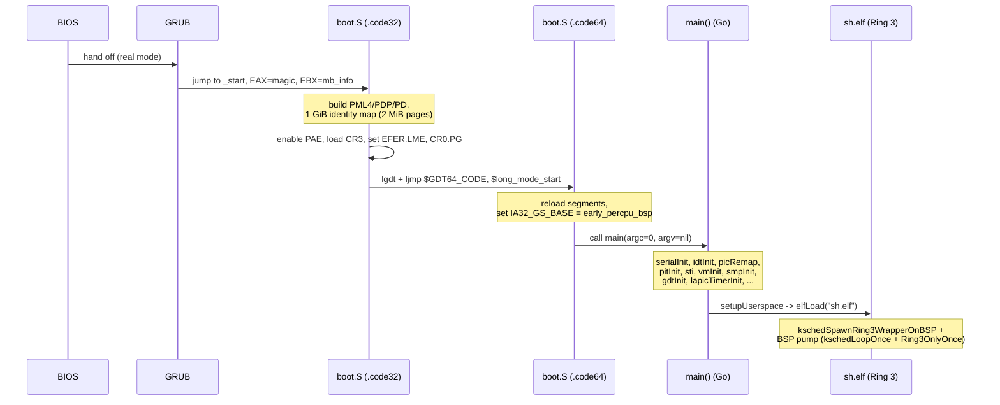

# Chapter 03 — Boot and Initialization

## Overview

This chapter walks the gooos boot path from the moment GRUB (GRand Unified
Bootloader) loads the kernel image off disk to the moment the boot shell
runs as a Ring-3 process. The path crosses four representations of "running
code":

1. A 32-bit protected-mode entry written in assembly (`src/boot.S`).
2. A 64-bit long-mode trampoline that calls into TinyGo-emitted Go code
   (`src/boot.S`, `long_mode_start`).
3. The TinyGo runtime entry `main` (`src/main.go`).
4. The boot shell ELF loaded into a Ring-3 address space and pumped by a
   hand-rolled scheduler loop (`src/elf.go`, `src/userspace.go`).

The chapter calls out concrete files and line numbers so a reader can step
through the actual kernel rather than an idealized one. Where the spec text
and the source disagree, the source wins and the text is corrected.

## Prerequisites

Readers should be comfortable with:

* Multiboot-1 in concept (header magic, info struct passed in `EBX`).
* The 32-to-64-bit transition on x86_64 — `CR3` (Control Register 3),
  `EFER.LME` (Extended Feature Enable Register, Long Mode Enable bit),
  `CR0.PG` (Paging enable), `PML4` (Page Map Level 4), `PAE` (Physical
  Address Extension).
* What a `GDT` (Global Descriptor Table), `IDT` (Interrupt Descriptor
  Table), `TSS` (Task State Segment), `IST` (Interrupt Stack Table), and
  `MSR` (Model-Specific Register) are at the data-structure level.
* The legacy `PIC` (Programmable Interrupt Controller, 8259A) and `PIT`
  (Programmable Interval Timer, 8254) at the I/O-port level.
* That an `IRQ` (Interrupt Request) is an electrical signal, an `ISR`
  (Interrupt Service Routine) is the software that handles it, and the
  `LAPIC` (Local Advanced Programmable Interrupt Controller) /
  `IOAPIC` (I/O Advanced Programmable Interrupt Controller) are the
  modern per-CPU and platform-level replacements for the PIC.
* The `BIOS` (Basic Input/Output System) ROM is invisible by the time
  GRUB hands off to a Multiboot-1 kernel — gooos does not call back
  into it.

## The boot path at a glance



## 1. Multiboot-1 handshake with GRUB

**What.** The kernel image carries a Multiboot-1 header in the first 8 KiB
of the file. GRUB scans the image, validates the header's three
4-byte fields (magic, flags, checksum), loads the image at its link
address, and jumps to `_start` with `EAX = 0x2BADB002` (the "loader
identifies itself" magic) and `EBX = pointer to the Multiboot info
struct`.

**Why.** Multiboot-1 lets a stock GRUB load a custom kernel ELF without
needing a custom boot sector. gooos chooses Multiboot-1 (not -2) because
the header is three little-endian words and the entry contract is
trivial — there is no `EBX`-walking code in the kernel, and the boot
trampoline can stay short.

**How.** The header lives in its own ELF input section so the linker
script can place it deterministically:

```
.set MB_MAGIC,    0x1BADB002
.set MB_FLAGS,    0x00000000
.set MB_CHECKSUM, -(MB_MAGIC + MB_FLAGS)

    .section .multiboot, "a", @progbits
    .align 4
    .long MB_MAGIC
    .long MB_FLAGS
    .long MB_CHECKSUM
```

The linker script reserves the first PT_LOAD bytes for that section and
guards it with `KEEP` so `--gc-sections` does not throw it away:

```
. = 0x100000;
.multiboot : ALIGN(4)
{
    KEEP(*(.multiboot))
}
```

The `0x100000` (1 MiB) is the conventional load address that escapes the
640 KiB BIOS/IVT / EBDA region.

**Where.**

| File | Lines | Role |
|------|-------|------|
| `src/boot.S` | 9–20 | Multiboot-1 header definition |
| `src/linker.ld` | 7–14 | Header placement at file start, KEEP |
| `src/linker.ld` | 7 | Image load address `0x100000` |

The kernel does not consume the Multiboot info struct in `EBX`.
Memory-map discovery is replaced by a bump allocator over the linker
symbol `_alloc_start` (see Chapter 04).

## 2. `_start` in 32-bit protected mode

**What.** GRUB delivers control in 32-bit protected mode with paging
disabled. `_start` (in `.code32`) builds the long-mode page tables,
enables PAE, loads `CR3`, sets `EFER.LME` and `CR0.PG`, then far-jumps
into a 64-bit code segment.

**Why.** This is the canonical x86_64 long-mode bring-up sequence. It is
self-contained — no BIOS calls, no unreal-mode tricks — because by the
time GRUB hands off, the CPU is already in flat 32-bit protected mode.

**How — five sub-steps in order.**

1. **Stack.** The very first instruction sets `ESP = stack_top`. Because
   `stack_bottom` reserves 16 KiB in `.bss` (the linker zeroes it on
   load), the stack is immediately usable.

   ```
   _start:
       movl    $stack_top, %esp
       cld
   ```

2. **Identity-map 1 GiB with three tables.** `PML4[0]` points at `pdp`,
   `pdp[0]` points at `pd`, and `pd[0..511]` are filled with 2 MiB huge
   pages. Each entry is `(i * 0x200000) | 0x83`, where `0x83 = PRESENT |
   WRITE | PAGE_SIZE` (the `PS` bit at bit 7 turns a PD entry into a 2
   MiB leaf rather than a pointer to a PT). The loop writes both halves
   of each 8-byte entry explicitly so the code is robust even if `pd`
   ever moves out of `.bss`:

   ```
   xorl    %ecx, %ecx
   1:
       movl    %ecx, %eax
       shll    $21, %eax              ; eax = i * 2 MiB
       orl     $0x83, %eax            ; PRESENT | WRITE | PAGE_SIZE
       movl    %eax, pd(, %ecx, 8)    ; low 32 bits
       movl    $0,   pd+4(, %ecx, 8)  ; high 32 bits
       incl    %ecx
       cmpl    $512, %ecx
       jne     1b
   ```

   Note: the boot map uses 2 MiB pages, *not* 4 KiB pages. Fine-grained
   4 KiB mappings come later (see step 11).

3. **`CR3` ← physical address of `pml4`.**

4. **Enable PAE** by setting `CR4.PAE` (bit 5). Long mode requires PAE.

5. **Set `EFER.LME`** via `wrmsr` to MSR `0xC0000080`. After `LME` is
   set the CPU is "long-mode capable" but has not yet entered it.

6. **Enable paging** by setting `CR0.PG` (bit 31). The combination of
   `EFER.LME = 1` + `CR0.PG = 1` puts the CPU in *compatibility mode*
   under a 64-bit code segment — but the current CS is still the 32-bit
   protected-mode selector, so the actual transition needs one more
   thing.

7. **`lgdt gdt64_pointer`** loads a 64-bit GDT containing a null
   descriptor, a 64-bit code segment (bits 43, 44, 47, 53 set — the
   "L" bit at 53 is what makes it 64-bit), and a 64-bit data segment.

8. **`ljmp $GDT64_CODE, $long_mode_start`** — the far jump replaces CS
   with the 64-bit selector, and the next instruction executes as
   `.code64`.

**Where.**

| File | Lines | Role |
|------|-------|------|
| `src/boot.S` | 75–104 | Identity map construction |
| `src/boot.S` | 106–124 | PAE + LME + PG sequence |
| `src/boot.S` | 56–68 | 64-bit GDT and `gdt64_pointer` |
| `src/boot.S` | 127–128 | `lgdt` + far jump |

## 3. Long-mode entry and `main` invocation

**What.** `long_mode_start` reloads the data segment registers with the
64-bit data selector, sets `IA32_GS_BASE` to point at a temporary
per-CPU block (see step 4 below), zero-initializes `argc`/`argv`, and
calls TinyGo's `main` symbol.

**How.**

```
.code64
long_mode_start:
    movw    $GDT64_DATA, %ax
    movw    %ax, %ds
    movw    %ax, %es
    movw    %ax, %fs
    movw    %ax, %gs
    movw    %ax, %ss
    ...                      /* IA32_GS_BASE setup, see step 4 */
    xorl    %edi, %edi       /* argc = 0 */
    xorl    %esi, %esi       /* argv = nil */
    call    main
hang:
    cli
    hlt
    jmp     hang
```

The signature `main(argc int32, argv *unsafe.Pointer) int` matches what
TinyGo's `runtime_unix.go` expects. `argc=0` and `argv=nil` are passed
because there is no shell or kernel command line above us — gooos *is*
the kernel. If `main` ever returns, the trampoline falls through to a
`cli; hlt; jmp` loop so the machine halts safely instead of executing
random bytes.

**Where.** `src/boot.S` lines 132–163.

## 4. Per-CPU GS_BASE before any C/Go code runs

**What.** Before calling `main`, the long-mode trampoline writes the
address of `early_percpu_bsp` (a 64-byte zero-filled `.bss` block) into
`IA32_GS_BASE` (MSR `0xC0000101`). That makes `%gs:0..63` point at a
zeroed scratch area immediately, so the first interrupt — even one
fired before any Go code runs — can safely do `incl %gs:4` to bump the
per-CPU interrupt-depth counter without crashing.

**Why.** The ISR prologue in `src/isr.S` references `%gs:4`,
`%gs:44`, etc. for the `PerCPU` struct fields `InterruptDepth` and
`SyscallDepth`. If those reads landed on a stale `GS_BASE` (for example
the boot value of 0), they would either fault or silently corrupt
memory. A zero-filled 64-byte block has the right side-effect: the
counters start at zero and increment harmlessly.

**How.**

```
movl    $0xC0000101, %ecx       ; IA32_GS_BASE MSR
leaq    early_percpu_bsp(%rip), %rax
movl    %eax, %eax              ; zero-extend (addr < 4 GiB)
movq    %rax, %rdx
shrq    $32, %rdx
wrmsr
```

The `movl %eax, %eax` is a deliberate zero-extend: at this point the
kernel is loaded below 4 GiB (linker script: load address 1 MiB), so
`RAX` fits in 32 bits, and the upper half is forced to zero before the
`shrq` builds `EDX`.

**Where.**

| File | Lines | Role |
|------|-------|------|
| `src/boot.S` | 32–34 | `early_percpu_bsp` reservation |
| `src/boot.S` | 141–150 | `IA32_GS_BASE` write |
| `src/percpu.go` | 14–48 | `PerCPU` layout, `pcpuOffInterruptDepth = 4` |
| `src/isr.S` | 118–124 | First user of `%gs:4` |

`percpuInitBSPEarly()` (called from `main()`) later replaces this
temporary block with the real `perCPUBlocks[0]`.

## 5. Ordered initialization in `main()`

The Go-side boot is a strictly sequential script. The exact order
matters: every step has either a hardware precondition (something must
be programmed before it can fire) or a software precondition (some
table must be populated before another piece of code reads it). Read
the actual code at `src/main.go:122` for the canonical version. Below
is the order with one-line purpose notes — the line numbers are from
that file.

| # | Step | File | Line | Purpose |
|---|------|------|------|---------|
| 1 | `vgaClear` | main.go | 123 | Wipe the VGA text buffer |
| 2 | `serialInit` | main.go | 126 | Bring up COM1 for `serialPrintln` |
| 3 | `idtInit` | main.go | 133 | Build 256 IDT gates pointing at `isr.S` stubs |
| 4 | `registerHandler(0, …); registerHandler(14, …)` | main.go | 138–139 | #DE and #PF handlers |
| 5 | `picRemap` | main.go | 144 | Move legacy IRQs from 0x08–0x0F to 0x20–0x2F |
| 6 | default IRQ handlers for 32–47 | main.go | 148–150 | Spurious-IRQ EOI guard |
| 7 | `percpuInitBSPEarly` | main.go | 154 | Repoint `IA32_GS_BASE` at real `perCPUBlocks[0]` |
| 8 | `pitInit` + register vector 32 | main.go | 157–158 | 100 Hz tick |
| 9 | `keyboardInit` + register vector 33 | main.go | 163–164 | IRQ1 handler |
| 10 | `sti` | main.go | 169 | First moment maskable interrupts can fire |
| 11 | `afterTicksInit` | main.go | 177 | Start the timer-wheel kthread |
| 12 | `vmInit` | main.go | 209 | Initialize the page-frame allocator (set `nextFreePage`) |
| 13 | `ring3StackPoolInit` | main.go | 214 | Kernel-stack pool for Ring-3 wrappers |
| 14 | `captureBootPML4` | main.go | 219 | Save boot CR3 for processExit fast path |
| 15 | (VM + free-list smoke tests) | main.go | 220–252 | Verify `mapPage`/`unmapPage`/`allocPage` |
| 16 | (ELF parser smoke test) | main.go | 254–320 | Synthetic ELF64 sanity check |
| 17 | direct FS demo | main.go | 322–334 | `fsCreate`/`fsWrite`/`fsRead` before scheduler runs |
| 18 | `smpInit` | main.go | 362 | INIT-SIPI-SIPI; map LAPIC MMIO; bring up APs |
| 19 | `percpuInitBSPLate` | main.go | 365 | Fill in BSP's APIC ID |
| 20 | `gdtInit` | main.go | 369 | Install Ring 3 + TSS GDT |
| 21 | register IPI handlers | main.go | 378–381 | `ipiWakeupVector` 0xFC, `ipiPreemptVector` 0xFB |
| 22 | `lapicTimerCalibrate` | main.go | 386 | Measure LAPIC ticks per 10 ms against PIT |
| 23 | `lapicTimerInit` | main.go | 387 | Periodic 100 Hz LAPIC timer on BSP |
| 24 | `pciInit` + `e1000Init` | main.go | 391–405 | NIC bring-up (when present) |
| 25 | `kschedInit` | main.go | 438 | gooos kthread scheduler |
| 26 | `kschedSpawnAt("fsTask", …, 0)` | main.go | 444 | FS service kthread, BSP-pinned |
| 27 | `netSpawnServices` | main.go | 454 | netRxLoop, udpEchoServer kthreads |
| 28 | `fsCreate("sh.elf", …)` and friends | main.go | 474–560 | Stage embedded user binaries |
| 29 | `setupUserspace` (`elfLoad("sh.elf")`) | main.go | 622 | Spawn boot shell, pump scheduler |

A few non-obvious sequencing rules captured in this list:

* `picRemap` must run before `sti`. Otherwise the first PIT tick lands
  on vector 8, which the IDT routes to the `#DF` (double-fault) handler.
* `percpuInitBSPEarly` must run before `sti` for the same reason as
  step 4 above — but with the real `PerCPU` block.
* `smpInit` maps the LAPIC MMIO page, so `lapicTimerCalibrate`,
  `lapicTimerInit`, and `percpuInitBSPLate` (which reads the APIC ID
  register) must come after it.
* `gdtInit` installs the TSS, which is needed for Ring 3 stack
  switching on interrupt; it must run before any Ring 3 process is
  spawned.

## 6. IDT layout and stub flow

**What.** A 256-entry IDT (`idtTable [256]IDTEntry` in `src/idt.go:44`),
with each entry a 16-byte 64-bit gate descriptor.

### Gate descriptor (16 bytes)

```
+---------+---------+---------+---------+
| byte 0  | byte 1  | byte 2  | byte 3  |
|        offset_low (16)      | seg_sel  |
+---------+---------+---------+---------+
| byte 4  | byte 5  | byte 6  | byte 7  |
|  IST    | TypeAttr|     offset_mid     |
+---------+---------+---------+---------+
| byte 8  | byte 9  | byte 10 | byte 11 |
|              offset_high (32)         |
+---------+---------+---------+---------+
| byte 12 | byte 13 | byte 14 | byte 15 |
|              reserved = 0             |
+---------+---------+---------+---------+

TypeAttr bits:
  bit 7    : Present
  bits 6:5 : DPL  (0 = ring 0, 3 = ring 3 trap gate)
  bit 4    : 0
  bits 3:0 : Type (0xE = 64-bit interrupt gate, 0xF = trap gate)
```

`gateInterrupt = 0x8E` is what `setGate` writes by default; vector 0x80
gets `gateTrapUser = 0xEF` via `setGateDPL3` (so user code can `int
$0x80` and so the handler keeps `IF` set across the call). See
`src/idt.go:36–41`, `src/idt.go:88–95`.

### From hardware to Go

The 256 stubs are generated by two macros in `src/isr.S`. Vectors with
a CPU-pushed error code (8, 10–14, 17, 21) use `ISR_ERR`; the rest use
`ISR_NOERR` and push a dummy zero so the stack frame is uniform. Each
stub `jmp`s to `isr_common`.

`isr_common` (lines 88–172 of `src/isr.S`):

1. Pushes 15 GPRs (rax through r15) — see lines 90–104.
2. `incl %gs:4` (interrupt depth). For vector 0x80 (syscall) and 0xFB
   (preempt IPI) it additionally `incl %gs:44` (syscall depth) so
   `runtime.interrupt.In()` returns `false` inside those handlers,
   letting `task.Pause()` work — see lines 118–125.
3. Calls `go_interrupt_handler(rdi=vector, rsi=errcode, rdx=frameptr)`
   after aligning RSP to 16 bytes — lines 129–138.
4. Decrements the depth counters and pops the GPRs.
5. `addq $16, %rsp` to discard the vector + error code, then `iretq`.

`go_interrupt_handler` (`src/interrupt.go:33`) is a five-line dispatcher:
it stores the error code and frame pointer per-CPU, special-cases vector
`0x80` to `syscallDispatch`, otherwise calls
`handlers[vector](vector)` if a handler is registered.

The 256 stub addresses are kept in a `.rodata` table `isr_table`
(`src/isr.S:179–198`); `idtInit` reads it via `isrTableAddr()` and
calls `setGate` 256 times (`src/idt.go:61–86`).

## 7. PIC remap

**What.** Move legacy 8259A vectors from `0x08–0x0F` (master) and
`0x70–0x77` (slave) to `0x20–0x27` and `0x28–0x2F`.

**Why.** CPU exceptions live in vectors `0–31`. Without a remap, IRQ0
(timer) lands on vector 8 — which is `#DF` (double fault). The legacy
mapping is a leftover from real-mode DOS where exceptions and IRQs
shared vector space.

**How.** `picRemap` (`src/pic.go:31–59`) drives the four ICW
(Initialization Command Word) bytes per chip:

* ICW1 (`0x11`): begin init, ICW4 follows.
* ICW2: vector base (`32` for master, `40` for slave).
* ICW3: cascade — master tells slave it's on IRQ2 (`0x04`), slave tells
  master its identity (`0x02`).
* ICW4 (`0x01`): 8086 mode.

Then both PICs are unmasked (`outb(picXData, 0x00)`).

`picSendEOI(irq)` (`src/pic.go:63–68`) sends `0x20` to PIC1 always, and
also to PIC2 if `irq >= 8`.

## 8. Vectors 0–47 table

| Vec | Source | Name | Push errcode? | Default handler |
|-----|--------|------|---------------|-----------------|
| 0  | CPU exception | `#DE` Division Error | no  | `handleDivisionError` (`main.go:96`) |
| 1  | CPU exception | `#DB` Debug | no | — |
| 2  | CPU exception | NMI | no | — |
| 3  | CPU exception | `#BP` Breakpoint | no | — |
| 4  | CPU exception | `#OF` Overflow | no | — |
| 5  | CPU exception | `#BR` Bound Range | no | — |
| 6  | CPU exception | `#UD` Invalid Opcode | no | — |
| 7  | CPU exception | `#NM` Device Not Avail | no | — |
| 8  | CPU exception | `#DF` Double Fault | yes | — |
| 9  | CPU exception | Coproc Seg Overrun (legacy) | no | — |
| 10 | CPU exception | `#TS` Invalid TSS | yes | — |
| 11 | CPU exception | `#NP` Segment Not Present | yes | — |
| 12 | CPU exception | `#SS` Stack-Segment Fault | yes | — |
| 13 | CPU exception | `#GP` General Protection | yes | — |
| 14 | CPU exception | `#PF` Page Fault | yes | `handlePageFault` (`main.go:139`) |
| 15 | CPU exception | Reserved | no | — |
| 16 | CPU exception | `#MF` x87 FPU Error | no | — |
| 17 | CPU exception | `#AC` Alignment Check | yes | — |
| 18 | CPU exception | `#MC` Machine Check | no | — |
| 19 | CPU exception | `#XM` SIMD FP | no | — |
| 20 | CPU exception | `#VE` Virtualization | no | — |
| 21 | CPU exception | `#CP` Control Protection | yes | — |
| 22–31 | CPU exception | Reserved | no | — |
| 32 | PIC IRQ 0 | PIT Timer | no | `handleTimer` (`pit.go:53`) |
| 33 | PIC IRQ 1 | Keyboard | no | `handleKeyboard` (registered in `main.go:164`) |
| 34 | PIC IRQ 2 | Cascade (slave) | no | `handleDefaultIRQ` |
| 35 | PIC IRQ 3 | COM2 | no | `handleDefaultIRQ` |
| 36 | PIC IRQ 4 | COM1 | no | `handleDefaultIRQ` |
| 37 | PIC IRQ 5 | LPT2 / sound | no | `handleDefaultIRQ` |
| 38 | PIC IRQ 6 | Floppy | no | `handleDefaultIRQ` |
| 39 | PIC IRQ 7 | LPT1 / spurious | no | `handleDefaultIRQ` |
| 40 | PIC IRQ 8 | RTC | no | `handleDefaultIRQ` |
| 41 | PIC IRQ 9 | ACPI / general | no | `handleDefaultIRQ` |
| 42 | PIC IRQ 10 | available (often e1000) | no | `handleE1000IRQ` if NIC present |
| 43 | PIC IRQ 11 | available | no | `handleDefaultIRQ` |
| 44 | PIC IRQ 12 | PS/2 mouse | no | `handleDefaultIRQ` |
| 45 | PIC IRQ 13 | FPU error | no | `handleDefaultIRQ` |
| 46 | PIC IRQ 14 | Primary ATA | no | `handleDefaultIRQ` |
| 47 | PIC IRQ 15 | Secondary ATA | no | `handleDefaultIRQ` |

Vectors above 47 used elsewhere in gooos: `0x80` (syscall, set to DPL=3
trap gate), `0xFB` (preempt IPI), `0xFC` (wakeup IPI), `0xFE`
(LAPIC timer). See `src/lapic_timer.go:14`, `src/main.go:378–381`,
`src/main.go:385`.

## 9. PIT 100 Hz tick

**What.** Channel 0 of the 8254 PIT, programmed in mode 2 (rate
generator) with divisor `1193182 / 100 ≈ 11932 (0x2E9C)`, drives IRQ0
once every ~10 ms.

**Why.** Until the LAPIC timer is calibrated and turned on, the PIT is
the only timekeeping the kernel has. Even after LAPIC takes over, the
PIT keeps running on the BSP — `pitWakeAPs` uses it as a 100 Hz cadence
for waking parked APs over PIC pass-through (see comments in
`src/pit.go:38–80`).

**How.** Programming sequence (`src/pit.go:26–33`):

```
outb(0x43, 0x34)             ; channel 0, lo+hi access, mode 2, binary
outb(0x40, low(divisor))
outb(0x40, high(divisor))
```

`handleTimer` (`src/pit.go:53–80`) increments `pitTicks`, optionally
polls keyboard, sends EOI (LAPIC if `ioapicActive`, else PIC), and on
SMP broadcasts the wakeup IPI.

## 10. LAPIC bring-up

**What.** Each CPU has its own LAPIC. After `smpInit` maps the LAPIC
MMIO page into the boot address space, the BSP calibrates the LAPIC
timer against the PIT, then arms the LAPIC timer in periodic mode at
100 Hz with vector `0xFE`.

**Why.** The PIC delivers IRQs only to the BSP under PIC pass-through;
APs need their own per-core timer for preemption and scheduling.

**How.** Calibration uses a one-shot LAPIC timer started at
`0xFFFFFFFF`, busy-waits with `hlt` for one PIT tick (10 ms), and reads
`lapicRegTimerCurrCnt` to compute "ticks per 10 ms"
(`src/lapic_timer.go:34–62`). The result is stored in
`lapicCalibratedInitCnt`.

`lapicTimerInit` (`src/lapic_timer.go:67–76`) then writes:

* `lapicRegTimerDivCfg = 0x03` (divide by 16, same as calibration).
* `lapicRegLVTTimer = 0x00020000 | 0xFE` (periodic mode, vector 0xFE).
* `lapicRegTimerInitCnt = lapicCalibratedInitCnt`.

`handleLAPICTimer` (`src/lapic_timer.go:88–131`) sets
`perCPUBlocks[idx].WantReschedule = 1`, optionally drives
preempt-IPI broadcast and Ring-3 SIGALRM delivery, and sends LAPIC EOI.

## 11. `vmInit`

**What.** `vmInit` (`src/vm.go:82–86`) initializes the page-frame
allocator's bump pointer:

```go
func vmInit() {
    end := allocStartAddr()
    nextFreePage = (end + pageSize - 1) &^ (pageSize - 1)
}
```

It does *not* invalidate or replace the 1 GiB / 2 MiB identity map built
by `boot.S`. That map remains live throughout the boot and continues to
cover all kernel-resident memory.

What changes after `vmInit` is that the kernel can now call `allocPage`
and `mapPage`, which build *additional* fine-grained 4 KiB-page mappings
on top of the existing structure. Specifically:

* `mapPage(vaddr, paddr, flags)` walks `pml4 → pdp → pd → pt`, allocating
  intermediate tables as needed, and installs a 4 KiB leaf entry.
  When it walks a PD that already contains a 2 MiB huge entry from
  `boot.S`, it splits that huge entry into 512 × 4 KiB entries first.
* User mappings (Ring-3 process pages, user stacks, the test address
  `0x40000000` in `main.go:220`) are all installed this way.

This is why the spec language about "switches from coarse identity map
to fine-grained 4-level paging" is true at the *behavior* level — fine-
grained mappings are how everything past `vmInit` works — but the
function `vmInit` itself is just three lines of allocator initialization.

See Chapter 04 for the full story.

## 12. The point of "interrupts on"

`sti()` is called at `src/main.go:169`, immediately after PIT init,
keyboard init, and the `percpuInitBSPEarly()` GS-base fixup. After this
line:

* PIT IRQ0 begins firing at 100 Hz; `pitTicks` advances and any code
  that calls `<-afterTicks(n)` will eventually wake.
* Any data structure read by an ISR is from this moment on potentially
  racing with the main thread. `handlers[]` (`src/interrupt.go:16`),
  `pitTicks`, the keyboard ring buffer, and `perCPUBlocks[0]` are the
  primary examples.
* `cli()` may still be used to make short critical sections atomic on
  the BSP (the kernel uses Spinlock + `RFLAGS.IF` save/restore for that
  — see Chapter 04 / Spinlock skill).

`smpInit` is the *next* major step that adds new sources of concurrency
— APs running their own ISRs simultaneously.

## 13. Memory layout

The linker script (`src/linker.ld`) lays the kernel out at load address
`0x100000`:

```
0x100000  +-----------------------------+
          |   .multiboot (12 bytes)     |
          +-----------------------------+
          |   .text                     |   ELF code
          +-----------------------------+
          |   .rodata                   |   string literals, gdt64, isr_table
          +-----------------------------+
          |   .data                     |   initialized globals
          +-----------------------------+
          |   .bss (4 KiB aligned)      |   stack (16 KiB),
          |                             |   early_percpu_bsp (64 B),
          |                             |   perCPUBlocks, idtTable, ...
          +-----------------------------+ <- _globals_end
          |   .heap (4 MiB aligned)     |   GC-managed Go heap
          |                             |   _heap_start ... _heap_end
          +-----------------------------+
          |   guard gap (4 KiB)         |   protects page tables from GC memset
          +-----------------------------+
          |   .pagetables               |   pml4, pdp, pd
          +-----------------------------+ <- _alloc_start
          |   bump-allocated pages      |   allocPage hands these out
          v                             v
```

Concrete sizes from `src/boot.S` and `src/linker.ld`:

| Region | Size | Notes |
|--------|------|-------|
| `.multiboot` | 12 bytes | three uint32: magic, flags, checksum |
| `stack` | 16 KiB | `boot.S:38` `.skip 16384` |
| `early_percpu_bsp` | 64 bytes | `boot.S:34` `.skip 64` (one cache line) |
| `pml4`, `pdp`, `pd` | 4 KiB each | `boot.S:48–53` |
| `.heap` | 4 MiB | declared as `@nobits` in `stubs.S` |
| guard gap | 4 KiB | `linker.ld:71` `. += 4096` |

The bump allocator (`vmInit` initializes `nextFreePage` from
`allocStartAddr()`) hands out pages above `_alloc_start`. There is no
free list at boot; it grows monotonically until `freePage` is called,
which pushes onto `freeStack` for LIFO reuse (`src/vm.go:75–78`).

## 14. Boot completion: spawning the boot shell

This is the part that is easy to describe wrongly. The pattern is *not*
"`main` calls a scheduler loop and never returns." It is:

1. `main` calls `setupUserspace()` (`src/main.go:622`).
2. `setupUserspace` (`src/userspace.go:898–912`) calls `elfLoad("sh.elf",
   bootShellArgs)`. If the load fails it halts; if it succeeds, the
   call returns only after the shell's `proc.Exited` is set.
3. `elfLoad` (`src/elf.go:173`) reads the ELF from the in-memory FS,
   parses program headers, maps `PT_LOAD` segments with user flags,
   allocates a 4-page (16 KiB) user stack at `userStackBase`, fills in
   `proc.EntryPoint` and `proc.StackTop`, and then:

   ```go
   // src/elf.go:257
   kschedSpawnRing3WrapperOnBSP(proc)
   for proc.Exited == 0 {
       kschedLoopOnce()
       kschedLoopRing3OnlyOnce(0)
       runtime.Gosched()
   }
   ```

   That for-loop is the **boot pump**. The BSP main goroutine itself
   alternates between dispatching ready service kthreads
   (`kschedLoopOnce`) and ready Ring-3 wrapper kthreads on CPU 0
   (`kschedLoopRing3OnlyOnce(0)`), with a `runtime.Gosched` to give
   any remaining TinyGo goroutines time. Without this pump, the boot
   shell's kthread would only run when an AP idle hook happened to
   pick it up — which is too unreliable for interactive boot.

4. When the shell process exits, `processExit` sets `proc.Exited = 1`
   and the pump loop terminates. `elfLoad` returns true. `setupUserspace`
   then enters `for { hlt() }` because returning all the way back to
   `main` would also return out of the TinyGo runtime entry, which sets
   `schedulerDone = true` and stops dispatching kthreads system-wide.

### Cite trail

* `src/elf.go:257` — `kschedSpawnRing3WrapperOnBSP(proc)`.
* `src/elf.go:259–268` — the alternating pump.
* `src/userspace.go:898–912` — `setupUserspace` and the post-shell
  halt loop.

## Summary

The boot path is short and mostly linear:

1. GRUB hands off to `_start` in `src/boot.S` with `EAX = 0x2BADB002`,
   `EBX = mb_info`. The kernel ignores `EBX`.
2. `boot.S` builds a 1 GiB / 2 MiB identity map, enables PAE + LME +
   PG, and far-jumps into long mode.
3. The 64-bit trampoline reloads segments, points `IA32_GS_BASE` at a
   zeroed `early_percpu_bsp` block so ISR `%gs:` addressing is safe,
   and calls `main(0, nil)`.
4. `main` initializes the kernel in a fixed order: serial → IDT → PIC
   remap → per-CPU GS → PIT → keyboard → `sti` → afterTicks → page
   allocator (`vmInit`) → SMP → GDT/TSS → LAPIC timer → networking →
   gooos kthread scheduler (`kschedInit`) → service kthreads → user
   ELFs in FS → `setupUserspace`.
5. `setupUserspace` calls `elfLoad("sh.elf")`, which spawns the shell
   as a Ring-3 process on a kthread (`kschedSpawnRing3WrapperOnBSP`)
   and runs the BSP's hand-rolled pump alternating service- and Ring-3
   queues until the shell exits. After it exits, the boot goroutine
   halts (it must not return into the TinyGo runtime).

## Cross-references

* `./04_memory_management.md` — the page-frame allocator behind
  `vmInit`, `mapPage`, `unmapPage`, and how the early identity map
  coexists with fine-grained 4 KiB mappings.
* `./05_kernel_thread_runtime.md` — `kschedInit`, `kschedLoopOnce`,
  `kschedSpawnAt`, and how the boot pump fits in.
* `./06_smp_and_preemption.md` — `smpInit`, INIT-SIPI-SIPI, the LAPIC
  timer, and the preempt / wakeup IPIs.
* `./07_processes_and_userspace.md` — `elfLoad`,
  `kschedSpawnRing3WrapperOnBSP`, and the boot shell lifecycle.
* `./08_syscalls.md` — the DPL=3 trap gate at vector `0x80` and the
  syscall-depth counter at `%gs:44`.
