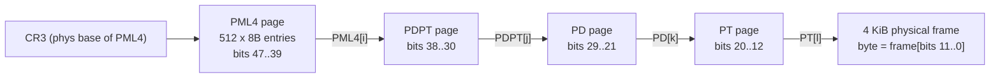
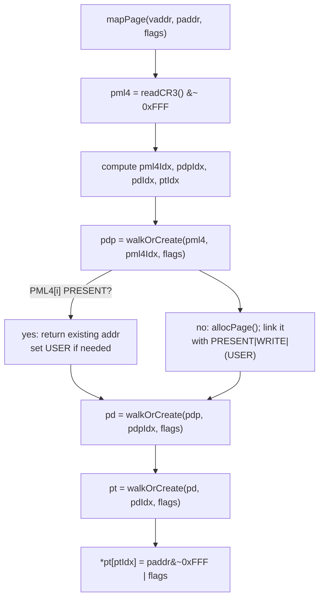

# Chapter 04 — Memory Management

## Overview

This chapter explains how `gooos` lays out and manages memory on the x86_64 architecture. It walks through the full lifetime of a virtual address, starting from the boot-time identity map that brings the CPU into long mode, then to the runtime page-frame allocator and 4 KiB mapping helpers, and finally to the per-process address spaces installed on every Ring-3 dispatch.

`gooos` runs in long mode with a single, kernel-managed 4-level page-table hierarchy. The kernel half of every address space (the lowest 1 GiB) is identity-mapped with 2 MiB huge pages and is shared by every process. Each Ring-3 process owns a private PML4 (Page Map Level 4) page that aliases the kernel half but holds its own user mappings above 1 GiB. Physical memory is handed out by a lightweight bump pointer with a small LIFO (Last-In, First-Out) reuse stack, both protected by a single spinlock for SMP (Symmetric Multi-Processing) safety.

A conservative, mark-sweep GC (Garbage Collector) sits *on top* of this machinery for the kernel's own allocations. The page tables are deliberately placed outside the GC's scan window, because raw PTE (Page Table Entry) bit patterns can resemble heap pointers and would otherwise trigger over-retention false positives.

## Prerequisites

To follow this chapter you should be comfortable with:

- The general idea of paging, virtual address spaces, and translation: virtual addresses are mapped to physical addresses through tables walked by the MMU (Memory Management Unit), which caches recent translations in the TLB (Translation Lookaside Buffer).
- The notion of a page fault — a CPU exception delivered when a virtual address has no mapping or fails permission checks — and how an OS routes that fault to a handler.
- Mark-sweep garbage collection in general terms: a "conservative" collector treats every word in its root set that *looks like* a pointer as if it actually were one.

You do not need prior exposure to actual x86_64 4-level paging code, hand-rolled physical allocators, or `CR3 (Control Register 3)`. The chapter introduces those concretely. Familiarity with the early-boot story from `./03_boot_and_init.md` helps but is not strictly required.

## 1. Shape of x86_64 4-level paging

### What

x86_64 long mode uses *48-bit canonical virtual addresses* translated through a 4-level page-table hierarchy. The 48 bits are split as 9-9-9-9-12: four 9-bit indices into successive page tables and a 12-bit offset within the final 4 KiB page.

### Why

Each table is exactly one 4 KiB page (512 entries × 8 bytes). Reusing one page format at every level keeps the allocator and walker uniform, and the 9-bit fanout matches the 512-entry table size.

### How

The `CR3 (Control Register 3)` register holds the physical base of the top-level table (the PML4). The MMU walks:

```
CR3 -> PML4[bits 47-39] -> PDPT[bits 38-30] -> PD[bits 29-21] -> PT[bits 20-12] -> 4 KiB page[bits 11-0]
```

The expanded names are: PML4 (Page Map Level 4), PDPT (Page Directory Pointer Table), PD (Page Directory), PT (Page Table), PTE (Page Table Entry).



### Where

The walk arithmetic appears verbatim in `src/vm.go:160-163`:

```
pml4Idx := (vaddr >> 39) & 0x1FF
pdpIdx  := (vaddr >> 30) & 0x1FF
pdIdx   := (vaddr >> 21) & 0x1FF
ptIdx   := (vaddr >> 12) & 0x1FF
```

The `0x1FF` mask keeps each index in the 0..511 range. CR3 itself is read by `readCR3` in `src/vm.go:42-46`, masked with `&^ 0xFFF` to drop the low 12 bits of flags and reveal the PML4 physical base.

## 2. Paging flag set

### What and Why

PTEs are 64-bit values. The high bits store the physical frame address; the low 12 bits encode permissions and status. `gooos` uses a deliberately small subset of the architectural flags.

### How / Where

Defined at the top of `src/vm.go:14-20`:

| Flag (constant)       | Bit  | Hex   | Meaning                                                |
|-----------------------|------|-------|--------------------------------------------------------|
| `pagePresent`         | 0    | 0x001 | Translation is valid; PTE points at a frame            |
| `pageWrite`           | 1    | 0x002 | Writable. Without this bit, the page is read-only      |
| `pageUser`            | 2    | 0x004 | Accessible from Ring 3 (User/Supervisor bit)           |

The boot identity map additionally uses bit 7 (PSE — Page Size Extension), encoded as the literal `0x83 = PRESENT | WRITE | PSE` in `src/boot.S:99`. PSE turns a PD entry into a 2 MiB huge page that bypasses the PT level.

The runtime mapping path (`mapPage`) constructs PTEs as `paddr&^0xFFF | flags` (`src/vm.go:171`). Ring-3 mappings always pass `pagePresent | pageWrite | pageUser`; see for example `src/elf.go:203` and `src/process.go:386`. `walkOrCreate` (`src/vm.go:212-229`) propagates `pageUser` to *every* intermediate level, because the CPU AND-s the U/S bit across the four-level walk — a Ring-3-accessible leaf needs `pageUser` set on its PML4, PDPT, PD, *and* PT entries.

## 3. Boot-time identity map

### What

When `_start` exits early-32-bit code into long mode, the kernel needs *some* working virtual addressing: nothing in the kernel image works until paging is on. `gooos` sets up a minimal identity map covering the first 1 GiB with three statically allocated, BSS (Block Started by Symbol)-resident page-table pages.

### Why

A 1 GiB identity map is more than enough to reach `main()`: the kernel image loads at 1 MiB (`. = 0x100000` in `src/linker.ld:7`), the heap and `.pagetables` sections sit higher up but well under 1 GiB, and the LAPIC (Local Advanced Programmable Interrupt Controller) MMIO at `0xFEE00000` is also below 1 GiB. Using 2 MiB huge pages keeps the table count to three, which is small enough to pre-reserve in BSS.

### How

`src/boot.S:46-53` reserves three 4 KiB-aligned scratch pages in a dedicated `.pagetables` section:

```
pml4: .skip 4096   # 1 PML4 table
pdp:  .skip 4096   # 1 PDPT
pd:   .skip 4096   # 1 PD covering 512 x 2 MiB = 1 GiB
```

`src/boot.S:80-104` wires them up in 32-bit code before paging is enabled:

1. `PML4[0] = &pdp | 0x03` (PRESENT | WRITE)
2. `PDPT[0] = &pd  | 0x03`
3. For `i = 0..511`: `PD[i] = (i * 0x200000) | 0x83` (PRESENT | WRITE | PSE — Page Size Extension)

Then `src/boot.S:106-128` enables CR4.PAE (Physical Address Extension), sets `EFER.LME` to flip on long-mode-enable, finally turns on CR0.PG, and far-jumps to 64-bit code.

### Where

The `.pagetables` section is positioned by `src/linker.ld:73-79`. It sits *after* `_globals_end` and a 4 KiB guard gap (`src/linker.ld:67-71`). This is load-bearing for the GC; see §9.

## 4. Refined paging in `vmInit`

### What and Why

The boot identity map is good enough for the kernel itself, but a real OS needs to map *new* regions at finer granularity. `gooos` does NOT rewrite the boot identity map — it leaves the 1 GiB region alone (still backed by 2 MiB huge pages) and adds 4 KiB-granularity mappings *above* 1 GiB on demand.

`mapPage` (§6) cannot split an existing 2 MiB huge page entry. The split would require allocating a new PT, copying 512 derived PTEs, and atomically swapping the PD entry — none of which `gooos` implements. The discipline is simply: never `mapPage` an address below 1 GiB.

### How / Where

`vmInit` in `src/vm.go:80-86` sets up the page-frame allocator:

```
end := allocStartAddr()
nextFreePage = (end + pageSize - 1) &^ (pageSize - 1)
```

`allocStartAddr` is the linker symbol `_alloc_start` (`src/linker.ld:81-82`), defined as the first 4 KiB-aligned address after the `.pagetables` section. So the bump pointer starts at the very top of the kernel's static layout: stack, page tables, heap, `.pagetables`, then *open* memory. From here on, every call to `allocPage` carves the next 4 KiB block out of the upward-growing region.

`vmInit` is invoked from `src/main.go:209` as part of early initialization, before any process is spawned.

## 5. Physical page allocator

### What

A two-tier page allocator:

1. **Bump pointer** `nextFreePage` for first-time allocation.
2. **LIFO free stack** `freeStack` of returned pages, capped at 4096 entries.

The allocator hands out *physical* page addresses that are simultaneously valid *virtual* addresses thanks to the boot identity map (always under 1 GiB by construction).

### Why

A bump pointer is the simplest forward allocator. The LIFO reuse stack lets `freePage` recover memory when processes exit; `gooos` deliberately stores the free-list metadata in a separate BSS array rather than threading a next-pointer through the freed page itself. The comment at `src/vm.go:71-74` calls out the historical bug: the old in-page next-pointer was misread as PTE bits when the freed page was reused as an intermediate page table.

### How

```
+--------------------------+   +-----------------------------------+
|  nextFreePage : uintptr  |   |  freeStack[0..freeStackCap-1]     |
|  (4 KiB-aligned cursor)  |   |  freeStackLen : int (top-of-stack)|
+--------------------------+   +-----------------------------------+
       |                              ^      |
       | bump on miss                 | push | pop
       v                              | free | alloc
+--------------------------------------------------------------+
| Physical frames: contiguous region above _alloc_start         |
| (kernel image | heap | .pagetables | guard | <-- here)        |
+--------------------------------------------------------------+
```

`freeStackCap = 4096` (`src/vm.go:69`). At 8 bytes per slot the stack itself is 32 KiB of `.bss` metadata and can hold up to ~16 MiB of reclaimable pages.

`allocPage` (`src/vm.go:94-112`) acquires `pageAllocLock`, prefers a popped free-stack entry if one exists, otherwise bumps `nextFreePage`. The page is then zeroed before return. `allocPagesContig` (`src/vm.go:118-129`) skips the LIFO stack entirely — it cannot guarantee contiguity — and only bump-allocates. It is used for kernel stacks and DMA (Direct Memory Access)-shaped multi-page structures.

`freePage` (`src/vm.go:135-149`) zeroes the page (so a future reuse as an intermediate page table reads as all-non-present) and pushes onto the LIFO stack. **If the stack is full the page is leaked** — the comment at `src/vm.go:133-134` makes this explicit. The bump allocator has roughly 950 MiB of headroom in the typical QEMU memory size, so a leak is non-fatal.

`pageAllocLock` is a `Spinlock` declared at `src/vm.go:90` with documented lock-ordering rank 1 (outermost), guarding both `nextFreePage` and the free stack.

### Where

All six functions live in `src/vm.go`:

- `allocPage` — `src/vm.go:94-112`
- `allocPagesContig` — `src/vm.go:118-129`
- `freePage` — `src/vm.go:135-149`
- `nextFreePage` declaration — `src/vm.go:65`
- `freeStack`, `freeStackLen` — `src/vm.go:75-78`
- `vmInit` — `src/vm.go:80-86`

## 6. Mapping helpers

### What

Two paired primitives turn (virtual, physical, flags) tuples into PTEs and back:

- `mapPage(virt, phys, flags)` — install a leaf PTE, allocating any missing intermediate tables.
- `unmapPage(virt)` — clear a leaf PTE and flush the TLB entry.

### Why

These are the *only* runtime knobs for changing the active address space at 4 KiB granularity. ELF load (`src/elf.go`), the user-stack setup, and the argument-page setup all funnel through them.

### How

`mapPage` walks `CR3 → PML4[i] → PDPT[j] → PD[k] → PT[l]` exactly like the MMU does, except that on a missing entry it calls `allocPage` to manufacture a fresh table page and links it in. `walkOrCreate` (`src/vm.go:212-229`) is the workhorse helper: it returns the next-level table address, allocating a zeroed one if the present-bit is clear, and propagating `pageUser` upward when it is set in `flags` (the U/S-bit AND-ing rule from §2).



`unmapPage` (`src/vm.go:177-204`) does the symmetric walk via `walkExisting` (`src/vm.go:233-239`), which returns 0 instead of allocating. If any level is absent the function quietly returns. Otherwise it clears the leaf PTE and calls `invlpg(vaddr)` to evict the stale TLB entry on the current CPU. Cross-CPU TLB invalidation (TLB shootdown) is *not* implemented — `gooos` relies on the fact that every process has its own PML4, so a stale TLB on a CPU that is not currently running this process cannot expose the unmapped page.

The `*In` and `*From` variants — `mapPageInto`, `unmapPageFrom`, `walkAndGetPaddrIn` (`src/vm.go:283-351`) — take an explicit PML4 physical address instead of reading CR3. They are used by `elfSpawn` to populate a child's address space *before* the kernel ever switches to it. `unmapPageFrom` deliberately omits `invlpg` (the comment at `src/vm.go:298-300` explains: the caller is not on `pml4`, so its TLB cannot be present; the eventual CR3 swap will flush anyway).

### Where

- `mapPage` — `src/vm.go:157-172`
- `unmapPage` — `src/vm.go:177-204`
- `walkOrCreate` — `src/vm.go:212-229`
- `walkExisting` — `src/vm.go:233-239`
- `walkAndGetPaddr` — `src/vm.go:244-270`
- Per-PML4 variants — `src/vm.go:283-351`
- `invlpg` declaration (asm in `stubs.S`) — `src/vm.go:58-62`

## 7. Per-process PML4

### What

Each Ring-3 process owns a private PML4 page. PML4[0] points at a process-private PDPT, whose entry 0 is *copied by value* from the boot kernel's PDPT[0] — so virtual addresses 0..1 GiB still resolve to the kernel's identity-mapped PD on every CPU. PDPT[3] is also copied (covers the LAPIC MMIO at `0xFEE00000`). Per-process PDPT[1..2] and PDPT[4..511] hold the process's own user-space mappings.

### Why

Two reasons:

1. **Isolation.** Each process sees only its own user pages. Switching CR3 implicitly invalidates non-global TLB entries, so a stale translation from process A cannot leak into process B.
2. **Kernel reachability under interrupts.** When an interrupt fires while a Ring-3 process is current, the kernel ISR runs with whatever CR3 the process had loaded. The shared kernel half guarantees the kernel's text, data, BSS, heap, and LAPIC MMIO are all reachable without a CR3 swap.

### How

`newProcPML4` (`src/proc_pml4.go:74-92`) allocates two zeroed pages, then:

1. `PML4[0] = pdp | PRESENT | WRITE | USER`
2. `PDP[0] = bootKernelPDP[0]` (verbatim — the boot PD pointer)
3. `PDP[3] = bootKernelPDP[3]` (LAPIC MMIO if present)

`captureKernelPDP0` (`src/proc_pml4.go:52-63`) snapshots the boot kernel's PDPT[0] entry the first time `newProcPML4` runs and caches it in `pml4SharedKernelPDP0`.

CR3 is loaded on every Ring-3 dispatch by one of two paths:

- **Goroutine path:** `gooosOnResume` in `src/goroutine_tss.go:175-209` runs from the patched `internal/task.resume()` on every goroutine switch. If the goroutine being resumed has a `*Process` with a non-zero `pml4`, it calls `writeCR3(pml4)` (line 200). This is `nosplit` (no allocation, no parking) because it must complete atomically.
- **Kernel-thread path:** `kthreadResumeRing3Ctx` in `src/kthread_ring3.go:104-122` is called from every kthread post-resume site (`kschedYield`, `kschedPark`, `KEvent.Wait`, `fsReqQueue.Push/Pop`, etc.). It similarly issues `writeCR3(proc.pml4)`.

`writeCR3` itself is one mov instruction wrapped by a `nosplit` Go declaration in `src/cr3.go:11-22`. Loading CR3 implicitly flushes every non-global TLB entry, so callers do not need to issue `invlpg` themselves.

`captureBootPML4` (`src/proc_pml4.go:37-39`) is called once from `src/main.go:219`. The saved value is restored by `processExit` (`src/process.go:601-605`) immediately before `freeProcPML4` reclaims the per-process page tables — otherwise the kernel would be running on freed memory the moment the function returned.

### Where

- `newProcPML4` — `src/proc_pml4.go:74-92`
- `captureKernelPDP0` — `src/proc_pml4.go:52-63`
- `freeProcPML4`, `freePDP`, `freePD` — `src/proc_pml4.go:101-144`
- `gooosOnResume` — `src/goroutine_tss.go:175-209`
- `kthreadResumeRing3Ctx` — `src/kthread_ring3.go:104-122`
- `writeCR3` — `src/cr3.go:22`
- `captureBootPML4` — `src/proc_pml4.go:37-39`

## 8. Kernel heap

### What

A 4 MiB region of zero-filled BSS reserved for the TinyGo conservative GC heap.

### How / Where

The `.heap` output section in `src/linker.ld:61-66` brackets two linker symbols:

```
.heap : ALIGN(4096)
{
    _heap_start = .;
    *(.heap)
    _heap_end = .;
}
```

The actual storage comes from `src/stubs.S:518-519`, which declares an `@nobits` input section of size `0x400000` (4 MiB). Because it is `@nobits`, the linker emits a PT_LOAD segment with `memsz > filesz`; GRUB or QEMU zero-fills the gap at load time, satisfying the GC's pre-zeroed assumption.

The TinyGo `mmap` stub in `src/stubs.S:34-58` exposes the heap to TinyGo: it returns `_heap_start` if the requested size fits within `_heap_end - _heap_start`, otherwise -1. `growHeap` returns false at the runtime layer, so this 4 MiB is a hard ceiling. `heapEndAddr` (`src/vm.go:22-26`) makes the upper bound visible to Go.

The region is page-aligned (`ALIGN(4096)`) by the linker script. The trailing `. += 4096;` in `src/linker.ld:71` reserves a 1-page guard gap before `.pagetables` so that any GC-internal memset that walks up to `_heap_end` cannot bleed into page-table memory even with off-by-one bounds.

| Symbol         | Defined at              | Meaning                                       |
|----------------|-------------------------|-----------------------------------------------|
| `_heap_start`  | `src/linker.ld:63`      | First byte of the GC heap                     |
| `_heap_end`    | `src/linker.ld:65`      | One past the last byte of the GC heap         |
| `_alloc_start` | `src/linker.ld:81-82`   | First page available to `allocPage` (post-PT) |
| `_globals_start` / `_globals_end` | `src/linker.ld:26, 48` | Bracket .data + .bss (GC root window) |
| `_stack_top`   | `src/linker.ld:86`      | Re-export of `boot.S`'s `stack_top` for GC stack scan |

## 9. Conservative GC interaction with `.pagetables`

### What

The TinyGo conservative GC marks live objects by scanning a *root set* — globals plus active stacks — for any word that *looks like* a pointer into the GC heap. Anything that pattern-matches as a heap address pins the targeted block.

### Why this matters for page tables

A PTE typically packs a high physical address with low flag bits. The boot identity map's huge-page entries use the literal flag byte `0x83` (PRESENT | WRITE | PSE). Read as a 64-bit word, the *flag-only* portion of an unpopulated entry is the value `0x83`. The full PTEs for in-use 2 MiB frames look like `0x000XXX83` patterns, where `0x000XXX` is a physical frame address.

Both shapes can pattern-match what the GC considers "a plausible heap pointer" — `0x83` itself happens to be a tiny address that some GC implementations bucket as a low-pointer. If the GC scanned page-table memory it could over-retain heap blocks the PTEs *coincidentally* alias, even though no Go code holds a real reference. **This is an over-retention false positive, not a memory-safety hole.** The kernel never confuses a PTE for a Go object — only the GC's bookkeeping is affected, and the worst observable effect is reduced reclamation, not corruption.

### How

`src/linker.ld` deliberately places `.pagetables` *outside* the `[_globals_start, _globals_end)` window that the GC scans for root pointers. The relevant boundary:

```
_globals_end = .;     -- close of the GC root window
.heap         -- 4 MiB GC heap
. += 4096;            -- 1-page guard gap
.pagetables   -- page tables live here, OUTSIDE the GC's root scan
_alloc_start = .;
```

The comment at `src/linker.ld:37-41` and `src/boot.S:42-45` documents this discipline:

> The conservative GC scans this region for root pointers. Page table entries (e.g., 0x83 flags) may cause false positives (the GC treats them as live heap pointers, preventing some blocks from being freed). This is harmless for correctness but slightly reduces GC effectiveness.

The commit log on this section (`src/linker.ld:73-75`) reinforces the point: "Page tables must be completely outside this range."

### Where

- Section ordering rationale — `src/linker.ld:33-79`
- `.pagetables` declaration — `src/boot.S:46-53` (BSS storage) and `src/linker.ld:76-79` (placement)

## 10. Page-fault handler

### What

x86 vector 14 is the page-fault exception. The faulting virtual address arrives in CR2, and an error code on the stack indicates write-vs-read, user-vs-kernel, present-vs-non-present, etc.

### Why

In `gooos`, page faults are *fatal*. The kernel does not swap, does not lazy-allocate, and does not implement copy-on-write. A page fault means a real bug or a runaway pointer in user code.

### How

`handlePageFault` in `src/vm.go:360-383` is registered as the vector-14 handler at `src/main.go:139`:

```
registerHandler(14, handlePageFault)
```

The handler:

1. Reads CR2 via `readCR2` (asm helper at `src/vm.go:36-40`) for the faulting address.
2. Reads the per-CPU error code stashed by the ISR prologue (`lastErrorCodes[idx]`).
3. Reads the saved RIP from the trap frame (`lastFramePtrs[idx]`).
4. Formats `PF: addr=… err=… rip=…` into a static buffer (`panicHexBuf`) using the allocation-free helpers `appendStr` and `appendHex`.
5. Writes the line to VGA row 12 and the serial console.
6. Loops on `hlt`.

The `//go:nosplit` annotation on `handlePageFault` and its allocation-free formatting are deliberate — the handler runs from ISR context, where calling into the GC or growing a goroutine stack would deadlock. See the wider design note in `impldoc/deferred_fatal_handlers.md` referenced from the source comment.

`gooos` does *not* currently distinguish kernel faults from user faults at the handler level. The error-code bit identifying user-mode is stored in `errCode`, but the policy is: panic in either case. A future revision could route user faults to per-process termination via `processExit`, but the mechanism is not in place yet.

### Where

- Handler — `src/vm.go:353-383`
- Registration — `src/main.go:139`
- CR2 reader (asm) — `src/vm.go:36-40`

## 11. Well-known virtual addresses

### What

A handful of virtual addresses are constant by convention or by linker script. These are the landmarks of an `gooos` address space.

### Where (by reading code)

| Region                | Virtual address                    | Source                                         |
|-----------------------|------------------------------------|------------------------------------------------|
| Kernel image base     | `0x00100000` (1 MiB)               | `src/linker.ld:7` — `. = 0x100000`             |
| Kernel `.heap`        | `_heap_start` .. `_heap_end` (4 MiB) | `src/linker.ld:61-66`, `src/stubs.S:518-519` |
| Kernel `.pagetables`  | After heap + 4 KiB guard           | `src/linker.ld:73-79`                          |
| Kernel `_alloc_start` | After `.pagetables`, page-aligned  | `src/linker.ld:81-82`                          |
| User code base        | `0x40100000` (just above 1 GiB)    | `user/linker_user.ld:27`                       |
| User globals window   | `[_globals_start, _globals_end)`   | `user/linker_user.ld:38-52`                    |
| User heap             | Right after user globals, 1 MiB    | `user/linker_user.ld:54-58`, `user/rt0.S:230`  |
| Argument page         | `0x40300000`                       | `src/process.go:179` — `argPageVaddr`          |
| User stack base       | `0x7FFF0000`                       | `src/process.go:182` — `userStackBase`         |
| User stack top        | `0x7FFF2000`                       | `user/linker_user.ld:68` — `_stack_top`        |
| LAPIC MMIO (kernel)   | `0xFEE00000`                       | `src/proc_pml4.go:84-90` (PDPT[3] copy)        |

The "above 1 GiB" rule for user mappings (`user/linker_user.ld:4-6`) reflects the §4 invariant: `mapPage` cannot split the 2 MiB huge pages of the boot identity map, so any vaddr below `0x40000000` is reserved for the kernel.

## 12. Address-space ASCII maps

### Kernel (boot) address space

```
0xFFFFFFFF +----------------------+
           |  (unmapped)          |
           |        ...           |
0xFEE00FFF +----------------------+
           |  LAPIC MMIO (4 KiB)  |  PDP[3]
0xFEE00000 +----------------------+
           |  (unmapped)          |
           |        ...           |
0x40000000 +----------------------+  -- 1 GiB boundary --
           |                      |
           |  Free physical pool  |  bumped by allocPage
           |  (nextFreePage ...)  |
           +----------------------+  _alloc_start
           |  .pagetables         |  PML4 / PDP / PD pages from boot.S
           +----------------------+
           |  4 KiB guard gap     |
           +----------------------+  _heap_end
           |  .heap (4 MiB)       |  TinyGo conservative GC heap
           +----------------------+  _heap_start
           |  .bss + .data        |  GC root window
           |                      |  [_globals_start, _globals_end)
           +----------------------+  _globals_start
           |  .rodata             |
           +----------------------+
           |  .text               |  kernel code
           +----------------------+
           |  .multiboot header   |
0x00100000 +----------------------+  -- kernel image base (1 MiB) --
           |  (BIOS / low 1 MiB)  |  identity-mapped, mostly unused by gooos
0x00000000 +----------------------+

The whole 0..1 GiB region is identity-mapped with 2 MiB huge pages.
PDPT[0] -> PD covering 512 entries -> 512 x 2 MiB = 1 GiB.
```

### Ring-3 (user) address space

```
0xFFFFFFFF +----------------------+
           |  (unmapped)          |
           |        ...           |
0xFEE00FFF +----------------------+
           |  LAPIC MMIO          |  inherited PDPT[3] (kernel-only)
0xFEE00000 +----------------------+
           |  (unmapped)          |
           |        ...           |
0x7FFF2000 +----------------------+  _stack_top (top of user stack)
           |  user stack          |  4 pages (16 KiB) mapped by elfSpawn
0x7FFF0000 +----------------------+  userStackBase
           |  (unmapped)          |
           |        ...           |
0x40300FFF +----------------------+
           |  argument page       |  one 4 KiB page
0x40300000 +----------------------+  argPageVaddr
           |  (unmapped)          |
           +----------------------+
           |  user heap           |  1 MiB, .heap section in user ELF
           +----------------------+  _heap_start (user)
           |  user .bss + .data   |
           +----------------------+  _globals_start (user)
           |  user .rodata        |
           |  user .text          |  ELF PT_LOAD segments
0x40100000 +----------------------+  user code base (entry point lives here)
           |  (unmapped)          |
0x40000000 +----------------------+  -- 1 GiB boundary --
           |                      |
           |  KERNEL IDENTITY MAP |  shared via PML4[0] -> PDPT[0] copy
           |  (text, data, heap,  |  identical bytes as kernel address space
           |   page tables, etc.) |
           |                      |
0x00000000 +----------------------+

PML4[0] -> per-process PDPT.
Per-process PDPT[0] = boot PDPT[0] (verbatim copy)  -> kernel half identity map.
Per-process PDPT[3] = boot PDPT[3] (LAPIC MMIO).
Per-process PDPT[1] -> per-process PD -> per-process PT  -> user 4 KiB pages.
```

## 13. TLB management

### What

The TLB caches virtual-to-physical translations on each CPU. Stale TLB entries silently violate page-table state, so they must be invalidated whenever a mapping changes meaning.

### How

`gooos` uses two mechanisms:

- **Context switch (CR3 reload).** Writing CR3 implicitly flushes every non-global TLB entry on the issuing CPU. Because no `gooos` mapping sets the global bit, every CR3 reload effectively gives the kernel a clean TLB slate for the new address space. `gooosOnResume` (`src/goroutine_tss.go:200`) and `kthreadResumeRing3Ctx` (`src/kthread_ring3.go:119`) both rely on this property — neither follows up with an explicit flush.
- **Single-page invalidation (`invlpg`).** `unmapPage` (`src/vm.go:203`) calls `invlpg(vaddr)` to remove just the unmapped translation from the local TLB. The `invlpg` instruction is exposed via the asm helper declared at `src/vm.go:58-62`.

### What is not implemented

There is no TLB shootdown across CPUs. A change to the *current* address space on the issuing CPU is invalidated locally; concurrent CPUs that happen to be in a different address space have no stale entry for the affected vaddr. Per-process PML4 ownership makes this safe in practice: the kernel only mutates a process's mappings while that process is the active one (or before the kernel ever switches into it via the `*In/From` helpers). The `unmapPageFrom` helper (`src/vm.go:298-300`) deliberately omits `invlpg` for this reason.

## 14. Address-space lifecycle

### Process creation (`elfSpawn`)

`src/process.go:319-441` walks the lifecycle for a newly spawned child:

1. `child.pml4 = newProcPML4()` (line 337) — fresh PML4 + PDPT, kernel half stitched in.
2. **PT_LOAD segments.** For every PT_LOAD program header (`src/process.go:391-411`), each covered 4 KiB page is allocated via `allocPage()` and mapped via `mapPageInto(child.pml4, vaddr, paddr, userFlags)`. Page contents are written through the *physical* address (which is identity-mapped in the kernel half), never through the child's virtual address — the kernel's CR3 still points at the boot PML4 at this moment.
3. **Argument page.** One page at `argPageVaddr = 0x40300000` (`src/process.go:413-419`).
4. **User stack.** Four pages from `userStackBase = 0x7FFF0000` upward (`src/process.go:421-427`). Initial RSP is set one page below the mapped top.
5. **Heap break.** `child.HeapBreak` is the page-aligned end of the last PT_LOAD; `child.HeapLimit = HeapBreak + userHeapLimit` enforces a 2 MiB ceiling on `sys_sbrk` (`src/process.go:432-436`).

The boot shell takes a slightly different path through `elfLoad` (`src/elf.go:170-302`), which uses `mapPage` (current CR3) rather than `mapPageInto` because the boot shell is loaded before per-process PML4s are introduced. The boot shell ends up with `proc.pml4 == 0`, which causes `gooosOnResume` to fall back to `bootPML4` (`src/goroutine_tss.go:194-198`).

Each mapping is recorded by `processRecordPage` (`src/process.go:241-249`) into the per-process `UserPages` and `UserPaddrs` arrays (capacity `maxUserPages = 512`, `src/process.go:20`). This is the cleanup roster for `processExit`.

### Process exit (`processExit`)

`src/process.go:535-635`:

1. Acquire `procLock`.
2. **Free user pages.** Loop `i = 0..UserPageCnt`, call `freePage(proc.UserPaddrs[i])` (line 567). Each freed page is zeroed and pushed onto `freeStack` (or leaked if the stack is full — see §5).
3. Set `proc.Exited = 1` and release `procLock`.
4. Notify the parent (channel send, kthread polling, etc.).
5. **Restore CR3.** `writeCR3(bootPML4)` (line 602) before reclaiming the per-process PML4 — otherwise the kernel would be running on freed pages.
6. **Free PML4 / PDPT / PD / PT pages.** `freeProcPML4(proc.pml4)` in `src/proc_pml4.go:101-113` walks PML4[1..511] and recursively frees each per-process PDPT, PD, and PT page via `freePDP` and `freePD`. PML4[0] is *not* touched — that is the shared kernel half.
7. Clear current-proc state, close FDs, release the kernel-stack pool slot, and `taskPause` forever.

The careful ordering (free user pages → swap CR3 to boot → free page tables) is the textbook hazard: the active address space cannot point at memory it is about to release.

## Summary

`gooos` keeps memory management deliberately small. The boot path stamps three statically allocated page-table pages into a 1 GiB identity map with 2 MiB huge pages, enough to reach `main()`. From there a bump-allocator-with-LIFO-reuse hands out 4 KiB physical frames, and `mapPage` / `unmapPage` install or clear leaf PTEs along a four-level walk. Every Ring-3 process owns a private PML4 whose first PDPT entry is copied from the boot kernel's, so the kernel half is universally reachable while user mappings remain isolated. CR3 is loaded on every Ring-3 resume by `gooosOnResume` (goroutines) or `kthreadResumeRing3Ctx` (kthreads), and the implicit non-global TLB flush keeps stale translations from leaking. Process teardown reverses construction: first user pages, then a CR3 hop back to the boot PML4, then the per-process page-table pages. The TinyGo conservative GC manages a 4 MiB heap whose bounds (`_heap_start`, `_heap_end`) and root window (`[_globals_start, _globals_end)`) are linker-defined, with the page-table region deliberately placed *outside* the root window to avoid PTE-shaped over-retention false positives. Page faults are handled by `handlePageFault`, which prints diagnostic state and halts — `gooos` has no swap, no demand paging, and no copy-on-write.

## Cross-references

- `./03_boot_and_init.md` — the early identity map and how `main()` is reached.
- `./05_kernel_thread_runtime.md` — kthreads embed their stacks in BSS rather than the GC heap.
- `./07_processes_and_userspace.md` — `elfSpawn`, PT_LOAD layout, and the user-side runtime.
- `./11_tinygo_baremetal.md` — TinyGo conservative GC internals and how the heap is wired up.
