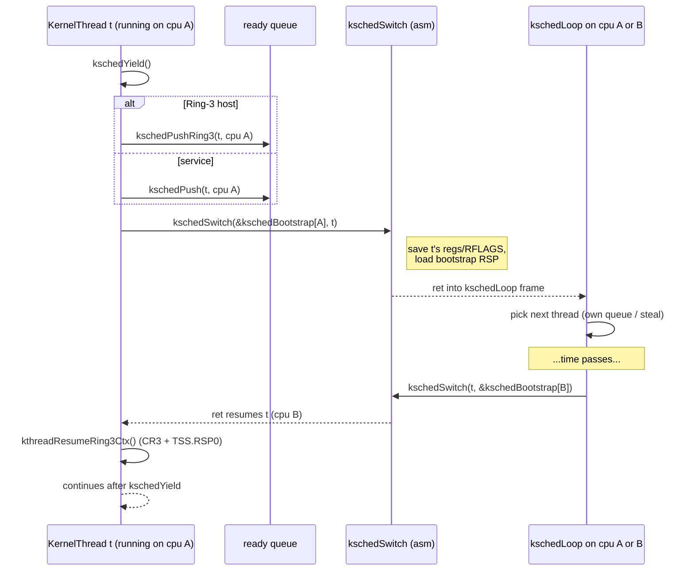

# Chapter 05 — Kernel Thread Runtime (Route C)

## Overview

This chapter documents the single biggest divergence between gooos and a
textbook OS-on-a-language-runtime design: **the kernel does not use
goroutines.** In Ring 0, gooos schedules its own kernel threads, called
`KernelThread`, on top of a hand-written x86_64 context-switch routine.
The TinyGo task scheduler is *compiled out* of the kernel binary (`scheduler:
"none"` in `src/target.json:9`); the `go` keyword is therefore a compile error
inside `src/`. Userspace ELFs keep `scheduler: "tasks"` (`user/target.json:9`)
and run goroutines normally — but their host inside the kernel is itself a
`KernelThread`.

This design — referred to throughout the source tree as **Route C** — gives
gooos a deterministic, ISR-safe kernel scheduler without paying the cost of
debugging goroutine wake-up bugs across a Symmetric Multi-Processing (SMP)
fabric of cores. Every long-lived service in `src/` (the in-memory file
system task, the network receive loop, the Transmission Control Protocol
(TCP) server, the timer dispatcher, every Ring-3 process host) is a
`KernelThread`. There are no `go func()` calls in `src/`.

The runtime has six moving parts:

| Concern             | File                           | Key symbol(s)                                  |
| ------------------- | ------------------------------ | ---------------------------------------------- |
| Thread struct       | `src/kthread.go`               | `KernelThread`, `KState`, `KernelStack`        |
| Pool allocator      | `src/kthread_pool.go`          | `kthreadPool`, `kthreadPoolAlloc/Free`         |
| Per-CPU scheduler   | `src/kthread_sched.go`         | `kschedQueues[]`, `kschedQueuesRing3[]`        |
| Spawn / park / wake | `src/kthread_lifecycle.go`     | `kschedSpawn`, `kschedPark`, `kschedWake`      |
| Context switch      | `src/kthread_switch.S`         | `kschedSwitch`, `kschedEnter`                  |
| Ring-3 host         | `src/kthread_ring3.go`         | `kschedSpawnRing3Wrapper`, `ring3WrapperKT`    |

## Prerequisites

The reader should have read `./03_boot_and_init.md` (where `kschedInit` and
the boot pump are introduced from the boot side) and `./04_memory_management.md`
(for the kernel heap and Block Started by Symbol (BSS)-resident slabs that
back the kernel-thread pool). Familiarity with the textbook concepts of
ready queue, context switch, voluntary yield, and parking on a synchronization
primitive is assumed; the chapter walks through each one in concrete x86_64
form rather than re-deriving the theory.

---

## Why "Route C" Exists

### What

In Ring 0, gooos kernel threads are managed by gooos, not by TinyGo. Each
service runs as a `KernelThread`. The TinyGo task scheduler is removed from
the kernel build (`scheduler: "none"`). In Ring 3, user processes still use
TinyGo's task scheduler (`scheduler: "tasks"`) for their own goroutines.

### Why

The earlier prototypes used `scheduler: "tasks"` in the kernel and treated
every long-lived service as a goroutine. Under SMP this produced
intermittent failures: a kernel goroutine woken from CPU `A` while a peer
goroutine was running on CPU `B` could be silently delayed for up to one
LAPIC-timer (Local Advanced Programmable Interrupt Controller) tick (10 ms),
or — if the wake landed at an awkward moment in the TinyGo scheduler's
internal queue manipulation — lost outright. The Inter-Processor Interrupt
(IPI) wake-up patches that papered over symptoms turned the kernel into a
hairball of timing assumptions. The decision was to take the scheduler
out of TinyGo's hands entirely.

### How

`src/target.json` overrides the TinyGo target's scheduler choice:

```
"scheduler": "none",
```

With `scheduler=none` the TinyGo runtime is built without `internal/task`,
which means the `go` keyword is a compile error in any `src/*.go` file and
no goroutine creation, scheduling, or context-switch code is linked into
the kernel image. Concurrency in Ring 0 must therefore go through
`KernelThread`.

The user target keeps the textbook configuration:

```
"scheduler": "tasks",
```

so user-space programs (`/bin/shell`, `/bin/wget`, the test harnesses) can
still `go func()` freely. Each user process runs on a dedicated kernel
thread that hosts its address space; the goroutines inside it are a
purely Ring-3 concern.

### Where

- `src/target.json:9` — kernel scheduler set to `none`.
- `src/scheduler_none_stubs.go` — provides `tinygo_task_exit` as a halt
  stub so the TinyGo assembly tail of a returning goroutine still links;
  the path is unreachable because `go` cannot appear in `src/`.
- `user/target.json:9` — user-space scheduler stays `tasks`.

---

## The `KernelThread` Struct

### What

A `KernelThread` is the in-memory record for one gooos-owned thread of
execution. Every kthread is one slot in the BSS-resident `kthreadPool`.

### Why

The struct serves three distinct readers:

1. **Go code** in `src/kthread_*.go` reads and writes most fields directly.
2. **The context-switch assembly** in `src/kthread_switch.S` indexes the
   first three fields by hard-coded byte offsets.
3. **The conservative Garbage Collector (GC) in TinyGo** scans the BSS
   slab where the pool lives, so the embedded stack must be inside the
   struct (heap-allocating it separately would defeat the one-pass scan).

To keep the assembly stable across struct edits, `kthread.go` defines the
expected offsets as Go constants and `checkKernelThreadOffset()` panics at
boot if the layout drifts (`src/kthread.go:124`).

### How

```
+-------- offset 0 ---------------------------------------------+
| SavedRSP : uintptr  (parked Stack Pointer (RSP))              |
+-------- offset 8 ---------------------------------------------+
| State : uint32  (KState; see state diagram below)             |
+-------- offset 12 --------------------------------------------+
| OwnerCPU : uint32  (last/current CPU index)                   |
+-------- offset 16 --------------------------------------------+
| Stack : KernelStack                                           |
|     Canary : uintptr  (sentinel 0xC0DE57AC4CA11ADE)           |
|     Pad    : [kernelStackWords]uintptr  (16 KiB - 16 B)       |
|     Top    : uintptr  (initialised to &Pad[len-1] + 8)        |
+---------------------------------------------------------------+
| Name     : [16]byte  (null-padded debug identifier)           |
| Entry    : func()    (Go entry function)                      |
| WakeLink : *KernelThread  (intrusive ready/wait list)         |
| ParkLock : *Spinlock      (lock held while parked, or nil)    |
| Quantum  : uint32         (preempt quantum in LAPIC ticks)    |
| ExitCode : uintptr        (read by joiners)                   |
| Slot     : int32          (pool index, -1 if not pooled)      |
| Used     : uint32         (live bit, guarded by pool lock)    |
+---------------------------------------------------------------+
```

The first three fields are pinned at offsets `0`, `8`, `12` because the
context-switch assembly references them as numeric immediates. The Go
constants `kthreadOffSavedRSP`, `kthreadOffState`, `kthreadOffOwnerCPU`
in `src/kthread.go:115-119` document the contract; `checkKernelThreadOffset`
asserts it on every boot.

The embedded `KernelStack` is **16 KiB minus 16 bytes** of stack payload
plus an 8-byte canary at the low end and an 8-byte Top word at the high
end. Because the stack is *part of the struct*, the conservative GC's
scan of the BSS slab transparently covers the live RSP region of every
kernel thread without any per-thread root registration. The canary
sentinel `0xC0DE57AC4CA11ADE` (`src/kthread.go:109`) is checked by
`kthreadPoolFree`; a mismatch halts with a "KTHREAD CANARY CORRUPT"
banner before the slot is recycled.

`Slot == -1` denotes a non-pool thread — currently only the per-CPU
`kschedBootstrap` and `kschedIdle` anchors (`src/kthread_sched.go:44,54`).

### Where

- `src/kthread.go:43-86` (struct definition).
- `src/kthread.go:96-104` (KernelStack layout).
- `src/kthread.go:124-136` (offset assertion).

---

## Thread State Diagram

### What

`KState` is a `uint32` field that the assembly stub can store with an
ordinary `mov`. It enumerates the lifecycle stages a kernel thread passes
through.

### Why

The state acts as a low-level hand-off marker between three actors: the
running thread itself (transitions to `Parked`, `Exiting`), the scheduler
loop (`Runnable` ↔ `Running`), and the preempt Inter-Processor Interrupt
(IPI) handler (`Preempted`). Keeping the values numerically stable lets
the assembly inspect them without a Go function call.

### How



```mermaid
stateDiagram-v2
    [*] --> New : kschedSpawnInternal allocates
    New --> Runnable : initial frame built; pushed to ready queue
    Runnable --> Running : kschedLoop pops, kschedSwitch in
    Running --> Runnable : kschedYield (voluntary re-enqueue)
    Running --> Parked : kschedPark (waiting on Spinlock / KEvent)
    Parked --> Runnable : kschedWake from another thread or IRQ
    Running --> Preempted : 100 Hz preempt IPI (vector 0xFB)
    Preempted --> Runnable : ISR-driven re-enqueue
    Running --> Exiting : kschedExit / kschedExitNoreturn
    Exiting --> [*] : kthreadPoolFree reclaims slot
```

The names come straight from `src/kthread.go:23-30`:

| `KState` constant | numeric | meaning                                 |
| ----------------- | ------- | --------------------------------------- |
| `KStateNew`       | 0       | Spawned, not yet enqueued.              |
| `KStateRunnable`  | 1       | Sitting on a ready queue.               |
| `KStateRunning`   | 2       | Executing on `OwnerCPU`.                |
| `KStateParked`    | 3       | Waiting on a sync primitive (`ParkLock`)|
| `KStatePreempted` | 4       | Timer ISR demanded a switch (Ch06).     |
| `KStateExiting`   | 5       | Terminal; pool slot to be reclaimed.    |

The transition `Running → Exiting` is invoked by the thread itself
(`kschedExit`, `src/kthread_lifecycle.go:108`). The scheduler observes the
exiting state on the next pop attempt and returns the slot via
`kthreadPoolFree`.

### Where

- `src/kthread.go:23-30` (state enum).
- `src/kthread_sched.go:245-247` (Exiting reaped at top of loop).
- `src/kthread_lifecycle.go:108-126` (clean exit path).

---

## The Kernel-Thread Pool

### What

`kthreadPool` is a fixed slab of 32 `KernelThread` slots living in BSS:

```go
const kthreadPoolCap = 32
var kthreadPool [kthreadPoolCap]KernelThread
```

(`src/kthread_pool.go:17,23`)

### Why

Three reasons argue for a fixed-size slab over a growable allocator:

1. **No heap allocation in Interrupt Service Routine (ISR)-sensitive
   paths.** A `KernelThread` is sometimes spawned from contexts that
   cannot tolerate a heap-grow detour (the boot path, certain exec
   sequences). A bounded pool means `kschedSpawn` runs in O(1) under
   one spinlock.
2. **Single-pass GC scan.** The slab sits inside `_globals_start..end`
   by construction; the conservative collector walks it once, covering
   every kernel thread's stack as a side effect.
3. **Worst-case sizing is known.** Six long-lived service kthreads plus
   a generous eight concurrent Ring-3 hosts plus headroom fits in 32
   slots × 16 KiB = 512 KiB total reservation.

Pool exhaustion is treated as a configuration bug and halts the kernel
with a "KTHREAD POOL EXHAUSTED" banner (`src/kthread_lifecycle.go:206`).

### How

```
kthreadPoolAlloc():
    acquire kthreadPoolLock
    scan from kthreadPoolNextHint, modulo kthreadPoolCap
    first slot with Used == 0:
        zero management fields (NOT the 16 KiB Stack body)
        seed Stack.Canary = 0xC0DE57AC4CA11ADE
        Stack.Top = &Stack.Top
        Slot, Used := idx, 1
        kthreadPoolNextHint = (idx + 1) % cap
        return &kthreadPool[idx]
    return nil  (caller halts via kthreadPoolExhaustedPanic)
```

```
kthreadPoolFree(t):
    if t.Stack.Canary != 0xC0DE57AC4CA11ADE: kthreadCanaryPanic(t)
    acquire kthreadPoolLock
    Used = 0
    Slot = -1
    kthreadPoolNextHint = min(kthreadPoolNextHint, idx)
    release
```

`kthreadPoolNextHint` is a racey hint that lets the common-case alloc
land on the first slot it inspects; under contention the scan re-verifies
`Used` under the lock, so the race is harmless.

The `Stack.Top = &Stack.Top` line at `src/kthread_pool.go:67` is
deliberate: the `Top` word's *address* is the byte just past the `Pad`
array (because `Top` is laid out immediately after `Pad` in the struct).
That address is the high-water mark the spawn code uses as the seed RSP.

### Where

- `src/kthread_pool.go:38-72` (alloc).
- `src/kthread_pool.go:77-94` (free + canary check).

---

## Context Switch in Assembly

### What

`kschedSwitch(new, old *KernelThread)` is the routine that hands the
hardware execution context from one kernel thread to another. It is the
only piece of x86_64 assembly written by hand in Route C.

### Why

A context switch in Ring 0 has to do exactly three things, in order:

1. Save enough register state on the *current* (outgoing) thread's stack
   to recover later. For System V calling convention on x86_64, that is
   the callee-saved General-Purpose Registers (GPRs) RBX, RBP, R12-R15
   plus the Register Flags (RFLAGS) word.
2. Swap RSP from the outgoing thread's stack to the incoming one's,
   recording the old RSP into `old.SavedRSP` and reading the new one
   from `new.SavedRSP`.
3. Restore the registers and `ret` into whatever Instruction Pointer
   (RIP) was on top of the new stack.

The Go compiler cannot emit this — it would clobber callee-saved
registers in the prologue/epilogue and would not respect the requirement
that interrupts stay disabled across the RSP swap.

### How

```asm
kschedSwitch:                      ; %rdi = new, %rsi = old
    pushfq                         ; (1) save RFLAGS + cli for the swap
    cli
    pushq %r15                     ; (2) save callee-saved GPRs
    pushq %r14
    pushq %r13
    pushq %r12
    pushq %rbp
    pushq %rbx
    movq %rsp, (%rsi)              ; (3) old.SavedRSP = current RSP
    movq (%rdi), %rsp              ; (4) RSP = new.SavedRSP
    popq %rbx                      ; (5) restore in mirror order
    popq %rbp
    popq %r12
    popq %r13
    popq %r14
    popq %r15
    popfq                          ; (6) restore RFLAGS (may set IF)
    ret                            ; (7) jump to RIP at top of new stack
```

Step (1) is critical: a `cli` ensures no ISR fires *between* the RSP
write and the RSP read. The corresponding `popfq` at step (6) restores
the new thread's saved Interrupt-Flag (IF) state, which is "interrupts
enabled" for any thread that was last running normally.

`kschedEnter` is the trampoline that all *newly spawned* threads land
in on their very first context switch:

```asm
kschedEnter:
    movq %r13, %rdi                ; %r13 was preloaded with *KernelThread
    callq kschedRunEntry           ; Go helper: runs t.Entry()
    jmp kschedExitNoreturn         ; if Entry returns, clean up
```

The first switch into a brand-new thread doesn't actually re-enter a Go
function — it `ret`s into `kschedEnter`, because `kschedSpawnInternal`
manufactures an initial frame whose top word is `&kschedEnter`:

```go
top := uintptr(unsafe.Pointer(&t.Stack.Top))
rsp := top - 8*8
enterAddr := kschedEnterAddr()
selfPtr := uintptr(unsafe.Pointer(t))
words := [8]uintptr{
    0, 0, 0, selfPtr, 0, 0, 0x202, enterAddr,
}
```

(`src/kthread_lifecycle.go:88-94`)

Reading from low to high, the eight uintptrs are: RBX(0), RBP(0),
R12(0), R13(`*KernelThread`), R14(0), R15(0), RFLAGS(`0x202` = IF=1,
reserved bit 1 set), and finally RIP(`&kschedEnter`). When the first
`kschedSwitch` pops these, `R13` is loaded with the thread pointer;
`popfq` re-enables interrupts; `ret` jumps to `kschedEnter`; the
trampoline moves R13 into RDI (the System V first arg) and calls
`kschedRunEntry`, which dispatches `t.Entry()`. If `Entry` ever returns
(it usually doesn't), `kschedExitNoreturn` halts the thread cleanly.

### Where

- `src/kthread_switch.S` (full file, 96 lines).
- `src/kthread_lifecycle.go:67-101` (initial-frame builder).
- `src/kthread_lifecycle.go:229-234` (`kschedRunEntry` Go helper).

---

## Per-CPU First-In, First-Out (FIFO) Ready Queues

### What

The scheduler maintains two parallel arrays of per-CPU ready queues:

```go
var kschedQueues       [maxCPUs]kschedReadyQueue  // service tier
var kschedQueuesRing3  [maxCPUs]kschedReadyQueue  // Ring-3 host tier
```

(`src/kthread_sched.go:23,38`)

Each queue is an intrusive singly-linked First-In, First-Out (FIFO)
list of `KernelThread`s threaded through `KernelThread.WakeLink`,
guarded by its own `Spinlock`, with a 64-byte cache-line pad to
prevent false sharing across cores.

### Why

The two-tier split codifies a hard rule from the Multi-Producer
Single-Consumer (MPSC) era: **service kthreads stay on the Bootstrap
Processor (BSP); Ring-3 host kthreads can move to Application Processors
(APs)**. By giving them separate queues, the BSP combined pump can
service both tiers fairly while AP loops only ever touch the Ring-3 tier
(`src/kthread_sched.go:25-37`).

Per-CPU sharding was chosen over one global queue for the usual SMP
reason — under heavy churn, a single global lock becomes the bottleneck.
Each queue's own spinlock is taken only briefly around push/pop.

### How

The push and pop primitives are tiny:

```go
//go:nosplit
func kschedPushLocked(q *kschedReadyQueue, t *KernelThread) {
    t.WakeLink = nil
    if q.tail == nil { q.head = t } else { q.tail.WakeLink = t }
    q.tail = t
}

//go:nosplit
func kschedPopLocked(q *kschedReadyQueue) *KernelThread {
    t := q.head
    if t == nil { return nil }
    q.head = t.WakeLink
    if q.head == nil { q.tail = nil }
    t.WakeLink = nil
    return t
}
```

(`src/kthread_sched.go:82-104`)

The public wrappers (`kschedPush`, `kschedPop`, `kschedPushRing3`,
`kschedPopRing3`) acquire the relevant lock, call the locked helper,
release, and — for cross-CPU push paths — fire a wake IPI:

```go
//go:nosplit
func kschedPush(t *KernelThread, cpu uint32) {
    if cpu >= maxCPUs { cpu = 0 }
    q := &kschedQueues[cpu]
    flags := q.lock.Acquire()
    t.State = uint32(KStateRunnable)
    t.OwnerCPU = cpu
    kschedPushLocked(q, t)
    q.lock.Release(flags)
    if cpu != cpuID() {
        gooosWakeupCPU(cpu)
    }
}
```

(`src/kthread_sched.go:119-132`)

The IPI step at the bottom is what makes cross-CPU wakes deterministic:
without it the target Application Processor would sit in `hlt` until
its next 100 Hz timer tick. See `gooosWakeupCPU` in `src/ipi.go:108-123`,
which sends the wake-up vector `0xFC` to the destination Local APIC.

Lock-rank ordering is documented in Chapter 09 — the queue spinlocks
sit beneath `kthreadPoolLock` and above any caller-held primitive
spinlocks, so `kschedPush` may be invoked while holding zero or one
sync primitive, but never with two.

### Where

- `src/kthread_sched.go:16-20` (queue struct + cache-line pad).
- `src/kthread_sched.go:82-146` (locked + public push/pop).
- `src/kthread_sched.go:331-382` (Ring-3 tier counterparts).
- `src/ipi.go:108-123` (the wake-IPI side).

---

## Spawning a Thread

### What

`kschedSpawn(name string, entry func()) *KernelThread` allocates a pool
slot, builds the initial switch frame, and pushes the new kthread onto
a target CPU's service-tier ready queue.

### Why

The split between `kschedSpawn` (round-robin), `kschedSpawnAt` (pinned),
and `kschedSpawnRing3Wrapper` (Ring-3 host) reflects three different
placement policies:

- Service kthreads (`fsTask`, `netRxLoop`, the TCP servers, etc.) are
  pinned to BSP under `uniprocessorKernel = true`.
- Ad-hoc kthreads use plain `kschedSpawn`; the round-robin counter
  (`kschedSpawnRRCounter`) provides simple load spreading on multi-core
  configs that turn `uniprocessorKernel` off.
- Ring-3 hosts use the *Ring-3 tier* queue and round-robin onto
  AP queues (`1..numCoresOnline-1`) while keeping the boot shell
  pinned to BSP.

### How

`kschedSpawnInternal` (`src/kthread_lifecycle.go:67-101`) does the heavy
lifting:

1. `kthreadPoolAlloc` reserves a slot.
2. The thread's `Name` field is filled (truncated to 15 + null).
3. The eight-word initial frame is written at `top - 64` so a `ret` from
   the first `kschedSwitch` lands in `kschedEnter`.
4. `SavedRSP` is set to the bottom of that frame; `State = KStateRunnable`.

The placement wrappers then pick a target CPU and push:

```go
func kschedSpawn(name string, entry func()) *KernelThread {
    t := kschedSpawnInternal(name, entry)
    target := uint32(0)
    if !uniprocessorKernel {
        target = kschedSpawnRRCounter
        kschedSpawnRRCounter++
        if numCoresOnline == 0 { target = 0 } else { target = target % numCoresOnline }
    }
    kschedPush(t, target)
    return t
}
```

(`src/kthread_lifecycle.go:46-62`)

Under the current `uniprocessorKernel = true` setting, `target` is
always 0 (BSP). Service kthreads therefore land on `kschedQueues[0]`.

`kschedSpawnRing3Wrapper` is the Ring-3 host variant
(`src/kthread_ring3.go:40-72`). It records `proc` in the side-table
`kthreadHostedProc[t.Slot]` *before* the push so a wake-up on the target
CPU can resolve the process as soon as the kthread is dispatched. Its
placement formula avoids BSP to keep the boot shell on CPU 0:

```go
target = 1 + (kschedSpawnRRCounter % (numCoresOnline - 1))
```

(`src/kthread_ring3.go:57`)

The boot shell itself uses the BSP-pinned variant
`kschedSpawnRing3WrapperOnBSP` (`src/kthread_ring3.go:85-90`), which
pushes onto `kschedQueuesRing3[0]` so the BSP combined pump in
`src/elf.go:259-268` dispatches it.

### Where

- `src/kthread_lifecycle.go:24-101` (`kschedSpawnAt`, `kschedSpawn`,
  `kschedSpawnInternal`).
- `src/kthread_ring3.go:40-90` (Ring-3 wrappers).

---

## The Dispatch Loops

### What

There are *three* dispatch surfaces, not one, because the boot path,
the BSP idle path, and AP entry have different fairness requirements:

| Function                     | Caller                          | Tier(s) drained        | Returns?  |
| ---------------------------- | ------------------------------- | ---------------------- | --------- |
| `kschedLoop()`               | (legacy SMP — `apSchedulerEntry` when `userspaceSMP=false` and `uniprocessorKernel=false`) | service                | never     |
| `kschedLoopRing3Only(cpu)`   | `apSchedulerEntry` on each AP under `userspaceSMP=true` | Ring-3                 | never     |
| `kschedLoopOnce()`           | BSP boot pump in `src/elf.go`   | service (1 iteration)  | yes       |
| `kschedLoopRing3OnlyOnce(c)` | BSP boot pump in `src/elf.go`   | Ring-3 (1 iteration)   | yes       |

### Why

The boot pump cannot block on a non-returning loop: it has to keep
polling `proc.Exited` (the boot-shell exit flag) so the kernel can
notice when the shell has terminated. So instead of calling `kschedLoop`,
the BSP main thread interleaves single-iteration variants of both tiers
and yields to whatever is left of the TinyGo runtime once per round.

APs have no such concern — once `apSchedulerEntry` returns from setup
they are owned by the kthread runtime forever, so they call the
non-returning `kschedLoopRing3Only(cpuID())`.

### How

The boot-time pump is hand-rolled in `src/elf.go:257-275`:

```go
kschedSpawnRing3WrapperOnBSP(proc)
for proc.Exited == 0 {
    kschedLoopOnce()
    kschedLoopRing3OnlyOnce(0)
    runtime.Gosched()
}
```

Each iteration drains one service kthread (if any), then one Ring-3 host
(if any), then yields. Both `*Once` variants return immediately on an
empty queue, so the loop spin-rate is bounded by whichever tier has work.

The non-returning loop is the textbook shape:

```go
//go:nosplit
func kschedLoop() {
    cpu := cpuID()
    for {
        if kschedSmokeAllDone != 0 { return }      // smoke-test only
        t := kschedPop(cpu)
        if t == nil && !uniprocessorKernel {
            // Try to steal from a peer (cpu+1, cpu+2, ...).
            for i := uint32(1); i < numCoresOnline; i++ {
                t = kschedSteal((cpu+i)%numCoresOnline, cpu)
                if t != nil { break }
            }
        }
        if t == nil {
            sti(); hlt(); cli()                    // wait for IPI
            continue
        }
        if KState(t.State) == KStateExiting {
            kthreadPoolFree(t); continue
        }
        kschedRunning[cpu] = t
        t.State = uint32(KStateRunning)
        t.OwnerCPU = cpu
        t.Quantum = kschedDefaultQuantum
        kschedSwitch(t, &kschedBootstrap[cpu])
        kschedRunning[cpu] = nil
    }
}
```

(`src/kthread_sched.go:206-258`)

The idle path `sti(); hlt(); cli()` is the sole reason cross-CPU pushes
must send a wake IPI: without one, the target CPU would not exit `hlt`
until its own LAPIC timer fires (10 ms later under `preemptEnabled = true`).
The `cli` after `hlt` is symmetric so the loop body re-enters with
interrupts disabled, exactly as `kschedSwitch` expects.

`apSchedulerEntry` is what each AP runs after Application-Processor
bring-up:

```go
func apSchedulerEntry() {
    if userspaceSMP {
        kschedLoopRing3Only(cpuID())
        return
    }
    if uniprocessorKernel {
        for { sti(); hlt() }                 // M6 AP idle
    }
    kschedLoop()
}
```

(`src/smp.go:351-373`)

Under the current configuration (`uniprocessorKernel = true`,
`userspaceSMP = true`) APs run `kschedLoopRing3Only` and consume
exclusively from `kschedQueuesRing3[cpuID()]`.

### Where

- `src/kthread_sched.go:206-258` (`kschedLoop`).
- `src/kthread_sched.go:273-318` (`kschedLoopOnce`).
- `src/kthread_sched.go:390-423` (`kschedLoopRing3Only`).
- `src/kthread_sched.go:434-462` (`kschedLoopRing3OnlyOnce`).
- `src/elf.go:257-275` (boot pump).
- `src/smp.go:351-373` (AP entry dispatch).

---

## Sequence: `kschedYield → kschedSwitch → resume`

### What

`kschedYield` is the voluntary "give the CPU back" entry point. It is
what tight-loop services call to share the core under cooperative
scheduling, and what the per-CPU LAPIC-timer safe-point invokes when it
detects a long-running compute thread.

### Why

A cooperative yield must (1) re-enqueue the current thread before it
loses CPU ownership, (2) hand control to the bootstrap context (the
scheduler loop), (3) re-install Ring-3 state when the yielding thread
later resumes, possibly on a different core.

### How



The Go side is small (`src/kthread_sched.go:484-501`):

```go
//go:nosplit
func kschedYield() {
    cpu := cpuID()
    t := kschedRunning[cpu]
    if t == nil { return }
    if t.Slot >= 0 && int(t.Slot) < kthreadPoolCap &&
        kthreadHostedProc[t.Slot] != nil {
        kschedPushRing3(t, cpu)
    } else {
        kschedPush(t, cpu)
    }
    kschedSwitch(&kschedBootstrap[cpu], t)
    kthreadResumeRing3Ctx()
}
```

The `kthreadResumeRing3Ctx()` call after the switch returns is what
makes cross-CPU resume safe: when `t` is a Ring-3 host that originally
ran on CPU A but got dispatched on CPU B by work-stealing, the new CPU's
Task State Segment (TSS) `RSP0` and `CR3` are stale, and any subsequent
syscall trap would land on the wrong stack with the wrong page tables.
The hook re-installs both before `t`'s next instruction can take a
ring-transition (`src/kthread_ring3.go:104-122`).

### Where

- `src/kthread_sched.go:484-501` (`kschedYield`).
- `src/kthread_ring3.go:104-122` (`kthreadResumeRing3Ctx`).

---

## Park, Wake, and Timed Park

### What

Three closely related primitives govern blocking:

- `kschedPark(lock *Spinlock)` — release the supplied lock and park
  until woken.
- `kschedWake(t *KernelThread)` — wake a parked thread, routing it
  to the correct tier.
- `kschedTimedPark(d uint64)` — park for `d` PIT (Programmable Interval
  Timer) ticks via the `afterticks` machinery.

### Why

The park-with-lock idiom is the building block for every higher-level
synchronization object in `./09_synchronization.md` (`KEvent`, condition
variables, Multi-Producer Single-Consumer (MPSC) queues). The lock is
the proof that the waiter has been registered on a wait list before it
relinquishes the CPU; releasing it inside `kschedPark` closes the
classic "lost wake-up" hole.

### How

```go
//go:nosplit
func kschedPark(lock *Spinlock) {
    cpu := cpuID()
    t := kschedRunning[cpu]
    if t == nil { return }
    t.State = uint32(KStateParked)
    t.ParkLock = lock
    if lock != nil {
        spinlockRelease(&lock.locked)        // hand the lock back to the waker
    }
    kschedSwitch(&kschedBootstrap[cpu], t)
    kthreadResumeRing3Ctx()                  // possibly cross-CPU resume
    t.ParkLock = nil
}
```

(`src/kthread_lifecycle.go:151-174`)

`kschedWake` mirrors the tier split from spawn:

```go
//go:nosplit
func kschedWake(t *KernelThread) {
    if t == nil || t.State != uint32(KStateParked) { return }
    if t.Slot >= 0 && int(t.Slot) < kthreadPoolCap &&
        kthreadHostedProc[t.Slot] != nil {
        kschedPushRing3(t, t.OwnerCPU)
        return
    }
    kschedPush(t, t.OwnerCPU)
}
```

(`src/kthread_lifecycle.go:186-199`)

`kschedTimedPark` (`src/afterticks.go:224-243`) installs an entry in
`timerList` with the desired deadline and a stack-allocated `KEvent`,
then calls `ev.Wait()`. The PIT ISR wakes the event when `pitTicks >=
deadline`, which transitions the parked kthread back through
`kschedWake`. No heap allocation occurs — the `KEvent` lives on the
caller's stack until `Wait` returns.

### Where

- `src/kthread_lifecycle.go:151-199` (park/wake).
- `src/afterticks.go:216-243` (timed park).

---

## Preemption Coupling (cross-link to Ch06)

The 100 Hz BSP LAPIC-timer ISR broadcasts a preempt IPI on vector
`0xFB` (`src/ipi.go:14`). Each receiving CPU's `handlePreemptIPI`
(`src/goroutine_irq.go:89`) decides whether to call back into
`kschedYield` based on per-CPU safe-point counters
(`PreemptDisable`, `InterruptDepth`, `SyscallDepth`). The full IPI
machinery — vector wiring, the safe-point counters, and the rollback
flag `preemptEnabled` — is documented in `./06_smp_and_preemption.md`.
For Route C the only takeaway is: preemption is implemented as a
cooperative yield triggered by an ISR, not as a free-standing
asynchronous register save.

---

## Wake IPI

When `kschedPush` (or `kschedPushRing3`) runs on CPU `A` for a target
CPU `B != A`, it ends with `gooosWakeupCPU(B)` (`src/ipi.go:109`).
That helper resolves `B`'s Local APIC ID via the per-CPU table and
sends vector `0xFC` through the LAPIC Interrupt Command Register. The
receiving handler `handleWakeupIPI` (`src/ipi.go:92`) does nothing
beyond writing End-Of-Interrupt — its sole purpose is to make `B`
return from its `hlt` and re-enter the loop body, where the just-pushed
thread will be popped on the next iteration.

This is what closes the cross-CPU wake-up race that motivated Route C
in the first place: every push-to-a-remote-queue is paired with an
explicit IPI, and `hlt`-idle CPUs always exit promptly.

---

## Work-Stealing in the Ring-3 Tier

### What

When an AP's Ring-3 ready queue is empty, it tries to dequeue from a
peer's Ring-3 queue. The function is `kschedStealRing3(from, to uint32)`.

### Why

Without stealing, a process spawned on AP1 that immediately blocks on
input would leave AP2 idle even if AP2's own queue had nothing to do.
Stealing keeps every Ring-3 core productive whenever any Ring-3 work
exists anywhere — the standard SMP load-balancing primitive.

### How

```go
//go:nosplit
func kschedStealRing3(from, to uint32) *KernelThread {
    if from >= maxCPUs || from == to { return nil }
    if from == 0 { return nil }    // R6: BSP is never a steal source
    q := &kschedQueuesRing3[from]
    flags := q.lock.Acquire()
    t := kschedPopLocked(q)
    q.lock.Release(flags)
    return t
}
```

(`src/kthread_sched.go:370-382`)

The `if from == 0 { return nil }` line encodes a non-obvious rule —
**BSP is excluded as a steal source under `userspaceSMP`**. The boot
shell lives on `kschedQueuesRing3[0]` and must keep its
foreground-keyboard owner role on BSP; if AP1 stole the shell during a
brief park-window, keyboard input would route to the wrong host and
the user-visible terminal would freeze. So Ring-3 stealing is strictly
AP-to-AP.

The service-tier `kschedSteal` (`src/kthread_sched.go:157-169`) is
shorted to `nil` under `uniprocessorKernel = true`: there is nothing
on any AP's service queue to steal because service kthreads are all
pinned to BSP.

### Where

- `src/kthread_sched.go:370-382` (`kschedStealRing3`).
- `src/kthread_sched.go:157-169` (service-tier `kschedSteal`).
- `src/kthread_sched.go:392-405` (steal loop in `kschedLoopRing3Only`).

---

## `scheduler=none` Stubs

### What

`src/scheduler_none_stubs.go` provides a stub for `tinygo_task_exit`,
the Go-exported symbol the TinyGo runtime's `task_stack_amd64.S`
references when a goroutine returns from its top function.

### Why

Under `scheduler=none` the `internal/task` package isn't compiled, so
`tinygo_task_exit` is undefined at link time. The reference still
exists in the assembly tail because `task_stack_amd64.S` is part of
the runtime regardless of the scheduler choice. We cannot rewrite the
runtime; we can supply a stub.

The stub is a halt loop because it is statically unreachable: the `go`
keyword is a compile error in `src/`, no goroutine is ever created in
the kernel, no goroutine ever returns, the assembly tail is never
executed.

### How

```go
//go:build gooos && baremetal && kernelspace && scheduler.none

//export tinygo_task_exit
func tinygoTaskExitStub() {
    for { hlt() }
}
```

(`src/scheduler_none_stubs.go:17-22`)

The build-tag set `gooos && baremetal && kernelspace && scheduler.none`
matches exactly the kernel build, so the stub is invisible to user-space
ELFs.

### Where

- `src/scheduler_none_stubs.go` (entire file).
- See also `./11_tinygo_baremetal.md` for the broader picture of how
  the kernel and user builds diverge on TinyGo runtime configuration.

---

## Summary

- The kernel runs **gooos-owned** kernel threads, not goroutines. The
  TinyGo task scheduler is compiled out of the kernel binary
  (`src/target.json:9` sets `scheduler: "none"`); the user binary
  retains the textbook configuration (`user/target.json:9`).
- Each `KernelThread` is one slot in a 32-element BSS-resident pool,
  carrying its own embedded 16 KiB stack so the conservative GC's
  one-pass slab scan covers every kernel stack root.
- Context switching is hand-written x86_64 assembly
  (`src/kthread_switch.S`): save callee-saved General-Purpose Registers
  + Register Flags onto the outgoing stack, swap RSP, restore, `ret`.
  Newly spawned threads land in the `kschedEnter` trampoline, which
  calls a Go helper that invokes the entry function — keeping the
  TinyGo func-value calling convention on the Go side.
- Two parallel tiers of per-CPU FIFO queues are maintained:
  `kschedQueues[]` for service kthreads (BSP-pinned) and
  `kschedQueuesRing3[]` for Ring-3 host kthreads (round-robin onto
  Application Processors, boot shell pinned to BSP).
- Cross-CPU pushes always send a wake IPI on vector `0xFC`, ensuring
  `hlt`-idle CPUs leave their idle promptly. Work-stealing in the
  Ring-3 tier is **AP-to-AP only**: BSP is excluded as a steal source.
- Park/wake/yield/timed-park are layered on top of `kschedSwitch` and
  the per-CPU bootstrap anchor; the `kthreadResumeRing3Ctx` post-resume
  hook re-installs CR3 + TSS.RSP0 so a Ring-3 host can transparently
  resume on a different CPU than it parked on.
- The boot path uses a hand-rolled pump in `src/elf.go:259-268` that
  alternates `kschedLoopOnce()` (service tier) and
  `kschedLoopRing3OnlyOnce(0)` (Ring-3 tier) so the boot shell still
  runs on BSP regardless of how the AP-side tiers are configured.

## Cross-references

- `./03_boot_and_init.md` — `kschedInit` and the broader boot pump
  context (`src/elf.go`, `src/main.go`).
- `./06_smp_and_preemption.md` — AP startup, vector `0xFB` preempt IPI,
  per-CPU safe-point counters, the `preemptEnabled` rollback flag.
- `./07_processes_and_userspace.md` — `ring3WrapperKT`, the `Process`
  struct, exec/wait paths.
- `./09_synchronization.md` — Spinlock, ParkLock, KEvent, condition
  variables, lock-rank ordering.
- `./11_tinygo_baremetal.md` — `scheduler=none` build configuration,
  the TinyGo runtime patches that make Route C compile.
