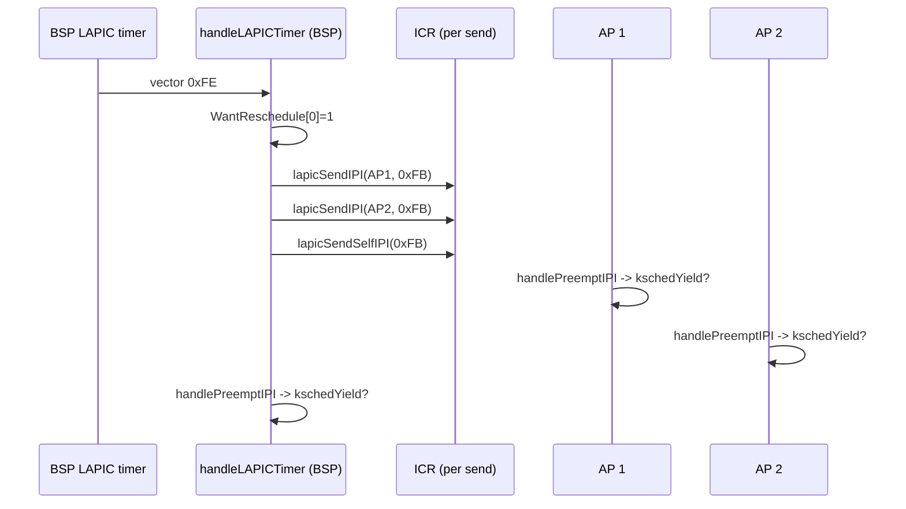

# Chapter 06 — SMP and Preemption

## Overview

This chapter explains how gooos brings up additional logical CPUs and how it
turns the resulting collection of cores into a useful — but deliberately
limited — multiprocessor. The picture is hybrid:

1. The kernel itself runs as a uniprocessor on the BSP (Bootstrap Processor).
   No two cores ever execute kernel code simultaneously (M6 invariant).
2. The remaining APs (Application Processors) are dedicated to dispatching
   Ring-3 host kthreads. Userspace processes therefore *do* run in parallel
   across cores (M7 invariant).
3. All hardware IRQs (Interrupt Requests) — keyboard, PIT (Programmable
   Interval Timer), e1000 NIC, fs request completion — still land on the BSP.
   APs only see internal IPIs (Inter-Processor Interrupts) and their own
   LAPIC (Local Advanced Programmable Interrupt Controller) timer.

The chapter walks the BSP's discovery of APs through ACPI (Advanced
Configuration and Power Interface), the real-mode trampoline at physical
`0x8000`, the INIT-SIPI-SIPI (Initialize / Startup IPI / Startup IPI) wake
sequence, per-CPU storage via `IA32_GS_BASE`, the IPI vector layout
(`0xFB`, `0xFC`, `0xFE`), the LAPIC timer's role as a 100 Hz heartbeat,
preempt-IPI fanout, wake-IPIs, the staged `preempt_phase` enable, and the
TLB (Translation Lookaside Buffer) handling story.

Read it after Chapter 03 (BSP boot) and Chapter 05 (kernel-thread runtime).

## Prerequisites

Before reading this chapter you should be comfortable with:

- The general idea of an APIC and that each x86_64 core has its own LAPIC.
- That an IPI is a software-generated interrupt addressed to one or more
  cores via the LAPIC's ICR (Interrupt Command Register).
- That ACPI provides firmware tables — for SMP (Symmetric Multi-Processing)
  the relevant ones are the RSDP (Root System Description Pointer), the
  RSDT/XSDT (Extended System Description Table), and the MADT (Multiple
  APIC Description Table).
- gooos's per-CPU GDT/TSS and the IDT layout from Chapter 03.
- The kthread queue and `kschedLoop` from Chapter 05.

If you have never wired up real SMP boot before, this chapter is meant to
be enough to follow the code; it is not a substitute for the Intel Software
Developer's Manual, but it points at the exact bits gooos pokes.

## What "SMP" means in gooos

When QEMU is invoked with `-smp 4`, the firmware presents four logical
CPUs to the boot code. The first is the BSP (the one already executing
when `_start` runs); the other three are APs and start in a halted state
until kicked.

gooos's bring-up is bounded by two compile-time constants:

- `smpMaxAPs = 16` — `src/smp.go:53`. Caps the per-AP stack array
  `apStacks` and the side tables in `src/percpu.go`.
- `maxCPUs = 17` — `src/percpu.go:14`. One slot per AP plus one for the
  BSP, so `perCPUBlocks` always indexes safely with `cpuID()`.

The runtime constant `numCoresOnline` (`src/smp.go:70`) starts at 1 and
is rewritten by `smpInit` once the AP count is known. It is referenced
externally by the patched TinyGo runtime (the `gooosWakeupCPU` path needs
to know how many cores can possibly receive a wake-IPI).

| Symbol | Where | Meaning |
|---|---|---|
| `smpMaxAPs` | `src/smp.go:53` | Hard cap on AP-side stacks/data tables |
| `maxCPUs` | `src/percpu.go:14` | `smpMaxAPs + 1`, sizes `perCPUBlocks` |
| `numCoresOnline` | `src/smp.go:70` | Live count, BSP + APs that booted |
| `bspBootDone` | `src/smp.go:63` | APs spin on this before entering scheduler |
| `gdtReady` | `src/smp.go:58` | APs spin on this before `gdtInitPerCPU` |

## ACPI MADT walk

Before sending any IPI, the BSP walks ACPI to find out how many APs the
firmware claims exist. This drives the bounded wait loop later — without
it, we would have to fall back to a fixed timeout.

`detectAPsFromACPI` (`src/smp.go:379`) is the entry point. The walk is:

1. `findRSDP` (`src/smp.go:417`) scans `0xE0000`–`0xFFFFF` and the EBDA
   in 16-byte steps for the literal signature `"RSD PTR "` (note the
   trailing spaces). The 8-byte match is implemented in `matchRSDP`
   (`src/smp.go:439`).
2. The RSDP's offset 16 holds the 32-bit physical address of the RSDT
   (`src/smp.go:386`). gooos uses the RSDT path; the XSDT (which would
   give 64-bit pointers) is unnecessary because QEMU's RSDT is below
   1 GiB and therefore inside the boot-time identity map.
3. The RSDT is verified by signature `"RSDT"` and walked: `(length-36)/4`
   4-byte child pointers (`src/smp.go:399`). For each child whose
   signature is `"APIC"` we have the MADT.
4. `parseMADT` (`src/smp.go:447`) walks the MADT entries starting at
   offset 44. Type-0 entries (Processor Local APIC) are counted when
   their flag bit 0 is set and their APIC ID differs from the BSP's.
   Type-1 entries (IOAPIC) populate the global `ioapicBase`, used later
   by `ioapicInit` in `src/ioapic.go`.

```
+-----------------------+
| RSDP "RSD PTR "       |  <-- found by findRSDP() in low memory
+-----------------------+
            |
            v
+-----------------------+
| RSDT  sig "RSDT"      |
| length, [child ptrs]  |
+-----------------------+
            |
            v (one of N children)
+-----------------------+
| MADT  sig "APIC"      |
| length, ...            |
| Entry type 0: LAPIC    |  <-- counted as an AP
| Entry type 1: IOAPIC   |  <-- captures ioapicBase
| Entry type 0: LAPIC    |
| ...                    |
+-----------------------+
```

If no MADT is found, `expectedAPs` is 0 and `smpInit` falls back to a
broadcast INIT-SIPI-SIPI plus a fixed 100 ms wait.

## Real-mode trampoline at physical 0x8000

APs come out of reset in 16-bit real mode at the SIPI vector. A SIPI
vector is one byte; the CPU starts executing at physical address
`vector * 0x1000`. gooos chooses vector `0x08`, so APs land at physical
`0x8000`. That number lives in two places that must agree:

- `trampPhys = 0x8000` and `trampSIPIVec = 0x08` — `src/smp.go:35-36`.
- `.equ TRAMP_BASE, 0x8000` — `src/trampoline.S:16`.

`smpInit` copies the trampoline blob (built into `.rodata`) byte-by-byte
to physical `0x8000` (`src/smp.go:188-192`), then patches a small data
area at fixed offsets:

| Offset (from `0x8000`) | Field | Patched by |
|---|---|---|
| `0xF00` | 32-byte trampoline GDT (4 entries) | static, `trampoline.S:133` |
| `0xF20` | 6-byte GDT pointer | static, `trampoline.S:141` |
| `0xF28` | PML4 physical address | `smpInit`, `src/smp.go:201` |
| `0xF30` | 64-bit Go entry (`apEntry`) | `smpInit`, `src/smp.go:202` |
| `0xF38` | Pointer to `apStacks[0]` | `smpInit`, `src/smp.go:203` |
| `0xF40` | Atomic AP counter (init 0) | `smpInit`, `src/smp.go:204` |

The trampoline code itself is the classic 16 → 32 → 64 ladder, identical
in spirit to the BSP's `boot.S` but executed by every AP:

1. Real mode (`src/trampoline.S:37-58`): clear DS/ES/SS, `lgdt` the
   trampoline GDT (with a 0x66 operand-size override so `lgdt` reads a
   6-byte descriptor), set CR0.PE, far-jump into 32-bit code at
   `tramp_pm32`.
2. Protected mode (`src/trampoline.S:62-90`): reload data segments to
   selector `0x10`, set CR4.PAE (Physical Address Extension), load
   `CR3` from `TRAMP_PML4` (the *same* PML4 the BSP is using — APs
   share the kernel address space), set EFER.LME via MSR
   (Model-Specific Register) `0xC0000080`, set CR0.PG, far-jump into
   64-bit code at `tramp_lm64`.
3. Long mode (`src/trampoline.S:94-125`): reload segment selectors,
   atomically claim a per-AP index with `lock xaddl`, look up its stack
   in `apStacks`, set up `%rdi = apIndex` for the System V ABI, align
   `%rsp` to 16 bytes, and call the patched `apEntry` pointer.

The atomic `xaddl` (`src/trampoline.S:108`) is what makes the trampoline
re-entrant for N simultaneously-released APs without a lock — each AP
gets a unique 0-based index, and they index `apStacks` in parallel.

## INIT-SIPI-SIPI sequence

Once the trampoline is in place, the BSP issues the wake sequence. The
ICR is written through the LAPIC MMIO page at `0xFEE00000`, mapped
identity + uncacheable in `smpInit` (`src/smp.go:165`).

```mermaid
sequenceDiagram
    participant BSP as BSP (in smpInit)
    participant ICR as LAPIC ICR
    participant AP as AP CPU
    participant Tramp as 0x8000 trampoline

    BSP->>ICR: lapicWaitICR()
    BSP->>ICR: write ICR low = 0x000C4500 (icrINIT, all-excl-self)
    Note over BSP: hlt-wait 2 PIT ticks (~10 ms)
    BSP->>ICR: lapicWaitICR()
    BSP->>ICR: write ICR low = 0x000C4600 | 0x08 (icrSIPI, vector 0x08)
    AP->>Tramp: SIPI lands; CS:IP -> 0x8000
    Note over BSP: ioDelay(200 us)
    BSP->>ICR: lapicWaitICR()
    BSP->>ICR: write ICR low = 0x000C4600 | 0x08 (second SIPI)
    Note over AP: trampoline 16 -> 32 -> 64 bit
    AP->>Tramp: lock xaddl claims apIndex
    AP->>BSP: callq apEntry(apIndex)
```

Constants:

- `icrINIT = 0x000C4500` — `src/smp.go:49`. Bits 18-19 = `0b11`
  (destination shorthand "all excluding self"), bit 14 = 1 (level
  assert), delivery mode = 101 (INIT).
- `icrSIPI = 0x000C4600` — `src/smp.go:50`. Same shorthand and assert,
  delivery mode = 110 (Startup).
- The vector byte (`0x08`) is OR'd into the SIPI command on each send
  (`src/smp.go:220, 227`).

The 10 ms gap after INIT is implemented as `pitTicks + 2` since PIT
interrupts at 100 Hz (`src/smp.go:213-216`). The 200 µs gap after the
first SIPI is `ioDelay(200)`, which spins on `outb 0x80` (`src/smp.go:223`).
The second SIPI is required by some Intel processors that miss the
first.

After the second SIPI the BSP polls `tramp_counter` (the atomic at
`0xF40`) with an adaptive deadline: each new AP that increments the
counter resets the deadline to `pitTicks + 5`, and we exit early once
`expectedAPs` is reached (`src/smp.go:232-244`). The final value of
`tramp_counter`, plus 1 for the BSP, is written to `numCoresOnline`.

## `apEntry` and `apSchedulerEntry`

Each AP enters Go for the first time in `apEntry` (`src/smp.go:260`)
with `apIndex` (0 for the first AP, 1 for the second, …) in `%rdi`.
The function does, in order:

1. `percpuInitAP(apIndex)` — writes `IA32_GS_BASE` so per-CPU access
   is live (`src/smp.go:262`, defined at `src/percpu.go:258`).
2. Spin on `gdtReady` (`src/smp.go:268-270`). The BSP only sets this
   to 1 after `gdtInit` finishes, so APs see a fully populated
   `gdtTable` template before they `gdtInitPerCPU`.
3. `gdtInitPerCPU(int(apIndex)+1)` — load this AP's GDT and TSS.
4. `idtLoadAP()` — load the same IDT the BSP uses. Without this the
   AP's IDTR is `{base=0, limit=0xFFFF}` and any exception
   triple-faults.
5. Set the LAPIC SVR (Spurious Interrupt Vector Register) to
   software-enable the LAPIC (`src/smp.go:286-287`), then latch its
   APIC ID into `perCPUBlocks[idx].APICID` via
   `percpuLatchAPICIDCurrent` (`src/percpu.go:272`). The latch retries
   up to 1024 times because LAPIC ID can briefly read as 0 right after
   software-enable on some boots.
6. Spin on `lapicCalibratedInitCnt` (`src/smp.go:294-296`) and call
   `lapicTimerInit` (`src/lapic_timer.go:67`) — every AP now has its
   own 100 Hz tick driving `WantReschedule`.
7. Spin on `bspBootDone` until BSP signals services are running
   (`src/smp.go:316-318`).
8. Mask LVT LINT0/LINT1 on this AP (`src/smp.go:326-327`). Only the
   BSP carries PIC pass-through; APs must not accept legacy
   ExtINT/NMI through their LINT lines.
9. `sti()`, then `markAPSchedulerEntered()` (`src/preempt_phase.go:46`),
   then `apSchedulerEntry()`.

`apSchedulerEntry` (`src/smp.go:351`) is the AP-specific scheduler
selector. Three branches, in priority order:

```
if userspaceSMP {                  // M7 path (current default)
    kschedLoopRing3Only(cpuID())
    return
}
if uniprocessorKernel {            // M6 path (rollback target)
    for { sti(); hlt() }
}
kschedLoop()                       // pre-§14 SMP kernel (legacy)
```

Under the current build (`userspaceSMP = true`) every AP runs
`kschedLoopRing3Only`, consuming only from `kschedQueuesRing3[cpuID()]`.
Service kthreads (timer dispatcher, fsTask, network kthreads) stay on
the BSP queue and are never popped from an AP. A safety-net
`for { hlt() }` follows in case the loop ever returns.

## Per-CPU storage via `IA32_GS_BASE`

Every nosplit ISR/syscall stub needs to access "this CPU's data" without
acquiring a lock. The standard x86_64 trick is to install a per-CPU
data pointer in `IA32_GS_BASE` (MSR `0xC0000101`) so `%gs:offset`
addressing in assembly is one cycle.

`PerCPU` is the per-CPU block (`src/percpu.go:22`). Layout:

```
PerCPU @ %gs:0  (one cache-line-aligned instance per core)
+--------+--------------------+--------------------------------+
| Offset | Field              | Notes                          |
+--------+--------------------+--------------------------------+
|   0    | CPUIndex   uint32  | 0 = BSP, 1..N = APs            |
|   4    | InterruptDepth     | bumped by isr.S prologue       |
|   8    | SystemStack uintptr| TinyGo scheduler stack         |
|  16    | TSSPtr     uintptr | this CPU's TSS                 |
|  24    | APICID     uint32  | latched after LAPIC enable     |
|  28    | WantReschedule     | set by LAPIC timer ISR         |
|  32    | CurrentPML4 uintptr| CR3 of running goroutine       |
|  40    | CurrentPoolIdx int32| ring3 pool slot (-1 if kernel)|
|  44    | SyscallDepth       | int 0x80 nesting               |
|  48    | PreemptDisable     | spinlock-held nesting          |
|  ...   | _pad [12]byte      | pad to 64-byte cache line      |
+--------+--------------------+--------------------------------+
```

Stable offsets matter because the assembly stubs (`stubs.S`, `isr.S`)
read these fields directly via `%gs:N`. The Go-side mirror constants
are at `src/percpu.go:38-48`.

`perCPUBlocks` is `[maxCPUs]PerCPU` (`src/percpu.go:52`); each entry's
address is what gets written to `IA32_GS_BASE` via `wrmsr`. The BSP
calls `percpuInitBSPEarly` *before* `sti()` (the ISR prologue uses
`%gs:4` — without GS base set up, the first PIT tick triple-faults).
APs call `percpuInitAP` as the very first thing they do in `apEntry`.

The BSP additionally calls `percpuInitBSPLate` once the LAPIC MMIO is
mapped, to capture its APIC ID (`src/percpu.go:243`).

## The M6 invariant — uniprocessor kernel

`uniprocessorKernel = true` (`src/preempt_config.go:128`) is the M6
contract: *the gooos kernel runs on BSP only*. APs come up, latch their
per-CPU state, and (under M6 alone) idle in `sti; hlt` until an IPI
wakes them. `kschedSpawn` always pushes to CPU 0; `kschedSteal` returns
`nil`; `pitWakeAPs` is bypassed.

The reason is conservative correctness: gooos's kthread runtime, the
e1000 driver, the in-memory FS, and the network stack were all written
without explicit per-resource locks beyond what's documented. Running
them on a single core is safe; running them on N cores would expose
races that have not been proven absent. M6 makes this trade-off
explicit and reversible: flipping the flag and rebuilding restores the
older multi-core kernel scheduler.

The AP idle loop *does* still receive its LAPIC timer; the timer ISR
just sets `WantReschedule = 1` and EOIs. An AP idle in `hlt` will exit
on any IPI (wakeup or preempt) and retry the loop.

## The M7 invariant — Ring-3 on APs

`userspaceSMP = true` (`src/preempt_config.go:146`) layers parallelism
back on top of M6, but only for Ring-3 host kthreads. The placement
rule lives in `kschedSpawnRing3Wrapper` (`src/kthread_ring3.go:40`):

```go
if userspaceSMP && numCoresOnline > 1 {
    target = 1 + (kschedSpawnRRCounter % (numCoresOnline - 1))
    kschedSpawnRRCounter++
}
...
kschedPushRing3(t, target)
```

The `1 + (counter % (numCoresOnline-1))` formula is the round-robin: it
generates 1, 2, …, N-1, 1, 2, … and *never* yields 0. The BSP queue is
reserved for the boot shell (see next section). Service kthreads
(`fsTask`, `netRxLoop`, `tcpEchoServer`, etc.) are pushed via the
service tier `kschedPush(t, 0)` and are not affected.

| Tier | Queue family | Who pops | Who pushes |
|---|---|---|---|
| Service | `kschedQueues[0]` | BSP only | `kschedSpawn`/`kschedSpawnAt` |
| Ring-3  | `kschedQueuesRing3[1..N-1]` | APs (`kschedLoopRing3Only`) | `kschedSpawnRing3Wrapper` |
| Ring-3 (BSP) | `kschedQueuesRing3[0]` | BSP combined pump | `kschedSpawnRing3WrapperOnBSP` |

## Boot shell as exception

The boot shell is the one Ring-3 wrapper that *must* run on BSP, because
it is launched before SMP brings APs to a usable state and because the
exec/wait pump in `src/elf.go:258` is what drives the shell's stdin
loop. The exception is encoded in `kschedSpawnRing3WrapperOnBSP`
(`src/kthread_ring3.go:85`), called at `src/elf.go:257`:

```go
kschedSpawnRing3WrapperOnBSP(proc)
for proc.Exited == 0 {
    kschedLoopOnce()
    ...
}
```

The function does the same setup as `kschedSpawnRing3Wrapper` but
unconditionally pushes to Ring-3 queue 0 (`kschedPushRing3(t, 0)`).
That keeps R3 ("only ring3WrapperKT instances live on Ring-3 queues")
intact while still letting the BSP combined pump dispatch the shell.

## IPI vectors

gooos uses three IPI vectors and one local LAPIC vector. They all live
above `0xF0` so they are never confused with PIC-mapped IRQs (legacy
PIC vectors are 0x20-0x2F, IOAPIC vectors are 32 and 33).

| Vector | Name | Direction | Source file | Purpose |
|---|---|---|---|---|
| `0xFB` | `ipiPreemptVector` | BSP → all-except-self + self-IPI | `src/ipi.go:13` | Force a per-CPU reschedule check |
| `0xFC` | `ipiWakeupVector` | any → one | `src/ipi.go:12` | Wake target CPU from `hlt` so it re-checks its runqueue |
| `0xFE` | `lapicTimerVector` | local only | `src/lapic_timer.go:14` | Per-CPU 100 Hz heartbeat |

The BSP also still serves IRQ0 (PIT) at vector 32 and IRQ1 (keyboard)
at vector 33, routed either via the legacy PIC pass-through on LINT0
or via `ioapicSetRedirection` (`src/ioapic.go:39`) once `ioapicInit`
runs.

`lapicSendIPI(targetAPICID, vector)` is the targeted form
(`src/ipi.go:27`); it writes ICRH (high) with the destination APIC ID
in bits 24-31 then ICRL (low) with the vector plus assert bit 14, and
spins on `lapicWaitICR`. `lapicBroadcastIPI` (`src/ipi.go:43`) uses
destination shorthand for "all" (with or without self).
`lapicSendSelfIPI` (`src/ipi.go:60`) uses shorthand `0b01` (self) and
deliberately *does not* wait — used from inside the LAPIC timer ISR
when we want to enqueue another preempt to ourselves without spinning.

## LAPIC timer setup

The PIT runs at 100 Hz from boot and is the BSP's only wall-clock-ish
reference for calibration. `lapicTimerCalibrate`
(`src/lapic_timer.go:34`) measures one PIT tick of LAPIC counter
decrement:

1. Set the timer divider to 16 (`lapicRegTimerDivCfg = 0x03`).
2. Mask the timer (LVT bit 16 set, vector `0xFE`).
3. Load `0xFFFFFFFF` into the initial-count register.
4. `hlt`-wait for `pitTicks` to advance by one (≈10 ms).
5. Read `lapicRegTimerCurrCnt` and compute
   `elapsed = 0xFFFFFFFF - current`.
6. Store `elapsed` in `lapicCalibratedInitCnt`.

Each CPU then runs `lapicTimerInit` (`src/lapic_timer.go:67`), which
programs LVT Timer to periodic mode (bit 17), unmasked, vector `0xFE`,
with the calibrated initial count. The BSP does this just after
calibration; APs do it inside `apEntry` once they observe
`lapicCalibratedInitCnt != 0`.

The handler `handleLAPICTimer` (`src/lapic_timer.go:88`) is per-CPU
nosplit and does:

- Always: `perCPUBlocks[idx].WantReschedule = 1`.
- BSP-only and only after the preempt phase reaches Operational:
  call `maybeSignalUserPreempt(i)` for every online CPU, then
  `broadcastPreemptIPI()`, then attempt SIGALRM delivery on this BSP
  if a Ring-3 frame is captured.
- Always: `lapicSendEOI()`.

The BSP-only branch is gated by `idx == 0`, `preemptEnabled`, and
`preemptPhaseIsOperational()` (`src/preempt_phase.go:54`). It also
swallows the first 150 ticks after userspace handoff
(`preemptStartupWarmupTicks`) to keep shell bootstrap deterministic.

## Preempt-IPI fanout

`broadcastPreemptIPI` (`src/ipi.go:132`) is what the BSP calls every
10 ms (when the phase gate allows it). The function:

1. Snapshots APIC IDs of all online cores other than the BSP into
   `preemptTargetSnapshot[]`.
2. Sends `lapicSendIPI(apicID, ipiPreemptVector)` to each.
3. Sends `lapicSendSelfIPI(ipiPreemptVector)` to itself.



Each receiver runs `handlePreemptIPI` (`src/goroutine_irq.go:89`).
The handler is *local*: it decides whether to yield based purely on
its own per-CPU state.

| Condition | Action | Source |
|---|---|---|
| `InterruptDepth > 1` (nested ISR) | bail | `src/goroutine_irq.go:100` |
| `PreemptDisable > 0` (spinlock held) | set `WantReschedule`, bail | `src/goroutine_irq.go:106` |
| `SyscallDepth > 1` (real `int 0x80` running above us) | bail | `src/goroutine_irq.go:113` |
| Interrupted Ring-3 (CS RPL == 3) hosted by kthread | `kschedYield()` | `src/goroutine_irq.go:144` |
| Interrupted Ring-3 hosted by goroutine | try SIGALRM via `maybeDeliverSignal`, else fall through | `src/goroutine_irq.go:158` |
| Ring-0 with kthread running | `kschedYield()` | `src/goroutine_irq.go:180` |
| Ring-0 with `taskCurrent() == 0` | bail (no goroutine to yield) | `src/goroutine_irq.go:190` |
| Ring-0 default | `gooosSchedulerYield()` (`runtime.Gosched`) | `src/goroutine_irq.go:206` |

Note that EOI is sent at the very top of the handler
(`src/goroutine_irq.go:90`) — the LAPIC is freed before any decision
work, so a long yield path doesn't block subsequent IPIs.

## Wake-IPI

The wake-IPI is point-to-point. When a kthread on CPU X is `kschedWake`'d
but its `OwnerCPU` is Y ≠ X, the waker calls `gooosWakeupCPU(Y)`
(`src/ipi.go:108`), which resolves the APIC ID from
`perCPUBlocks[Y].APICID` and issues `lapicSendIPI(apicID, 0xFC)`.

The handler `handleWakeupIPI` (`src/ipi.go:92`) is the simplest of all:
record a "first seen" diagnostic and EOI. The mere fact of returning
from the ISR brings CPU Y out of `hlt`, and its scheduler loop checks
its runqueue on the way around. No additional state is needed.

The early-return guards in `gooosWakeupCPU` are important:

- `cpuIdx == cpuID()` → never IPI yourself with a wake (the local
  scheduler will see the new task on its way through the loop).
- `cpuIdx != 0 && apicID == 0` → AP has not yet latched its APIC ID;
  skip the send rather than mis-target the BSP.

## Preempt phases

Preempt-IPI fan-out has three preconditions that are all subtle to
satisfy at boot:

1. Every AP must have entered its scheduler loop at least once, so its
   `kschedRunning[c]`/`taskCurrent()` state is meaningful when
   `handlePreemptIPI` examines it.
2. Every AP must have latched its APIC ID, otherwise the BSP's
   targeting loop will skip it (and never resume).
3. The BSP itself must be past `bspBootDone` so all services are up.

`src/preempt_phase.go` encodes this as a monotonic three-state ladder:

```mermaid
flowchart LR
    BootInit -->|preemptPhaseAdvance(SchedReady)<br/>called when scheduling becomes safe| SchedReady
    SchedReady -->|maybeEnterOperational:<br/>bspBootDone != 0 AND<br/>apSchedEnteredCount >= numCoresOnline-1| Operational
```

| Phase | Constant | Effect on `handleLAPICTimer` |
|---|---|---|
| BootInit | `0` (`src/preempt_phase.go:10`) | BSP's timer ISR skips fanout |
| SchedReady | `1` (`src/preempt_phase.go:11`) | Still skipped (waits on bsp+APs) |
| Operational | `2` (`src/preempt_phase.go:12`) | `preemptPhaseIsOperational()` returns true; fanout enabled |

`markAPSchedulerEntered` (`src/preempt_phase.go:46`) is called by every
AP just before `apSchedulerEntry`; once `apSchedEnteredCount >=
numCoresOnline-1` *and* `bspBootDone != 0`, the next
`maybeEnterOperational` flips the phase. The check is performed under
a `Spinlock` (`preemptPhaseLock`), but the read inside the LAPIC timer
ISR is lock-free because the variable is monotonic — a stale read can
delay enablement by at most one tick.

## All hardware IRQs land on BSP

This is the current scope decision and worth understanding before
debugging. Two paths exist:

- **PIC pass-through (default boot)**: `restoreBSPVirtualWire`
  (`src/smp.go:116`) writes `LVT LINT0 = ExtINT, unmasked` and
  `LVT LINT1 = NMI, unmasked` on the BSP, then unmasks both 8259A
  PICs. All hardware IRQs flow PIC → LINT0 → BSP CPU. APs explicitly
  *mask* their own LINT0/LINT1 in `apEntry` (`src/smp.go:326-327`) so
  the legacy IRQ stream cannot accidentally land on an AP.
- **IOAPIC routing (when `ioapicInit` runs)**: `src/ioapic.go:88-91`
  programs IRQ0 → vector 32 and IRQ1 → vector 33, both with
  `destAPICID = bspAPICID`. The PIC is masked. Every other IOAPIC
  redirection entry stays masked (`src/ioapic.go:81-83`).

Either way, the policy is the same: e1000 RX, keyboard, fsTask
completion, the PIT tick — they all run on the BSP. M8 (steering IRQs
to less-loaded cores) is deferred. This is *deliberately* not a
limitation we hide; the M6 uniprocessor-kernel choice would be unsafe
if IRQs could fire concurrent kernel handlers on multiple cores.

## TLB shootdown

A textbook SMP kernel needs cross-CPU TLB invalidation: when CPU 0
unmaps a page, every other CPU's TLB must drop stale entries before
the unmap becomes visible. gooos *does not* implement this protocol
today, and the chapter documents it explicitly so readers do not look
for a missing piece.

The reason it is currently safe:

- The kernel runs only on the BSP (`uniprocessorKernel = true`), so
  kernel-side unmaps are observed by exactly one CPU.
- Every Ring-3 dispatch reloads CR3 (in `kthreadResumeRing3Ctx`,
  `src/kthread_ring3.go:104`), which flushes the entire local
  TLB on that AP.
- A user address space is private to one host kthread at a time —
  there is no shared writable mapping that two cores could observe in
  inconsistent states between an unmap on CPU X and a subsequent CR3
  load on CPU Y.

If a future change introduces shared user mappings or moves any
kernel-side mutator off the BSP, an explicit shootdown IPI (typically
on a fourth vector like `0xFD`) becomes necessary. That would slot
naturally next to the existing `0xFB`/`0xFC` machinery.

## Summary

- gooos is *hybrid* SMP: kernel uniprocessor on BSP (M6), Ring-3 host
  kthreads round-robined across APs (M7).
- AP discovery is via ACPI MADT; bring-up is the textbook real-mode
  trampoline at `0x8000` plus an INIT-SIPI-SIPI sequence using the
  LAPIC ICR.
- Each CPU has a `PerCPU` block at `%gs:0`, holding the fields ISRs
  and syscalls touch in O(1).
- Three IPI vectors are defined: `0xFB` preempt, `0xFC` wakeup, plus
  the local LAPIC timer at `0xFE`.
- The BSP's 100 Hz LAPIC timer drives preempt-IPI fanout, gated by a
  monotonic three-phase ladder so fanout only happens once every AP
  is in its scheduler loop with its APIC ID latched.
- All hardware IRQs land on the BSP today, by both PIC pass-through
  and IOAPIC routing decisions.
- No TLB shootdown protocol exists; CR3 reloads on every Ring-3
  dispatch make it unnecessary under current invariants.

## Cross-references

- `./03_boot_and_init.md` — BSP boot path, GDT/IDT/PIT setup that
  this chapter assumes is already done.
- `./05_kernel_thread_runtime.md` — `KernelThread`, `kschedQueues`,
  `kschedQueuesRing3`, `kschedLoopRing3Only` referenced throughout.
- `./08_syscalls.md` — SIGALRM delivery via the BSP timer's iretq-frame
  rewrite path called from `handleLAPICTimer`.
- `./10_drivers_filesystem_network.md` — concrete drivers affected by
  the "all hardware IRQs land on BSP" decision (e1000, keyboard, PIT,
  fsTask completions).
