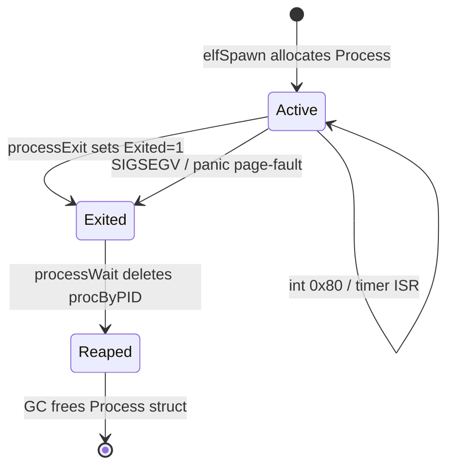
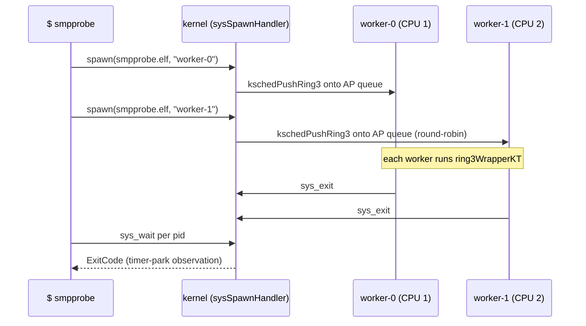

# Chapter 07 — Processes and Userspace

## Overview

Chapter 10 describes the in-memory filesystem that holds 22 user
programs, each compiled to a Ring-3 ELF (Executable and Linkable Format)
binary. This chapter explains how those binaries become **processes**:
how the kernel parses ELF headers, allocates a per-process address
space, hosts the process inside a kernel thread, hands the CPU off to
Ring 3 via `iretq`, and finally reaps the process when it exits.

The story has six moving parts that must agree on the same Process
descriptor at runtime:

1. The `Process` struct (`src/process.go`) — pid, exit code, fd table,
   PML4 (Page Map Level 4) pointer, host kthread reference, and the
   per-CPU bookkeeping fields used by the LAPIC-timer preemption path.
2. The ELF parser (`src/elf.go`) — validates the binary and walks
   PT_LOAD (ELF Loadable Program Segment) entries.
3. The per-process PML4 builder (`src/proc_pml4.go`) — gives each
   process its own page-table root with the kernel half stitched in.
4. The Ring-3 wrapper kthread (`src/kthread_ring3.go`) — installs CR3
   (Control Register 3) and TSS.RSP0 (Task-State-Segment Ring-0 Stack
   Pointer) at every dispatch and finally executes `jumpToRing3`.
5. The `iretq` stub (`src/stubs.S`) — builds the five-quadword
   privilege-transition frame and crosses from DPL=0 (Descriptor
   Privilege Level 0) to DPL=3.
6. The bounded Ring-3 stack pool (`src/ring3_pool.go`) — recycles 8 KiB
   kernel stacks across processes so long shell sessions do not leak.

By the end of this chapter you will be able to read `src/process.go`
end to end and explain, line by line, how a `$ smpprobe` shell command
turns into four sibling Ring-3 processes running on four CPU cores.

## Prerequisites

Before reading this chapter you should be comfortable with:

- **Chapter 04 (Memory Management)** — `mapPage`, `mapPageInto`,
  `allocPage`, the boot PML4 layout, and the `pagePresent | pageWrite |
  pageUser` flag combination used for Ring-3 mappings.
- **Chapter 05 (Kernel Thread Runtime)** — `KernelThread`, the kthread
  pool, `kschedSpawnInternal`, `kschedRunning[cpu]`, and the
  park/resume hooks.
- **Chapter 10 (Drivers, Filesystem, and Networking)** — `fsSendRead(name)`,
  which returns the ELF blob for `sh.elf`, `hello.elf`, etc.
- **Concept-level** familiarity with ELF, fork/exec, and the Ring-0
  vs Ring-3 distinction. You are *not* expected to have written an
  `iretq` frame or driven a TSS by hand before — those are the central
  topics of §8 and §9 below.

## Body

### 1. The `Process` struct

Every Ring-3 process is described by a single `Process` struct
(`src/process.go:32-110`). It is allocated on the kernel heap by
`elfSpawn` (or `elfLoad` for the boot shell) and lives until
`processWait` deletes it from `procByPID`.

```
+--------------------------------------------------------------+
|  Process (src/process.go:32)                                  |
+--------------------------------------------------------------+
|  pid          uint32      // PID assigned by allocPID         |
|  parent       *Process    // nil for the boot shell           |
|  ExitCode     uintptr     // set by processExit               |
|  Exited       uint32      // 0=Active, 1=Exited               |
|  exitCh       chan uintptr// goroutine-parent path (legacy)   |
|  poolIdx      int         // ring3StackPool slot, -1 if none  |
|  pml4         uintptr     // per-process PML4 phys addr       |
|  EntryPoint   uintptr     // ELF e_entry                      |
|  StackTop     uintptr     // initial Ring-3 RSP               |
|  HeapBreak    uintptr     // sys_sbrk current break           |
|  HeapLimit    uintptr     // HeapBreak + 2 MiB ceiling        |
|  ArgString    [256]byte   // copy of the argv blob            |
|  ArgLen       int                                             |
|  fds          [16]FileDesc// per-process fd table             |
|  UserPages    [512]uintptr// virtual addrs of user pages      |
|  UserPaddrs   [512]uintptr// matching physical addrs          |
|  UserPageCnt  int         // count for cleanup loop           |
|  LastCpuID    uint32      // last CPU this process resumed on |
|  SigAlrmHandler  uintptr  // sys_sigaction registered handler |
|  UserPreemptPending uint32// set by tick, cleared on delivery |
|  UserQuantumTicks  uint32 // 10 = 100 ms at 100 Hz            |
|  UserQuantumCounter uint32// accumulator                      |
|  SigInProgress     uint32 // 1 while SIGALRM handler runs     |
|  SigSavedRSP       uintptr// user RSP when sigFrame was built |
+--------------------------------------------------------------+
```

The lookup tables in the same file (`src/process.go:116-131`) keep
three indices:

| Map / global       | Key                | Value          | Populated by                       |
|--------------------|--------------------|----------------|------------------------------------|
| `procByTask`       | `*task.Task`       | `*Process`     | `setCurrentProc` from `ring3Wrapper` |
| `procByPID`        | `pid uint32`       | `*Process`     | `elfSpawn` after `allocPID`        |
| `procByPoolSlot`   | `int` (slot index) | `*Process`     | `ring3WrapperKT` / `ring3Wrapper`  |
| `nextPID`          | —                  | `uint32` (1++) | bumped by `allocPID`               |
| `foregroundProc`   | —                  | `*Process`     | `setForegroundProc` (keyboard)     |

`procByPoolSlot` is the **primary** lookup under `scheduler=none`,
because `taskCurrent()` returns a single shared `mainTask` value across
every kernel thread; only the per-CPU pool-slot index disambiguates
which process is running on **this** CPU
(`src/process.go:202-217`).

### 2. Process states

Only two state bits live in the struct itself (`Exited == 0` versus
`Exited == 1`), but the lifecycle naturally has a third *Reaped* phase
once `processWait` removes the entry from `procByPID`.



Notes:
- *Active* covers both "currently executing on a CPU" and "parked in
  the scheduler's runqueue". The Ring-3 host kthread, not the
  `Process` struct, holds the runnable/blocked bit.
- *Exited* is the gooos analogue of POSIX zombie state: pages are
  freed (`processExit` walks `UserPaddrs`) but the descriptor stays in
  `procByPID` until the parent's `processWait` reaps it
  (`src/process.go:503-509`). The kernel-stack pool slot is also
  released here.
- There is no separate "Stopped" state; gooos has no `SIGSTOP`.

### 3. The 22 user programs

Every directory under `user/cmd/` becomes one Ring-3 ELF. The build
script `scripts/embed_elfs.sh` walks `user/build/*.elf` and emits one
byte-array constant per binary into `src/user_binaries.go`. Each
program is loaded into the in-memory FS at boot by `src/main.go:474`
onward.

| Program          | Purpose (one-liner)                                          |
|------------------|--------------------------------------------------------------|
| `cat`            | Print files to stdout (`fs_read` syscall)                    |
| `cpuhog`         | Tight-loop CPU-bound workload (anti-starvation test)         |
| `dhcp`           | Userspace DHCP DORA client (Discover, Offer, Request, Ack)   |
| `edit`           | vi-like text editor                                          |
| `fdprobe`        | End-to-end check of `sys_open` / `sys_read` / `sys_close`    |
| `gochan`         | Userspace goroutines + channels demo                         |
| `goprobe`        | Goroutine + channel PASS/FAIL probe                          |
| `hello`          | Single `Println("Hello, World")` smoke test                  |
| `ls`             | Directory listing via `sys_fs_list`                          |
| `markerprint`    | Periodic sibling for anti-starvation regression              |
| `ps`             | List processes via `sys_listprocs` (PID, PPID, S, CPU, NAME) |
| `sh`             | Interactive shell — pipelines, redirection, autorun          |
| `sleeptest`      | Repeated `gooos.Sleep` calls                                 |
| `smpprobe`       | Spawns 4 worker children; reports `cpuID` per worker         |
| `tcpcli`         | Userspace TCP client                                         |
| `tcpecho`        | Userspace TCP echo server on port 8081                       |
| `tinyc`          | Tree-walking Tiny-C interpreter                              |
| `udpecho`        | Userspace UDP echo server on port 17                         |
| `userpreempt`    | SIGALRM-based user-goroutine preemption harness              |
| `wc`             | Word/line/byte counter                                       |
| `wget`           | HTTP/1.0 file downloader                                     |
| `yieldtest`      | Stress test for `sys_yield`                                  |

That is 22 entries — exactly the directory count under `user/cmd/`.
The list of `userElf_*` byte-array variables in
`src/user_binaries.go:6-166675` contains exactly the same 22 names.

### 4. Embedded ELF blobs

`scripts/embed_elfs.sh` (48 lines) is a deliberately small bash script.
For each `user/build/<name>.elf` it writes one Go declaration of the
form

```
// <name>.elf (<size> bytes)
var userElf_<name> = [...]byte{ 0x7f, 0x45, 0x4c, 0x46, ... }
```

into `src/user_binaries.go`. The cap is `262144` bytes
(`scripts/embed_elfs.sh:22`), matching `maxFileData` in `src/fs.go`. A
binary larger than that aborts the build before linking.

There is no global `findUserBinary("sh.elf")` helper. Instead,
`src/main.go:474-561` runs a sequence of explicit
`fsCreate` + `fsWrite` pairs against each blob, populating the in-memory
filesystem before any user code runs. The lookup path used by
`elfSpawn` is therefore through the FS, not through a name-to-blob map:

```
elfSpawn("hello.elf", ...) ─▶ fsSendRead("hello.elf")
                              └─▶ returns []byte slice into userElf_hello
```

`src/user_binaries.go` is auto-generated; do not hand-edit it.

### 5. `elfLoad` and `elfSpawn`

The kernel exposes two parallel ELF entry points.

| Function   | File / line               | Caller         | Result                                      |
|------------|---------------------------|----------------|---------------------------------------------|
| `elfLoad`  | `src/elf.go:173-280`      | boot path      | Boot shell on BSP (Bootstrap Processor)     |
| `elfSpawn` | `src/process.go:319-441`  | `sys_spawn`    | Child process; round-robin to AP queues     |
| `elfExec`  | `src/process.go:520-526`  | `sys_exec`     | Convenience wrapper: `elfSpawn` + `processWait` |

Both share the same parser:

```
elfParse(data) ─▶ (entry uintptr, phdrs []Elf64Phdr, ok bool)
                  src/elf.go:93-167
```

`elfParse` validates the magic (`0x7f 'E' 'L' 'F'`), 64-bit class,
little-endian, `ET_EXEC`, and `EM_X86_64` (`src/elf.go:101-126`), then
walks the program-header table copying every `PT_LOAD` entry into a
fixed `[16]Elf64Phdr` static buffer (`src/elf.go:147-164`). No heap
allocation, no `encoding/binary` dependency.

For each PT_LOAD segment, both loaders perform the same loop:

```go
// src/process.go:391-411 (elfSpawn variant — kernel writes via paddr)
for addr := startPage; addr < endAddr; addr += pageSize {
    if walkAndGetPaddrIn(child.pml4, addr) != 0 { continue }
    paddr := allocPage()
    mapPageInto(child.pml4, addr, paddr, USER|WRITE|PRESENT)
    processRecordPage(child, addr, paddr)
}
for j := 0; j < ph.Filesz; j++ {
    *(byte*)(paddr + (vaddr & pageMask)) = data[ph.Offset+j]
}
```

The crucial subtlety in `elfSpawn` is that the kernel never
dereferences a child vaddr — those mappings exist only in
`child.pml4`, not in the boot PML4 currently held in CR3. Instead it
writes through the *physical* address returned by `allocPage`, which
**is** identity-mapped in the boot kernel half. (The boot-time
`elfLoad` can dereference vaddrs because the boot PML4 is current.)

After PT_LOAD comes the argument page and the user stack:

| Region        | Vaddr                          | Size               | Code site                       |
|---------------|--------------------------------|--------------------|---------------------------------|
| PT_LOAD start | `0x10000000` (per linker_user.ld) | per-binary      | ELF segment loop                |
| Argument page | `0x40300000` (`argPageVaddr`)  | 4 KiB              | `src/process.go:179`            |
| User stack    | `0x7FFF0000` (`userStackBase`) | 4 pages = 16 KiB   | `src/process.go:182`            |
| Initial RSP   | `userStackBase + 3*pageSize - 8` | —                | `src/process.go:430`            |

The initial RSP is set one page below the mapped top so a small
positive offset off RSP at process start (which TinyGo's prologue does
for argc/argv) does not page-fault.

### 6. Per-process PML4 setup

`newProcPML4` (`src/proc_pml4.go:74-92`) gives every process its own
page-table root. The trick is sharing the kernel half so an interrupt
that fires while Ring 3 is current still finds kernel text and data.

```
        per-process PML4              boot PD (kernel half)
        +-----------------+            +----------------+
PML4[0] | per-process PDP |            | 0..1 GiB ident |
PML4[1] | empty           |            +----------------+
  ...   |                 |                    ^
PML4[511]| empty          |                    |
        +-----------------+                    |
                  |                            |
                  v                            |
        per-process PDP                        |
        +-----------------+                    |
PDP[0]  | shared boot PD  |--------------------+
PDP[1]  | empty (user)    |
PDP[2]  | empty (user)    |
PDP[3]  | LAPIC PD copy   | (3..4 GiB, includes 0xFEE00000)
PDP[4..]| empty           |
        +-----------------+
                  |
                  v   (PDP[1..511] become per-process user PDs/PTs)
```

Key points (`src/proc_pml4.go:74-92`):

- `pml4SharedKernelPDP0` is captured once from the boot PDP[0] entry
  and copied verbatim into every per-process PDP[0]. This keeps
  vaddrs `0..1 GiB` identity-mapped to the kernel.
- PDP[3] is also copied so the LAPIC MMIO at `0xFEE00000` is
  reachable from inside a child's address space — required for the
  `EOI` (End-Of-Interrupt) write in the timer ISR (Interrupt Service
  Routine).
- `freeProcPML4` (`src/proc_pml4.go:101-113`) walks PML4[1..511] only
  and never frees PML4[0], because that pointer is shared with the
  kernel.

Without the shared kernel half, an `int 0x80` from Ring 3 would attempt
to fetch the IDT (Interrupt Descriptor Table) entry from a vaddr that
doesn't exist in the child's PML4 and triple-fault.

### 7. `ring3WrapperKT` — the kthread that hosts a Ring-3 process

A Ring-3 process does not run on its own goroutine in the
`scheduler=none` configuration. Instead, `kschedSpawnRing3Wrapper`
(`src/kthread_ring3.go:40-72`) allocates a kernel thread from the pool,
records the `*Process` in a side table, and enqueues the kthread on a
Ring-3 runqueue. When that kthread is dispatched, its entry function
is `ring3WrapperKT`.

```
ring3WrapperKT (src/kthread_ring3.go:131-166)
  ├─ resolve proc = kthreadHostedProc[t.Slot]
  ├─ proc.poolIdx = t.Slot
  ├─ setProcByPoolSlot(t.Slot, proc)        // ISR-safe lookup
  ├─ setCurrentProc(proc)                   // bridge for syscall handlers
  ├─ kthreadResumeRing3Ctx()                // installs CR3 + TSS.RSP0
  ├─ setGateDPL3(0x80)                      // make int 0x80 callable from Ring 3
  └─ jumpToRing3(proc.EntryPoint, proc.StackTop)
                                            // never returns
```

`kthreadResumeRing3Ctx` (`src/kthread_ring3.go:104-122`) is the
**re-install** hook. It reads `kschedRunning[cpu]`, resolves the
hosted process via the side table, then writes:

- `perCPUBlocks[cpu].CurrentPoolIdx = t.Slot`
- `writeCR3(proc.pml4)` — switches the address space.
- `tssSetRSP0(&t.Stack.Top)` — points the per-CPU TSS at this
  kthread's kernel stack top.

This hook fires on first dispatch *and* after every park-then-resume
inside `kschedYield`, `kschedPark`, `KEvent.Wait`, and
`fsReqQueue.Push/Pop`. The reason: while this kthread was parked, a
different Ring-3 host may have run on the same CPU, leaving CR3 and
TSS.RSP0 pointing at *that* process's PML4 and kernel stack. Without
the re-install, the next `int 0x80` from this process would land on
the wrong stack.

### 8. The `iretq` boundary

`jumpToRing3` is a hand-written assembly routine
(`src/stubs.S:330-356`). It performs the privilege transition by
forging the same five-quadword stack frame the CPU itself pushes on a
Ring-3 → Ring-0 trap, then executing `iretq` (Interrupt Return Quad).

```
                      Stack just before iretq
                      +-----------------+   <- RSP = top
                      |  RIP  (userRIP) | from RDI
                      |  CS   (0x1B)    | user code, RPL=3
                      |  RFLAGS         | with IF=1, bit 2=1
                      |  RSP  (userRSP) | from RSI
                      |  SS   (0x23)    | user data, RPL=3
                      +-----------------+   <- RSP = base
```

The selectors are defined in `src/gdt.go:27-29`:

| Selector | Value  | Meaning                                    |
|----------|--------|--------------------------------------------|
| Kernel CS | 0x08  | Ring-0 code                                |
| Kernel DS | 0x10  | Ring-0 data                                |
| User CS   | 0x1B  | `0x18 | RPL=3` — Ring-3 code               |
| User DS   | 0x23  | `0x20 | RPL=3` — Ring-3 data               |
| TSS       | 0x28  | Per-CPU Task State Segment                 |

Two non-obvious details in the assembly:

- Before pushing, `DS` and `ES` are loaded with `0x23`
  (`src/stubs.S:340-342`). `iretq` does not reload these from the
  frame, so they must already be the user data selector when the
  user program first runs.
- `RFLAGS` is OR-ed with `0x202` so `IF=1` (interrupts enabled) and
  reserved bit 2 is set (`src/stubs.S:353`). Without `IF=1`, the
  LAPIC timer cannot deliver preempt-IPI interrupts to the Ring-3
  process.

After `iretq` the CPU drops to `DPL=3`, `RIP=userRIP`, `RSP=userRSP`,
and the user program begins executing.

The reverse path (Ring-3 → Ring-0) goes through `int 0x80` (or the
LAPIC timer interrupt). The CPU pushes the *same* five quadwords plus
an error code and vector, the assembly stub in `src/isr.S` saves the
register file, and `go_interrupt_handler` runs in Ring 0 on the stack
addressed by `TSS.RSP0`.

### 9. TSS per-CPU

There is **no single global TSS** in gooos. Each CPU has its own
TSS so a Ring-3-to-Ring-0 transition lands on a per-CPU kernel stack
via `TSS.RSP0` rather than a shared one (which would race under SMP).

The data structures (`src/gdt.go:33-46`):

```
const tssSize = 104                                  // long-mode TSS

var tss          [tssSize]byte                       // BSP boot-time TSS
var perCPUTSS    [maxCPUs][tssSize]byte              // SMP per-CPU TSS
var perCPUGDT    [maxCPUs][gdtNumEntries]uint64      // per-CPU GDT
var perCPUGDTPtr [maxCPUs][10]byte                   // lgdt pointer
```

At boot, `gdtInit` (`src/gdt.go:59-133`) builds the BSP GDT plus a TSS
descriptor at `selectorTSS = 0x28`, then `ltr(selectorTSS)` loads it.
For each AP (Application Processor), `gdtInitPerCPU(cpuIdx)`
(`src/gdt.go:151-202`) builds an isomorphic GDT with the TSS descriptor
pointing at `perCPUTSS[cpuIdx]`, runs `lgdt` + `ltr`, and the AP is
ready to accept Ring-3 transitions.

`tssSetRSP0(rsp0)` (`src/gdt.go:135-144`) is `nosplit` and writes the
8-byte RSP0 field at offset 4 of `perCPUTSS[cpuID()]`. Two paths reach
it:

- **Goroutine path** (legacy): `tssSetRSP0ForCurrentG` from
  `gooosOnResume` (`src/goroutine_tss.go:175-209`) — fires inside the
  patched TinyGo task switch.
- **Kthread path** (active): `tssSetRSP0(&t.Stack.Top)` from
  `kthreadResumeRing3Ctx` (`src/kthread_ring3.go:121`).

When the LAPIC timer interrupts Ring 3 on CPU N, the CPU consults
`perCPUTSS[N].RSP0`, switches to that stack, and the interrupt service
routine runs there. CPU M cannot scribble on CPU N's RSP0 because each
CPU only writes its own slot via `tssSetRSP0`.

### 10. Ring-3 kernel-stack pool

If every process allocated a fresh 8 KiB kernel stack via `allocPage`
and never returned it, a long shell session would exhaust the
~32 MiB kernel heap after a few hundred `exec`s. The Ring-3 stack pool
(`src/ring3_pool.go:20-117`) prevents this.

```
ring3StackPool [32]ring3StackSlot           // pre-allocated 2-page stacks
ring3StackInUse[32] uint32                  // free bitmap
ring3StackPoolLk    Spinlock                // protects the bitmap
ring3StackPoolHnt   uint32                  // round-robin scan hint
procByPoolSlot [32]*Process                 // slot → owning Process
```

Lifecycle:

1. `ring3StackPoolInit()` (called once from `src/main.go:214`)
   allocates 32 × 2-page contiguous regions via `allocPagesContig(2)`.
2. **Spawn**: `ring3WrapperKT` (or the legacy `ring3Wrapper`) calls
   `ring3StackAcquire()` → returns `(idx, stackTop)`. The host
   kthread/goroutine records `proc.poolIdx = idx` and points
   `TSS.RSP0` at `stackTop`.
3. **Process exit**: `processExit` (`src/process.go:616-620`) calls
   `clearProcByPoolSlot(idx)` and `ring3StackRelease(idx)` to mark
   the slot free.
4. **Pool exhaustion**: `ring3StackAcquire` returns `(-1, 0)` if all
   32 slots are taken; `elfSpawn` treats this as a fatal user-side
   error.

Why a free-bitmap and not a channel: under `scheduler=none` a TinyGo
chan operation panics with "scheduler is disabled" because `chansend`
calls `task.Pause`. The bitmap variant (`§M6.fix-1` in
`src/ring3_pool.go:29-46`) uses a spinlock instead; the original
channel declaration is preserved as a comment for revert ergonomics.

`maxRing3Procs = 32` (`src/ring3_pool.go:20`) caps the per-host
concurrent process count. With per-process worst-case ~1 MiB user
heap, 32 × 1 MiB = 32 MiB — well within the free-page budget.

### 11. `processWait` and `processExit`

These are the two halves of the parent/child handshake.

**`processExit(exitCode)`** runs on the *child's* kthread context
inside the `int 0x80` ISR for `sys_exit`
(`src/process.go:535-654`):

```
0. proc = currentProc()                                                  // line 536
1. procLock.Acquire()                                                    // line 552
2. for i := 0; i < proc.UserPageCnt; i++ { freePage(proc.UserPaddrs[i]) }// 566
3. proc.ExitCode = exitCode; proc.Exited = 1                             // 570
4. procLock.Release()
5. (legacy goroutine parent only) proc.exitCh <- exitCode                // 588
6. writeCR3(bootPML4); freeProcPML4(proc.pml4); proc.pml4 = 0            // 601
7. unregisterRing3G(); clearCurrentProc(); procCloseAll(proc)            // 613-615
8. clearProcByPoolSlot(proc.poolIdx); ring3StackRelease(proc.poolIdx)    // 617-619
9. perCPUBlocks[idx].InterruptDepth--; SyscallDepth--                    // 627-633
10. kschedExit(exitCode)                                                 // 644
```

Step 6 is essential: the child must switch CR3 *off* its own PML4
before freeing the PML4 page, otherwise the kernel would be running on
freed pages once `freeProcPML4` returned them to the allocator.

**`processWait(proc)`** runs on the *parent's* kthread context, blocked
inside `int 0x80` for `sys_wait`
(`src/process.go:451-515`):

```
0. setForegroundProc(proc)                          // child gets the keyboard
1. for proc.Exited == 0 {
       kschedTimedPark(1)                           // 10 ms timer-event park
   }
2. exitCode = proc.ExitCode
3. setForegroundProc(prevForeground)                // restore parent's keyboard
4. delete(procByPID, proc.pid)                      // reap
5. delete(processStartTick, proc.pid)
6. clearProcName(proc.pid)
7. return exitCode
```

The polling loop on line 481 deserves explanation. Under
`scheduler=none` the parent is also a kthread, and a `<-proc.exitCh`
chan-recv from kthread context would call `task.PauseLocked`, which
writes RSP into a stale `task.Current()` and corrupts the kthread
context. Instead, the parent parks on a 1-tick (10 ms) timer event
between checks; on wake, `kthreadResumeRing3Ctx` re-installs CR3 and
TSS.RSP0 in case the parent migrated CPUs while parked. The `exitCh`
path is preserved on lines 486-487 for the legacy goroutine-parent
configuration.

```mermaid
sequenceDiagram
    participant Parent as Parent kthread
    participant Sysc as sys_spawn ISR (Ring 0)
    participant Child as Child kthread
    participant CPU as CPU
    Parent->>Sysc: int 0x80 (sysSpawn)
    Sysc->>Sysc: elfSpawn() — alloc PML4, load PT_LOAD, set fds
    Sysc->>Child: kschedSpawnRing3Wrapper enqueues kthread
    Sysc-->>Parent: returns child.pid
    Parent->>Sysc: int 0x80 (sysWait)
    Sysc->>Sysc: processWait — kschedTimedPark(1) loop
    Note over Child: ring3WrapperKT → jumpToRing3
    Child->>CPU: iretq into Ring 3 (DPL=3)
    CPU->>Child: user code runs until sys_exit
    Child->>Sysc: int 0x80 (sysExit)
    Sysc->>Sysc: processExit — freePage loop, set Exited=1
    Sysc->>Child: kschedExit (slot returned to pool)
    Sysc-->>Parent: timer-park wake observes Exited=1
    Parent-->>Parent: delete procByPID; return ExitCode
```



### 12. Ring-3 address-space layout (revisited)

Chapter 04 covered the kernel half. Here is the focus on the user half
with code citations:

| Vaddr (low → high) | Region            | Set by                                           |
|--------------------|-------------------|--------------------------------------------------|
| `0..1 GiB`         | Kernel identity   | shared boot PDP[0] in every process PML4         |
| `0x10000000`       | PT_LOAD start     | `user/linker_user.ld`; `Vaddr` field of `phdr`   |
| `... HeapBreak`    | sbrk arena        | `proc.HeapBreak = end-of-last-PT_LOAD aligned up` (`src/process.go:434`) |
| `... HeapLimit`    | 2 MiB ceiling     | `proc.HeapLimit = HeapBreak + userHeapLimit` (`src/process.go:27, 435`) |
| `0x40300000`       | Argument page     | `argPageVaddr` (`src/process.go:179`)            |
| `0x7FFF0000`       | User stack base   | `userStackBase` (`src/process.go:182`); 4 pages  |
| `0x7FFF0000+3*4096-8` | Initial RSP    | `child.StackTop` (`src/process.go:430`)          |

Note: a few headline `impldoc` notes mention `0x40000000` as a "user
heap base" in earlier designs; the current code derives `HeapBreak`
from the last PT_LOAD end instead, so the heap and code are
contiguous. The `0x40300000` argument page is unconditional.

### 13. Selected user programs in detail

Five representatives illustrate the breadth of the userspace API.

**`hello`** (`user/cmd/hello/main.go`) — the minimal proof-of-life:

```go
func main() {
    gooos.Println("Hello, World from gooos userspace!")
}
```

`Println` resolves to a single `sys_write(stdout, msg, len)` via
`syscall3` — see Chapter 08 for the syscall ABI. No spawn, no fd
table juggling, no goroutines. If `hello.elf` prints, the entire
ELF→PT_LOAD→PML4→iretq pipeline is healthy.

**`sh`** (`user/cmd/sh/main.go`) — interactive shell. The main loop
(lines 32-46) is a `parsePipeline` + `executePipeline`. Children are
spawned via `gooos.Spawn(filename, args)` (which reduces to
`sys_spawn`) and reaped with `gooos.Wait(pid)` (which reduces to
`sys_wait`). The shell also handles redirection via `sys_dup2`,
pipelines via `sys_pipe`, and an autorun-script path activated by
`gooos.Args() == "--autorun"`.

**`udpecho`** (`user/cmd/udpecho/main.go`) — 41 lines, end-to-end
proof of the Phase-5 socket API:

```go
fd := gooos.Socket()              // sys_socket
gooos.Bind(fd, 17)                // sys_bind on port 17
for {
    n, info := gooos.UDPRecvFrom(fd, buf[:])  // sys_recvfrom
    gooos.UDPSendTo(fd, buf[:n], info.SrcIP, info.SrcPort)  // sys_sendto
}
```

Combined with the QEMU `hostfwd udp:127.0.0.1:19999-:17`, this lets
host-side `nc -u 127.0.0.1 19999` reach the user-mode echo service
through the full Ring-3 path.

**`gochan`** (`user/cmd/gochan/main.go`) — proves the user-side
*cooperative* scheduler. The main goroutine pushes 1..5 into `source`,
a worker goroutine reads from `source` and writes squares to
`squared`, the main goroutine then prints them. A `select` over two
tickers exercises the runtime's `select` machinery. All goroutines
live entirely inside the same Ring-3 process — kernel-side preemption
is not involved (Chapter 11).

**`smpprobe`** (`user/cmd/smpprobe/main.go`) — the SMP smoke test.
The parent invocation `smpprobe` (no args) calls `gooos.Spawn` four
times for `worker-0`..`worker-3`. Each worker prints `cpuID=N` via
`sys_getcpuid` and yields 100 times per iteration. Under
`make run-smp` the four workers should land on different CPUs
through the round-robin in `kschedSpawnRing3Wrapper`
(`src/kthread_ring3.go:55-58`). The shell waits on each child's PID in
sequence.

### 14. User runtime hooks

The TinyGo task scheduler is patched in two places to call
`runtime.gooosOnResume` and `runtime.gooosStackOverflow`. In the
kernel these are real (Chapter 05); in the user program they are
deliberately near-no-ops (`user/gooos/runtime_hooks.go:16-42`):

- `gooosOnResume` does nothing — the process's CR3 is already current
  and user-goroutine context switches stay entirely inside Ring 3.
  Touching the TSS is illegal at DPL=3 anyway.
- `gooosStackOverflow` writes a 38-byte literal via `sys_write` to
  serial-only fd 1 and calls `sys_exit(1)`. It deliberately avoids
  `strconv.FormatUint` because that allocates; the canary that brought
  us here means the goroutine's stack is already corrupt. Kernel-side
  page-fault handling (Chapter 11) catches the truly catastrophic case
  where the user sbrk-arena guard page is touched.

## Summary

A Ring-3 process on gooos is the dynamic union of one `Process` struct,
one per-process PML4 with a shared kernel-half PDP[0], one host
`KernelThread` running `ring3WrapperKT`, one slot in the bounded
Ring-3 kernel-stack pool, and one per-CPU `TSS.RSP0` install fixed up
on every park-then-resume. ELF loading is a textbook PT_LOAD walk; the
twist is that `elfSpawn` writes user pages through their physical
addresses because the child PML4 is not yet current.

The transition to Ring 3 is a hand-built five-quadword `iretq` frame
(`src/stubs.S:330-356`) with `CS=0x1B`, `SS=0x23`, and `RFLAGS.IF=1`
forced on so the LAPIC timer can preempt user mode. The reverse
direction lands on the per-CPU TSS.RSP0 stack — never a shared one —
and that is why `kthreadResumeRing3Ctx` re-installs both CR3 and
RSP0 every time a host kthread is dispatched.

22 user programs ride this machinery: from a 7-line `hello` smoke test
to a 4-worker `smpprobe`, an interactive shell with pipelines and
redirection, two network echo servers, and a Tiny-C interpreter.

## Cross-references

- `./04_memory_management.md` — PML4 layout, `mapPage` / `mapPageInto`,
  identity-mapped kernel half, and the 4 KiB user-page allocator.
- `./05_kernel_thread_runtime.md` — `KernelThread`, the kthread pool,
  `kschedSpawnInternal`, `kschedTimedPark`, and the park/resume hook
  points where `kthreadResumeRing3Ctx` is wired in.
- `./06_filesystem.md` — `fsSendRead`, `fsCreate`, `fsWrite`, and the
  embedded user-binary blobs in `src/user_binaries.go`.
- `./08_syscalls.md` — the 39-entry syscall table, the
  `SyscallFrame` register layout pushed by `isr_common`, and per-call
  handler details.
- `./09_synchronization.md` — `KEvent`, `Spinlock`, and the timer-park
  primitive used by `processWait` to wait on a child's `Exited` flag.
- `./11_tinygo_baremetal.md` — the patched TinyGo task scheduler, the
  `runtime.gooosOnResume` linkage, and the user-goroutine cooperative
  runtime exercised by `gochan` and `goprobe`.
