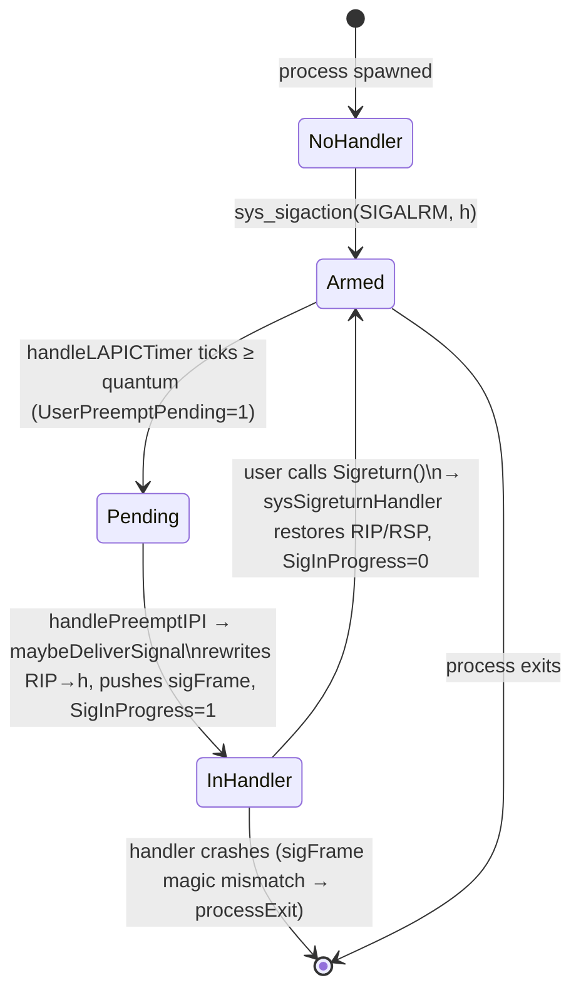

# Chapter 08 — System Calls

## Overview

This chapter walks through the gooos system-call mechanism end to end: the
software-interrupt gate, the kernel-side entry stub, the dispatcher, the per-
syscall handlers, and the user-side wrappers that funnel arguments into the
correct registers. It also covers the user-mode preemption protocol that
piggy-backs on the same interrupt-frame plumbing.

gooos picks the simplest possible gate: every Ring 3 → Ring 0 transition is a
single `int 0x80` software interrupt. There is no SYSCALL/SYSRET MSR (Model-
Specific Register) wiring, no fast path, and no SYSCALL_HANDLER target. One
ISR (Interrupt Service Routine), one Go-side dispatcher, one ABI (Application
Binary Interface). The trade-off is purely speed — `int 0x80` flushes the
whole pipeline and walks the IDT (Interrupt Descriptor Table) for every call —
and that is intentional for a hobby OS where readability dominates.

By the end of this chapter the reader should be able to:

- Read the saved `SyscallFrame` and locate every argument register.
- Trace a syscall from the user wrapper to the handler and back.
- Understand why `R10` carries the fourth argument instead of `RCX`.
- Explain how the SIGALRM rewrite turns a kernel timer tick into user-mode
  cooperative scheduling.

## Prerequisites

- Chapter 03 (Boot and Init) — IDT setup, GDT (Global Descriptor Table)
  selectors `0x1B`/`0x23` for the user code/data segments.
- Chapter 05 (Kernel Thread Runtime) — `kschedYield`, `kschedTimedPark`,
  `KEvent.Wait`/`Signal`.
- Chapter 06 (SMP and Preemption) — the BSP (Bootstrap Processor) LAPIC
  (Local Advanced Programmable Interrupt Controller) timer, IPIs (Inter-
  Processor Interrupts), preempt vector `0xFB`.
- Chapter 07 (Processes and Userspace) — `Process` struct, `procByPoolSlot`,
  `currentProc()`, `ring3WrapperKT`, the per-CPU pool slot index.
- Conceptual familiarity with software interrupts, privilege-level transitions,
  and IRET (Interrupt Return — `iretq` in 64-bit mode).

## The big picture

Userspace issues `int 0x80`. The CPU consults the IDT, finds the gate for
vector 0x80 (DPL — Descriptor Privilege Level — set to 3 so Ring 3 can fire
it), pushes a hardware frame, and jumps to `isr128` in `src/isr.S`. From there
every interrupt path looks identical, regardless of vector:

```
isr128 → push dummy errcode + vector → jmp isr_common → save 15 GPRs (General-
Purpose Registers) → call go_interrupt_handler(0x80, 0, framePtr) →
syscallDispatch(frame) → handler reads frame.RAX → handler runs → handler
writes return into frame.RAX → returns → isr_common pops GPRs → addq $16,%rsp
→ iretq → user code resumes after int 0x80
```

The Go side never touches the iretq frame directly — it only mutates the
saved register block (`SyscallFrame`). When `iretq` reloads the GPRs from the
stack, the syscall return value is in `RAX`. From the user program's point of
view, `int 0x80` looks exactly like a function call that clobbers `RAX`.

### End-to-end sequence

```mermaid
sequenceDiagram
    autonumber
    participant U as User code (Ring 3)
    participant CPU as CPU
    participant ISR as isr128 / isr_common (src/isr.S)
    participant GO as go_interrupt_handler (src/interrupt.go)
    participant DSP as syscallDispatch (src/userspace.go)
    participant H as Per-syscall handler

    U->>CPU: int 0x80 (RAX=nr, RDI/RSI/RDX/R10/R8/R9=args)
    CPU->>ISR: hardware push SS, RSP, RFLAGS, CS, RIP; vector 0x80 IDT entry
    ISR->>ISR: pushq $0 (dummy err); pushq $0x80 (vec); jmp isr_common
    ISR->>ISR: pushq RAX..R15 (15 GPRs)
    ISR->>ISR: incl %gs:4 (irq depth); incl %gs:44 (syscall depth)
    ISR->>GO: rdi=0x80, rsi=0, rdx=&frame; call go_interrupt_handler
    GO->>DSP: syscallDispatch((*SyscallFrame)(framePtr))
    DSP->>H: switch frame.RAX → sysFooHandler(frame)
    H->>H: read frame.RDI/RSI/RDX/R10/R8/R9; do work
    H->>H: frame.RAX = result (or sysFail(err))
    H-->>DSP: return
    DSP-->>GO: return
    GO-->>ISR: return
    ISR->>ISR: decl %gs:44; decl %gs:4
    ISR->>ISR: pop R15..RAX; addq $16,%rsp
    ISR->>CPU: iretq
    CPU->>U: pop RIP, CS, RFLAGS, RSP, SS — Ring 3 resumes after int 0x80
```

The number on each arrow corresponds to a discrete machine event. Steps 1, 2,
and the final `iretq` are CPU work; steps 3–5 are pure assembly bookkeeping;
step 6 is the only Go entry point; the rest is per-handler logic.

## The `SyscallFrame` struct

`SyscallFrame` (`src/userspace.go:19`) mirrors what `isr_common` pushes onto
the kernel stack. It is a strict struct overlay: the Go field offsets must
match the assembly push order exactly, otherwise the dispatcher would read the
wrong register as the syscall number.

| Field      | Offset | Source of value                      |
| ---------- | -----: | ------------------------------------ |
| R15        |      0 | pushed last by `isr_common`          |
| R14        |      8 | `pushq %r14`                         |
| R13        |     16 | `pushq %r13`                         |
| R12        |     24 | `pushq %r12`                         |
| R11        |     32 | `pushq %r11`                         |
| R10        |     40 | `pushq %r10` — 4th syscall arg       |
| R9         |     48 | `pushq %r9`  — 6th syscall arg       |
| R8         |     56 | `pushq %r8`  — 5th syscall arg       |
| RBP        |     64 | `pushq %rbp`                         |
| RDI        |     72 | `pushq %rdi` — 1st syscall arg       |
| RSI        |     80 | `pushq %rsi` — 2nd syscall arg       |
| RDX        |     88 | `pushq %rdx` — 3rd syscall arg       |
| RCX        |     96 | `pushq %rcx`                         |
| RBX        |    104 | `pushq %rbx`                         |
| RAX        |    112 | `pushq %rax` — syscall number / ret  |
| Vector     |    120 | `pushq $0x80` (the stub)             |
| ErrorCode  |    128 | `pushq $0`     (dummy for `int 0x80`)|
| RIP        |    136 | pushed by the CPU                    |
| CS         |    144 | pushed by the CPU                    |
| RFLAGS     |    152 | pushed by the CPU                    |
| RSP        |    160 | pushed by the CPU                    |
| SS         |    168 | pushed by the CPU                    |

A handler that wants the user-side `RIP` (for example, the SIGALRM rewrite,
covered later) reads `frame.RIP`. A handler that wants to deliver a
return value writes `frame.RAX`. Mutations to `frame.RIP` and `frame.RSP`
take effect when `isr_common` runs `iretq` — that is exactly how the
SIGALRM injection works.

## Calling convention

There are two ABIs in play, and they only partially overlap. Reading the user
wrapper assembly (`user/rt0.S`) makes them concrete:

| Position | Go caller (System V, into `syscallN`) | Kernel syscall ABI (after shuffle) |
| -------- | ------------------------------------- | ---------------------------------- |
| number   | `RDI` (1st Go arg = `nr`)             | `RAX`                              |
| arg 1    | `RSI`                                 | `RDI`                              |
| arg 2    | `RDX`                                 | `RSI`                              |
| arg 3    | `RCX`                                 | `RDX`                              |
| arg 4    | `R8`                                  | `R10`                              |
| arg 5    | `R9`                                  | `R8`                               |
| arg 6    | (stack)                               | `R9`                               |
| return   | —                                     | `RAX`                              |

The crucial detail is **arg 4 lives in `R10`, not `RCX`**. This is the same
choice Linux made for its `syscall`-instruction ABI: the `syscall` opcode
clobbers `RCX` (it stashes the return RIP there), so kernels picked `R10` as
the substitute. gooos uses `int 0x80`, which does *not* clobber `RCX`, but it
keeps the same convention so the wrapper code matches what every other x86_64
kernel does and so a future migration to `syscall`/`SYSRET` would not need to
re-spec the user side.

`syscall4` in `user/rt0.S:62-69` is the canonical example:

```
movq    %rdi, %rax       /* nr */
movq    %rsi, %rdi       /* a1 */
movq    %rdx, %rsi       /* a2 */
movq    %rcx, %rdx       /* a3 */
movq    %r8,  %r10       /* a4 */
int     $0x80
ret
```

Failure encoding follows POSIX-ish "negative errno" form. `sysFail`
(`src/fd.go:353`) returns `^uintptr(uint64(e)) + 1` — the two's-complement
negation of an `fdErr` enum. A user wrapper detects failure with
`if int64(r) < 0`. Some early handlers still return the magic value
`0xFFFFFFFFFFFFFFFF` directly (this is just `-1` cast to `uintptr`); the user
side checks for it explicitly.

## Full syscall number table

The numbers below are the exact constants in `src/userspace.go:47-93` (the
user-side mirror in `user/gooos/syscall.go`, `net.go`, `ps.go`, `signal.go`
must match byte-for-byte).

| #   | Constant         | Category              | Blocking?  | Brief                                                |
| --- | ---------------- | --------------------- | ---------- | ---------------------------------------------------- |
| 0   | `sysExit`        | Process control       | terminates | exit(code)                                           |
| 1   | `sysWrite`       | Pure data / I/O       | non-block  | write(fd, buf, len)                                  |
| 2   | `sysRead`        | Blocking I/O          | blocks     | read(fd, buf, max) — stdin blocks                    |
| 3   | `sysExec`        | Process control       | blocks     | exec(path, args) — waits for child exit              |
| 4   | `sysFsRead`      | Blocking I/O          | blocks     | fs_read(path, out, max) via fsTask                   |
| 5   | `sysFsWrite`     | Blocking I/O          | blocks     | fs_write(path, data) via fsTask                      |
| 6   | `sysFsList`      | Blocking I/O          | blocks     | fs_list(buf, max)                                    |
| 7   | `sysYield`       | Scheduler             | parks then resumes | yield()                                      |
| 8   | `sysSleep`       | Blocking I/O          | blocks     | sleep(ticks) at 100 Hz                               |
| 9   | `sysGetargs`     | Pure data             | non-block  | getargs(buf, max)                                    |
| 10  | `sysSbrk`        | Memory                | non-block  | sbrk(incr)                                           |
| 11  | `sysVgaClear`    | Pure data             | non-block  | vga_clear()                                          |
| 12  | `sysOpen`        | File-descriptor       | non-block  | open(path, mode)                                     |
| 13  | `sysClose`       | File-descriptor       | non-block  | close(fd)                                            |
| 14  | `sysDup2`        | File-descriptor       | non-block  | dup2(oldfd, newfd)                                   |
| 15  | `sysSpawn`       | Process control       | non-block  | spawn(path, args) — returns child pid                |
| 16  | `sysWait`        | Process control       | blocks     | wait(pid) — returns exit code                        |
| 17  | `sysPipe`        | File-descriptor       | non-block  | pipe(&fds[2])                                        |
| 18  | `sysReadKey`     | Blocking I/O          | blocks     | read_key(buf) — foreground only                      |
| 19  | `sysVgaWriteAt`  | Pure data             | non-block  | vga_write_at(row, col, ch, attr)                     |
| 20  | `sysVgaSetCursor`| Pure data             | non-block  | vga_set_cursor(row, col)                             |
| 21  | `sysGetcpuid`    | SMP introspection     | non-block  | getcpuid()                                           |
| 22  | `sysSocket`      | Network               | non-block  | socket(AF_INET, type, 0)                             |
| 23  | `sysBind`        | Network               | non-block  | bind(fd, port)                                       |
| 24  | `sysSendto`      | Network               | non-block  | UDP sendto(fd, buf, len, dstIP, dstPort)             |
| 25  | `sysRecvfrom`    | Blocking I/O          | blocks     | UDP recvfrom(fd, buf, max, info, timeout)            |
| 26  | `sysNetConfig`   | Network               | non-block  | net_config(op, val) multiplexer                      |
| 27  | `sysSendtoBcast` | Network               | non-block  | UDP broadcast sendto                                 |
| 28  | `sysListen`      | Network               | non-block  | TCP listen(fd, backlog)                              |
| 29  | `sysAccept`      | Blocking I/O          | blocks     | TCP accept(fd, info, timeout)                        |
| 30  | `sysConnect`     | Blocking I/O          | blocks     | TCP connect(fd, dstIP, dstPort, timeout)             |
| 31  | `sysTcpSend`     | Blocking I/O          | may block  | TCP send(fd, buf, len)                               |
| 32  | `sysTcpRecv`     | Blocking I/O          | blocks     | TCP recv(fd, buf, max, timeout)                      |
| 33  | `sysShutdown`    | Network               | non-block  | TCP shutdown(fd, how)                                |
| 34  | `sysWaitpid`     | Process control       | non-block  | waitpid(pid, WNOHANG, &status) — WNOHANG only        |
| 35  | `sysSigaction`   | Signals               | non-block  | sigaction(SIGALRM, handler, flags)                   |
| 36  | `sysSigreturn`   | Signals               | special    | sigreturn() — restores user RIP/RSP                  |
| 37  | `sysListprocs`   | PS                    | non-block  | listprocs(buf, n) — fills `ProcInfo[]`               |
| 38  | `sysShellReady`  | Boot gate             | non-block  | shell_ready() — enables preempt fanout               |

Total: **39 syscalls** (numbers 0 through 38, contiguous). The dispatch
`switch` in `syscallDispatch` (`src/userspace.go:103-186`) covers every one of
them; an unknown number falls through to `default:` and returns `0xFFFF...FF`
(treated as `-1` by user code).

## Three handler categories

Different handler shapes need different runtime cooperation. The three
categories below cover every entry in the table.

### Pure-data syscalls (never block)

These handlers read from `frame`, do bounded kernel-side work, write `RAX`,
and return. They never park the calling thread. Examples include `sysWrite`
(stdout fast path), `sysGetcpuid`, `sysGetargs`, `sysSbrk`, the VGA poke
syscalls, and most network-config muxer ops.

`sysGetcpuidHandler` (`src/userspace.go:630-632`) is the smallest possible
handler — three lines, one register read on the kernel side
(`cpuID()`), one write to `frame.RAX`. The user wrapper
`gooos.GetCpuID` just casts the result to `int`.

`sysSbrkHandler` (`src/userspace.go:500-535`) is more involved but still
non-blocking: it walks the per-process page table, calls `allocPage()` for
each new page in the requested range, and updates `proc.HeapBreak`. No
parking, no locks held across long sections.

### Blocking I/O syscalls (park the caller)

When a syscall cannot complete synchronously, the handler must park the
hosting kthread without dragging the rest of the kernel down. The pattern is:

1. Send a request to a server kthread (`fsSendRead`, `netRxLoop`, the
   `afterTicks` timer wheel, etc.) — the server signals a per-request
   `KEvent` when the work is done.
2. Wait via the appropriate park primitive: `KEvent.Wait()`, `<-channel`, or
   `kschedTimedPark(ticks)`.
3. Resume on wake-up; copy results out to user memory; write `RAX`; return.

`sysSleepHandler` (`src/userspace.go:460-477`) is the cleanest illustration.
The body is just:

```go
if ticks > 0 {
    if kschedRunning[cpuID()] != nil {
        kschedTimedPark(ticks)
    } else {
        <-afterTicks(ticks)
    }
}
frame.RAX = 0
```

Under the production `scheduler=none` mode every Ring 3 process is hosted by
a kthread (`kschedRunning[cpuID()] != nil`), so the syscall handler parks via
`kschedTimedPark` — no goroutine-side primitives, no internal/task hazards.
The legacy goroutine path (`<-afterTicks(d)`) survives only for any
unconverted caller; today there are none.

`sysYieldHandler` (`src/userspace.go:434-446`) follows the same shape but
without a wake-up condition: `kschedYield()` returns immediately if no other
kthread is ready, otherwise hands the AP to a sibling.

`sysFsReadHandler` (`src/userspace.go:346-373`) is the request/response
variant. It sends a request via `fsSendRead`, which posts to the fsTask
mailbox and parks the caller on a `KEvent`. fsTask runs on its own kthread,
performs the read against the in-memory FS, signals the event, and the syscall
handler resumes — copies bytes out, writes `RAX`, returns.

### Process control + signals

These handlers manipulate the process table and may signal waiters. They are
mostly non-blocking from the caller's view (`sysSpawn`, `sysWaitpid`,
`sysSigaction`, `sysSigreturn`) but `sysWait` blocks on a child's `KEvent`.

`sysExitHandler` (`src/userspace.go:190-194`) calls `processExit`, which
records the exit code, signals the parent's wait event, and never returns to
user space.

## Worked example: `sysSpawnHandler`

`sysSpawnHandler` (`src/userspace.go:754-786`) is a representative
process-control handler. Walking through it shows how user pointers are
copied, how the child process is created, and how the result returns to the
caller.

1. `currentProc()` finds the parent. The lookup is **not** `procByTask`; it
   is `procByPoolSlot[perCPUBlocks[cpuID()].CurrentPoolIdx]`
   (`src/process.go:202-217`). Under `scheduler=none` the per-CPU pool slot is
   the only authoritative source — `procByTask` is a goroutine-era fallback.
2. Read `frame.RSI` for `pathLen`, clamp to 256, then byte-copy from
   `frame.RDI` into a kernel scratch buffer through the user PML4. The PML4
   is the same as the running CR3 because the int-0x80 ISR runs on the
   calling proc's PML4 with the kernel half identity-mapped via `PDP[0]`.
3. Repeat for `args` from `frame.RDX` / `frame.R10`.
4. Call `elfSpawn(filename, args, parent)` — this returns a fresh `*Process`
   parked at its entry point. `elfSpawn` does not run the child; it allocates
   a pool slot and starts a `ring3WrapperKT` kthread for it.
5. On success, `frame.RAX = uintptr(child.pid)` and the parent returns to
   user space *before* the child has run any user code. (Compare with
   `sysExec`, which blocks on `child.exitCh` and replaces the parent's view.)

The user wrapper that calls this handler is `gooos.Spawn` in
`user/gooos/proc.go:73-92`:

```go
r := syscall4(sysSpawn,
    uintptr(unsafe.Pointer(&pathBytes[0])),
    uintptr(len(pathBytes)),
    argPtr,
    argLen,
)
if int64(r) < 0 {
    return -1, int(int64(r))
}
return int(r), 0
```

The Go ABI delivers `(sysSpawn, &path, pathLen, argPtr, argLen)` in
`(RDI, RSI, RDX, RCX, R8)`. `syscall4` shuffles them into `(RAX, RDI, RSI,
RDX, R10)` and fires `int 0x80`. The kernel's `syscallDispatch` reads
`RAX = 15` and calls `sysSpawnHandler`.

## Park / resume integration

The syscall ISR runs on the kthread's own kernel stack, not on a TinyGo
goroutine stack. That is why blocking handlers must use the kthread parking
primitives (`kschedYield`, `kschedTimedPark`, `KEvent.Wait`) rather than Go-
level `runtime.Gosched()` or channel receives — `internal/task` operations
from a kthread context would push garbage onto the goroutine runqueue and
page-fault.

```mermaid
sequenceDiagram
    autonumber
    participant U as User process (Ring 3)
    participant H as Syscall handler (kernel)
    participant KS as kthread scheduler
    participant SRV as Server kthread (e.g. fsTask)

    U->>H: int 0x80; sysFsRead
    H->>SRV: fsSendRead(name) — post request, get KEvent
    H->>KS: KEvent.Wait() — kthread parks
    Note over KS: AP picks another runnable kthread
    SRV->>SRV: read in-memory file
    SRV->>KS: KEvent.Signal() — wake parked kthread
    KS->>H: park primitive returns
    H->>H: copy bytes to user buffer; frame.RAX = n
    H-->>U: iretq — RAX returned in user RAX
```

A waking-up handler resumes *after* the park call, on the same kernel stack,
with `frame` still pointing at the same saved register block — so the rest of
the handler runs unmodified, and the final `iretq` delivers the return value
correctly.

## SIGALRM and user-mode preemption

Cooperative user-mode tasks need a periodic kick to prevent a tight loop from
monopolising the CPU. gooos provides this via a kernel-delivered SIGALRM.
There is no real signal infrastructure — only the one signal, only the one
delivery path, and only the one teardown syscall. The whole mechanism lives
in `src/user_signal.go`.

### Setup

A user program installs its handler:

```go
gooos.Sigaction(gooos.SIGALRM, myHandler)
```

`sysSigactionHandler` (`src/user_signal.go:77-100`) records
`proc.SigAlrmHandler = handler`, resets the quantum counter, and arms the
default 100 ms quantum (10 BSP ticks at 100 Hz).

### Tick accounting

On each BSP LAPIC timer tick, `handleLAPICTimer` calls
`maybeSignalUserPreempt(cpuIdx)` (`src/user_signal.go:220-238`). This
identifies the running user process via `procByPoolIdx(perCPUBlocks
[cpuIdx].CurrentPoolIdx)`, increments its `UserQuantumCounter`, and when the
counter hits `UserQuantumTicks` it sets `proc.UserPreemptPending = 1`.
Hardware IRQs are routed BSP-only in gooos, so AP timer ticks do not perturb
this state machine.

### Delivery: rewrite the iretq frame

When the next preempt IPI lands on the AP that is hosting the marked
process, `handlePreemptIPI` (Chapter 06) calls `maybeDeliverSignal(frame)`
(`src/user_signal.go:266-334`) if the interrupted context is Ring 3. The
function pushes a 13-word `sigFrame` onto the **user** stack (writing through
`activePML4ForProc(proc)` byte-by-byte), then rewrites the saved iretq
frame's `RIP` to `proc.SigAlrmHandler` and `RSP` to the new top-of-user-stack.

When `iretq` runs, the user resumes *not* at the original RIP, but inside its
SIGALRM handler — with all caller-saved GPRs still holding values consistent
with the original interruption (those values were copied into `sigFrame`
first). The handler executes, possibly calling `gooos.Yield()` to let
something else run.

### Restore: `sysSigreturn`

The handler must end with `gooos.Sigreturn()`, which fires
`sysSigreturnHandler` (`src/user_signal.go:112-167`). The handler does **not**
read from the live user `RSP` (the Go-coded handler has pushed locals on top
of the sigFrame during execution) — it reads the kernel-tracked
`proc.SigSavedRSP`, validates the magic word `0xDEADBEEF`, restores
RIP/RSP/RFLAGS plus the caller-saved GPRs into `frame`, and returns.

When `iretq` runs, the user resumes at the *original* RIP, with the original
RSP, exactly as if the SIGALRM never happened.

### State diagram



A few invariants are easy to miss:

- `SigInProgress` is the re-entrancy guard. While set,
  `maybeDeliverSignal` returns `false` even if `UserPreemptPending` is set
  again — there cannot be a nested SIGALRM frame.
- `proc.SigSavedRSP` is the only pointer we trust at sigreturn time. The
  user handler is allowed to run arbitrary Go code, including pushing locals,
  so the live RSP is unrelated to the sigFrame location.
- Hardware IRQs land on the BSP only, but the preempt IPI fans out to APs.
  The frame rewrite therefore happens on the AP's kernel stack, against that
  AP's host kthread — `procByPoolSlot[CurrentPoolIdx]` is the source of
  truth; `procByTask` is not.

## Why `int 0x80` instead of `syscall`

Three reasons, in order of importance:

1. **Zero MSR setup.** A `syscall`-based path needs `IA32_STAR`,
   `IA32_LSTAR`, `IA32_FMASK`, and a custom kernel entry that handles the
   GS-base swap manually. `int 0x80` reuses the existing IDT entry and the
   same `isr_common` stub used by exceptions and IRQs.
2. **One code path.** Every kernel entry — exceptions, hardware IRQs, IPIs,
   syscalls — flows through `isr_common`. The depth counters at `%gs:4`
   (interrupt depth) and `%gs:44` (syscall/preempt depth) are bumped by the
   same prologue, so `runtime.interrupt.In()` and `task.Pause()` see a
   consistent view regardless of why we entered the kernel.
3. **Trivially debuggable.** A QEMU `info registers` after `int 0x80`
   shows the user-side pre-int RIP on the kernel stack at a fixed offset,
   making postmortem analysis of any kernel hang easy.

A future move to `syscall`/`SYSRET` is not architecturally blocked — the
register-shuffle convention is already SYSCALL-shaped (R10 for arg 4, RAX for
nr/return) — but is out of scope for the hobby OS goals.

## User wrapper layer

The user-side SDK (Software Development Kit) lives under `user/gooos/` and is
imported as the Go package `gooos`. There are two conceptual layers:

| Layer            | File                  | Contents                                              |
| ---------------- | --------------------- | ----------------------------------------------------- |
| Raw stubs        | `user/rt0.S`          | `_start`, `syscall0`–`syscall5`, libc-shim stubs      |
| Generic linkage  | `user/gooos/syscall.go` | `//go:linkname` declarations + syscall numbers     |
| Typed wrappers   | `user/gooos/io.go`    | stdin/stdout/Open/Close/Dup2/Pipe/VgaClear            |
| ↳                | `user/gooos/proc.go`  | Exit/Exec/Spawn/Wait/Waitpid/Yield/Sleep/GetCpuID     |
| ↳                | `user/gooos/fs.go`    | ReadFile/WriteFile/ListDir                            |
| ↳                | `user/gooos/net.go`   | Socket/Bind/UDP*/TCP*/network config                  |
| ↳                | `user/gooos/signal.go`| Sigaction/Sigreturn                                   |
| ↳                | `user/gooos/ps.go`    | Listprocs                                             |

The raw stubs in `user/rt0.S` exist because TinyGo cannot emit `int $0x80`
inline; we need hand-written assembly that does the register shuffle and
issues the trap. The Go side declares them via `//go:linkname` so calls cost
exactly one `call`/`ret` and one `int`.

### End-to-end: `gooos.Spawn`

The full path for `gooos.Spawn("/bin/ls", "-l")`:

```
gooos.Spawn (user/gooos/proc.go:73)
   │  Go ABI: RDI=path, RSI=pathLen, RDX=argPtr, RCX=argLen
   ▼
syscall4 (user/rt0.S:62)
   │  Shuffle: RAX=15, RDI=path, RSI=pathLen, RDX=argPtr, R10=argLen
   │  int $0x80
   ▼
isr128 → isr_common (src/isr.S)
   │  Pushes 15 GPRs, calls go_interrupt_handler(0x80, 0, &frame)
   ▼
syscallDispatch (src/userspace.go:103)
   │  switch frame.RAX → case sysSpawn (=15)
   ▼
sysSpawnHandler (src/userspace.go:754)
   │  Reads path/args from user memory; calls elfSpawn; frame.RAX = childPid
   ▼
isr_common iretq → user resumes after int 0x80, RAX = childPid
   ▼
syscall4 returns RAX in Go's RAX → Spawn returns (int(r), 0)
```

Every other typed wrapper follows the same template — only the syscall number,
the argument unpacking, and the failure encoding change. The
`syscall0..syscall5` family covers everything in the kernel ABI today; no
syscall in the table needs more than five non-number arguments.

## Summary

- `int 0x80` is the only Ring 3 → Ring 0 gate. There is no `syscall` MSR
  path. Every entry funnels through `isr_common`.
- The kernel sees a `SyscallFrame` overlay at the saved register block
  (`src/userspace.go:19`). Reading `frame.RAX` selects the syscall; writing
  `frame.RAX` returns. Mutating `frame.RIP`/`frame.RSP` redirects `iretq`,
  which is exactly what SIGALRM delivery exploits.
- The user ABI uses `RAX = nr; RDI/RSI/RDX/R10/R8/R9 = a1..a6`. R10 (not RCX)
  carries arg 4 to match the standard SYSCALL convention.
- The kernel offers 39 syscalls (#0–#38), spanning data, file I/O, sockets,
  process control, signals, and PS.
- Blocking handlers park via `kschedYield`, `kschedTimedPark`, or
  `KEvent.Wait`; pure-data handlers complete in line; process-control
  handlers manipulate `procByPoolSlot` and the process table directly.
- SIGALRM / `sysSigreturn` give Ring 3 a 100 Hz preemption tick by
  rewriting the iretq frame on the kernel stack of the AP currently hosting
  the user kthread.

## Cross-references

- `./05_kernel_thread_runtime.md` — `kschedYield`, `kschedTimedPark`,
  the kthread runqueue.
- `./06_smp_and_preemption.md` — BSP LAPIC timer, preempt IPI vector
  `0xFB`, the AP fan-out path that calls `maybeDeliverSignal`.
- `./07_processes_and_userspace.md` — `Process` struct, `procByPoolSlot`
  vs `procByTask`, `ring3WrapperKT`, jumpToRing3.
- `./09_synchronization.md` — `KEvent`, `Spinlock`, the building blocks of
  every blocking syscall.
- `./10_drivers_filesystem_network.md` — fsTask, network rx/tx kthreads,
  the request/response handshake that backs `sysFsRead`, `sysRecvfrom`,
  `sysAccept`, `sysTcpRecv`.
