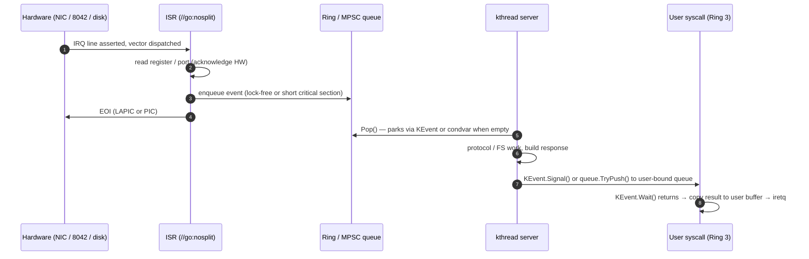
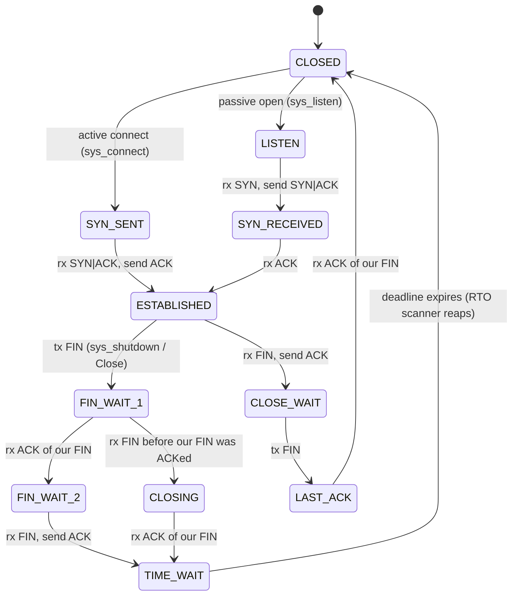
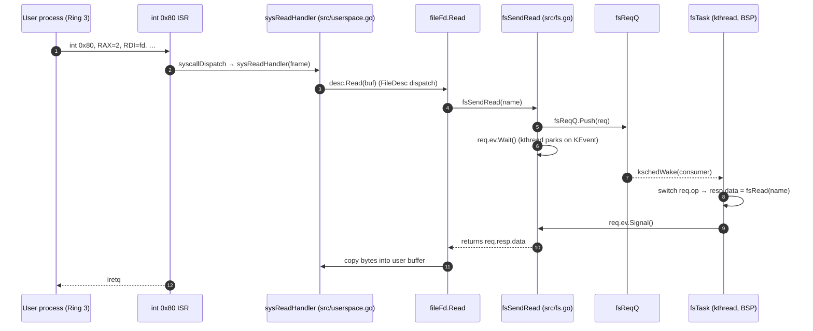

# Chapter 10 — Drivers, Filesystem, and Networking

## Overview

Three of the largest subsystems in gooos — the keyboard driver, the in-memory
filesystem, and the TCP/IP stack — look like very different beasts on the
surface. One reads scancodes off a port, one juggles `[256 KiB]byte` arrays,
and one walks PCI configuration space and parses TCP segments. Yet at the
plumbing level they share one structural pattern: an Interrupt Service Routine
(ISR — the brief Ring-0 handler the CPU runs when an Interrupt Request line
fires) drops work into a queue, a dedicated kernel thread (`fsTask`,
`netRxLoop`, `tcpRTOScanner`, `tcpEchoServer`, `udpEchoServer`) consumes that
queue at its leisure, and any user process waiting for the result blocks on a
KEvent (kernel event — gooos's edge-triggered completion primitive) until the
kthread finishes and signals it.

This chapter spells out that recurring shape, then walks each subsystem in
turn — PS/2 (Personal System/2 keyboard interface) keyboard, PCI (Peripheral
Component Interconnect) bus and the e1000 NIC (Network Interface Controller),
the ARP/IPv4/ICMP/UDP/TCP stack, and the flat-directory filesystem — pointing
at exactly where each piece of the pattern lives in the source tree. Two
worked examples at the end stitch the picture back together: a UDP `recvfrom`
and a regular-file `read`, both showing the int 0x80 → handler → queue →
server → KEvent → user-resume cycle end to end.

By the end of this chapter the reader should be able to:

- Recognise the same "IRQ → enqueue → kthread server → KEvent wake" pattern
  in any I/O subsystem under `src/`.
- Trace a packet from its arrival at the e1000 NIC to its delivery to a
  user-space `recvfrom` buffer.
- Explain why ISRs in gooos are intentionally minimal and why all hardware
  IRQs land on the BSP (Bootstrap Processor) in the current build.
- Describe how the per-process FD (File Descriptor) table abstracts over
  console, regular file, pipe end, and socket using one Go interface.

## Prerequisites

- Chapter 03 (Boot and Init) — IDT installation, where ISRs are registered,
  PIC vs IOAPIC selection.
- Chapter 04 (Memory Management) — `allocPagesContig`, the boot identity map,
  page flags including `pagePCD`/`pagePWT` for MMIO (Memory-Mapped I/O).
- Chapter 05 (Kernel Thread Runtime) — `kschedSpawnAt`, `kschedTimedPark`,
  `KEvent.Wait`/`Signal`, the bounded MPSC (Multi-Producer Single-Consumer)
  `fsReqQueue` / `udpDgramQueue`.
- Chapter 06 (SMP and Preemption) — the BSP-only IRQ delivery limitation in
  the current build.
- Chapter 07 (Processes and Userspace) — `Process.fds`, `currentProc()`,
  fd inheritance on spawn.
- Chapter 08 (System Calls) — the `int 0x80` gate, `SyscallFrame`, the
  syscall numbering scheme.
- Conceptual familiarity with PCI configuration space, MMIO, descriptor
  rings, ARP, IPv4 datagrams, the TCP three-way handshake.

## Section A — The shared "kthread-server" I/O pattern

### A.1  The recurring shape

Every time gooos has to coordinate "hardware notification arrives" with
"user code is blocked in a syscall waiting on it," the same five-stage
machine does the work:



The ISR side stays microscopic on purpose: every line of code added there is
code that runs with IRQs masked, on whatever stack happened to be active when
the line fired, and with no permission to allocate or take a sleeping lock.
All "real work" (parsing an Ethernet frame, walking the file table, computing
a checksum) gets shoved down into the kthread, which runs with normal
privileges, can park politely, and never blocks the CPU from servicing the
next IRQ.

### A.2  Why this split

Three properties fall out for free:

1. **Bounded interrupt latency.** No matter how many connections are queued
   or how big the file is, the ISR runtime is dominated by one MMIO read and
   one queue push. A worst-case 8 KiB receive ring is drained from the
   kthread, not from the ISR.
2. **Allocation is allowed where it makes sense.** The Ethernet dispatcher,
   the IPv4 parser, and the TCP state machine all `make([]byte, …)` freely
   because they run from `netRxLoop`, never from ISR context. Allocation in
   ISR context would crash because the GC bitmap walk would touch memory the
   ISR has no right to touch.
3. **User syscalls become cleanly blocking.** A process calling
   `sys_recvfrom` does `q.Pop()`, which parks the kthread that hosts the
   Ring-3 process onto the queue's wait list. The timer interrupt and the
   RX (Receive) ISR are both free to fire while that kthread sleeps —
   neither cares it is blocked, because they only enqueue work.

### A.3  All IRQs land on BSP today

The IOAPIC redirection table is programmed to deliver every hardware vector
to logical destination 0 (CPU 0 = BSP). APs (Application Processors) never
see an IRQ from the keyboard, the e1000, the LAPIC timer, or the PIT. The
consumer kthreads (`fsTask`, `netRxLoop`, `udpEchoServer`, `tcpEchoServer`,
`tcpRTOScanner`) are all spawned with `kschedSpawnAt(name, fn, 0)` — pinned
to CPU 0 — so the producer side and the consumer side run on the same core
and the standard cross-CPU wake hazards (covered in Chapter 06) simply do
not arise. A future chapter will revisit the IOAPIC routing once the cross-
CPU wake-IPI machinery is hardened; for now, "everything on BSP" is a
deliberate simplification, not an oversight.

The next four sections walk each subsystem and point at where each stage of
the pattern lives.

## Section B — PS/2 keyboard

### B.1  Hardware

The 8042 controller exposes two I/O ports:

| Port  | Direction | Purpose                               |
|-------|-----------|---------------------------------------|
| 0x60  | R/W       | Data — scancode bytes from the keyboard |
| 0x64  | R         | Status — bit 0 set means data ready  |
| 0x64  | W         | Command — config writes (unused here) |

When the user presses or releases a key, the controller raises IRQ1
(legacy PIC vector 33 once `32 + irq` translation is applied). The handler
reads exactly one byte from port 0x60 and exits.

`src/keyboard.go:180` registers `handleKeyboard(vector uint64)` as the IRQ1
ISR. The body is deliberately tiny:

- `inb(kbdDataPort)` to fetch the scancode (also acknowledges the 8042).
- `lapicSendEOI()` or `picSendEOI(1)` to acknowledge the controller.
- `processKeyboardScancode(scancode)` to do the rest in nosplit code.

`processKeyboardScancode` (`src/keyboard.go:102`) tracks shift/ctrl/alt
state, applies the scancode→ASCII tables, packs a 32-bit event word, and
calls `keyboardIRQSend`.

### B.2  The lock-free 64-slot ring

The producer/consumer queue lives in `src/keyboard_irq.go`:

```
gooosKbdRing[64]   — power-of-two capacity (kbdRingSize = 64)
gooosKbdHead       — written by ISR, monotonically increases
gooosKbdTail       — written by the consumer, monotonically increases
```

The producer writes `gooosKbdRing[h & 63] = event` then bumps `head`. The
consumer checks `tail == head` for empty, reads, then bumps `tail`. No lock
is taken on either side. Why this is safe:

- One producer (the ISR) and one consumer (whoever is reading the keyboard).
- x86-TSO (Total Store Order) gives plain MOV the four orderings required by
  the algorithm (see the file's header comment for the proof).
- Only BSP runs the ISR, so there is no second producer.

`keyboardIRQSend` is marked `//go:nosplit` so TinyGo will not insert a
stack-growth check that could split the ISR mid-call. If the ring is full
(64 unread events) the new event is dropped and `kbdRingDrops++` increments;
this counter is exported through `netDiag` for visibility.

### B.3  Blocking read path

`consoleStdin` (`src/fd.go:52`) is the FileDesc backing user fd 0. Its
`Read` method calls `readKeyboardLine`, which loops calling
`keyboardReadEventBlocking()` (`src/keyboard_irq.go:91`) one event at a time,
echoing characters, and stopping on Enter. The "blocking" part of
`keyboardReadEventBlocking`:

- Fast path: `keyboardIRQRecv()` — non-blocking ring poll. Returns the event
  if any.
- BSP slow path: `pollKeyboardFallback` is a safety net for boots where
  IRQ1 never fires (`kbdIRQSeen == 0`). After that, if the caller is a
  kthread (the post-M4.1 normal case) it calls `kschedTimedPark(1)` —
  parks for one PIT (Programmable Interval Timer) tick (10 ms) — and then
  re-checks. Otherwise it falls back to `sti(); hlt()` so an incoming IRQ
  wakes the CPU.
- AP slow path: identical to BSP but skips `pollKeyboardFallback` (APs
  cannot poll port 0x60 meaningfully because they will never see the IRQ).

The "ring polled by a sleeper" form is the simplest possible instance of
the Section A pattern: the queue is the ring itself, the kthread server is
the user's own kthread (no separate worker exists), and the wake mechanism
is the next IRQ unlocking `hlt()`.

## Section C — PCI bus and the e1000 NIC

### C.1  PCI scan via legacy I/O ports

`src/pci.go` enumerates the bus using mechanism #1: write a 32-bit address
word to port 0xCF8, read or write the corresponding data dword at port
0xCFC. `pciInit()` walks every bus 0–255, every device 0–31, every
function 0–7, looking for vendor 0x8086, device 0x100E (Intel 82540EM —
QEMU's default e1000 model). On the first hit it:

1. Records bus/device/function, BAR0 (Base Address Register 0), and the
   IRQ Line byte.
2. Verifies BAR0 bit 0 is clear (memory-mapped, not I/O space).
3. Sets `pciCmdMemSpace | pciCmdBusMaster` in the Command register so the
   NIC can both decode MMIO accesses and act as a DMA (Direct Memory
   Access) bus master.

The result is stashed in package-level globals `e1000PCI` and `e1000Found`
(`src/pci.go:66-69`). A real OS would walk the capability list,
parse multi-function quirks, and build a topology tree; gooos parks at
"first hit wins" because there is exactly one e1000 in the QEMU machine.

### C.2  BAR0 mapping

`e1000MapMMIO` (`src/e1000.go:216`) maps the 128 KiB BAR0 region into
virtual address space using `mapPage(virt, phys, flags)` for each 4 KiB
page, with flags `pagePresent | pageWrite | pagePCD | pagePWT`. The PCD
(Page Cache Disable) and PWT (Page Write-Through) bits keep the CPU from
caching MMIO reads — essential, because device registers are not memory
and must be observed exactly once per access.

The mapping is identity (virtual = physical), so `e1000Base` is just
the BAR0 base address. Two helpers expose typed access:

```go
//go:nosplit
func e1000Read(reg uint32) uint32
//go:nosplit
func e1000Write(reg uint32, val uint32)
```

(`src/e1000.go:140-148`). Each one is a single `mov` to or from
`*(*uint32)(unsafe.Pointer(e1000Base + uintptr(reg)))`.

### C.3  Descriptor rings

The e1000 splits RX and TX (Transmit) into two ring buffers in main memory:

| Ring | Entries | Bytes per descriptor | Buffer size       | Total ring | Total buffer pool |
|------|---------|----------------------|-------------------|------------|-------------------|
| RX   | 64      | 16                   | 2048              | 1024 B     | 128 KiB           |
| TX   | 32      | 16                   | 2048              | 512 B      | 64 KiB            |

(`src/e1000.go:101-108`). The kernel allocates these with
`allocPagesContig(N)` (Chapter 04), asserts they live below the 1 GiB
identity map limit so they can be used as DMA targets via their physical
address, and programs the `RDBAL/RDBAH/RDLEN/RDH/RDT` (RX) and
`TDBAL/TDBAH/TDLEN/TDH/TDT` (TX) registers to point at them.

ASCII layout of one 16-byte RX descriptor as the e1000 hardware writes it:

```
 byte:  0   1   2   3   4   5   6   7   8   9  10  11  12  13  14  15
       +---+---+---+---+---+---+---+---+---+---+---+---+---+---+---+---+
       | buffer addr (low 32)          | buffer addr (high 32)         |
       +---+---+---+---+---+---+---+---+---+---+---+---+---+---+---+---+
       | length        | checksum      |sta|err| special               |
       +---+---+---+---+---+---+---+---+---+---+---+---+---+---+---+---+
                                       ^
                                       bit 0 of `sta` is DD ("Descriptor
                                       Done") — set by the NIC when the
                                       buffer holds a freshly-arrived
                                       packet.
```

The TX descriptor uses the same 16-byte slot but interprets bytes 8–15 as
length / CSO / CMD / STA / CSS / special. `txDescSetCMD` flips `EOP`
(End Of Packet), `IFCS` (Insert FCS — Frame Check Sequence), and `RS`
(Report Status) so the NIC sets DD on completion (`src/e1000.go:191-195`).

The driver tracks software shadows of the head/tail pointers
(`rxTail`, `txTail`) so each call only advances the hardware tail by one
slot via a single MMIO write.

### C.4  e1000 ISR and the rxReadyFlag

The interrupt handler (`src/e1000_irq.go:42`) is even shorter than the
keyboard one. On entry it:

1. Increments a diagnostic counter `e1000IRQCount`.
2. Reads the ICR (Interrupt Cause Read) register. ICR is clear-on-read,
   so this single read both tells the handler *what* fired and acknowledges
   every cause to the device.
3. Sets `rxReadyFlag = 1` unconditionally — `netRxLoop` will inspect this
   the next time around.
4. Logs `link up` / `link down` if the LSC (Link Status Change) bit was set.
5. Sends EOI (End Of Interrupt) to the LAPIC (or PIC if the IOAPIC isn't
   active).

Note what the ISR does *not* do: it does not drain the RX ring, it does not
allocate a netbuf, it does not parse a frame. All of that is done by the
poll loop in `drainRxRing` from `netRxLoop`. The ISR exists almost purely
to wake the CPU — `rxReadyFlag` is a hint, not the canonical signal source
(the loop drains whether or not it's set, on every iteration).

### C.5  The netbuf pool

`src/netbuf.go` reserves 128 × 2048 byte buffers from the page allocator
into one physically contiguous 256 KiB region. A 128-bit availability
bitmap (`netBufFree [2]uint64`) tracks which slots are free; `netBufAlloc`
uses the `ctz64` (count trailing zeros) helper to find the lowest free
bit in O(1). `netBufFreeIdx` clears it back. The whole pool is guarded by
`netBufLock` (Spinlock, ordering rank 5).

ASCII of one netbuf cell:

```
 +-----------------------------------------------------+
 |  byte 0                                  byte 2047  |
 |  ←—————— 2048-byte raw frame area ——————————————→  |
 +-----------------------------------------------------+
   ↑
   netBufPoolBase + idx*2048
```

In the current build the pool is allocated and exposed but not yet wired
into descriptor management — the polled receive path in
`e1000TryReceive` still `make([]byte, length)`s out of the GC heap. The
pool is plumbed for the upcoming RX-zero-copy work; the lifecycle test in
`testNetBuf` verifies that 128 allocations succeed, the 129th fails, and
freeing one slot returns the same index on the next alloc.

## Section D — Network stack (ARP / IPv4 / ICMP / UDP / TCP)

### D.1  netRxLoop — the consumer kthread

`netRxLoop` (`src/net.go:80`) is the one kthread that owns frame ingestion.
Its body:

```go
for {
    drainRxRing()
    statsInc(&netStats.NetRxLoopWakes)
    if kschedRunning[cpuID()] != nil {
        kschedYield()
    } else {
        runtime.Gosched()
    }
}
```

`drainRxRing` calls `e1000TryReceive()` until it returns nil, handing each
frame to `ethernetDispatch`. There is no parking primitive in this loop —
it relies on `kschedYield`, plus the cooperative scheduler's tick-driven
wake-up, to share BSP fairly with `tcpRTOScanner`, `tcpEchoServer`,
`udpEchoServer`, and `fsTask`.

`netSpawnServices` (`src/net.go:65`) is the spawn point, called from
`main()` after the kernel-thread scheduler smoke test:

```go
kschedSpawnAt("netRxLoop", netRxLoop, 0)
kschedSpawnAt("udpEcho",   udpEchoServer, 0)
```

Both are pinned to CPU 0 because all hardware IRQs are routed there.
`tcpInit` (called from `netInit`) spawns `tcpRTOScanner` and `tcpEcho`
similarly.

### D.2  Ethernet dispatch

`ethernetDispatch` (`src/net.go:114`):

1. Length-checks the frame against `[ethernetMinRxFrame, ethernetMaxRxFrame]`
   = `[60, 1518]`.
2. Parses the 14-byte header via `ethernetParse` — byte-by-byte to dodge
   any TinyGo struct-padding surprises.
3. Drops anything not addressed to our station MAC or the broadcast MAC
   via `isForUs`.
4. Switches on `EtherType`:
   - `0x0806` → `arpHandle`
   - `0x0800` → `ipv4Handle`
   - everything else → `RxUnknownEtherType++`

The MTU (Maximum Transmission Unit) is fixed at 1500 bytes via
`ipv4MTU = 1500` (`src/ipv4.go:17`); we do not implement IPv4 fragmentation
or reassembly.

### D.3  ARP — the parking story

`src/arp.go` implements an Ethernet/IPv4 ARP cache with 16 slots
(`arpCacheSize = 16`) under `arpLock` (rank 6). Three entry points:

| Function           | When                                                         |
|--------------------|--------------------------------------------------------------|
| `arpHandle`        | RX an ARP packet. Always learns the sender's binding; replies if the request targets `ourIP`. |
| `arpResolve(ip)`   | TX path needs a MAC. Cache lookup; on miss, send request and poll the cache for up to 2 s (200 PIT ticks). |
| `arpSendGratuitous`| Boot-time announcement so the gateway learns us up front.    |

The interesting part is `arpResolve` (`src/arp.go:220`). On cache miss it
broadcasts an ARP request and then enters a tight check loop with
`kschedTimedPark(1)` between iterations. Effectively the calling kthread
parks for one tick, wakes, checks the cache, sleeps again. If the reply
arrives on `netRxLoop` during that window, `arpHandle` calls `arpLearn` and
the next cache check wins. If the 2-second timeout expires first, the
caller (typically `ipv4Send`) returns `false` and the upper-layer send
fails. There is no per-IP wait queue — the polling sleep loop is the wait
mechanism.

This is the cleanest example of the cross-subsystem coupling the Section A
pattern enables: the request and the reply go through totally independent
code paths, but the requesting kthread parks on a generic timer event and
the reply path simply mutates shared state.

### D.4  IPv4

`src/ipv4.go` parses one form: 20-byte header, IHL=5, no options, MF=0,
fragment offset = 0. Anything else (fragments, bad version, TTL=0,
checksum mismatch) is dropped. The header struct uses host byte order
internally; on-wire bytes are read explicitly with shifts.

Two outbound surfaces:

- `ipv4BuildHeader(buf, proto, src, dst, payloadLen)` — fills in 20 bytes,
  computes the header checksum.
- `ipv4Send(proto, dstIP, payload)` — the catch-all helper used by ICMP,
  UDP, and TCP. It calls `nextHopIP` (gateway lookup if `dst` is off-net),
  `arpResolve` (which can park, see above), then constructs the full
  Ethernet+IP frame and hands it to `e1000Transmit`.

Inbound dispatch (`ipv4Handle`):

```
hdr.Protocol == 1  → icmpHandle
hdr.Protocol == 6  → tcpHandle
hdr.Protocol == 17 → udpHandle
otherwise          → drop silently
```

Broadcast receipt is allowed for both `255.255.255.255` and the subnet-
directed broadcast — DHCP (Dynamic Host Configuration Protocol) replies
need this before the client has its own IP.

### D.5  ICMP

`src/icmp.go` implements echo-reply only (Type 8 → Type 0). On a valid
echo request addressed to us, `icmpHandle` clones the payload, flips the
type byte, recomputes the checksum, and calls `ipv4Send`. No other ICMP
types are emitted — no Destination Unreachable, no TTL Exceeded.

### D.6  UDP

`src/udp.go` carries:

- `udpBindings[8]` — fixed-size table of `(port, queue, active)` triples
  guarded by `udpLock` (rank 7).
- `udpDgramQueue` (`src/kthread_queue.go:148-`) — bounded MPSC, capacity
  `udpDgramQueueCap = 16`, with `Push` (blocking), `TryPush`
  (non-blocking, drop on full), `Pop` (blocking), `TryPop`. Wait list is
  intrusive via the kthread's `WakeLink`.

`udpHandle` (`src/udp.go:207`): parse, verify checksum (or accept if
sender used checksum=0 per RFC 768), look up the bound queue by destination
port, copy the payload (because the underlying RX buffer is about to be
recycled), and `q.TryPush(UDPDatagram{…})`. Drop on full because
`udpHandle` runs from `netRxLoop` and parking would jam the entire RX path.

Two TX paths:

- `udpSend(dstIP, dstPort, srcPort, data)` — normal path; goes through
  `ipv4Send` and thus through `arpResolve`.
- `udpSendRaw(srcIP, dstIP, srcPort, dstPort, data)` — bypasses ARP,
  forces destination MAC = broadcast. Used by the userspace DHCP client
  before it has either an IP or a learned gateway MAC.

### D.7  UDP socket fd

`src/netsock.go` implements the user-facing API around `udpBindings`. A
`socketFd` is a FileDesc with a discriminant `kind` for UDP / TCP-idle /
TCP-listener / TCP-connection plus the per-kind state.

| Syscall      | Number | Effect on a UDP socket                              |
|--------------|--------|-----------------------------------------------------|
| sys_socket   | 22     | Allocate `socketFd{kind: sockKindUDP, recvQ: …}`, install in next free fd slot. |
| sys_bind     | 23     | `udpBindWithQueue(port, sock.recvQ)` — registers in the global table. |
| sys_sendto   | 24     | Copy buffer from user, call `udpSend`.              |
| sys_recvfrom | 25     | `recvQ.Pop()` (blocking) or `TryPop`+timeout loop.  |

`sys_recvfrom` is the textbook expression of the Section A pattern. The
syscall handler simply does:

```go
if timeoutTicks == 0 {
    dg = sock.recvQ.Pop()      // parks the kthread on the queue's wait list
} else {
    for {
        if v, ok := sock.recvQ.TryPop(); ok { … break }
        if pitTicks >= deadline { … return }
        kschedTimedPark(5)     // 50 ms poll if running on a kthread
    }
}
```

When a frame for the right port arrives, `netRxLoop → ipv4Handle →
udpHandle → recvQ.TryPush` runs on BSP. `TryPush` enqueues the datagram
and unparks the consumer kthread — which is exactly the kthread hosting
the user process that called `sys_recvfrom`. On resume the handler copies
the payload into the user buffer, optionally writes the source address
metadata, sets `frame.RAX = n`, and returns. From the user's point of
view, `recvfrom()` just returned with the datagram bytes in the buffer.

### D.8  TCP — TCB table and state machine

`src/tcp.go` carries the heart of the TCP implementation. Three shared
data structures:

| Object              | Capacity       | Lock                 | Purpose                                  |
|---------------------|----------------|----------------------|------------------------------------------|
| `tcbTable[16]`      | 16 connections | `tcbTableLock` rank 9| One TCB per active connection.           |
| `tcpListeners[4]`   | 4 ports        | `tcpListenLock` rank 10| Passive-open ports (listen).             |
| Per-TCB `txBuf`/`rxBuf` | 8192 B each | (inside TCB)        | Byte ring buffers (power-of-two index).  |

The state enum (`src/tcp.go:12-24`) covers the standard set:



This is a deliberate subset of RFC 793. What is implemented: passive
and active opens; data send/receive; the standard four-way close;
TIME_WAIT timeout via the RTO scanner. What is not: simultaneous open,
URG (Urgent) data semantics, TCP options beyond MSS (Maximum Segment
Size), SACK (Selective Acknowledgement), window scaling, timestamps,
Path MTU Discovery.

### D.9  TCP RX dispatch

`tcpHandle(hdr, inner)` (`src/tcp.go:516`):

1. Length and checksum check.
2. `tcbLookup(localIP, localPort, remoteIP, remotePort)` — exact 4-tuple
   match against the active TCBs.
3. On hit, `tcpDispatchToTCB(t, h, payload)` runs the per-state handler.
4. On miss, if the segment is a pure SYN, try `tcpTryPassiveOpen` against
   `tcpListeners`. Otherwise, send a RST per RFC 793 §3.4
   (`tcpSendReset`).

`tcpHandle` runs from `netRxLoop`, never from the e1000 ISR — allocation
is fine.

### D.10  TX, retransmit queue, RTO scanner

Outbound segments go through `tcpSendSegment` (`src/tcp.go:364`), which
builds the segment on a 1500-byte stack scratch buffer, fills the
pseudo-header checksum, and hands it to `ipv4Send`. The caller (a state-
machine handler) must drop `tcbTableLock` first because `ipv4Send` will
grab `netBufLock` (rank 5) and inversion is illegal.

In-flight segments are tracked in `t.retxQ` (a per-TCB ring of
`tcpRetxEntry` descriptors) along with `rtoTicks`/`rtoDeadline`. Each
descriptor records the seq range, flags, txBuf offset, and tick at send.
`tcpRTOScannerLoop` (`src/tcp_retx.go:143`) is a kthread spawned via
`kschedSpawnAt("tcpRTOScanner", tcpRTOScannerLoop, 0)`. Its body:

```
loop forever:
    kschedTimedPark(5)          // 50 ms = 5 PIT ticks
    tcpRTOScanPass()
```

`tcpRTOScanPass` walks every active TCB under `tcbTableLock`, marks any
whose `rtoDeadline`, `timeWaitDeadline`, `persistDeadline`, or
`delackDeadline` has passed, releases the lock, and then fires the
matching action outside the lock (rank ordering again).

### D.11  Other TCP files at a glance

| File                | Topic                                                              |
|---------------------|--------------------------------------------------------------------|
| `src/tcp_segment.go`| Wire-format parse/build, MSS option, pseudo-header checksum.       |
| `src/tcp_cc.go`     | RFC 5681 slow start + congestion avoidance, fast retransmit, fast recovery, RTO collapse. |
| `src/tcp_flow.go`   | Receive-window advertisement with Silly-Window-Syndrome avoidance, persist timer scaffolding. |
| `src/tcp_retx.go`   | Retx queue, RTO scanner kthread, RTO fire path.                    |
| `src/tcp_rtt.go`    | RFC 6298 SRTT/RTTVAR/RTO with fixed-point ×8/×4 scaling.           |

The TCP echo server (`tcpEchoServer`, `src/tcp.go:1355`) is a kthread that
polls every TCB on port 8080, drains `rxBuf`, and writes the bytes back
out via `tcpSendSegment`. It is the kernel-internal smoke test for the
server side of the stack.

### D.12  DHCP

DHCP lives in user space — `user/cmd/dhcp` runs as a normal Ring-3
process, calling `sys_socket`, `sys_bind`, `sys_sendto_bcast` (DISCOVER),
`sys_recvfrom`, `sys_sendto_bcast` (REQUEST), `sys_recvfrom` again
(ACK), and finally `sys_net_config(SetIP/SetNetmask/SetGateway/SetDNS)`
to install the lease into the kernel. The userspace flow belongs in a
later chapter; here it suffices to note that `sys_recvfrom` with a
non-zero timeout is the primitive that makes the user-side DHCP state
machine work (`src/netsock.go:355`).

## Section E — Filesystem

### E.1  Flat directory in BSS

`src/fs.go` carries the simplest possible filesystem: a fixed array of
named buffers sitting in `.bss`. The constants:

```go
const (
    maxFiles    = 32
    maxFileData = 262144   // 256 KiB
)
```

(`src/fs.go:11-13`). Total static footprint: 32 × 256 KiB = **8 MiB**
of `.bss`. There is no hierarchy, no path separator, no permissions, no
on-disk persistence, no inode/dentry split.

```go
type FileEntry struct {
    name string
    data [maxFileData]byte
    size int
    used bool
}
type FileSystem struct {
    files [maxFiles]FileEntry
}
var fs FileSystem
```

| Operation     | Function          | Effect                                            |
|---------------|-------------------|---------------------------------------------------|
| Create        | `fsCreate`        | Find first `!used` slot, claim it, name it.       |
| Read          | `fsRead`          | Linear scan by name, return `make([]byte, size)`. |
| Write         | `fsWrite`         | Replace contents. Capped at `maxFileData`.        |
| Append        | `fsAppend`        | Extend file in place; returns bytes written.      |
| Truncate      | `fsTruncate`      | Set `size = 0` without deleting.                  |
| Delete        | `fsDelete`        | Mark slot `used = false`.                         |
| Size lookup   | `fsSize`          | Return current size, or -1 if missing.            |
| List          | `fsList`          | Return all `used` slot names.                     |

All linear scans, all O(n) in `maxFiles`. With n=32 the constant is small
enough that no indexing scheme is worth the complexity.

### E.2  fsTask kthread + fsReqQueue

The raw `fs*` helpers above run synchronously and touch shared global
state. To turn them into safe kernel services, every caller goes through
the `fsReqQueue` MPSC and the `fsTask` kthread.

`fsRequest` and `fsResponse` (`src/fs.go:177-190`):

```go
type fsRequest struct {
    op   fsOp           // Create / Write / Read / List / Delete
    name string
    data []byte
    resp *fsResponse
    ev   KEvent          // signalled by fsTask when resp is filled
}
type fsResponse struct {
    ok    bool
    data  []byte
    names []string
}
```

`fsReqQ fsReqQueue` (`src/fs.go:195`) is a bounded MPSC of `*fsRequest`
with capacity `fsReqQueueCap = 8` (`src/kthread_queue.go:21`). Producers
are every kernel caller of `fsSendCreate`/`fsSendWrite`/`fsSendRead`/
`fsSendList`/`fsSendDelete`. The single consumer is `fsTask`:

```go
func fsTask() {
    fsTaskHandle = taskCurrent()
    for {
        req := fsReqQ.Pop()              // parks when empty
        resp := &fsResponse{}
        switch req.op { … synchronous fs* calls … }
        req.resp = resp
        req.ev.Signal()                  // wakes the parked caller
    }
}
```

(`src/fs.go:200-222`). `fsTask` is spawned from `main()` via
`kschedSpawnAt("fsTask", fsTask, 0)` (`src/main.go:444`) — pinned to BSP
so it is always co-resident with `netRxLoop` and the other servers.

The producer side mirrors the consumer:

```go
func fsSendRead(name string) []byte {
    req := &fsRequest{op: fsOpRead, name: name}
    fsReqQ.Push(req)                     // parks if queue is full
    req.ev.Wait()                        // parks until fsTask signals
    return req.resp.data
}
```

A user calling `sys_fs_read` therefore enters `sysFsReadHandler`
(`src/userspace.go:346`), which calls `fsSendRead`, which calls
`fsReqQ.Push`, which (eventually) wakes `fsTask`, which serves the
request, which signals `req.ev`, which wakes the user's hosting kthread,
which copies the bytes back to the user buffer and IRETs. End-to-end the
syscall looks blocking, but no Ring-0 lock is held while waiting.

This is the textbook Section A pattern, with the only twist being that
the "ISR" stage is missing — there is no hardware notification for
filesystem activity, just user requests pushing into the queue. The
queue+kthread+KEvent triple is exactly the same.

### E.3  fd-table indirection

`src/fd.go` puts every fd kind behind one Go interface:

```go
type FileDesc interface {
    Read(buf []byte) (int, fdErr)
    Write(buf []byte) (int, fdErr)
    Close() fdErr
}
```

The current implementations:

| FileDesc          | Backs                                  | Read source / Write sink           |
|-------------------|----------------------------------------|------------------------------------|
| `consoleStdin`    | fd 0 of foreground process             | `keyboardReadEventBlocking` ring   |
| `consoleStdout`   | fd 1 (stdout, with VGA mirror)         | serial port + VGA text buffer      |
| `consoleStdout` (toVGA=false) | fd 2 (stderr)                | serial port only                   |
| `fileFd`          | regular file (sys_open)                | `fsRead` / `fsAppend` via fsTask   |
| `pipeReader`      | reader end of `sys_pipe`               | shared `chan byte` (cap=4096)      |
| `pipeWriter`      | writer end of `sys_pipe`               | shared `chan byte` (cap=4096)      |
| `socketFd` (UDP)  | UDP socket via sys_socket              | `udpDgramQueue` (cap=16)           |
| `socketFd` (TCP)  | TCP socket — listener / connection     | per-TCB `rxBuf` / `txBuf`          |

`Process.fds` is an array of `procMaxFDs = 16` slots
(`src/fd.go:24`). Allocation is "lowest free slot wins" via
`procAllocFD`. Inheritance on `sys_spawn` is a shallow copy of the array
(with pipe ends bumping their refcounts via `fdAddRef`).

`procDup2(oldfd, newfd)` is the primitive shell pipelines need:

1. If `newfd == oldfd`, return.
2. If `p.fds[newfd] != nil`, close it first.
3. `p.fds[newfd] = p.fds[oldfd]; fdAddRef(desc)`.

For `cmd_a | cmd_b`, the shell does `pipe(rfd, wfd)`, spawns A with
`dup2(wfd, 1); close(rfd); close(wfd)`, spawns B with
`dup2(rfd, 0); close(rfd); close(wfd)`. The pipe's `rdRefs` / `wrRefs`
refcounting (`src/pipe.go:17-32`) makes sure neither end vanishes
prematurely.

`pipeReader.Read` blocks on `<-r.p.ch` (TinyGo's chan). When the writer's
last reference closes, `close(p.ch)` makes pending reads return `EOF`.
`pipeWriter.Write` writes byte-by-byte; if `p.rdClosed` flips while we're
mid-write, the next iteration returns `fdErrPipe` (EPIPE).

## Section F — Putting it together

### F.1  Worked example: user calls `recvfrom` on a UDP socket

```mermaid
sequenceDiagram
    autonumber
    participant U as User process (Ring 3)
    participant ISR128 as int 0x80 ISR
    participant H as sysRecvfromHandler (src/netsock.go)
    participant Q as sock.recvQ (udpDgramQueue)
    participant NICISR as e1000 ISR
    participant RX as netRxLoop (kthread, BSP)
    participant UH as udpHandle (src/udp.go)

    U->>ISR128: int 0x80, RAX=25, RDI=fd, RSI=buf, …
    ISR128->>H: syscallDispatch → sysRecvfromHandler(frame)
    H->>Q: dg = sock.recvQ.Pop()
    Note over H,Q: kthread parks on Q.consumer wait list
    NICISR->>NICISR: read ICR, set rxReadyFlag, EOI
    RX->>RX: drainRxRing (next iteration)
    RX->>UH: ethernetDispatch → ipv4Handle → udpHandle
    UH->>Q: q.TryPush(UDPDatagram{…})
    Q-->>H: kschedWake(consumer)
    H->>U: copy dg.Data to bufPtr; frame.RAX = n
    ISR128-->>U: iretq
```

The user thinks they called a function that returned `n`. Underneath,
the kthread hosting their Ring-3 context parked on a queue, the e1000
hardware interrupted CPU 0, the bottom-half kthread `netRxLoop` parsed
the packet up through three protocol layers, the queue push woke the
parked consumer, and control returned to the syscall handler in
roughly the time it took to copy a kilobyte of payload.

### F.2  Worked example: user calls `read` on a regular file



Same pattern, but now there is no ISR at all — the producer is the
syscall handler itself. The queue is `fsReqQ`, the kthread is `fsTask`,
the wake primitive is `KEvent.Signal`. The pattern is so general that
the only thing changing between the two examples is *who* pushes onto
the queue.

### F.3  Limitations

| Area              | What we do not do today                                                     |
|-------------------|------------------------------------------------------------------------------|
| Drivers           | One e1000 only; no driver for any other NIC; no PS/2 mouse; no disk.        |
| IRQ steering      | All IRQs land on BSP (no IOAPIC redirection to APs).                        |
| Filesystem        | No on-disk backing; no hierarchy; no permissions; no atime/mtime; no rename; 32 files × 256 KiB cap. |
| Networking        | No IPv6; no IP fragmentation/reassembly; no routing table beyond "subnet vs gateway"; no firewall hooks. |
| ARP               | No incomplete-entry "pending" list — resolution is a single 2 s polling spin. |
| TCP               | 16-TCB cap; no SACK; no window scaling; no timestamps; no Path MTU Discovery; no simultaneous open; no urgent data. |
| Sockets           | UDP-bind table caps at 8; per-binding recv queue holds 16 datagrams; drop on full. |
| Interrupt safety  | netbuf pool plumbed but not yet used by the RX (Receive) path — frames are still allocated through the GC heap on each `e1000TryReceive`. |

These are deliberate v1 simplifications that keep the codebase walkable;
none of them are dead-ends, and several have outstanding implementation
docs scoping the upgrade.

## Summary

- The "ISR enqueues, kthread server consumes, user kthread parks on
  KEvent or queue" pattern recurs across every I/O subsystem in gooos.
- The PS/2 keyboard driver expresses it minimally: a 64-slot lock-free
  ring fed by IRQ1, drained by `keyboardReadEventBlocking` on the user's
  kthread.
- The e1000 driver maps BAR0 with PCD+PWT, allocates 64-entry RX and
  32-entry TX rings of 16-byte descriptors backed by 2 KiB DMA buffers,
  and runs the smallest possible ISR (read ICR, set flag, EOI).
- `netRxLoop` is the bottom half: pulls frames off the RX ring, runs
  Ethernet → ARP/IPv4 → ICMP/UDP/TCP dispatch, and either replies in
  kernel (ARP, ICMP, TCP echo) or pushes to a per-binding queue (UDP,
  TCP socket).
- TCP keeps a 16-entry TCB table guarded by `tcbTableLock` (rank 9),
  4 listener slots (rank 10), 8 KiB ring buffers per direction, and an
  RTO scanner kthread that walks all TCBs every 50 ms to fire
  retransmits and TIME_WAIT cleanup.
- The filesystem is 32 file slots × 256 KiB each = 8 MiB in `.bss`, with
  no hierarchy. All operations route through `fsReqQueue` (cap 8) into
  the `fsTask` kthread, signalled back via per-request `KEvent`.
- The fd table is per-process, 16 slots, holding any `FileDesc`
  implementation: console, file, pipe end, or UDP/TCP socket. `dup2`
  lets the shell wire pipes between two Ring-3 processes.
- All hardware IRQs are routed to BSP today; every consumer kthread is
  spawned with `kschedSpawnAt(name, fn, 0)` so producer and consumer
  share the same core. This is the simplification that lets the
  current code skip cross-CPU wake-IPI complications.

## Cross-references

- `./05_kernel_thread_runtime.md` — the kthread server pattern, KEvent,
  bounded MPSC queue lifecycle.
- `./06_smp_and_preemption.md` — why all hardware IRQs land on BSP and
  what the cross-CPU wake hazards look like.
- `./07_processes_and_userspace.md` — `Process.fds`, fd inheritance on
  spawn, the foreground-process keyboard model.
- `./08_syscalls.md` — the syscall numbering used in this chapter
  (sys_read=2, sys_open=12, sys_socket=22, sys_recvfrom=25, etc.) and
  the int 0x80 dispatcher.
- `./09_synchronization.md` — KEvent, Spinlock, MPSC queue ordering
  ranks (`netBufLock`=5, `arpLock`=6, `udpLock`=7, `tcbTableLock`=9,
  `tcpListenLock`=10, kqLock=13).
