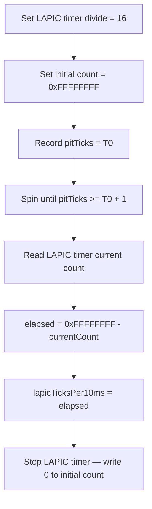
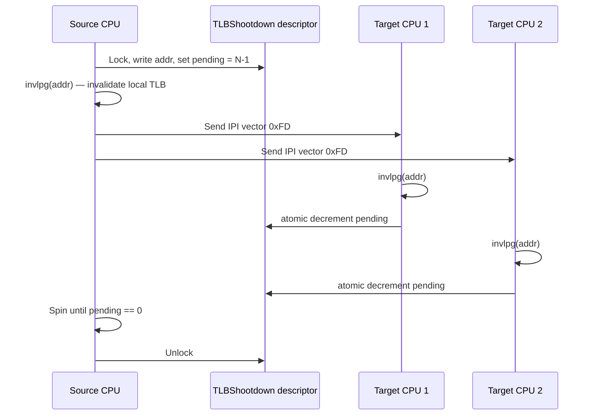
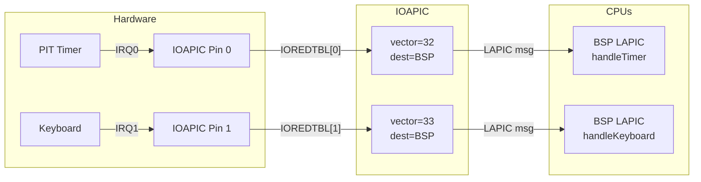

# SMP v2 — LAPIC Timer, IOAPIC, IPI, and Preemption

Covers the interrupt delivery infrastructure required for
multi-processor operation: per-CPU LAPIC timers, IOAPIC-based
hardware interrupt routing, inter-processor interrupts (IPI),
TLB shootdown, and timer-based preemption.

Covers work plan items 5-7 and 13-14 from `smp_overview.md §4`.

## 1. Context

### 1.1 Current LAPIC State

`src/smp.go:92-103` initializes the BSP's LAPIC:

- `mapPage(lapicBase, lapicBase, ...)` — identity-maps the LAPIC
  MMIO page at `0xFEE00000` with uncacheable flags
  (`src/smp.go:94`).
- LVT LINT0 = ExtINT (PIC passthrough, unmasked)
  (`src/smp.go:98`).
- LVT LINT1 = NMI (unmasked) (`src/smp.go:99`).
- SVR = software-enable (bit 8) + spurious vector 0xFF
  (`src/smp.go:101-103`).

No LAPIC timer registers are defined or programmed. The only
timer source is the PIT, which fires IRQ0 at 100 Hz routed
through the PIC to the BSP (`src/pit.go:16-18`).

### 1.2 Current PIT State

`src/pit.go:26-33` programs PIT channel 0 in rate generator
mode (mode 2), divisor 11932, producing ~100 Hz ticks. The
handler (`src/pit.go:41-44`) increments `pitTicks` and calls
`picSendEOI(0)`.

### 1.3 Current Interrupt Routing

PIC remapped: master IRQ 0-7 to vectors 32-39, slave IRQ 8-15
to vectors 40-47 (`src/pic.go:25-26`). All IRQs delivered to
BSP via LINT0 ExtINT. APs receive no hardware interrupts.

### 1.4 What Is Missing

| Gap | Impact |
|---|---|
| No LAPIC timer registers (`LVTTimer`, `TimerDiv`, etc.) | Cannot program per-CPU timer |
| No LAPIC EOI function | Cannot acknowledge LAPIC-delivered interrupts |
| No IOAPIC driver | Cannot route IRQs to specific CPUs |
| No IPI send primitive | Cannot wake APs or signal cross-CPU events |
| No TLB shootdown | AP TLB caches go stale after BSP unmap |
| No preemption | CPU-bound goroutine monopolizes its core |

## 2. LAPIC Register Definitions

Add to the existing constant block in `src/smp.go:12-24`:

```go
const (
    lapicRegEOI          = uintptr(0x0B0) // End-of-Interrupt register
    lapicRegLVTTimer     = uintptr(0x320) // LVT Timer register
    lapicRegTimerInitCnt = uintptr(0x380) // Timer Initial Count register
    lapicRegTimerCurrCnt = uintptr(0x390) // Timer Current Count register
    lapicRegTimerDivCfg  = uintptr(0x3E0) // Timer Divide Configuration register
)
```

These supplement the existing registers (`lapicRegID`,
`lapicRegSVR`, `lapicRegICRL`, `lapicRegICRH`, `lapicRegLVT0`,
`lapicRegLVT1`) defined at `src/smp.go:12-19`.

### 2.1 LAPIC EOI

```go
// lapicSendEOI signals end-of-interrupt to the local APIC.
// Must be called at the end of every LAPIC-delivered interrupt
// handler (timer, IOAPIC-routed IRQs, IPIs that require EOI).
//
//go:nosplit
func lapicSendEOI() {
    lapicWrite(lapicRegEOI, 0)
}
```

This replaces `picSendEOI()` calls once IOAPIC routing is
active. Current call sites that must migrate:

| File | Line | Current Call | New Call |
|---|---|---|---|
| `src/pit.go` | 43 | `picSendEOI(0)` | `lapicSendEOI()` |
| `src/keyboard.go` | 96 | `picSendEOI(1)` | `lapicSendEOI()` |
| `src/main.go` | 107 | `picSendEOI(irq)` | `lapicSendEOI()` |

## 3. LAPIC Timer Calibration

The LAPIC timer decrements at a bus-frequency-derived rate
that varies across machines. We calibrate it once on the BSP
using the PIT as a reference clock, then distribute the
calibrated count to all APs (same chip, same bus frequency).

### 3.1 Calibration Algorithm



### 3.2 Implementation

New file `src/lapic_timer.go`:

```go
// lapicCalibratedInitCnt holds the calibrated initial count
// for 100 Hz (10 ms period). Set by lapicTimerCalibrate on the
// BSP, read by all APs.
var lapicCalibratedInitCnt uint32

// lapicTimerCalibrate measures the LAPIC timer decrement rate
// using the PIT (already running at 100 Hz) as a reference.
// Must be called on the BSP after pitInit() and smpInit().
func lapicTimerCalibrate() {
    // Divide configuration: value 0x03 = divide by 16.
    lapicWrite(lapicRegTimerDivCfg, 0x03)

    // Start the LAPIC timer at max count.
    lapicWrite(lapicRegTimerInitCnt, 0xFFFFFFFF)

    // Wait for exactly one PIT tick (~10 ms).
    t0 := pitTicks
    for pitTicks == t0 {
        // spin — interrupts must be enabled
    }

    // Read how far the LAPIC timer counted down.
    current := lapicRead(lapicRegTimerCurrCnt)
    elapsed := uint32(0xFFFFFFFF) - current

    // Stop the calibration timer.
    lapicWrite(lapicRegTimerInitCnt, 0)

    lapicCalibratedInitCnt = elapsed

    serialPrint("LAPIC timer: ")
    serialPrint(utoa(uint64(elapsed)))
    serialPrintln(" ticks/10ms")
}
```

**Why divide-by-16**: provides a reasonable count range. On
typical QEMU (1 GHz bus / 16 = 62.5 MHz effective), a 10 ms
measurement yields ~625,000 ticks, well within uint32 range.
Real hardware varies but stays within range at any sensible
divider.

**Why use `pitTicks` instead of PIT channel 2**: the PIT is
already running at 100 Hz on channel 0 (`src/pit.go:26-33`),
so one tick is exactly the 10 ms interval we need. No
additional PIT programming required.

### 3.3 Accuracy

One PIT tick at 100 Hz = 10 ms +/- ~8.4 us (PIT oscillator
tolerance). For a 100 Hz LAPIC timer this gives < 0.1% error,
which is acceptable for preemption purposes. Higher precision
(e.g., averaging over multiple ticks) can be added later if
needed.

## 4. Per-AP LAPIC Timer Init

Each CPU programs its own LAPIC timer to fire in periodic mode
at the calibrated interval. The BSP calls this after
calibration; each AP calls it during `apEntry`.

### 4.1 LVT Timer Register Format

| Bits | Field | Value |
|---|---|---|
| 0-7 | Vector | `0xFE` (254) |
| 16 | Mask | 0 (unmasked) |
| 17 | Timer mode bit 0 | 1 (periodic) |
| 18 | Timer mode bit 1 | 0 |

Combined value: `0x000200FE` (periodic, vector 0xFE, unmasked).

### 4.2 Implementation

```go
const lapicTimerVector = 0xFE

// lapicTimerInit programs this CPU's LAPIC timer in periodic
// mode using the BSP-calibrated initial count. Must be called
// after lapicTimerCalibrate has run (on BSP) or after the BSP
// has stored lapicCalibratedInitCnt (on APs).
func lapicTimerInit() {
    // Divide configuration: same as calibration (divide by 16).
    lapicWrite(lapicRegTimerDivCfg, 0x03)

    // LVT Timer: periodic mode (bit 17), vector 0xFE, unmasked.
    lapicWrite(lapicRegLVTTimer, 0x00020000|uint32(lapicTimerVector))

    // Initial count: calibrated ticks per 10 ms = 100 Hz.
    lapicWrite(lapicRegTimerInitCnt, lapicCalibratedInitCnt)
}
```

### 4.3 Boot Sequence Integration

```mermaid
sequenceDiagram
    participant BSP as BSP (CPU 0)
    participant AP as AP N

    BSP->>BSP: smpInit() — boot APs
    BSP->>BSP: lapicTimerCalibrate()
    BSP->>BSP: lapicTimerInit()
    BSP->>BSP: registerHandler(0xFE, handleLAPICTimer)
    Note over AP: APs idle in sti;hlt during calibration
    AP->>AP: percpuInitAP()
    AP->>AP: gdtInitPerCPU()
    AP->>AP: lapicTimerInit()
    AP->>AP: enter scheduler loop
```

The AP reads `lapicCalibratedInitCnt` which was set by the BSP
before the APs proceed past idle. A memory barrier is not
strictly needed because the INIT-SIPI-SIPI sequence and the
subsequent `hlt`/wakeup path provide implicit ordering, but a
fence can be added for defense-in-depth.

### 4.4 Handler Registration

On the BSP, register the LAPIC timer handler after calibration:

```go
registerHandler(0xFE, handleLAPICTimer)
```

APs share the same handler table (`src/interrupt.go:16`),
which is a global `[256]InterruptHandler`. The registration
happens once on the BSP; all CPUs dispatch through the same
table (read-only after boot).

## 5. Timer-Based Preemption Design

### 5.1 Problem

Under cooperative scheduling, a CPU-bound goroutine never
yields. With per-CPU LAPIC timers, each CPU receives a 100 Hz
tick that can trigger preemption.

### 5.2 Approach: Flag + HLT-Wake

The simplest approach for SMP v2 avoids modifying the ISR
return path or calling scheduler functions from interrupt
context (which TinyGo's `task.Pause()` prohibits when
interrupt depth > 0):

1. The LAPIC timer ISR sets a per-CPU `wantReschedule` flag.
2. For APs running the idle loop (`sti; hlt`), the timer
   interrupt wakes the CPU from `hlt`. The scheduler loop
   checks `wantReschedule`, clears it, and runs the next
   goroutine from the local runqueue.
3. For CPUs running a goroutine, the ISR returns to the
   goroutine. The goroutine continues until it reaches a
   yield point (channel op, `Gosched()`, or syscall). A
   future enhancement can add stack-check-based preemption
   where the ISR modifies the goroutine's stack bound to
   force a stack check failure, triggering a yield at the
   next function prologue.

### 5.3 Per-CPU Flag

Extend the `PerCPU` struct (from `smp_percpu_and_sync.md §1.3`):

```go
type PerCPU struct {
    cpuIndex       uint32  // offset 0
    interruptDepth uint32  // offset 4
    systemStack    uintptr // offset 8
    tssPtr         uintptr // offset 16
    apicID         uint32  // offset 24
    wantReschedule uint32  // offset 28: set by timer ISR
    // ...
}

const pcpuOffWantReschedule = 28
```

The `_pad0` field at offset 28 in the original layout is
repurposed for `wantReschedule`.

### 5.4 LAPIC Timer Handler

```go
//go:nosplit
func handleLAPICTimer(vector uint64) {
    lapicSendEOI()
    // Set per-CPU reschedule flag. The scheduler loop checks
    // this flag after waking from hlt or at yield points.
    idx := cpuID()
    perCPUBlocks[idx].wantReschedule = 1
}
```

### 5.5 Scheduler Integration

The AP scheduler loop (see `smp_kernel_scheduler.md`) becomes:

```go
func apSchedulerLoop() {
    idx := cpuID()
    for {
        if perCPUBlocks[idx].wantReschedule != 0 {
            perCPUBlocks[idx].wantReschedule = 0
            // Run next task from local runqueue if available.
            // (Scheduler details in smp_kernel_scheduler.md)
        }
        hlt() // Wait for next interrupt (timer or IPI)
    }
}
```

### 5.6 Future: Stack-Check Preemption

For true preemption of compute-bound goroutines (not just
waking from `hlt`), the timer ISR can modify the interrupted
goroutine's stack limit so the next function prologue's stack
check fails, transferring control to the stack-growth handler
which then yields to the scheduler. This technique is used by
Go's runtime for goroutine preemption and avoids calling
scheduler functions from ISR context. Deferred to SMP v3.

## 6. IPI Send Primitive

### 6.1 ICR Format

The Local APIC Interrupt Command Register (ICR) is split
across two 32-bit MMIO registers:

- **ICR High** (`lapicRegICRH`, `0x310`): bits 24-31 =
  destination APIC ID.
- **ICR Low** (`lapicRegICRL`, `0x300`): writing this register
  triggers the IPI. Key fields:
  - Bits 0-7: Vector
  - Bits 8-10: Delivery mode (000 = Fixed)
  - Bit 14: Level (1 = Assert)
  - Bits 18-19: Destination shorthand (00 = use destination
    field)

The existing code already uses ICR for INIT-SIPI-SIPI
(`src/smp.go:138-159`) with broadcast shorthand (bits 18-19 =
11). The IPI primitive uses targeted delivery (shorthand = 00).

### 6.2 Implementation

```go
// lapicSendIPI sends a fixed-delivery IPI to a specific CPU.
// Caller must ensure the target APIC ID is valid and that the
// ICR is idle before calling (lapicWaitICR).
//
//go:nosplit
func lapicSendIPI(targetAPICID uint8, vector uint8) {
    lapicWaitICR()
    lapicWrite(lapicRegICRH, uint32(targetAPICID)<<24)
    // Fixed delivery (000), level assert (bit 14), shorthand
    // = no shorthand (00). Combined: 0x00004000 | vector.
    lapicWrite(lapicRegICRL, uint32(vector)|0x00004000)
}
```

**Ordering**: ICR High must be written before ICR Low, because
writing ICR Low triggers the IPI. `lapicWaitICR()` (already
defined at `src/smp.go:78-81`) ensures the previous IPI has
been delivered before writing a new one.

### 6.3 Broadcast IPI Helper

For operations that target all other CPUs (e.g., TLB
shootdown):

```go
// lapicSendIPIAll sends an IPI to all CPUs except self.
// Uses destination shorthand = all-excluding-self (bits 18:19 = 11).
//
//go:nosplit
func lapicSendIPIAll(vector uint8) {
    lapicWaitICR()
    // No need to set ICR High for broadcast shorthand.
    // Shorthand 11 = all excluding self, assert, fixed delivery.
    lapicWrite(lapicRegICRL, uint32(vector)|0x000C4000)
}
```

### 6.4 Wakeup IPI

A dedicated wakeup vector (e.g., 0xFC) is used to wake an AP
from `hlt` for cross-CPU goroutine scheduling. The handler is
minimal:

```go
const ipiWakeupVector = 0xFC

//go:nosplit
func handleWakeupIPI(vector uint64) {
    lapicSendEOI()
    // No action needed — returning from the ISR wakes the CPU
    // from hlt. The scheduler loop will check the runqueue.
}
```

Register at boot: `registerHandler(0xFC, handleWakeupIPI)`.

## 7. TLB Shootdown Protocol

### 7.1 Problem

When the BSP (or any CPU) unmaps a virtual page, other CPUs
may have cached the old PTE in their TLB. Without
invalidation, those CPUs will access stale mappings, causing
silent corruption or unexpected page faults.

The x86 `invlpg` instruction invalidates only the local CPU's
TLB entry for a given virtual address. A cross-CPU
invalidation requires IPI coordination.

### 7.2 Shootdown Descriptor

```go
// TLBShootdown describes a pending TLB invalidation request.
type TLBShootdown struct {
    addr    uintptr // virtual address to invalidate
    pending uint32  // number of CPUs that have not yet acked
    lock    Spinlock
}

var tlbShootdownReq TLBShootdown
```

For SMP v2, a single global descriptor suffices (shootdowns
are rare and serialized by the lock). Future optimization:
per-CPU shootdown queues for concurrent invalidation.

### 7.3 Protocol Flow



### 7.4 Implementation

#### Initiator Side

```go
// invlpg invalidates the TLB entry for a single virtual address.
// Implemented in src/stubs.S.
//
//go:linkname invlpg invlpg
func invlpg(addr uintptr)

// tlbShootdown invalidates a virtual address on all CPUs.
// Must be called with interrupts enabled (target CPUs need
// to receive the IPI).
func tlbShootdown(addr uintptr) {
    flags := tlbShootdownReq.lock.Acquire()

    // Count online CPUs minus self.
    numTargets := onlineCPUs() - 1
    if numTargets <= 0 {
        // Single CPU — local invalidation is sufficient.
        invlpg(addr)
        tlbShootdownReq.lock.Release(flags)
        return
    }

    tlbShootdownReq.addr = addr
    atomicStore32(&tlbShootdownReq.pending, uint32(numTargets))

    // Invalidate local TLB first.
    invlpg(addr)

    // Send TLB shootdown IPI to all other CPUs.
    lapicSendIPIAll(tlbShootdownVector)

    // Spin until all targets have acknowledged.
    for atomicLoad32(&tlbShootdownReq.pending) != 0 {
        pause() // PAUSE hint for spin-wait
    }

    tlbShootdownReq.lock.Release(flags)
}
```

#### Target Side (IPI Handler)

```go
const tlbShootdownVector = 0xFD

//go:nosplit
func handleTLBShootdown(vector uint64) {
    lapicSendEOI()
    addr := tlbShootdownReq.addr
    invlpg(addr)
    atomicDec32(&tlbShootdownReq.pending)
}
```

Register at boot: `registerHandler(0xFD, handleTLBShootdown)`.

### 7.5 Assembly: invlpg and pause

Add to `src/stubs.S`:

```asm
.global invlpg
invlpg:
    invlpg (%rdi)
    ret

.global pause
pause:
    pause
    ret
```

### 7.6 When to Issue TLB Shootdowns

For SMP v2, shootdowns are required in:

- `processExit` / `freeProcPML4`: after unmapping user pages
  (work plan item 16).
- Any future `munmap`-style operation that reclaims user pages.

Kernel page mappings (identity-mapped region, LAPIC/IOAPIC
MMIO) are created at boot and never unmapped, so they do not
require shootdowns.

## 8. IOAPIC Discovery and Programming

### 8.1 IOAPIC Overview

The IOAPIC replaces the 8259A PIC for interrupt routing in SMP
systems. Each IOAPIC has a redirection table that maps physical
IRQ pins to interrupt vectors and destination CPUs. This
enables routing hardware interrupts to any processor, not just
the BSP.

### 8.2 MADT Type-1 Entry Parsing

The ACPI MADT contains IOAPIC entries (type 1) that the
current parser (`src/smp.go:290-315`) skips. Each type-1 entry
has the following layout:

| Offset | Size | Field |
|---|---|---|
| 0 | 1 | Entry type (1) |
| 1 | 1 | Entry length (12) |
| 2 | 1 | IOAPIC ID |
| 3 | 1 | Reserved |
| 4 | 4 | IOAPIC MMIO base address |
| 8 | 4 | Global System Interrupt Base |

Add to `parseMADT` (`src/smp.go:290`):

```go
// In the entry-walking loop, after the type-0 handler:
if entryType == 1 && entryLen >= 12 {
    // Type 1: IOAPIC entry.
    ioapicID   = *(*byte)(unsafe.Pointer(madtAddr + offset + 2))
    ioapicAddr = uintptr(*(*uint32)(unsafe.Pointer(madtAddr + offset + 4)))
    ioapicGSIBase = *(*uint32)(unsafe.Pointer(madtAddr + offset + 8))
}
```

Store the discovered base address in a global:

```go
var ioapicBase uintptr // set from MADT type-1 entry
```

Default IOAPIC base is `0xFEC00000`, but the implementation
must always read it from MADT.

### 8.3 IOAPIC Register Access

The IOAPIC uses indirect register access via two MMIO
registers:

| Offset | Name | Function |
|---|---|---|
| 0x00 | IOREGSEL | Index register — write the register number to select |
| 0x10 | IOWIN | Data register — read/write the selected register |

```go
// ioapicRead reads a 32-bit IOAPIC register.
func ioapicRead(reg uint32) uint32 {
    *(*uint32)(unsafe.Pointer(ioapicBase)) = reg
    return *(*uint32)(unsafe.Pointer(ioapicBase + 0x10))
}

// ioapicWrite writes a 32-bit IOAPIC register.
func ioapicWrite(reg uint32, val uint32) {
    *(*uint32)(unsafe.Pointer(ioapicBase)) = reg
    *(*uint32)(unsafe.Pointer(ioapicBase + 0x10)) = val
}
```

### 8.4 IOAPIC Registers

| Index | Name | Description |
|---|---|---|
| 0x00 | IOAPICID | IOAPIC identification (bits 24-27 = ID) |
| 0x01 | IOAPICVER | Version; bits 16-23 = max redirection entry index |
| 0x10 + 2*n | IOREDTBL[n] low | Redirection table entry n, bits 0-31 |
| 0x10 + 2*n + 1 | IOREDTBL[n] high | Redirection table entry n, bits 32-63 |

### 8.5 Redirection Table Entry Format

Each redirection entry is 64 bits, split across two 32-bit
IOAPIC registers:

```
Bits  63      56 55           16 15  14 13 12 11 10    8 7       0
     +----------+--------------+---+--+--+--+--+-------+---------+
     | Dest     | Reserved     | Trig|  |Pol|DS| DM    | Del Mode| Vector  |
     | APIC ID  |              | Mode|Msk|   |  |       |         |
     +----------+--------------+---+--+--+--+--+-------+---------+
```

| Bits | Field | Description |
|---|---|---|
| 0-7 | Vector | Interrupt vector number (32-255) |
| 8-10 | Delivery Mode | 000=Fixed, 001=Lowest Priority, 010=SMI, 100=NMI, 101=INIT, 111=ExtINT |
| 11 | Destination Mode | 0=Physical (APIC ID), 1=Logical |
| 12 | Delivery Status | Read-only; 0=Idle, 1=Send Pending |
| 13 | Pin Polarity | 0=Active High, 1=Active Low |
| 15 | Trigger Mode | 0=Edge-triggered, 1=Level-triggered |
| 16 | Mask | 0=Enabled, 1=Masked (disabled) |
| 56-63 | Destination | Target APIC ID (physical mode) |

### 8.6 Redirection Table Programming

```go
// ioapicSetRedirection programs a single IOAPIC redirection
// table entry. irq is the IOAPIC input pin (0-23), vector is
// the IDT vector, and destAPICID is the target CPU's APIC ID.
func ioapicSetRedirection(irq uint8, vector uint8, destAPICID uint8) {
    regLo := uint32(0x10 + 2*uint32(irq))
    regHi := regLo + 1

    // Low 32 bits: vector, fixed delivery, physical dest,
    // active high, edge-triggered, unmasked.
    lo := uint32(vector) // delivery mode 000, dest mode 0, polarity 0, trigger 0, mask 0
    // High 32 bits: destination APIC ID in bits 24-27.
    hi := uint32(destAPICID) << 24

    ioapicWrite(regHi, hi)
    ioapicWrite(regLo, lo)
}

// ioapicMaskIRQ masks (disables) a single IOAPIC redirection entry.
func ioapicMaskIRQ(irq uint8) {
    regLo := uint32(0x10 + 2*uint32(irq))
    lo := ioapicRead(regLo)
    ioapicWrite(regLo, lo|(1<<16))
}
```

### 8.7 IOAPIC Initialization

New file `src/ioapic.go`:

```go
func ioapicInit() {
    if ioapicBase == 0 {
        serialPrintln("IOAPIC: not found in MADT, skipping")
        return
    }

    // Map IOAPIC MMIO page (identity-mapped, uncacheable).
    mapPage(ioapicBase, ioapicBase, pagePresent|pageWrite|pagePCD|pagePWT)

    // Read version and max redirection entries.
    ver := ioapicRead(0x01)
    maxRedir := (ver >> 16) & 0xFF

    serialPrint("IOAPIC: version=")
    serialPrint(utoa(uint64(ver & 0xFF)))
    serialPrint(", max_redir=")
    serialPrintln(utoa(uint64(maxRedir)))

    // Mask all entries first.
    for i := uint8(0); i <= uint8(maxRedir); i++ {
        ioapicMaskIRQ(i)
    }

    bspAPICID := uint8(lapicRead(lapicRegID) >> 24)

    // Program IRQ0 (PIT timer) -> vector 32, route to BSP.
    ioapicSetRedirection(0, 32, bspAPICID)

    // Program IRQ1 (keyboard) -> vector 33, route to BSP.
    ioapicSetRedirection(1, 33, bspAPICID)

    // Disable the legacy 8259A PIC by masking all IRQs.
    outb(pic1Data, 0xFF)
    outb(pic2Data, 0xFF)

    serialPrintln("IOAPIC: PIC disabled, IOAPIC routing active")
}
```

### 8.8 IOAPIC Redirection Flow



### 8.9 EOI Transition

With IOAPIC active, interrupt acknowledgment changes from PIC
EOI to LAPIC EOI. The IOAPIC itself does not need a separate
EOI for edge-triggered interrupts (IRQ0 PIT, IRQ1 keyboard are
both edge-triggered by default). For level-triggered interrupts
(not used in v2), an IOAPIC EOI register write would be needed.

After `ioapicInit()`:
- `handleTimer` calls `lapicSendEOI()` instead of
  `picSendEOI(0)`.
- `handleKeyboard` calls `lapicSendEOI()` instead of
  `picSendEOI(1)`.
- `handleDefaultIRQ` calls `lapicSendEOI()` instead of
  `picSendEOI(irq)`.

A global flag (`useIOAPIC bool`) can gate which EOI path is
used, allowing the system to fall back to PIC mode if IOAPIC
discovery fails:

```go
var useIOAPIC bool

//go:nosplit
func sendEOI(irq uint8) {
    if useIOAPIC {
        lapicSendEOI()
    } else {
        picSendEOI(irq)
    }
}
```

## 9. Vector Allocation Table

| Vector | Hex | Purpose | Source | Handler |
|---|---|---|---|---|
| 0 | 0x00 | Divide Error (#DE) | CPU exception | `handleDivisionError` (`src/main.go:131`) |
| 14 | 0x0E | Page Fault (#PF) | CPU exception | `handlePageFault` (`src/main.go:132`) |
| 32 | 0x20 | PIT Timer (IRQ0) | PIC / IOAPIC pin 0 | `handleTimer` (`src/main.go:147`) |
| 33 | 0x21 | Keyboard (IRQ1) | PIC / IOAPIC pin 1 | `handleKeyboard` (`src/main.go:153`) |
| 34-47 | 0x22-0x2F | Unassigned HW IRQs | PIC / IOAPIC pins 2-15 | `handleDefaultIRQ` (`src/main.go:141-143`) |
| 128 | 0x80 | Syscall (int 0x80) | Software interrupt | `syscallDispatch` (`src/interrupt.go:38-39`) |
| 252 | 0xFC | Wakeup IPI | LAPIC IPI | `handleWakeupIPI` (new) |
| 253 | 0xFD | TLB Shootdown IPI | LAPIC IPI | `handleTLBShootdown` (new) |
| 254 | 0xFE | LAPIC Timer (per-CPU) | Local APIC timer | `handleLAPICTimer` (new) |
| 255 | 0xFF | Spurious | LAPIC SVR | (none — spurious vectors must not send EOI) |

**Design rule**: vectors 0xF0-0xFF are reserved for LAPIC-
internal use (timer, error, spurious, IPIs). Vectors 0x20-0x2F
are for IOAPIC-routed hardware IRQs. Vectors 0x30-0xEF are
available for future software interrupts or additional IPIs.

## 10. PIC-to-IOAPIC Migration Sequence

The transition from PIC to IOAPIC routing must be atomic from
the perspective of interrupt delivery — no interrupts may be
lost during the switch.

### 10.1 Migration Steps

1. **Disable interrupts** (`cli`) on BSP.
2. **Call `ioapicInit()`**: maps IOAPIC, programs redirection
   table entries, masks PIC.
3. **Update EOI path**: set `useIOAPIC = true`.
4. **Update LVT LINT0**: mask ExtINT on BSP since PIC is now
   disabled. Write `lapicWrite(lapicRegLVT0, 0x00010700)`
   (bit 16 = masked).
5. **Re-enable interrupts** (`sti`) on BSP.

### 10.2 Integration Point

In `main()`, after `smpInit()` and `lapicTimerCalibrate()`:

```go
cli()
ioapicInit()
useIOAPIC = true
// Mask LINT0 ExtINT — PIC is disabled.
lapicWrite(lapicRegLVT0, 0x00010700)
sti()
```

### 10.3 Fallback

If `ioapicBase == 0` (MADT had no type-1 entry), `ioapicInit`
returns immediately and the system continues with PIC routing.
`useIOAPIC` stays false, and all existing EOI paths remain
unchanged. This preserves backward compatibility with single-
CPU configurations or BIOS/firmware that lacks IOAPIC support.

## 11. Files to Modify/Add

| File | Change |
|---|---|
| `src/smp.go` | Add LAPIC timer/EOI register constants (5 new consts); add `lapicSendEOI()`, `lapicSendIPI()`, `lapicSendIPIAll()`; extend `parseMADT` for type-1 entries; store `ioapicBase` |
| `src/lapic_timer.go` (new) | `lapicTimerCalibrate()`, `lapicTimerInit()`, `handleLAPICTimer()`, `lapicCalibratedInitCnt` |
| `src/ioapic.go` (new) | `ioapicRead()`, `ioapicWrite()`, `ioapicSetRedirection()`, `ioapicMaskIRQ()`, `ioapicInit()` |
| `src/ipi.go` (new) | Wakeup IPI handler, TLB shootdown descriptor and protocol |
| `src/stubs.S` | Add `invlpg`, `pause` stubs |
| `src/percpu.go` | Add `wantReschedule` field to `PerCPU` struct |
| `src/pit.go` | Replace `picSendEOI(0)` with `sendEOI(0)` (or `lapicSendEOI()` behind flag) |
| `src/keyboard.go` | Replace `picSendEOI(1)` with `sendEOI(1)` |
| `src/main.go` | Register new handlers (0xFC, 0xFD, 0xFE); call `lapicTimerCalibrate()`, `ioapicInit()` in boot sequence; add migration sequence |
| `src/interrupt.go` | Add `sendEOI()` wrapper; update `handleDefaultIRQ` to use `sendEOI()` |

## 12. Dependencies

### 12.1 Prerequisites (must land first)

| Item | From | Why |
|---|---|---|
| Per-CPU storage (GS base) | `smp_percpu_and_sync.md §1` | `cpuID()` used in timer handler, per-CPU `wantReschedule` |
| Spinlock primitive | `smp_percpu_and_sync.md §4` | TLB shootdown descriptor lock |
| Per-CPU GDT/TSS | `smp_percpu_and_sync.md §5` | APs need valid TSS before running timer ISR |
| Per-CPU interrupt depth | `smp_percpu_and_sync.md §6` | Timer ISR increments `%gs:4` |

### 12.2 Dependents (blocked by this doc)

| Item | From | Why |
|---|---|---|
| AP scheduler spawn | `smp_kernel_scheduler.md` | APs need LAPIC timer before entering scheduler loop |
| Cross-CPU wakeup | `smp_kernel_scheduler.md` | Uses `lapicSendIPI()` for wakeup vector |
| Ring-3 on APs | `smp_user_multicore.md` | Per-CPU timer enables preemption of user processes |
| TLB shootdown for user unmaps | `smp_user_multicore.md` | Uses `tlbShootdown()` protocol from this doc |

### 12.3 Dependency DAG (this doc's items)

```
[5] LAPIC register defs + EOI
 │
 ├──► [6] LAPIC timer calibration + per-AP init
 │         │
 │         └──► [14] Timer-based preemption
 │
 ├──► [7] IOAPIC discovery + redirection
 │
 └──► [13] IPI send primitive
           │
           ├──► Wakeup IPI (cross-CPU scheduling)
           └──► TLB shootdown (item 16)
```

## 13. Verification Criteria

### Item 5 (LAPIC register defs + EOI)
- `make build` clean.
- No functional change (definitions only).

### Item 6 (LAPIC timer calibration + per-AP init)
- `make build` clean.
- Serial output: `"LAPIC timer: N ticks/10ms"` with a
  reasonable value (e.g., 50,000-5,000,000 depending on QEMU
  frequency).
- Under `-smp 4`: all 4 CPUs receive periodic LAPIC timer
  interrupts. Verify by adding a per-CPU heartbeat counter and
  printing to serial after 1 second (~100 ticks per CPU).
- `test_sendkey.sh 1` PASS (no regression with timer running).

### Item 7 (IOAPIC discovery + redirection)
- `make build` clean.
- Serial output: `"IOAPIC: version=N, max_redir=N"`.
- Keyboard and timer interrupts still function on BSP after
  PIC-to-IOAPIC migration.
- `test_sendkey.sh 1` PASS (keyboard input works through
  IOAPIC routing).

### Item 13 (IPI send primitive + wakeup vector)
- `make build` clean.
- BSP sends wakeup IPI to each AP; AP serial output confirms
  receipt (e.g., increment a per-AP counter in the wakeup
  handler).
- TLB shootdown IPI: BSP initiates shootdown; all APs
  acknowledge. Verify `pending` counter reaches 0.

### Item 14 (Timer-based preemption)
- `make build` clean.
- AP wakes from `hlt` on each LAPIC timer tick (verified by
  heartbeat counter).
- `wantReschedule` flag is set and cleared correctly (no
  stuck flags after 10 seconds of operation).

## 14. Open Questions

1. **LAPIC timer frequency variation across APs**: on real
   hardware (not QEMU), LAPIC timers on the same chip use the
   same bus clock, so the BSP-calibrated count is valid for all
   APs. On exotic multi-socket systems each socket may have a
   different bus clock. For v2 (single-socket target), BSP
   calibration is sufficient.

2. **IOAPIC interrupt source override**: ACPI MADT type-2
   entries (Interrupt Source Override) can remap IRQ numbers
   (e.g., IRQ0 to GSI 2 on some systems). For QEMU the
   default mapping holds. Parsing type-2 entries is deferred
   unless QEMU testing reveals misrouted interrupts.

3. **Level-triggered IRQs and IOAPIC EOI**: v2 uses only
   edge-triggered IRQs (PIT, keyboard). If level-triggered
   devices are added later (e.g., AHCI, USB), the IOAPIC EOI
   register (`0x40` on IOAPIC version >= 0x20) or the
   redirection entry's Remote IRR bit must be handled. Deferred.

4. **TLB shootdown batching**: the current protocol invalidates
   one page per IPI. For bulk unmaps (e.g., `processExit`
   freeing dozens of pages), batching multiple addresses into a
   single shootdown request would reduce IPI count. Deferred
   to SMP v3.

5. **True preemption vs. flag-based**: the flag + `hlt`-wake
   approach only preempts CPUs that are halted. A compute-bound
   goroutine that never yields will not be preempted until SMP
   v3 adds stack-check-based preemption (see section 5.6). Is
   this acceptable for v2? Recommendation: yes — v2 targets
   correctness of multi-CPU scheduling, not fairness under
   adversarial workloads.

## 15. Risk Register Delta

**Adds:**

| ID | Risk | Likelihood | Impact | Mitigation |
|---|---|---|---|---|
| R-ioapic-compat | QEMU IOAPIC behavior differs from real HW | Low | Medium | Test on multiple QEMU versions; document assumptions |
| R-preemption-reentry | Timer ISR fires during scheduler critical section | Medium | High | Disable LAPIC timer (mask LVT Timer) during scheduler; re-enable after task switch |
| R-tlb-shootdown-perf | IPI storm during rapid process exit | Low | Medium | Batch TLB invalidations; use process-generation counter |
| R-calibration-drift | LAPIC timer rate drifts over time vs. wall clock | Low | Low | 100 Hz preemption tick does not require high accuracy |
| R-ioapic-override | MADT type-2 overrides remap IRQ0 away from pin 0 | Low | High | Add type-2 parsing if QEMU testing shows misrouted IRQs |

**Retires (when items land):**
- B6 (No LAPIC timer) — resolved by items 5-6.
- B7 (No IPI support) — resolved by item 13.
- B8 (No IOAPIC) — resolved by item 7.
- B11 (No TLB shootdown) — resolved by item 16 (uses
  protocol from this doc).
- B12 (No preemption) — partially resolved by item 14 (full
  preemption in v3).

## 16. Reviewer MINOR notes

(Filled after the reviewer pass; none initially.)
