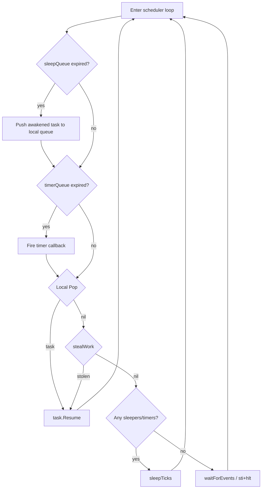
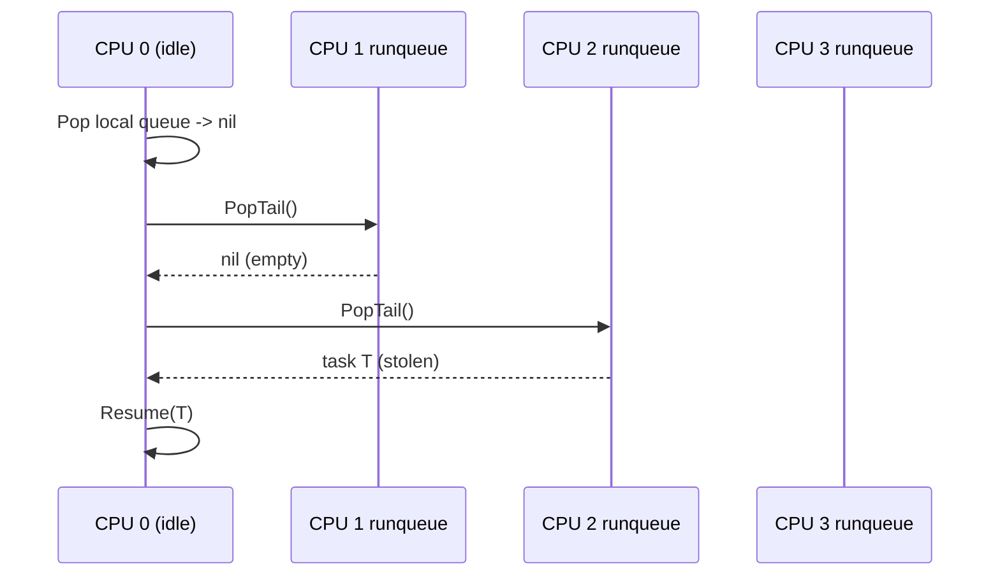

# SMP v2 -- Kernel Scheduler: Per-CPU Runqueues, Work Stealing, and AP Spawn

Doc 3 of 7 in the SMP v2 design set. Covers the TinyGo runtime
fork surface for multi-CPU scheduling, per-CPU runqueues with
work stealing, per-CPU systemStack, cross-CPU wakeup via
`chan.go`, and AP scheduler spawn.

Addresses blockers B3 (single global runqueue) and B4 (single
global `systemStack`) from `smp_overview.md`.

Covers work plan items 8-11 from `smp_overview.md` (Phase 1).

## 1. Context

### 1.1 Current Scheduler

TinyGo's `scheduler=tasks` implementation uses a single global
runqueue (`~/.local/tinygo/src/runtime/scheduler.go:28`):

```go
var runqueue task.Queue
```

The scheduler loop (`runtime/scheduler.go:160-239`) is a
single-instance cooperative loop: pop from `runqueue`, call
`t.Resume()`, repeat. When the queue is empty it sleeps via
`sleepTicks()` until the next sleeping goroutine is due.

All push sites feed the same global:
- `runqueuePushBack(t)` (`scheduler.go:79-81`)
- `resumeRX` (`chan.go:187`)
- `resumeTX` (`chan.go:214`)
- `Gosched()` (`scheduler.go:260`)
- `scheduler()` sleep-wakeup path (`scheduler.go:178`)

Context switch goes through `tinygo_swapTask`
(`internal/task/task_stack_amd64.S:45-74`), which saves/restores
callee-saved registers and swaps `%rsp`. The system stack is a
single global (`internal/task/task_stack_amd64.go:7`):

```go
var systemStack uintptr
```

`resume()` swaps from `systemStack` to the task stack;
`pause()` swaps back. With one CPU this is correct. With N CPUs
running N independent scheduler loops, they would all clobber
the same `systemStack` variable, corrupting each other's
scheduler state.

### 1.2 Why Per-CPU Runqueues

A single global runqueue protected by a spinlock is the simplest
SMP-safe option but creates a hot contention point: every
`Push`/`Pop` on every CPU serializes on one lock. Per-CPU
runqueues with work stealing give each CPU its own fast path
(no contention for local operations) while still balancing
load across CPUs when one is idle.

This matches the approach used by Linux CFS (per-CPU rq with
pull migration) and Go's own runtime (per-P local runqueue +
global fallback + work stealing).

### 1.3 Existing Patch Surface

gooos already patches TinyGo via `scripts/tinygo_runtime.patch`
(292 lines). The patch adds:

| File | Change |
|---|---|
| `runtime/runtime_gooos.go` (new) | Kernel-mode runtime stubs: `sleepTicks`, `ticks`, `putchar`, etc. |
| `runtime/runtime_gooos_user.go` (new) | Userspace runtime stubs via syscalls |
| `runtime/interrupt/interrupt_gooos.go` (new) | Kernel `interrupt.Disable`/`Restore`/`In` via RFLAGS |
| `runtime/interrupt/interrupt_gooos_user.go` (new) | Userspace no-op interrupt stubs |
| `internal/task/task_stack.go` (mod) | `stackTop` field, `gooosStackOverflow` hook in `Pause()` |
| `internal/task/task_stack_amd64.go` (mod) | `gooosOnResume` hook before `swapTask` in `resume()` |

SMP v2 extends this same patch file (decision D9 from
`smp_overview.md`). No separate patch file, no full fork.

## 2. TinyGo Patch Surface Enumeration

Every file under `~/.local/tinygo/src/` that needs modification
for per-CPU scheduling. Changes marked `[new]` are additions to
the patch; `[extend]` modifies an already-patched hunk.

| # | File | Change | Est. Lines |
|---|---|---|---|
| 1 | `runtime/scheduler.go` | Replace `var runqueue task.Queue` with `var runqueues [16]task.Queue`; update `runqueuePushBack`, `scheduler()`, `Gosched()`, `minSched()`; add `stealWork()`; add `apScheduler()` entry | ~60 |
| 2 | `runtime/scheduler_any.go` | No change to `run()` (BSP calls it as before); add `//go:linkname` export of `apScheduler` for gooos AP entry | ~5 |
| 3 | `internal/task/queue.go` | Replace `interrupt.Disable`/`Restore` in `Push`/`Pop`/`Append`/`Empty` with spinlock; add `PopTail()` for work stealing | ~40 |
| 4 | `internal/task/task_stack_amd64.go` | Replace `var systemStack uintptr` with `var systemStacks [16]uintptr`; update `resume()`/`pause()`/`SystemStack()` to index by `cpuID()` | ~20 |
| 5 | `runtime/chan.go` | `resumeRX`/`resumeTX`: push to target task's CPU queue; call `gooosWakeupCPU` if cross-CPU; `chanClose` receiver wakeups similarly | ~30 |
| 6 | `runtime/runtime_gooos.go` | Add `gooosWakeupCPU` linkname declaration; add `cpuID()` linkname import | ~10 [extend] |

**Total new patch lines: ~165 (on top of existing 292).**

All changes go into `scripts/tinygo_runtime.patch` and are
applied by the existing build process.

## 3. Per-CPU Runqueues Design

### 3.1 Data Structure

Replace the single global (`runtime/scheduler.go:28`):

```go
// Before:
var runqueue task.Queue

// After:
const maxCPUs = 16 // matches smpMaxAPs (src/smp.go:46) + 1 BSP

var runqueues [maxCPUs]task.Queue
```

`maxCPUs = 16` matches the constant defined in
`smp_percpu_and_sync.md` (decision D10).

### 3.2 Push/Pop Site Updates

Every site that currently references `runqueue` must be updated
to use `runqueues[cpuID()]` for local operations:

| Site | File:Line | Current | After |
|---|---|---|---|
| `runqueuePushBack` | `scheduler.go:79-81` | `runqueue.Push(t)` | `runqueues[cpuID()].Push(t)` |
| `scheduler()` pop | `scheduler.go:193` | `t := runqueue.Pop()` | `t := runqueues[cpuID()].Pop()` (then steal if nil) |
| `scheduler()` sleep wakeup | `scheduler.go:178` | `runqueue.Push(t)` | `runqueues[cpuID()].Push(t)` |
| `Gosched()` | `scheduler.go:260` | `runqueue.Push(task.Current())` | `runqueues[cpuID()].Push(task.Current())` |
| `minSched()` pop | `scheduler.go:248` | `t := runqueue.Pop()` | `t := runqueues[cpuID()].Pop()` |
| `resumeRX` | `chan.go:187` | `runqueue.Push(b.t)` | see cross-CPU wakeup (section 6) |
| `resumeTX` | `chan.go:214` | `runqueue.Push(b.t)` | see cross-CPU wakeup (section 6) |
| `chanClose` loop | `chan.go:543` | calls `resumeRX(false)` | (inherits from `resumeRX` change) |

### 3.3 cpuID() Import

The runtime package obtains `cpuID()` via linkname from the
gooos kernel (defined in `src/percpu.go`, assembly in
`src/stubs.S` per `smp_percpu_and_sync.md`):

```go
// runtime/runtime_gooos.go (addition)
//go:linkname cpuID cpuID
//go:nosplit
func cpuID() uint32
```

### 3.4 Scheduler Loop with Steal

```go
// runtime/scheduler.go — modified scheduler()
func scheduler() {
    me := cpuID()
    var now timeUnit
    for !schedulerDone {
        // ... sleep queue / timer queue handling (unchanged) ...

        t := runqueues[me].Pop()
        if t == nil {
            t = stealWork(me)
        }
        if t == nil {
            // ... existing idle logic (sleepTicks / waitForEvents) ...
            continue
        }

        scheduleLogTask("  run:", t)
        t.Resume()
    }
}
```

### 3.5 Scheduler Flow



## 4. Per-CPU systemStack Design

### 4.1 Current State

`internal/task/task_stack_amd64.go:7`:

```go
var systemStack uintptr
```

`resume()` (`task_stack_amd64.go:50-53`) saves the scheduler
stack into `systemStack` and switches to the task. `pause()`
(`task_stack_amd64.go:55-59`) reads `systemStack` to return to
the scheduler. If two CPUs run `resume()` concurrently, the
second overwrites `systemStack` with its own value, and the
first CPU's `pause()` returns to the wrong stack.

### 4.2 Design

Replace with a per-CPU array:

```go
// internal/task/task_stack_amd64.go (modified)

var systemStacks [16]uintptr // indexed by cpuID()

//go:linkname cpuID cpuID
//go:nosplit
func cpuID() uint32

func (s *state) resume() {
    gooosOnResume()
    me := cpuID()
    swapTask(s.sp, &systemStacks[me])
}

func (s *state) pause() {
    me := cpuID()
    newStack := systemStacks[me]
    systemStacks[me] = 0
    swapTask(newStack, &s.sp)
}

func SystemStack() uintptr {
    return systemStacks[cpuID()]
}
```

### 4.3 Assembly Implications

`tinygo_swapTask` (`task_stack_amd64.S:45-74`) does not need
modification. It takes `(newStack uintptr, oldStack *uintptr)`
as arguments and performs a pure register-save + RSP swap. The
per-CPU indexing happens in the Go wrapper (`resume()`/`pause()`)
before calling `swapTask`, so the assembly remains CPU-agnostic.

### 4.4 Initialization

Each CPU's scheduler loop runs on its own kernel stack. The BSP's
system stack is already set up by TinyGo's `run()` function
(`scheduler_any.go:21-29`). AP system stacks are set in
`apScheduler()` (see section 7).

The `systemStacks[me] = 0` sentinel in `pause()` is preserved:
it detects illegal recursive `pause()` calls. Each CPU's slot
is independent.

## 5. Work Stealing Algorithm

### 5.1 stealWork Function

Added to `runtime/scheduler.go`:

```go
// stealWork scans peer runqueues in round-robin order and steals
// one task from the first non-empty peer. Returns nil if all
// peers are empty.
func stealWork(self uint32) *task.Task {
    for i := uint32(1); i < maxCPUs; i++ {
        peer := (self + i) % maxCPUs
        t := runqueues[peer].PopTail()
        if t != nil {
            return t
        }
    }
    return nil
}
```

### 5.2 PopTail: Steal from the Opposite End

The existing `Queue` is a singly-linked list with `head` and
`tail` pointers. `Push` appends at the tail; `Pop` removes
from the head. This is a FIFO.

Work stealing removes from the **tail** (most recently added
task) to reduce contention with the owner CPU, which operates
on the **head** (oldest task). This separation means the
owner and the stealer touch different ends of the list,
reducing cache-line ping-pong.

```go
// internal/task/queue.go (addition)

// PopTail removes and returns the tail task.
// Used by work stealing. Returns nil if the queue is empty.
func (q *Queue) PopTail() *Task {
    q.lock.Acquire()
    if q.tail == nil {
        q.lock.Release()
        return nil
    }
    if q.head == q.tail {
        // single element
        t := q.tail
        q.head = nil
        q.tail = nil
        t.Next = nil
        q.lock.Release()
        return t
    }
    // walk to the element before tail
    prev := q.head
    for prev.Next != q.tail {
        prev = prev.Next
    }
    t := q.tail
    q.tail = prev
    prev.Next = nil
    t.Next = nil
    q.lock.Release()
    return t
}
```

**Performance note**: `PopTail` is O(n) due to the singly-linked
list walk. This is acceptable because:
1. Work stealing is the cold path (only when local queue is empty).
2. Runqueues are typically short (tens of tasks, not thousands).
3. A doubly-linked list would add 8 bytes per `Task` and
   complicate `Push`/`Pop` for a path that fires rarely.

If profiling shows steal latency is a problem, the list can be
upgraded to a doubly-linked list or a lock-free deque in a future
optimization pass.

### 5.3 Work Stealing Flow



### 5.4 Scan Order

Round-robin starting from `(self + 1) % maxCPUs`. This is
simple and distributes steal pressure evenly across peers.
No randomization needed at 16 CPUs; the scan terminates at the
first non-empty peer.

## 6. Cross-CPU Wakeup in chan.go

### 6.1 Problem

`resumeRX` (`chan.go:164-189`) and `resumeTX` (`chan.go:194-217`)
currently push the unblocked task onto the global `runqueue`.
With per-CPU queues, the unblocked task must be pushed to the
**correct** CPU's queue. The simplest correct policy: push to the
**current CPU's** local queue (the CPU performing the channel
operation inherits the woken task). This gives good locality --
the waking and woken goroutines likely share data.

However, if the woken task was previously running on a different
CPU that is now idle (in `hlt`), that CPU will remain idle until
its next timer tick or a work-steal scan. To minimize latency,
the waking CPU sends an IPI to nudge the idle CPU.

### 6.2 Design

```go
// runtime/chan.go — modified resumeRX
func (ch *channel) resumeRX(ok bool) unsafe.Pointer {
    var b *channelBlockedList
    b, ch.blocked = ch.blocked, ch.blocked.next

    dst := b.t.Ptr
    if !ok {
        memzero(dst, ch.elementSize)
        b.t.Data = 0
    }
    if b.s != nil {
        b.t.Ptr = unsafe.Pointer(b.s)
        b.detach()
    }

    // Push to local CPU's runqueue (waker inherits woken task).
    me := cpuID()
    runqueues[me].Push(b.t)

    return dst
}
```

The same pattern applies to `resumeTX` (`chan.go:194-217`).

### 6.3 Cross-CPU IPI Hook

When the scheduler on CPU A is idle (`hlt`) and CPU B pushes
work to its own queue, CPU A will not notice until it wakes
(timer tick or steal). For low-latency wakeup, after pushing
a task, the runtime optionally sends an IPI.

The IPI hook is called from gooos kernel code, not from
`chan.go` directly. The runtime exposes a hook point:

```go
// runtime/runtime_gooos.go (addition)
//go:linkname gooosWakeupCPU main.gooosWakeupCPU
func gooosWakeupCPU(cpuIdx uint32)
```

gooos kernel side (`src/ipi.go`, covered by
`smp_kernel_lapic_and_ipi.md`):

```go
// src/ipi.go
func gooosWakeupCPU(cpuIdx uint32) {
    if cpuIdx == cpuID() {
        return // no self-IPI needed
    }
    apicID := perCPUBlocks[cpuIdx].apicID
    lapicSendIPI(uint8(apicID), vectorWakeup)
}
```

### 6.4 When to Send IPIs

Not every channel wakeup needs an IPI. The IPI is needed only
when the target CPU might be halted. The v2 strategy: always
send the IPI when pushing to a peer's queue. The cost (one
LAPIC ICR write, ~100 ns) is small relative to channel operation
overhead. If profiling shows IPI storms, add a per-CPU
`isIdle` flag that the scheduler sets before `hlt` and clears
on wakeup; only send IPI when `isIdle` is set.

For v2 simplicity, since woken tasks are pushed to the **local**
queue (section 6.2), cross-CPU IPIs are not issued from
`chan.go` at all. The stolen task (via work stealing) or the
timer tick will wake idle CPUs. If latency requirements tighten,
the IPI path is ready to activate.

## 7. AP Scheduler Spawn

### 7.1 Current State

`src/smp.go:186-216`: `apEntry(apIndex uint64)` prints "AP N
online" to serial and enters an infinite `sti; hlt` loop. APs
do no useful work.

### 7.2 Reworked apEntry

After SMP v2, `apEntry` performs per-CPU initialization and
then enters the TinyGo scheduler loop:

```go
// src/smp.go — reworked apEntry
//
//export apEntry
func apEntry(apIndex uint64) {
    // 1. Per-CPU storage: set GS base for this AP.
    percpuInitAP(apIndex)

    // 2. Per-CPU GDT + TSS.
    gdtInitPerCPU(int(apIndex) + 1)

    // 3. LAPIC timer: calibrate and start 100 Hz periodic.
    lapicTimerInitAP()

    // 4. Serial announce (character-at-a-time, no alloc).
    serialPutChar('A')
    serialPutChar('P')
    serialPutChar(' ')
    if apIndex >= 10 {
        serialPutChar(byte('0' + apIndex/10))
    }
    serialPutChar(byte('0' + apIndex%10))
    serialPutChar(' ')
    serialPutChar('r')
    serialPutChar('u')
    serialPutChar('n')
    serialPutChar('\r')
    serialPutChar('\n')

    // 5. Enter TinyGo scheduler loop on this AP.
    apSchedulerEntry()
}
```

### 7.3 AP Scheduler Entry

The BSP enters the scheduler via `run()` (`scheduler_any.go:21-29`),
which calls `initHeap()`, spawns `main()` as a goroutine, and
falls into `scheduler()`. APs must **not** call `run()` (that
would re-initialize the heap and re-run `main()`). Instead, APs
need a dedicated entry point that:

1. Sets up the per-CPU `systemStacks[me]` slot.
2. Enters the same scheduler loop (pop local, steal, idle).

```go
// runtime/scheduler.go (addition)

// apScheduler is the TinyGo scheduler entry for AP cores.
// Called from gooos after per-CPU init (GS base, GDT, TSS,
// LAPIC timer). Does not reinitialize the heap or call main.
func apScheduler() {
    // The system stack for this AP is the stack we are currently
    // running on (the AP boot stack allocated in smpInit).
    // It will be saved into systemStacks[cpuID()] on the first
    // resume() call. No explicit setup needed here.
    scheduler()
}
```

gooos-side bridge (`src/smp.go`):

```go
//go:linkname apSchedulerEntry runtime.apScheduler
func apSchedulerEntry()
```

### 7.4 AP Scheduler Lifecycle

```mermaid
sequenceDiagram
    participant BSP as BSP (CPU 0)
    participant AP as AP N

    BSP->>BSP: run() -> initHeap, go main(), scheduler()
    BSP->>AP: INIT-SIPI-SIPI
    AP->>AP: trampoline: real -> prot -> long
    AP->>AP: apEntry(N)
    AP->>AP: percpuInitAP(N) -- GS base
    AP->>AP: gdtInitPerCPU(N+1) -- per-CPU GDT+TSS
    AP->>AP: lapicTimerInitAP() -- 100 Hz LAPIC timer
    AP->>AP: apSchedulerEntry() -> runtime.apScheduler()
    AP->>AP: scheduler() loop: Pop / stealWork / idle
    Note over AP: idle = sti; hlt (woken by timer or IPI)
```

### 7.5 AP Idle Behavior

When an AP's local queue is empty and `stealWork` returns nil
and there are no local sleepers/timers, the AP hits the
`waitForEvents()` path in `scheduler()`. gooos's
`waitForEvents` implementation runs `sti; hlt`, which puts
the CPU into a low-power halt state. The CPU wakes on:

1. **LAPIC timer interrupt** (100 Hz) -- re-enters scheduler,
   checks for stolen work or expired sleepers.
2. **Wakeup IPI** from another CPU -- immediate scheduler
   re-entry.

This replaces the current `sti; hlt` infinite loop in
`apEntry` (`src/smp.go:211-215`) with a productive scheduler
idle that can resume work immediately.

### 7.6 AP Stack Reuse

The AP boot stacks allocated in `smpInit()` (`src/smp.go:127-130`,
4 KiB each via `allocPage()`) become the AP system stacks for
the scheduler. When the AP first calls `resume()` on a task,
`swapTask` saves the current RSP (pointing into the boot stack)
into `systemStacks[me]`. When the task calls `pause()`, RSP is
restored to the boot stack. No additional allocation needed.

**Caveat**: 4 KiB is sufficient for the scheduler loop (which
does only `Pop` + `Resume` + simple bookkeeping) but must not
run deep call chains. The scheduler functions are all
`//go:nosplit` or shallow. Document the 4 KiB constraint;
if a deeper scheduler is needed later, reallocate larger stacks.

## 8. Queue Synchronization

### 8.1 Current State

`internal/task/queue.go:14-46`: `Push` and `Pop` use
`interrupt.Disable()` / `interrupt.Restore()` for mutual
exclusion. This works on a single CPU (disabling interrupts
prevents preemption) but does **not** prevent concurrent access
from another CPU.

### 8.2 Design: Spinlock per Queue

Add a spinlock field to `Queue`:

```go
// internal/task/queue.go (modified)

type Queue struct {
    head, tail *Task
    lock       Spinlock // imported from gooos via linkname
}
```

The `Spinlock` type is imported from the gooos kernel:

```go
// internal/task/queue.go (addition at top)
//go:linkname spinlockAcquireAsm spinlockAcquire
func spinlockAcquireAsm(lock *uint32)

//go:linkname spinlockReleaseAsm spinlockRelease
func spinlockReleaseAsm(lock *uint32)

type Spinlock struct {
    locked uint32
}

func (s *Spinlock) Acquire() {
    spinlockAcquireAsm(&s.locked)
}

func (s *Spinlock) Release() {
    spinlockReleaseAsm(&s.locked)
}
```

**Note**: the queue-level spinlock does **not** save/restore
RFLAGS (unlike the gooos-side `Spinlock.Acquire` in
`src/spinlock.go` which wraps `cli`). This is deliberate:
the callers (`Push`, `Pop`, `PopTail`) are always called from
contexts where interrupts are already managed by the caller
(the scheduler runs with interrupts disabled during queue
manipulation, and `chan.go` operations already bracket with
`interrupt.Disable`/`Restore`). Adding redundant `cli`/`sti`
inside the lock would be safe but wasteful.

### 8.3 Updated Push/Pop

```go
func (q *Queue) Push(t *Task) {
    q.lock.Acquire()
    if asserts && t.Next != nil {
        q.lock.Release()
        panic("runtime: pushing a task to a queue with a non-nil Next pointer")
    }
    if q.tail != nil {
        q.tail.Next = t
    }
    q.tail = t
    t.Next = nil
    if q.head == nil {
        q.head = t
    }
    q.lock.Release()
}

func (q *Queue) Pop() *Task {
    q.lock.Acquire()
    t := q.head
    if t == nil {
        q.lock.Release()
        return nil
    }
    q.head = t.Next
    if q.tail == t {
        q.tail = nil
    }
    t.Next = nil
    q.lock.Release()
    return t
}
```

The `interrupt.Disable`/`Restore` calls are removed from inside
`Push`/`Pop`. Interrupt management is the caller's responsibility
(unchanged from current behavior where callers like `chanSend`
already disable interrupts before calling queue operations).

### 8.4 Stack Type

The `Stack` type (`queue.go:69-97`) is used only by the
`channelBlockedList` and is not accessed cross-CPU (channel
operations are protected by `interrupt.Disable` which, under
SMP v2, is extended to include a per-channel spinlock). No
change needed to `Stack` for v2.

## 9. Files to Modify

### TinyGo Side (via `scripts/tinygo_runtime.patch`)

| File | Modification |
|---|---|
| `runtime/scheduler.go` | `runqueues [16]Queue`; `stealWork()`; `apScheduler()`; update all push/pop sites |
| `runtime/scheduler_any.go` | No structural change; `apScheduler` linkname export |
| `internal/task/queue.go` | Spinlock field on `Queue`; `PopTail()` method; replace `interrupt.Disable` with spinlock |
| `internal/task/task_stack_amd64.go` | `systemStacks [16]uintptr`; `cpuID()` import; per-CPU indexing in `resume()`/`pause()`/`SystemStack()` |
| `runtime/chan.go` | `resumeRX`/`resumeTX` push to `runqueues[cpuID()]`; `chanClose` receiver loop likewise |
| `runtime/runtime_gooos.go` | `cpuID()` linkname; `gooosWakeupCPU()` linkname (for future IPI path) |

### gooos Kernel Side

| File | Modification |
|---|---|
| `src/smp.go` | Rework `apEntry`: call `percpuInitAP`, `gdtInitPerCPU`, `lapicTimerInitAP`, `apSchedulerEntry`; add `apSchedulerEntry` linkname bridge |
| `src/ipi.go` (new, covered by `smp_kernel_lapic_and_ipi.md`) | `gooosWakeupCPU` implementation |
| `src/percpu.go` | Already defined in `smp_percpu_and_sync.md`; `cpuID()` assembly is the dependency |

## 10. Dependencies

This document depends on the following foundation items from
`smp_overview.md` Phase 0:

| Item | What | From Doc |
|---|---|---|
| 1 | Per-CPU storage (GS base), `cpuID()` | `smp_percpu_and_sync.md` |
| 2 | Spinlock primitive (`spinlockAcquire`/`spinlockRelease` in `src/stubs.S`) | `smp_percpu_and_sync.md` |
| 3 | Per-CPU GDT + TSS (`gdtInitPerCPU`) | `smp_percpu_and_sync.md` |
| 4 | Per-CPU interrupt depth (`%gs:4`) | `smp_percpu_and_sync.md` |

And the following Phase 1 items (partially co-dependent):

| Item | What | From Doc |
|---|---|---|
| 6 | LAPIC timer calibration (`lapicTimerInitAP`) | `smp_kernel_lapic_and_ipi.md` |
| 13 | IPI send primitive (`lapicSendIPI`) | `smp_kernel_lapic_and_ipi.md` |

**Ordering within this doc's scope**:
```
[8] per-CPU runqueues + systemStack
    |
    +--> [9] spinlock-protected Queue
    |        |
    |        +--> [10] cross-CPU wakeup in chan.go
    |
    +--> [11] AP scheduler spawn (also depends on items 3,4,6)
```

## 11. Verification Criteria

### Item 8: Per-CPU Runqueues + systemStack

- `make build` clean (no linker errors, no undefined symbols).
- BSP scheduler still works under `-smp 1` (single-CPU
  regression test): shell boots, `ls` executes, `echo hello`
  prints.
- `test_sendkey.sh 1` PASS.
- Serial log: no double-free or nil-pointer panics from
  `swapTask`.

### Item 9: Spinlock-Protected Queue

- `make build` clean.
- Channel operations still work: `echo hello | cat` executes.
- No deadlock under single-CPU (spinlock does not self-deadlock
  on the BSP when a goroutine pushes to its own queue).
- `test_sendkey.sh 1` PASS.

### Item 10: Cross-CPU Wakeup in chan.go

- `make build` clean.
- Under `-smp 4`: goroutine on CPU 0 sends to channel; receiver
  on CPU 1 wakes and runs (verified via serial debug output
  showing task resume on different CPU).
- No stale tasks left in wrong queues after channel close.

### Item 11: AP Scheduler Spawn

- Under `-smp 4`: serial shows `"AP N run"` for each AP (not
  `"AP N online"` followed by permanent halt).
- Goroutines visibly run on multiple CPUs (serial debug output
  includes cpuID per resume).
- `test_sendkey.sh 1` PASS under `-smp 4`.
- Stress probe: 4 goroutines doing tight counter loops for 1
  second; all 4 counters non-zero (proves all CPUs execute
  goroutines).

## 12. Open Questions

1. **Sleep queue distribution**: the `sleepQueue` and
   `timerQueue` globals (`scheduler.go:29-31`) remain single
   global linked lists. Under SMP, multiple CPUs call
   `addSleepTask` / `addTimer` concurrently. Options:
   (a) protect with a global spinlock (simple, low contention
   since sleep/timer adds are infrequent);
   (b) per-CPU sleep queues (each CPU manages its own sleepers,
   but cross-CPU `time.Sleep` wakeups become complex).
   Recommendation: option (a) for v2.

2. **Task CPU affinity**: should a goroutine remember which CPU
   it last ran on? Current design: no affinity; `runqueuePushBack`
   pushes to the current CPU, and work stealing migrates freely.
   Adding a `homeCPU` field to `task.Task` enables affinity-aware
   pushing in `resumeRX`/`resumeTX` (push to `homeCPU`'s queue
   + IPI). Deferred unless latency testing shows benefit.

3. **GC stop-the-world under SMP**: TinyGo's conservative GC
   (`gc_blocks.go`) scans live stacks with interrupts disabled.
   Under SMP, CPU A's GC must also stop CPUs B/C/D. Requires a
   GC IPI that halts all other CPUs until the scanning CPU
   finishes. Flagged for `smp_verification.md` or a dedicated
   GC-SMP design doc.

4. **`minSched()` correctness**: the nested scheduler
   (`scheduler.go:245-257`) is used by WASM callbacks. gooos
   does not use WASM, but `minSched` may be called from other
   runtime-internal paths. Confirm it is dead code under gooos;
   if not, update its `runqueue.Pop()` to `runqueues[cpuID()].Pop()`.

5. **Queue spinlock vs interrupt.Disable nesting**: with the
   spinlock inside `Queue` and `interrupt.Disable` in callers
   like `chanSend`, the nesting is:
   `interrupt.Disable -> queue.lock.Acquire -> queue.lock.Release -> interrupt.Restore`.
   This is correct (lock acquired with interrupts disabled;
   no risk of deadlock from ISR trying to acquire the same lock).
   Document this invariant in the patch.

## 13. Risk Register Delta

**Adds:**

| ID | Risk | Likelihood | Impact | Mitigation |
|---|---|---|---|---|
| R-steal-starvation | Work stealing starves short tasks on busy peers | Low | Low | Round-robin scan distributes pressure; 16 CPUs is small |
| R-systemstack-overflow | 4 KiB AP boot stack too small for scheduler | Low | High | Scheduler functions are `nosplit`/shallow; monitor via canary |
| R-gc-smp-race | GC runs on one CPU while others mutate heap | Medium | High | Stop-the-world GC IPI (design TBD in GC doc) |
| R-sleepqueue-race | Concurrent `addSleepTask` corrupts linked list | Medium | High | Protect with global spinlock (open question 1) |
| R-chan-spinlock-contention | High-throughput channels contend on queue lock | Low | Medium | Lock hold time is ~10 instructions; acceptable for v2 |

**Modifies:**

| ID | Change |
|---|---|
| R-fork-divergence (from `smp_overview.md`) | Patch grows from 292 to ~460 lines; divergence risk increases proportionally |

**Retires (when items 8-11 land):**

| ID | Reason |
|---|---|
| B3 | Per-CPU runqueues replace single global |
| B4 | Per-CPU systemStacks replace single global |

## 14. Patch File Strategy

All TinyGo changes are expressed as hunks in
`scripts/tinygo_runtime.patch`, applied by `patch -p1` from
the TinyGo source root (`~/.local/tinygo/src/`). The existing
patch structure is preserved:

1. **New file hunks** use the `--- /dev/null` / `+++ b/path`
   format (as already done for `runtime_gooos.go`).
2. **Modified file hunks** use standard unified diff against the
   upstream TinyGo source (as already done for
   `task_stack_amd64.go` and `task_stack.go`).
3. Hunks are ordered by file path for readability.
4. Each hunk includes 3 lines of context for robust application
   across minor upstream changes.

Estimated final patch size: existing 292 lines + ~165 new lines
= **~460 lines total**. This remains manageable as a single
patch file per decision D9.

To regenerate the patch after manual edits:

```
cd ~/.local/tinygo/src
git diff > /path/to/gooos/scripts/tinygo_runtime.patch
```

## Reviewer MINOR notes

(Filled after the reviewer pass; none initially.)
