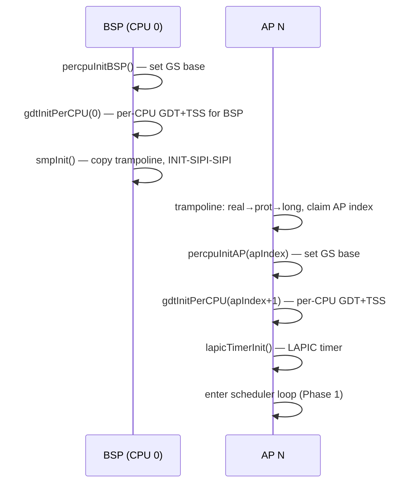

# SMP v2 — Per-CPU Storage and Synchronization Primitives

Foundation layer for all SMP v2 work. Every other `smp_*.md`
document references the per-CPU data layout and spinlock
primitive defined here.

Covers work plan items 1-4 from `smp_overview.md §4`.

## 1. Per-CPU Storage Mechanism

### 1.1 Choice: `IA32_GS_BASE` MSR

Each CPU writes its own per-CPU data block address into the
`IA32_GS_BASE` MSR (`0xC0000101`) at boot time. All per-CPU
reads use `%gs:offset` addressing, giving O(1) access without
LAPIC ID lookups.

**Rationale**: GS base is the standard Linux/xv6 approach for
per-CPU storage on x86_64. FS base is reserved for TLS (TinyGo
does not use it today, but keeping it available avoids future
conflicts). Reading the LAPIC ID register (`0xFEE00020`, bits
24-31) on every `cpuID()` call would cost ~100 cycles per MMIO
read vs. ~1 cycle for `%gs:offset`.

**Rejected**: (a) LAPIC ID lookup — too slow for hot paths like
`gooosOnResume`. (b) Fixed VA per CPU — wastes virtual address
space and requires page-table setup per CPU.

### 1.2 wrmsr / rdmsr Stubs

New assembly in `src/stubs.S`:

```asm
// wrmsr(msr uint32, val uint64)
// ECX = MSR number, EDX:EAX = value
.global wrmsr
wrmsr:
    movl %edi, %ecx       // MSR number
    movl %esi, %eax       // low 32 bits
    shrq $32, %rsi
    movl %esi, %edx       // high 32 bits
    wrmsr
    ret

// rdmsr(msr uint32) uint64
.global rdmsr
rdmsr:
    movl %edi, %ecx
    rdmsr
    shlq $32, %rdx
    orq  %rdx, %rax
    ret
```

Go declarations in `src/percpu.go`:

```go
//go:linkname wrmsr wrmsr
func wrmsr(msr uint32, val uint64)

//go:linkname rdmsr rdmsr
func rdmsr(msr uint32) uint64
```

### 1.3 Per-CPU Data Block

```go
// src/percpu.go

const maxCPUs = 17 // smpMaxAPs (16 APs) + 1 BSP

const (
    ia32GSBASE = 0xC0000101
)

// PerCPU is the per-CPU data block. Each CPU's GS base points
// to its own instance. Fields accessed from assembly must have
// stable offsets documented here.
type PerCPU struct {
    cpuIndex       uint32  // offset 0: CPU index (0 = BSP)
    interruptDepth uint32  // offset 4: ISR nesting counter
    systemStack    uintptr // offset 8: scheduler stack for TinyGo
    tssPtr         uintptr // offset 16: pointer to this CPU's TSS
    apicID         uint32  // offset 24: LAPIC APIC ID
    wantReschedule uint32  // offset 28: timer preemption flag (smp_kernel_lapic_and_ipi.md §5)
    currentPML4    uintptr // offset 32: CR3 of current goroutine (smp_user_multicore.md §6)
    currentPoolIdx int32   // offset 40: ring3 pool slot of current goroutine (-1 if kernel)
    _pad0          [20]byte // pad to 64-byte cache line boundary
}

// Assembly-visible byte offsets (must match struct layout).
const (
    pcpuOffCPUIndex        = 0
    pcpuOffInterruptDepth  = 4
    pcpuOffSystemStack     = 8
    pcpuOffTSSPtr          = 16
    pcpuOffAPICID          = 24
    pcpuOffWantReschedule  = 28
    pcpuOffCurrentPML4     = 32
    pcpuOffCurrentPoolIdx  = 40
)

// perCPUBlocks is the .bss-resident array. Each entry is
// cache-line aligned (64 bytes) to avoid false sharing.
var perCPUBlocks [maxCPUs]PerCPU
```

Each `PerCPU` is 32 bytes; pad to 64 bytes (cache line) by
adding `_pad [32]byte` at the end of the struct, or by
declaring the array element as a 64-byte-aligned wrapper:

```go
type PerCPUAligned struct {
    PerCPU
    _pad [32]byte // pad to 64-byte cache line
}
var perCPUBlocks [maxCPUs]PerCPUAligned
```

**Memory cost**: 17 CPUs x 64 bytes = 1088 bytes in `.bss`.
Negligible.

### 1.4 Initialization

**BSP** (in `main()`, before `smpInit`):

```go
func percpuInitBSP() {
    perCPUBlocks[0].cpuIndex = 0
    perCPUBlocks[0].apicID = lapicRead(lapicRegID) >> 24
    wrmsr(ia32GSBASE, uint64(uintptr(unsafe.Pointer(&perCPUBlocks[0]))))
}
```

**Each AP** (in `apEntry`, before scheduler):

```go
func percpuInitAP(apIndex uint64) {
    perCPUBlocks[apIndex+1].cpuIndex = uint32(apIndex + 1)
    perCPUBlocks[apIndex+1].apicID = lapicRead(lapicRegID) >> 24
    wrmsr(ia32GSBASE, uint64(uintptr(unsafe.Pointer(&perCPUBlocks[apIndex+1]))))
}
```

### 1.5 `cpuID()` Helper

```go
// cpuID returns the current CPU index (0 = BSP).
// Reads from %gs:0 — must be called after percpuInit.
//
//go:nosplit
func cpuID() uint32
```

Assembly (`src/stubs.S`):

```asm
.global cpuID
cpuID:
    movl %gs:0, %eax    // pcpuOffCPUIndex = 0
    ret
```

## 2. Files to Modify

| File | Change |
|---|---|
| `src/stubs.S` | Add `wrmsr`, `rdmsr`, `cpuID`, `spinlockAcquire`, `spinlockRelease` |
| `src/percpu.go` (new) | `PerCPU` struct, `perCPUBlocks`, `percpuInitBSP`, `cpuID` Go decl |
| `src/spinlock.go` (new) | `Spinlock` type, `Acquire`/`Release` wrappers |
| `src/smp.go` | `apEntry` calls `percpuInitAP` before idle/scheduler |
| `src/main.go` | Call `percpuInitBSP()` before `smpInit()` |
| `src/gdt.go` | Add `perCPUGDT`, `perCPUTSS` arrays; rewrite `tssSetRSP0` |
| `src/isr.S` | ISR prologue/epilogue: `%gs:4` instead of `gooos_in_interrupt_depth(%rip)` |
| `src/goroutine_irq.go` | Read interrupt depth from per-CPU block |

## 3. Boot Sequence with Per-CPU Init



## 4. Spinlock Primitive

### 4.1 Design

xchg-based test-and-set spinlock. The `xchg` instruction has
an implicit `lock` prefix on x86, providing full memory barrier.

```go
// src/spinlock.go

type Spinlock struct {
    locked uint32 // 0 = unlocked, 1 = locked
}

// Acquire disables interrupts and spins until the lock is held.
// Returns the saved RFLAGS for Restore on Release.
//
//go:nosplit
func (s *Spinlock) Acquire() uintptr {
    flags := readFlags()
    cli()
    spinlockAcquire(&s.locked)
    return flags
}

// Release releases the lock and restores interrupt state.
//
//go:nosplit
func (s *Spinlock) Release(flags uintptr) {
    spinlockRelease(&s.locked)
    restoreFlags(flags)
}
```

### 4.2 Assembly

```asm
// src/stubs.S

// spinlockAcquire(lock *uint32)
// Spins on xchg until lock is acquired.
.global spinlockAcquire
spinlockAcquire:
    movl    $1, %eax
.Lspin:
    xchgl   %eax, (%rdi)
    testl   %eax, %eax
    jnz     .Lspin
    ret

// spinlockRelease(lock *uint32)
// Releases the lock with a store + memory fence.
.global spinlockRelease
spinlockRelease:
    movl    $0, (%rdi)
    mfence
    ret
```

**Note**: `mfence` after the store ensures the unlock is
visible to other CPUs before the releasing CPU continues past
the critical section. On x86-TSO a plain `mov` store is
sufficient for the lock variable itself (stores are not
reordered with other stores), but `mfence` is conservative and
correct. Can be relaxed to a compiler barrier in a future
optimization pass if profiling shows contention.

### 4.3 Lock Ordering

To prevent deadlock, locks must be acquired in a fixed order.
Proposed canonical order (outermost first):

1. `pageAllocLock` — page allocator (`src/vm.go`)
2. `procLock` — `procByTask` / `procByPID` (`src/process.go`)
3. `gInfoLock` — `gInfoByTask` (`src/goroutine_tss.go`)
4. `vgaLock` — VGA console output (`src/vga.go`)

No function may hold a lower-numbered lock while acquiring a
higher-numbered one. Document this ordering in a comment at the
top of `src/spinlock.go`.

## 5. Per-CPU GDT + TSS

### 5.1 Current State

`src/gdt.go:36-37`:
```go
var gdtTable [gdtEntries]uint64  // single global
var tss      [tssSize]byte       // single global
```

`tssSetRSP0` (`src/gdt.go:126-128`) writes the single TSS:
```go
func tssSetRSP0(rsp0 uintptr) {
    *(*uint64)(unsafe.Pointer(&tss[4])) = uint64(rsp0)
}
```

### 5.2 Design

```go
var perCPUGDT [maxCPUs][gdtEntries]uint64
var perCPUTSS [maxCPUs][tssSize]byte
```

**`gdtInitPerCPU(cpuIdx int)`**: copies the BSP's GDT template
into `perCPUGDT[cpuIdx]`, builds a TSS descriptor pointing at
`perCPUTSS[cpuIdx]`, loads via `lgdt` + `ltr`.

**`tssSetRSP0(rsp0 uintptr)`** rewritten:
```go
func tssSetRSP0(rsp0 uintptr) {
    idx := cpuID()
    *(*uint64)(unsafe.Pointer(&perCPUTSS[idx][4])) = uint64(rsp0)
}
```

### 5.3 AP GDT Loading

Each AP must load its own GDT during `apEntry` (after
`percpuInitAP`). The trampoline's temporary GDT
(`src/trampoline.S:133-144`) is replaced with the per-CPU GDT
once `apEntry` runs in 64-bit mode.

The sequence in `apEntry`:
1. `percpuInitAP(apIndex)` — GS base set
2. `gdtInitPerCPU(apIndex + 1)` — per-CPU GDT + TSS loaded
3. LAPIC timer init (Phase 1)
4. Enter scheduler loop

## 6. Per-CPU Interrupt Depth

### 6.1 Current State

`src/isr.S:110,130`:
```asm
incl    gooos_in_interrupt_depth(%rip)  // prologue
decl    gooos_in_interrupt_depth(%rip)  // epilogue
```

Single `.bss` variable (`src/isr.S:168`). Comment at line 163
explicitly notes: "SMP v2 will need per-CPU counters."

### 6.2 Design

Replace RIP-relative access with GS-relative:

```asm
// ISR prologue (isr.S, replaces line 110)
incl    %gs:4    // pcpuOffInterruptDepth = 4

// ISR epilogue (isr.S, replaces line 130)
decl    %gs:4
```

Go-side read (`src/goroutine_irq.go`):
```go
//go:nosplit
func interruptDepth() uint32 {
    return *(*uint32)(unsafe.Pointer(
        readGSBase() + pcpuOffInterruptDepth))
}
```

Or, simpler — add an assembly helper:

```asm
.global readInterruptDepth
readInterruptDepth:
    movl %gs:4, %eax
    ret
```

The old `gooos_in_interrupt_depth` `.bss` symbol can be removed
once all references are migrated. The bridged
`runtime/interrupt/interrupt_gooos.go` must also be updated to
use the per-CPU accessor.

## 7. Verification

### Item 1 (Per-CPU storage)
- `make build` clean.
- Serial output: `"BSP cpuID=0"`, `"AP 0 cpuID=1"`, etc.
- `test_sendkey.sh 1` PASS (no regression).

### Item 2 (Spinlock)
- `make build` clean.
- Boot-time probe: BSP acquires spinlock, releases, re-acquires
  without deadlock.
- `test_sendkey.sh 1` PASS.

### Item 3 (Per-CPU GDT/TSS)
- `make build` clean.
- Each AP prints `"AP N: GDT+TSS loaded"` on serial.
- `test_sendkey.sh 1` PASS (Ring-3 transitions still work).

### Item 4 (Per-CPU interrupt depth)
- `make build` clean.
- ISR fires on BSP; `interrupt.In()` returns true inside handler.
- `test_sendkey.sh 1` PASS.

## 8. Open Questions

1. **Cache-line alignment of per-CPU blocks**: should
   `perCPUBlocks` entries be padded to 64 bytes (cache line) to
   prevent false sharing? Recommendation: yes — the ISR
   prologue/epilogue (`incl/decl %gs:4`) is extremely hot.

2. **readGSBase helper**: should Go code read the per-CPU block
   via `rdmsr(IA32_GS_BASE)` (slow, ~30 cycles) or via an
   assembly helper that uses `%gs`-relative addressing for each
   field? Recommendation: per-field assembly helpers (one per
   frequently-read field).

## 9. Risk Register Delta

**Adds:**
- `R-cache-coherency`: false sharing if per-CPU blocks are not
  cache-line aligned.
- `R-gs-base-clobber`: if any code writes GS base
  inadvertently, per-CPU storage breaks silently.
- `R-deadlock`: spinlock ordering violations. Mitigated by
  documented ordering (§4.3).

**Retires (when items land):**
- `R-b5-smp-atomics` (partial): spinlock primitive addresses
  the synchronization gap.

## Reviewer MINOR notes

(Filled after the reviewer pass; none initially.)
