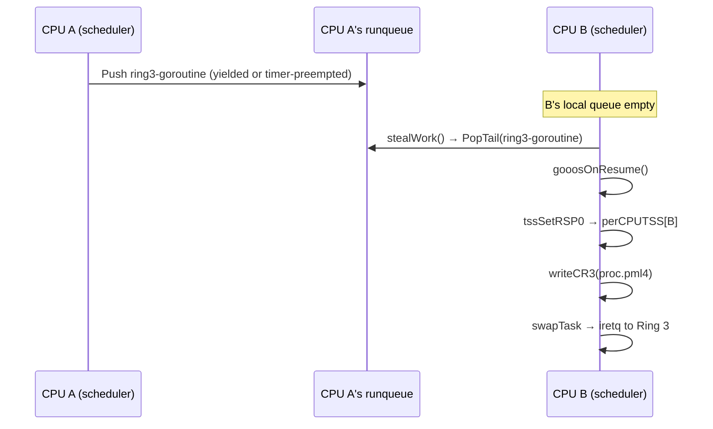

# SMP v2 — Userspace Multi-Core Support

Covers work plan items 15-17 from `smp_overview.md §4` (Phase 2).
Depends on the kernel-side foundation and scheduler work from
`smp_percpu_and_sync.md` (items 1-4) and
`smp_kernel_scheduler.md` (items 8-11).

## 1. Context

Each Ring-3 user process runs inside a dedicated kernel
goroutine spawned by `ring3Wrapper` (`src/process.go:172`).
Under SMP v1, all goroutines execute on the BSP. Under SMP v2,
the TinyGo scheduler distributes goroutines across CPUs — a
Ring-3 wrapper goroutine may run on any AP.

The existing `gooosOnResume` hook (`src/goroutine_tss.go:175-
201`) already handles two per-goroutine operations:

1. **TSS.RSP0** — sets the kernel stack top for Ring-3 → Ring-0
   transitions (`src/goroutine_tss.go:184`).
2. **CR3 swap** — loads the process's per-process PML4 into CR3
   (`src/goroutine_tss.go:192-199`).

Under SMP v2, `gooosOnResume` fires on whichever CPU the
goroutine is scheduled to. The key question is whether these
two operations remain correct when the target CPU is an AP
rather than the BSP.

## 2. TSS.RSP0 Under SMP

### 2.1 Current State

`tssSetRSP0` (`src/gdt.go:126-128`) writes into the single
global `tss[104]`:

```go
func tssSetRSP0(rsp0 uintptr) {
    *(*uint64)(unsafe.Pointer(&tss[4])) = uint64(rsp0)
}
```

With per-CPU TSS (`smp_percpu_and_sync.md §5`), this becomes:

```go
func tssSetRSP0(rsp0 uintptr) {
    idx := cpuID()
    *(*uint64)(unsafe.Pointer(&perCPUTSS[idx][4])) = uint64(rsp0)
}
```

### 2.2 Correctness

When a Ring-3 goroutine resumes on CPU N, `gooosOnResume` calls
`tssSetRSP0` which writes CPU N's TSS. If the goroutine then
transitions to Ring 0 via `int 0x80` or a timer interrupt, the
CPU reads RSP0 from its own TSS (loaded into the Task Register
via `ltr` during `gdtInitPerCPU`). This is correct — each
CPU's hardware reads only its own TSS.

**No code change needed** beyond the per-CPU TSS rewrite
already specified in `smp_percpu_and_sync.md §5`.

## 3. CR3 Swap Under SMP

### 3.1 Current State

`gooosOnResume` (`src/goroutine_tss.go:192-199`):

```go
if gi.proc != nil && gi.proc.pml4 != 0 {
    writeCR3(gi.proc.pml4)
} else {
    writeCR3(bootPML4)
}
```

### 3.2 Correctness

CR3 is per-CPU. Writing it on CPU N affects only CPU N's
address translation. When a Ring-3 goroutine moves from CPU A
to CPU B (via work stealing), `gooosOnResume` fires on CPU B
and writes the process's PML4 into CPU B's CR3. CPU A's CR3 is
left pointing at whatever PML4 it was using — either a
different process's PML4 or `bootPML4`. This is correct:
no process's pages are mapped in the wrong CPU's context.

**Subtlety**: CPU A may still have stale TLB entries from the
migrated process's PML4. These entries are harmless because:
- CPU A is now running a different goroutine (the scheduler or
  another process).
- If CPU A runs a kernel goroutine, it uses `bootPML4` — user
  addresses are unmapped, so stale user TLB entries never match
  a kernel access.
- If CPU A runs a different process, it loads that process's
  PML4 via `writeCR3`, which flushes all non-global TLB entries.
- If the original process exits and its pages are freed, TLB
  shootdown (item 16) invalidates stale entries on all CPUs.

**No code change needed** beyond ensuring TLB shootdown on
process exit (item 16).

## 4. Ring-3 Goroutine Migration

### 4.1 Work Stealing and Ring-3

When the scheduler on CPU B steals a Ring-3 goroutine from CPU
A's runqueue, the goroutine resumes on CPU B. The migration
path is:



### 4.2 Kernel Stack Safety

The Ring-3 goroutine's kernel stack (allocated from
`ring3StackPool`, `src/ring3_pool.go`) is a fixed 8 KiB
region. When the goroutine migrates from CPU A to CPU B, the
kernel stack contains data from CPU A's ISR context (saved
registers from the last `int 0x80` or timer interrupt on
CPU A).

On CPU B, `gooosOnResume` sets `perCPUTSS[B].RSP0` to this
goroutine's kernel stack top. When the user code next traps
into Ring 0, CPU B pushes its ISR frame onto the same kernel
stack. This is correct: the previous ISR frame was consumed by
`iretq` before the goroutine was placed back on the runqueue,
so the stack is clean.

**Invariant**: a Ring-3 goroutine is on the runqueue only when
its kernel stack is in a clean state (ISR frame fully consumed
by `iretq` or not yet created). This is guaranteed by the
existing ISR prologue/epilogue in `src/isr.S`.

## 5. `gInfoByTask` Under SMP

### 5.1 Problem

`gooosOnResume` reads `gInfoByTask` (`src/goroutine_tss.go:
180`), which is a Go `map[uintptr]*gInfo`. Under SMP, multiple
CPUs call `gooosOnResume` concurrently (each on its own
goroutine switch). Go maps are not thread-safe.

Additionally, `gooosOnResume` is `//go:nosplit`, meaning it
cannot trigger allocation. Go map reads can allocate (hash
bucket growth). This is the `R-nosplit-lock` risk from
`smp_overview.md §6`.

### 5.2 Solution

Replace the map with a fixed-size array indexed by the Ring-3
pool slot (`proc.poolIdx`):

```go
// src/goroutine_tss.go
var gInfoBySlot [maxRing3Procs]*gInfo
```

- `registerRing3G()`: `gInfoBySlot[proc.poolIdx] = &gInfo{...}`
- `unregisterRing3G()`: `gInfoBySlot[proc.poolIdx] = nil`
- `gooosOnResume()`: look up via
  `gInfoBySlot[currentProc().poolIdx]`

This eliminates map access entirely. The array is bounded by
`maxRing3Procs = 32` (`src/ring3_pool.go:20`), using 256 bytes.

For SMP safety:
- `registerRing3G` and `unregisterRing3G` are called from
  `ring3Wrapper` goroutine context — one writer per slot.
- `gooosOnResume` reads a slot that was written by the same
  goroutine's `registerRing3G`. No concurrent write to the
  same slot.
- Different slots accessed by different CPUs — no contention.

**No spinlock needed** on the array itself. The array is
effectively partitioned by pool slot.

### 5.3 `currentProc` in `gooosOnResume`

The current `gooosOnResume` uses `gInfoByTask[t]` to find the
`gInfo` entry, which also caches the `*Process` pointer
(`src/goroutine_tss.go:32-35`). With the array approach, we
need the pool index from the current goroutine.

Option A: Store pool index in the `gInfo` struct (set once
by `registerRing3G`, read by `gooosOnResume`).

Option B: Add pool index to the TinyGo Task struct (extends
the runtime patch surface).

**Recommendation**: Option A — store in `gInfo`. The
`gooosOnResume` path: `t := taskCurrent()` → look up `*gInfo`
by walking a small task-to-slot mapping (or storing the slot
index in the goroutine-local per-CPU block before entering
Ring 3). Since `gooosOnResume` must be nosplit, the mapping
must be allocation-free.

**Adopted approach**: store the pool index in the per-CPU data
block (`PerCPU.currentPoolIdx`, offset 40 — see
`smp_percpu_and_sync.md §1.3`). `setCurrentProc` writes
`perCPU[cpuID()].currentPoolIdx = proc.poolIdx` (or -1 for
kernel goroutines). `gooosOnResume` reads
`perCPU[cpuID()].currentPoolIdx` — O(1), no map access, no
linear scan, nosplit-safe.

This is consistent with `smp_kernel_data_audit.md §6` which
specifies the same per-CPU approach.

## 6. TLB Shootdown for User Pages

### 6.1 When Required

When `processExit` (`src/process.go:344-393`) frees a
process's user pages and PML4:

1. `freePage(proc.UserPaddrs[i])` — frees physical pages
   (`src/process.go:357-359`).
2. `freeProcPML4(proc.pml4)` — frees page-table pages
   (`src/process.go:379`).

After step 1, the physical pages may be reused by `allocPage`.
If another CPU still has the process's PML4 loaded in CR3
(because it cached a TLB entry before the process exited), it
could access a freed page via a stale TLB mapping.

### 6.2 When NOT Required

If no other CPU currently has this process's PML4 loaded in
CR3, no TLB shootdown is needed. This is the common case: a
process runs on one CPU at a time (its wrapper goroutine is
single-threaded).

### 6.3 Protocol

Before freeing user pages:

1. Switch the current CPU's CR3 to `bootPML4` (already done at
   `src/process.go:377-378`).
2. Check if any other CPU has `proc.pml4` loaded. This requires
   tracking each CPU's current CR3 (add `currentPML4 uintptr`
   to `PerCPU` struct, updated by `gooosOnResume` on every CR3
   swap).
3. If any CPU has the PML4: send TLB shootdown IPI to those
   CPUs (`smp_kernel_lapic_and_ipi.md §7`). Wait for ack.
4. Proceed with `freePage` / `freeProcPML4`.

### 6.4 Optimization

In practice, a single-threaded user process runs on one CPU.
When `processExit` fires, the wrapper goroutine is on the
exiting CPU. No other CPU should have this PML4. A simple
assertion + defensive broadcast covers the edge case where
work stealing moved the goroutine between `int 0x80` (syscall)
and `processExit` handling.

## 7. processExit Cross-CPU Cleanup

### 7.1 Current State

`processExit` (`src/process.go:344-393`) performs:

1. Free user physical pages (line 357-359)
2. Signal parent via `exitCh` (line 368)
3. Switch CR3 to bootPML4 (line 377-378)
4. Free PML4 (line 379)
5. `unregisterRing3G()` (line 389)
6. `clearCurrentProc()` (line 390)
7. `procCloseAll(proc)` (line 391)
8. `ring3StackRelease(proc.poolIdx)` (line 393)

### 7.2 SMP Concerns

Under SMP, concurrent goroutines may be accessing shared data
structures during `processExit`:

| Operation | Shared State | Lock Required |
|---|---|---|
| `freePage` | page allocator | `pageAllocLock` (from data audit) |
| `exitCh <- code` | Go channel | inherently safe |
| `freeProcPML4` | page allocator | `pageAllocLock` |
| `unregisterRing3G` | `gInfoBySlot` | none (per-slot, single writer) |
| `clearCurrentProc` | `procByTask` | `procLock` |
| `procCloseAll` | per-process fds | no shared state |
| `ring3StackRelease` | `ring3StackPoolCh` | Go channel, safe |

### 7.3 Changes Required

1. `clearCurrentProc()` and any `procByPID` removal must
   acquire `procLock`.
2. `freePage` / `allocPage` must acquire `pageAllocLock`.
3. TLB shootdown before freeing pages (§6).
4. `gInfoBySlot[poolIdx] = nil` is safe without lock (single
   writer per slot; readers only access their own slot).

## 8. `foregroundProc` Safety

`foregroundProc` (`src/process.go:97`, approximate) is a
`*Process` pointer that determines which process receives
keyboard input. Under SMP:

- Read by `consoleStdin.Read()` (on whatever CPU runs the
  reading goroutine).
- Written by `setForegroundProc()` (called during
  `sys_exec`/`sys_spawn`).

**Fix**: atomic pointer. Use `sync/atomic.StorePointer` /
`LoadPointer`, or protect with `procLock` (already acquired
during `sys_exec`/`sys_spawn`).

Recommendation: protect under `procLock` since spawn/exec
already hold it.

## 9. Files to Modify

| File | Change |
|---|---|
| `src/goroutine_tss.go` | Replace `gInfoByTask` map with `gInfoBySlot` array; add `taskToSlot` lookup |
| `src/process.go` | `clearCurrentProc` / `procByPID` removal under `procLock`; `foregroundProc` under `procLock` |
| `src/vm.go` | `freePage` / `allocPage` under `pageAllocLock` (covered by data audit) |
| `src/percpu.go` | Add `currentPML4 uintptr` field to `PerCPU` for TLB shootdown tracking |

## 10. Dependencies

- **Required before this phase**: items 1-4 (per-CPU storage,
  spinlock, GDT/TSS, ISR depth) + items 8-11 (scheduler) +
  item 13 (IPI).
- **Item 15** (Ring-3 on APs) depends on item 3 (per-CPU TSS).
- **Item 16** (TLB shootdown) depends on item 13 (IPI).
- **Item 17** (processExit) depends on item 12 (data audit
  fixes for pageAllocLock + procLock).

## 11. Verification

### Item 15 (Ring-3 on APs)
- `make build` clean under `-smp 4`.
- `test_sendkey.sh 1` PASS — shell boots and commands work.
- Serial log shows Ring-3 goroutines executing on APs
  (add `cpuID()` trace in `gooosOnResume` temporarily).
- `test_goprobe.sh` PASS — goroutines + channels work
  across CPUs.

### Item 16 (TLB shootdown)
- Rapid `exec` loop in shell: `ls; ls; ls; ...` (20 times).
  No page faults on stale TLB entries.
- `test_pipe_matrix.sh` under `-smp 4` — all PASS (exercises
  multi-process spawn/exit).

### Item 17 (processExit cleanup)
- `test_gochan.sh` under `-smp 4` — PASS (exercises
  goroutine lifecycle).
- No deadlocks or panics during concurrent process exit.
- Serial log shows `processExit` completing cleanly for each
  child process.

## 12. Open Questions

1. **Goroutine-to-CPU pinning for Ring-3**: should user
   processes be pinned to a CPU (no migration) for cache
   locality? Recommendation: no pinning for v2; the scheduler's
   work stealing naturally balances load.

2. **Per-process page fault handling on APs**: page faults from
   Ring-3 code on an AP need to be handled on that AP's ISR
   stack. The ISR frame includes the faulting RIP and CR2. With
   per-CPU `lastErrorCode` / `lastFramePtr`, this works
   correctly. No special handling needed.

3. **GC stop-the-world**: when a CPU triggers GC mark phase, it
   must stop all other CPUs' goroutines. This is a TinyGo
   runtime concern; the conservative GC's `GC()` path currently
   assumes single-threaded execution. May need an IPI-based
   stop-the-world protocol. Flag for detailed design during
   implementation.

## 13. Risk Register Delta

**Adds:**
- `R-gc-stop-world`: conservative GC assumes single CPU during
  mark phase. Under SMP, concurrent mutation during mark could
  miss live pointers. Needs stop-the-world or incremental GC.
- `R-tlb-stale-race`: window between `processExit` page free
  and TLB shootdown completion. Mitigated by shootdown-before-
  free ordering.

**Retires (when items land):**
- B2 (single TSS) via per-CPU TSS + Ring-3 migration support.
- B11 (no TLB shootdown) via shootdown protocol.

## Reviewer MINOR notes

(Filled after the reviewer pass; none initially.)
