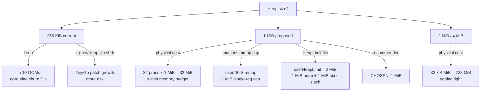

# Userspace `gc=conservative` — Linker-Script Design

Depends on `userspace_conservative_gc_overview.md`. Resolves
blockers U1 + U2 from §2 of that doc.

## 1. Context

TinyGo's conservative GC needs three things from the link
image to locate its roots:

1. A **`_globals_start` / `_globals_end` symbol pair** bracketing
   the writable globals region (`.data` + `.bss`). The GC scans
   every pointer-sized word in this range for live pointers.
2. A **synthetic `__ehdr_start`** — an Elf64 header at a
   well-known symbol. `runtime/os_linux.go:findGlobals()`
   parses it to extract PT_LOAD segments and derive the scan
   range. Without this, `findGlobals()` either reads stale
   kernel data (userspace is mapped above 1 GiB; the kernel's
   `__ehdr_start` is not in the user address space anyway) or
   crashes.
3. A **heap region** (`_heap_start` / `_heap_end`) the GC can
   manage. Already present in `user/linker_user.ld:43-45`; we
   will expand it.

The kernel already does all three in
`src/linker.ld:26,48` (globals) and `src/stubs.S:328-375`
(synthetic header). This doc ports both to userspace.

## 2. `_globals_start` / `_globals_end`

### 2.1 Current state

`user/linker_user.ld` (full file, 57 lines) defines:

- Entry `_start` at `0x40100000` (line 4).
- `.text`, `.rodata`, `.data`, `.bss` sections.
- `_heap_start` / `_heap_end` nested inside `.bss` (lines
  43-45) — 256 KiB region from `0x40000` bytes of padding.

It does **not** define `_globals_start` / `_globals_end`.

### 2.2 Proposed change

Mirror `src/linker.ld:26,48`:

```diff
     .rodata : {
         *(.rodata .rodata.*)
     }
+
+    _globals_start = .;
+
     . = ALIGN(4096);

     .data : {
         *(.data .data.*)
     }

     .bss : {
         *(.bss .bss.*)
         *(COMMON)

         . = ALIGN(4096);
         _heap_start = .;
-        . = . + 0x40000; /* 256 KiB fixed heap (matches design). */
+        . = . + 0x100000; /* 1 MiB fixed heap (gc=conservative). */
         _heap_end = .;
     }
+
+    _globals_end = .;
+    _globals_size = _globals_end - _globals_start;
```

Placement rationale:

- `_globals_start` sits **after `.rodata`** so the read-only
  section is excluded from the root scan (conservative GC
  scans writable memory only).
- `_globals_end` sits **after `.bss`** (including the heap
  region). **Wait** — the heap itself lives inside `.bss` via
  the nested `_heap_start..end`. Should the heap be inside or
  outside `[_globals_start, _globals_end)`?

### 2.3 Heap-inside-or-outside-globals

The kernel puts `.heap` **outside** `[_globals_start,
_globals_end)` (see `src/linker.ld:48,61-66`: `_globals_end`
is declared before the `.heap` section). The rationale: the
GC treats everything inside `[_globals_start, _globals_end)`
as a root-scan source; scanning the heap itself as a root
would pin every reachable object regardless of from where.

For userspace we should do the same. The heap region must sit
**after `_globals_end`**. But the current user linker nests
the heap inside `.bss`, which sits inside the globals window.

**Option A** — Move the heap out of `.bss`:

```diff
     .bss : {
         *(.bss .bss.*)
         *(COMMON)
-        . = ALIGN(4096);
-        _heap_start = .;
-        . = . + 0x100000;
-        _heap_end = .;
     }
+
+    _globals_end = .;
+    _globals_size = _globals_end - _globals_start;
+
+    .heap : ALIGN(4096) {
+        _heap_start = .;
+        . = . + 0x100000; /* 1 MiB */
+        _heap_end = .;
+    }
```

This requires the heap to be in a separate output section. To
avoid ld.lld emitting a PT_LOAD for a section full of zeros
(making ELFs huge on disk), the heap needs to be `@nobits`
(zero-filled at load time). The kernel declares this via a
`.heap` input section in `src/stubs.S:381` (`.section .heap,
"aw",@nobits` with `.skip 0x400000`). Userspace follows the
same pattern: add a `.heap` section to `user/rt0.S` (or a new
`user/heap.S`) and collect it in the linker script.

**Option B** — Keep the heap inside `.bss` but redefine
`_globals_end` to sit BEFORE `_heap_start`:

```diff
     .bss : {
         *(.bss .bss.*)
         *(COMMON)
+        _globals_end = .;
         . = ALIGN(4096);
         _heap_start = .;
         . = . + 0x100000;
         _heap_end = .;
     }
+    _globals_size = _globals_end - _globals_start;
```

Option B is simpler (no asm-side `.heap` input section), but
`_globals_end` inside a section output directive is subtler to
read. Kernel uses Option A.

### 2.4 Recommended

**Option A** to match the kernel pattern exactly. Move the
heap to its own `@nobits` section. Add the input section to
`user/rt0.S`:

```asm
    /* User heap — @nobits so the ELF loader zero-fills the
     * 1 MiB region without bloating the on-disk ELF. Mirror
     * of src/stubs.S:381-382. */
    .section .heap, "aw", @nobits
    .skip 0x100000
```

This keeps the on-disk ELF size ~identical to today even
though memsz grows by ~768 KiB. The kernel's `elfSpawn` /
`elfLoad` already handles memsz > filesz correctly (zero-fill
policy; the kernel's PT_LOAD walker allocates + zeros pages).

## 3. Synthetic `__ehdr_start`

### 3.1 Why

`runtime/os_linux.go:findGlobals()` parses an Elf64 header at
the address of the `__ehdr_start` symbol. GRUB loaded the
kernel's ELF header into memory at load time, but for **user
processes** the kernel's `elfSpawn` copies PT_LOAD segments
only — the ELF header is NOT present in the user address
space.

The kernel solves this by injecting a **synthetic Elf64 header
into `.rodata`** (`src/stubs.S:328-375`): a 64-byte Elf64_Ehdr
followed by a 56-byte Elf64_Phdr (PT_LOAD, PF_R|PF_W)
describing the globals region. When `findGlobals()` reads
`__ehdr_start`, it sees this synthetic header and derives
`p_vaddr = _globals_start`, `p_memsz = _globals_size`.

### 3.2 Where to put it in user

Two choices:

1. **Fold into `user/rt0.S`** (existing `.rodata` already in
   that file implicitly).
2. **New `user/ehdr.S`** — separate concerns, matches kernel
   (`src/stubs.S` is one big asm file of unrelated kernel
   plumbing, so the kernel choice is for history, not purity).

Recommended: **Fold into `user/rt0.S`**. It keeps the user
asm-file count at 3 (no new Makefile rule) and the header is
closely related to user-side startup.

### 3.3 Exact byte layout

Copy `src/stubs.S:341-375` verbatim. The only difference is
symbol references: user's `_globals_start` / `_globals_size`
instead of the kernel's. Both files use the same symbol
names, so this is literally the same block with no edits.

```asm
    .section .rodata,"a",@progbits
    .align 8
    .global __ehdr_start
__ehdr_start:
    /* Elf64_Ehdr (64 bytes) */
    .byte   0x7f, 0x45, 0x4c, 0x46   /* ELF magic */
    .byte   2                         /* ELFCLASS64 */
    .byte   1                         /* ELFDATA2LSB */
    .byte   1                         /* EV_CURRENT */
    .byte   0                         /* ELFOSABI_NONE */
    .byte   0                         /* ABI version */
    .zero   7                         /* padding */
    .short  2                         /* e_type: ET_EXEC */
    .short  0x3E                      /* e_machine: EM_X86_64 */
    .long   1                         /* e_version */
    .quad   0                         /* e_entry (unused) */
    .quad   64                        /* e_phoff */
    .quad   0                         /* e_shoff (unused) */
    .long   0                         /* e_flags */
    .short  64                        /* e_ehsize */
    .short  56                        /* e_phentsize */
    .short  1                         /* e_phnum */
    .short  0                         /* e_shentsize */
    .short  0                         /* e_shnum */
    .short  0                         /* e_shstrndx */

    /* Elf64_Phdr (56 bytes) — PT_LOAD for globals */
    .long   1                         /* p_type: PT_LOAD */
    .long   6                         /* p_flags: PF_R | PF_W */
    .quad   0                         /* p_offset (unused) */
    .quad   _globals_start            /* p_vaddr */
    .quad   0                         /* p_paddr (unused) */
    .quad   0                         /* p_filesz (unused) */
    .quad   _globals_size             /* p_memsz */
    .quad   0                         /* p_align (unused) */
```

### 3.4 Symbol override

ld.lld auto-defines `__ehdr_start` as a hidden symbol pointing
at the loaded ELF header address. User-defined global
`__ehdr_start` overrides this (same mechanism the kernel
relies on; comment at `src/stubs.S:337-338`). No special
linker flag needed.

## 4. Heap-Size Decision

Per overview §5 D2: **1 MiB fixed heap** (0x100000). Tradeoffs
analyzed:



- 1 MiB is 4× current. Unblocks `fib(10)` (~100 KiB heap
  peak), `gochan` churn, editor sessions.
- 32 concurrent Ring-3 procs × 1 MiB = 32 MiB physical
  (each process's 1 MiB heap is per-process PT_LOAD pages
  allocated by `elfSpawn`). Well within the ~950 MiB
  identity-mapped region available to `allocPage()`.
- Headroom for future bump without another linker-script
  touch-up.

## 5. Guard-Gap Policy

The kernel's linker reserves a 1-page guard gap between
`_heap_end` and `.pagetables` (`src/linker.ld:71`):

> Ensures GC metadata memset (which covers up to `_heap_end`)
> cannot touch page table memory even with off-by-one or
> inclusive bounds.

User processes have no page-table section (per-process PML4s
are allocated by the kernel via `newProcPML4`, not via the
user linker script). But the user linker should still honor
the principle: **add a 1-page guard after `_heap_end`** before
any subsequent section. Given Option A from §2.3, there's
nothing after `.heap` in user's linker script, so the guard is
a no-op at ELF layout time. We include it anyway for future-
proofing:

```asm
    .heap : ALIGN(4096) {
        _heap_start = .;
        . = . + 0x100000;
        _heap_end = .;
    }
    . += 4096;  /* guard gap, matches kernel convention */
```

## 6. `_alloc_start` Equivalent

Kernel has `_alloc_start = .` after `.pagetables` —
`allocPage()` starts bumping from there.

Userspace does not have a user-side page allocator. All user
heap allocations happen inside the `_heap_start.._heap_end`
range managed by TinyGo. There is **no** need for
`_alloc_start` in user.

## 7. Files to Modify

| File | Change |
|---|---|
| `user/linker_user.ld` | Add `_globals_start`/`_globals_end`/`_globals_size` symbols; move heap to separate `.heap` section; bump heap to 1 MiB; add 1-page guard gap |
| `user/rt0.S` | Add synthetic `__ehdr_start` in `.rodata`; add `.heap @nobits` input section with `.skip 0x100000` |

No other files touched by this design slice.

## 8. Verification

1. `make build` clean.
2. `nm user/build/hello.elf | grep -E '_globals_(start|end)'`
   returns two symbols bracketing `.data` + `.bss`.
3. `nm user/build/hello.elf | grep __ehdr_start` returns a
   `.rodata` address.
4. `readelf -l user/build/hello.elf | grep LOAD` shows a
   PT_LOAD whose memsz grew by ~768 KiB (the 1 MiB heap minus
   the removed 256 KiB).
5. All 10 user ELFs link cleanly (no symbol-collision errors
   with ld.lld's auto `__ehdr_start`).
6. Every existing `tmp/test_*.sh` harness still PASS — this
   slice does NOT flip the GC; `gc=leaking` continues to work
   with the new symbols present.

## 9. Dependencies

- None. This is the foundation; `runtime.md` and
  `verification.md` build on it.

## 10. Open Questions

1. **Should the `.heap` section's input-section name collide
   with the kernel's?** Both kernel and user declare a `.heap`
   input section via `@nobits`. Since they're in separate link
   graphs (kernel builds separately from each user ELF), no
   collision. No action required.
2. **`_alloc_start` in user?** No — see §6. Not needed.

## 11. Risk Register Delta

- **Retires**: `R-no-user-root-scan` — conservative GC now has
  a valid root range.
- **Adds**: `R-ehdr-collision` — see overview §6. Low
  probability; mitigated by proven kernel pattern.

## 12. Reviewer MINOR notes

Reviewer pass — see `overview.md §10` for the consolidated
list. This doc's specific follow-ups:
- Option A (heap out of `.bss`) is the chosen approach; `§2.3`
  discusses the Option B alternative for context only.
