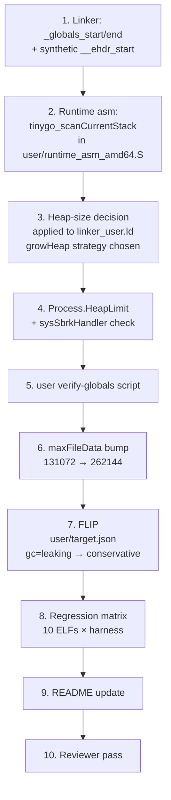
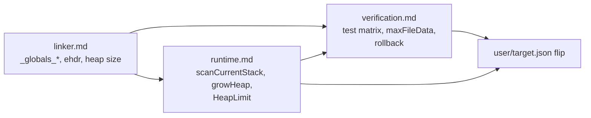

# Userspace `gc=conservative` Migration — Overview

This document is the entry point to the design set for migrating
every gooos user ELF from TinyGo's `gc=leaking` to
`gc=conservative`. Siblings: `userspace_conservative_gc_linker.md`,
`userspace_conservative_gc_runtime.md`,
`userspace_conservative_gc_verification.md`.

Produces **design documents only** — implementation is a future
Claude Code session's job.

## 1. Problem Statement

`user/target.json:8` sets `"gc": "leaking"`. Under that setting,
TinyGo's bump allocator never reclaims memory: every `make`,
`append`, `new`, goroutine stack, chan header, and map bucket
stays alive for the life of the process. Against the **256 KiB
fixed user heap** (`user/linker_user.ld:43-45`), this means:

- `fib(10)` in Tiny C — 177 recursive calls × ~560 B per
  `callFunc` frame + Env maps → exhausts the heap. Already
  documented as a deferred item (Tiny C tests use `fib(7)`).
- Any user program with a long-running goroutine pool
  (`gochan`, `goprobe`, or a hypothetical future long-lived
  service) accumulates goroutine stacks until OOM.
- Editor sessions with heavy insert/delete burn heap on every
  line split / join.

Kernel-side, `gc=conservative` (`src/target.json:8`) has been
working since the beginning of the project. Porting the same
pattern to user is mostly mechanical: define the right linker
symbols, add a stack-scan asm stub, synthesize an ELF header so
`findGlobals()` can locate user globals, and flip the JSON
switch.

## 2. Inventory of Blockers

Every blocker maps to the sibling doc that resolves it:

| # | Blocker | Location | Resolved in |
|---|---|---|---|
| U1 | `user/linker_user.ld` does not define `_globals_start` / `_globals_end`; conservative GC has no root scan range | `user/linker_user.ld` (full file) | `linker.md §2` |
| U2 | No synthetic `__ehdr_start` in user builds; `findGlobals()` will either fail or read stale kernel data | `user/rt0.S` / `user/runtime_asm_amd64.S` | `linker.md §3` |
| U3 | No userspace `tinygo_scanCurrentStack`; the weak dummy in `src/stubs.S:267-269` is kernel-only and conservative GC must scan the live goroutine stack | `src/stubs.S:248-264` (kernel reference) | `runtime.md §2` |
| U4 | `baremetal.go:growHeap` returns `false` unconditionally (`~/.local/tinygo/src/runtime/baremetal.go:34-37`); under heap pressure user programs OOM-panic | `user/linker_user.ld` + heap-size choice | `runtime.md §3` |
| U5 | `sysSbrkHandler` has no per-process heap ceiling (`src/userspace.go:420-447`); a runaway user could exhaust kernel physical memory | `src/process.go` + `src/userspace.go` | `runtime.md §4` |
| U6 | `tinyc.elf` at 126,512 B (123.5 KiB) already crowds the 128 KiB `maxFileData` cap (`src/fs.go:12`); conservative GC adds code + metadata + synthetic ELF header | `src/fs.go:12` | `verification.md §3` |
| U7 | `scripts/verify_globals.sh` only runs on the kernel binary; no equivalent asserts the user-binary runtime queues live inside the globals range | `scripts/verify_globals.sh` | `verification.md §4` |
| U8 | `maxFileData` bump risks overshooting the kernel `.bss` budget; 32 × 256 KiB = 8 MiB must fit cleanly alongside the 4 MiB heap | `src/linker.ld` heap region | `verification.md §3` |

Items already in our favor:

- The kernel-side pattern is proven: `src/linker.ld:26,48` for
  `_globals_start/end`, `src/stubs.S:328-375` for the synthetic
  ELF header, `src/stubs.S:248-264` for
  `tinygo_scanCurrentStack`. Every piece has a working
  reference implementation.
- `user/Makefile:31-52` already assembles three `.S` files
  (`rt0.S`, `task_stack_amd64.S`, `runtime_asm_amd64.S`) — the
  build system absorbs new asm without restructuring.
- `user/gooos/runtime_hooks.go` already supplies
  `gooosOnResume` / `gooosStackOverflow` and uses
  `//go:linkname` — it's a natural home for a `growHeap`
  override if we take option (b).

## 3. Implementation Phasing

Every intermediate commit keeps `make build` clean and every
`tmp/test_*.sh` harness green. The JSON flip (`gc=leaking` →
`gc=conservative`) is the FINAL user-visible step, not the
first; the linker + runtime plumbing lands beforehand so the
flip is a one-line change with immediate verification.

## 4. Dependency DAG

The JSON flip depends on every sibling doc being implemented.
Doing it first would make every user ELF unlinkable
(`tinygo_scanstack` undefined, `findGlobals` crashes).

## 5. Key Decisions (locked during design)

| # | Decision | Choice | Rationale |
|---|---|---|---|
| D1 | `growHeap` strategy (a/b/c) | **(c)** Bump fixed `.bss` heap, keep `growHeap=false` | No new TinyGo patch surface; 1 MiB per-process footprint acceptable (32 × 1 MiB = 32 MiB worst case, well under the 4 MiB kernel heap's physical budget since user heaps live in each process's own PT_LOAD pages, not in the kernel heap) |
| D2 | User fixed-heap size | **1 MiB** (0x100000) | 4× the current 256 KiB; covers `fib(10)` + goroutine churn in `gochan`/`goprobe` with headroom |
| D3 | Per-process ceiling | **`Process.HeapLimit` field**, enforced in `sysSbrkHandler` | Even though `growHeap=false` means sbrks aren't triggered by `gc=conservative`, `sys_sbrk` is callable directly and must have bounds. Locked in per user instruction. |
| D4 | Synthetic ELF header placement | **Extend `user/rt0.S`** rather than a new `.S` file | Mirrors `src/stubs.S:328-375`; keeps user asm count at 3 files |
| D5 | `tinygo_scanCurrentStack` placement | **Fold into `user/runtime_asm_amd64.S`** | Existing file already holds TinyGo runtime asm (`tinygo_longjmp`); no new build-system wiring |
| D6 | `maxFileData` new value | **262144 (256 KiB)** | One doubling ahead of current peak (`tinyc.elf` at 126,512 B + ~10–16 KiB conservative GC overhead ≈ 137–143 KiB). 32 slots × 256 KiB = 8 MiB `.bss` footprint (tolerable; FS lives in globals, not kernel heap) |
| D7 | User verify-globals check | **New `scripts/verify_globals_user.sh`**, run once per ELF | Generalization of `scripts/verify_globals.sh`; parameterized by ELF path |
| D8 | JSON flip placement in phasing | **Second-to-last** | Every piece of plumbing must land before the flip so the very first conservative-GC build is already correct |

## 6. Risk Register

| Risk | Probability | Impact | Mitigation |
|---|---|---|---|
| R-user-elf-overflow | High | tinyc.elf exceeds 128 KiB cap | D6 bumps `maxFileData` to 256 KiB pre-flip |
| R-false-positive-pin | Medium | Conservative GC keeps some heap live because integer values look like pointers | Small user heap (1 MiB) limits waste; document as accepted for v1 |
| R-goroutine-stack-pinning | Medium | Goroutine stacks in `gochan`/`goprobe` are heap-allocated; their content is scanned; values on one stack may pin another | Accept — same behavior as kernel |
| R-sbrk-runaway | Low (pre-D3) / Nil (post-D3) | A buggy user program calls `sys_sbrk` in a loop, exhausts kernel physical memory | D3: `HeapLimit` ceiling |
| R-scan-unsafe-sleep | Low | `tinygo_scanstack` running while a Ring-3 goroutine is mid-syscall could read inconsistent state | Accept — same as kernel; GC runs on the allocating goroutine, not preemptively |
| R-ehdr-collision | Low | User `__ehdr_start` overrides ld.lld's auto-defined hidden symbol incorrectly | Mirrors proven kernel pattern (`src/stubs.S:337-338` comment explains override semantics) |

## 7. Work Plan (step-by-step)

Convention matches `TODO_VI.md` / `TODO_TC.md`: one commit per
item, each item has explicit verification. A future Claude Code
session will create `TODO_USGC.md` at the project root from
this skeleton.

- [ ] **1. Linker foundation: `_globals_start`/`_globals_end`,
      synthetic `__ehdr_start`, heap moved out of `.bss`,
      1 MiB heap reservation (atomic commit)**
  - Edit `user/linker_user.ld`: add `_globals_start = .` after
    `.rodata`; move the heap OUT of `.bss` into a dedicated
    `.heap : ALIGN(4096) { *(.heap) }` output section; add
    `_globals_end = .` + `_globals_size` immediately after
    `.bss` (and BEFORE `.heap`); add 1-page guard gap after
    `.heap`. See `linker.md §2.3 Option A`.
  - Edit `user/rt0.S`: add `.heap @nobits` input section with
    `.skip 0x100000` (1 MiB); add synthetic `__ehdr_start`
    Elf64 header (mirror of `src/stubs.S:341-375`).
  - These three edits MUST land in the same commit — an
    intermediate commit with globals range covering the heap
    would make `findGlobals()` scan the heap as a root (pinning
    every allocation).
  - Verify: `make build` clean;
    `nm user/build/hello.elf | grep -E '_globals_(start|end)'`
    returns two symbols bracketing `.data` + `.bss` BUT NOT
    the heap; `nm ... | grep __ehdr_start` non-empty;
    `readelf -l user/build/hello.elf` shows PT_LOAD memsz > filesz
    (heap is `@nobits`); every existing harness still green.
  - Detail: `linker.md §2–§4`.

- [ ] **2. Runtime asm: `tinygo_scanCurrentStack` in
      `user/runtime_asm_amd64.S`**
  - Port the body of `src/stubs.S:248-264` (callee-saved push,
    RSP-as-arg call `tinygo_scanstack`, cleanup, ret) + the
    weak `tinygo_scanstack` dummy.
  - Verify: `make build` clean; `nm user/build/hello.elf |
    grep tinygo_scanCurrentStack` non-empty; harnesses
    unaffected.
  - Detail: `runtime.md §2`.

- [ ] **3. `Process.HeapLimit` + `sysSbrkHandler` enforcement**
  - Add `HeapLimit uintptr` to `Process` struct
    (`src/process.go`).
  - **Both** `elfSpawn` (in `src/process.go`, around the
    `HeapBreak` init site at `:288`) and `elfLoad`
    (`src/elf.go:228`) must set
    `HeapLimit = HeapBreak + userHeapLimit` where
    `userHeapLimit = 2*1024*1024` (2 MiB — covers the 1 MiB
    heap reservation plus 1 MiB of sbrk slack). Missing the
    `elfSpawn` site would leave forked children with
    `HeapLimit = 0` and immediate -1 on any sbrk.
  - `sysSbrkHandler` (`src/userspace.go:420-447`): before
    mapping pages, check `newBreak <= proc.HeapLimit`; if not,
    return -1 in RAX.
  - Verify: `make build` clean; a sbrk-probe test (manual or
    one-shot) confirms -1 is returned past the ceiling; all
    existing harnesses green (none hit the ceiling under
    normal use).
  - Detail: `runtime.md §4`.

- [ ] **4. `scripts/verify_globals_user.sh`**
  - Generalization of `scripts/verify_globals.sh`; takes an
    ELF path argument; asserts `runtime.runqueue` /
    `sleepQueue` / `timerQueue` live inside `[_globals_start,
    _globals_end)`.
  - Hook into `user/Makefile`'s ELF link rule: run the check
    after each `ld.lld` invocation.
  - Verify: script runs green against every current user ELF
    (pre-flip all under `gc=leaking`, but the symbols are
    now defined so the assertion is meaningful).
  - Detail: `verification.md §4`.

- [ ] **5. `maxFileData` bump to 256 KiB**
  - `src/fs.go:12` change 131072 → 262144.
  - Update comment + any size-audit script.
  - Verify: `make build` clean; kernel `.bss` doubles for the
    FS array (expected +4 MiB); `verify-globals: OK`.
  - Detail: `verification.md §3`.

- [ ] **6. FLIP: `user/target.json` gc=leaking → gc=conservative**
  - Single-character-ish JSON edit.
  - Verify: `make build` clean; every user ELF's linker step
    succeeds (no `tinygo_scanstack` undefined errors);
    `verify_globals_user.sh` green per ELF.
  - Detail: whole design set.

- [ ] **7. Regression matrix: 10 ELFs × harness**
  - `tmp/test_sendkey.sh` × 10, `test_fd_probe.sh`,
    `test_redirect.sh`, `test_pipe.sh`, `test_wc_pipe.sh`,
    `test_pipe_matrix.sh`, `test_goprobe.sh`,
    `test_gochan.sh`, `test_tinyc.sh`, `test_edit.sh`.
  - For each, assert PASS. Record per-binary behavior deltas
    (e.g., `fib.tc` now succeeds at `fib(10)`).
  - Detail: `verification.md §2`.

- [ ] **8. README.md update**
  - Add a "Userspace conservative GC" progress-table row OR
    update the existing "Userspace goroutines & channels" row
    to reflect `gc=conservative`.
  - Remove any stale `gc=leaking` mentions in the intro
    paragraph or elsewhere in the README.
  - Note the lifted constraint: `fib(10)` now works in Tiny C,
    long-running user programs no longer leak.
  - Update `current_impl_doc/userland.md` and
    `current_impl_doc/memory.md` to reflect the new user GC
    state and 1 MiB heap.

- [ ] **9. Reviewer pass + completeness**
  - Launch `general-purpose` reviewer subagent against the
    final state.
  - Classify CRITICAL / MAJOR / MINOR. Fix CRITICAL+MAJOR
    inline. Record MINOR in TODO_USGC.md tail.
  - Cross-reference TODO_USGC.md vs. commits (`git log
    --oneline`).
  - `grep -rn 'TODO\|FIXME\|XXX'` over the diff range shows
    no new markers.

## 8. Deferred / Post-v1

- **Switch `gc=conservative` back to `gc=leaking` for a
  specific short-lived program** — could be selective via a
  per-ELF target override. Not needed for v1; every user
  program is fine under conservative.
- **Heap-growth via `sys_sbrk` (option b from the trade study)**
  — if 1 MiB per process isn't enough in the future, implement
  option (b) then. TinyGo patch surface would grow by one new
  hook; `baremetal.go:growHeap` would be overridden via
  `//go:linkname runtime.growHeap` from `runtime_gooos_user.go`.
- **Precise GC** — would need TinyGo upstream work or a fork.
  Out of scope indefinitely.

## 9. Risk Register Delta

**Retires** (once implementation lands):
- `R-user-gc-leak` (from `userspace_gc_and_stacks.md §1`) —
  heap can now reclaim.

**Adds**:
- `R-user-false-positive-pin` — conservative-GC false
  positives may keep unreachable blocks live; bounded by the
  1 MiB heap ceiling, not catastrophic.
- `R-sbrk-past-heaplimit` — user program trying to sbrk past
  `HeapLimit` gets -1 and OOM-panics; document and accept.

## 10. Reviewer MINOR notes

Reviewer subagent pass: CRITICAL=0, MAJOR=2 (both fixed),
MINOR=5 (4 fixed, 1 cosmetic left).

- **MAJOR-1 (fixed)**: Step 1 and Step 3 consolidated into a
  single atomic commit so the intermediate tree never has the
  globals range overlapping the heap. Work plan renumbered to
  9 items.
- **MAJOR-2 (fixed)**: `runtime.md §4.2` now explicitly cites
  BOTH `src/elf.go:228` (elfLoad path) and
  `src/process.go:288` (elfSpawn path) for `HeapLimit` init;
  Files-to-Modify table updated accordingly.
- **MINOR-1 (fixed)**: `tinyc.elf` size normalized to
  "126,512 B (123.5 KiB)" in overview references.
- **MINOR-3 (fixed)**: `user/rt0.S:mmap` citation now includes
  the line range `:108-122`.
- **MINOR-4 (fixed)**: `verification.md §3.2` bitmap estimate
  corrected to 2 bits/block (~16 KiB, not 8 KiB). Doesn't
  change the 256 KiB cap decision.
- **MINOR-5 (fixed)**: `userHeapLimit` wording clarified —
  "2 MiB covers the 1 MiB heap plus 1 MiB sbrk slack".
- **MINOR-2 (cosmetic, left as-is)**: Mermaid nodes with
  `✓`/`✗` render as literal characters. Harmless; readable.
