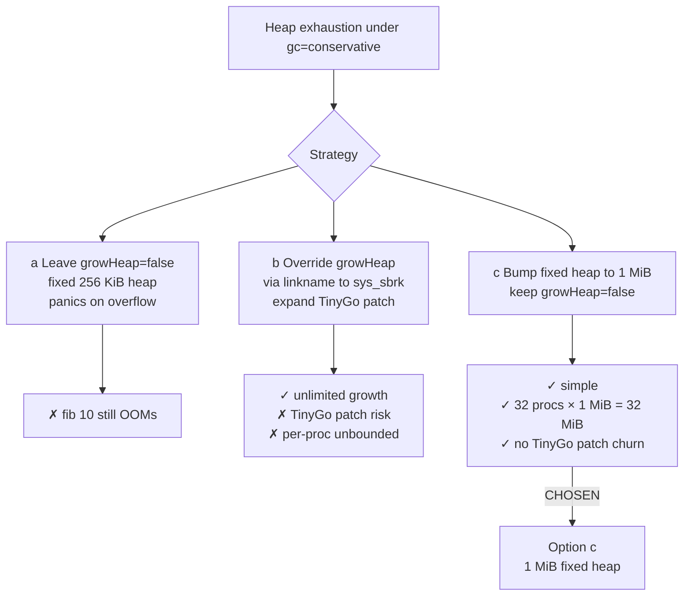

# Userspace `gc=conservative` — Runtime Design

Depends on `userspace_conservative_gc_overview.md` and
`userspace_conservative_gc_linker.md`. Resolves blockers
U3, U4, U5 from overview §2.

## 1. Context

Even with `_globals_start/_globals_end` in place (see
`linker.md §2`), TinyGo's conservative GC needs two runtime
pieces:

1. `tinygo_scanCurrentStack` — an asm trampoline that pushes
   callee-saved registers, then calls `tinygo_scanstack(sp)`.
   The Go-side body lives in TinyGo's `gc_stack_raw.go` and
   walks the stack from `sp` up to the goroutine's stackTop,
   scanning every pointer-sized word for live pointers.
2. A working allocator strategy. `baremetal.go:growHeap`
   returns `false` unconditionally
   (`~/.local/tinygo/src/runtime/baremetal.go:34-37`), so when
   the user heap fills, the GC runs. If the GC reclaims
   enough, allocation continues; otherwise the program panics
   "out of memory."

This doc specifies both.

## 2. `tinygo_scanCurrentStack` in userspace

### 2.1 Current state

The kernel has it in `src/stubs.S:248-264` with a weak
fallback at `:267-269`:

```asm
.global tinygo_scanCurrentStack
tinygo_scanCurrentStack:
    pushq   %rbx
    pushq   %rbp
    pushq   %r12
    pushq   %r13
    pushq   %r14
    pushq   %r15
    subq    $8, %rsp         /* 16-byte stack alignment */
    movq    %rsp, %rdi       /* sp → arg 1 */
    callq   tinygo_scanstack
    addq    $56, %rsp        /* 6 regs + align = 56 */
    retq

/* Dummy for gc=leaking (never called, satisfies link) */
.weak   tinygo_scanstack
tinygo_scanstack:
    retq
```

`tinygo_scanstack` is the real Go-side scanner under
`gc=conservative`. Under `gc=leaking` it's unused, but the
weak stub keeps linking possible even in leaking builds.

User binaries currently have no `tinygo_scanCurrentStack` — so
switching to `gc=conservative` would fail to link with
"undefined reference to tinygo_scanCurrentStack."

### 2.2 Placement

The user-side asm-file set today is:

- `user/rt0.S` — `_start`, syscall trampolines, ring3 entry.
- `user/task_stack_amd64.S` — TinyGo scheduler context-switch
  stubs.
- `user/runtime_asm_amd64.S` — `tinygo_longjmp` (panic
  unwinder).

`tinygo_scanCurrentStack` is TinyGo-runtime-level asm, closest
relative to `tinygo_longjmp`. **Fold into
`user/runtime_asm_amd64.S`**:

```asm
/* tinygo_scanCurrentStack — conservative-GC stack scanner.
 * Body is a byte-for-byte copy of src/stubs.S:248-264. Under
 * gc=conservative TinyGo's gc_stack_raw.go supplies the
 * real tinygo_scanstack body; under gc=leaking the weak
 * dummy below keeps the link graph intact.
 */
.section .text.tinygo_scanCurrentStack
.global tinygo_scanCurrentStack
tinygo_scanCurrentStack:
    pushq   %rbx
    pushq   %rbp
    pushq   %r12
    pushq   %r13
    pushq   %r14
    pushq   %r15
    subq    $8, %rsp
    movq    %rsp, %rdi
    callq   tinygo_scanstack
    addq    $56, %rsp
    retq

.weak   tinygo_scanstack
tinygo_scanstack:
    retq
```

### 2.3 Why not a separate `.S` file?

Folding keeps `user/Makefile` unchanged (the existing pattern
rule assembles `runtime_asm_amd64.S`). A separate file would
add another `as --64` line, another `build/*.o` dependency,
and another `ld.lld` arg to every ELF target. No functional
benefit.

## 3. `growHeap` Strategy

### 3.1 Three options reconsidered



### 3.2 Option (c) locked

Per overview §5 D1/D2:

- `user/linker_user.ld` heap grows from 256 KiB → 1 MiB. See
  `linker.md §4`.
- `growHeap` stays `false`. No TinyGo patch changes.
- Conservative GC behavior: when the heap fills, GC mark/sweep
  runs; if enough is reclaimed, alloc continues; otherwise
  `growHeap()` returns false, the runtime panics "out of
  memory" and `gooosStackOverflow` / `runtime.runtimePanic`
  fires through the patched path.

### 3.3 Why not option (b)

- Patch `scripts/tinygo_runtime.patch` surface would grow
  (new linkname override in `runtime_gooos_user.go` pointing
  at a userspace `gooos.growHeap` that calls `sys_sbrk`).
- `sys_sbrk` already exists (`src/userspace.go:420-447`) and
  is usable — but giving TinyGo unlimited growth means every
  allocation can trigger a syscall round-trip. Latency and
  complexity rise.
- Deferred: re-examine if the 1 MiB ceiling ever proves
  insufficient for a real workload.

## 4. `Process.HeapLimit`

### 4.1 Motivation

Per user-locked decision (overview §5 D3):
`sysSbrkHandler` (`src/userspace.go:420-447`) enforces no
per-process heap ceiling today. Under `gc=leaking` this
didn't matter — TinyGo never called `mmap`/`sbrk` (baremetal
growHeap returns false). Under `gc=conservative` the same
story holds (growHeap still false), but the kernel-side
syscall is still reachable from user asm (`user/rt0.S:108-122`
— the `mmap` TinyGo runtime stub falls through to
`sys_sbrk`) and from a hand-rolled Go call to
`syscall1(sysSbrk, ...)`. A buggy or hostile user program
could loop calling `sys_sbrk`, exhausting kernel physical
memory.

Adding a per-process cap is cheap and works under any
`growHeap` strategy (a/b/c).

### 4.2 Design

Add a field to `Process`:

```go
type Process struct {
    // ... existing fields ...
    HeapBreak uintptr       // existing — current break
    HeapLimit uintptr       // NEW — max break
}
```

Kernel-side constant:

```go
// src/process.go or src/userspace.go
const userHeapLimit = 2 * 1024 * 1024  // 2 MiB: 1 MiB heap + 1 MiB slack
```

The slack leaves room for any `sys_sbrk` call the user side
might make defensively (e.g., a future `gc=conservative`
tuning that tries to pre-expand). 2 MiB is still tiny — 32
procs × 2 MiB = 64 MiB physical worst case.

**Both** ELF-launch paths must set `HeapLimit = HeapBreak +
userHeapLimit` immediately after computing initial
`HeapBreak`:

- `elfLoad` in `src/elf.go:228` — the boot-shell path.
- `elfSpawn` in `src/process.go:288` — the fork/exec path
  used by `sys_spawn` and `sys_exec`. Missing this site
  leaves every forked child with `HeapLimit = 0`, making
  every subsequent `sys_sbrk` return -1 immediately.

### 4.3 Enforcement in `sysSbrkHandler`

```go
// src/userspace.go:420+ (body adjustments shown with +/-)
func sysSbrkHandler(frame *SyscallFrame) {
    proc := currentProc()
    increment := frame.RDI

    if increment == 0 {
        frame.RAX = proc.HeapBreak
        return
    }

    oldBreak := proc.HeapBreak
    newBreak := oldBreak + increment

+   // Enforce per-process heap ceiling.
+   if newBreak > proc.HeapLimit {
+       frame.RAX = 0xFFFFFFFFFFFFFFFF // -1
+       return
+   }

    // ... existing page-mapping loop ...
    proc.HeapBreak = newBreak
    frame.RAX = oldBreak
}
```

Return -1 on overflow. TinyGo's `runtime/arch_tinygowasm.go`
/ `baremetal.go` path treats growHeap=false the same as
sys_sbrk=-1 — panics "out of memory." User code sees the
panic on serial via the existing `gooosStackOverflow` /
`runtime.runtimePanic` path.

### 4.4 Cost

- One `uintptr` field per `Process` (8 B × 32 = 256 B of
  `.bss`).
- One `if` per `sys_sbrk` invocation. Negligible.

## 5. Interaction with `user/gooos/runtime_hooks.go`

Current file (42 lines):

```go
// user/gooos/runtime_hooks.go
//go:linkname gooosOnResume runtime.gooosOnResume
//go:nosplit
func gooosOnResume() { /* no TSS to update in Ring 3 */ }

//go:linkname gooosStackOverflow runtime.gooosStackOverflow
//go:nosplit
func gooosStackOverflow(_ uintptr) {
    msg := "gooos: user goroutine stack overflow\n"
    // sys_write + sys_exit
}
```

Under `gc=conservative`:

- `gooosOnResume` is unchanged — still no TSS to update,
  still `//go:nosplit`.
- `gooosStackOverflow` is unchanged — the canary-check path
  that calls it is identical regardless of GC mode.

**No edits to `runtime_hooks.go` for this migration.** The GC
mark/sweep path lives inside TinyGo itself
(`gc_conservative.go`, `gc_stack_raw.go`); gooos's only
userspace hooks are the resume and overflow ones, both
GC-mode-agnostic.

Optional safety audit: verify `runtime.runtimePanic` (called
on heap exhaustion) eventually routes through `putchar` in
`runtime_gooos_user.go:52-54` (which calls
`sys_write(fd=1)`) and then `exit` at lines 61-63 (sys_exit).
Already confirmed via the stack-overflow path; heap-OOM uses
the same panic plumbing.

## 6. Files to Modify

| File | Change |
|---|---|
| `user/runtime_asm_amd64.S` | Add `tinygo_scanCurrentStack` body + weak `tinygo_scanstack` dummy (port from `src/stubs.S:248-269`) |
| `src/process.go` | Add `HeapLimit uintptr` field to `Process` struct |
| `src/elf.go:228` | After setting `HeapBreak` (boot-shell path in `elfLoad`), set `HeapLimit = HeapBreak + userHeapLimit` |
| `src/process.go:288` | After setting `HeapBreak` (fork/exec path in `elfSpawn`), set `HeapLimit = HeapBreak + userHeapLimit`. **Both sites required** |
| `src/userspace.go:420-447` | Pre-check `newBreak > proc.HeapLimit` → return -1 |

## 7. Verification

1. **Pre-flip** (after §2 asm lands, while still on
   `gc=leaking`): `make build` clean; `nm user/build/hello.elf
   | grep tinygo_scanCurrentStack` non-empty; existing
   harnesses unchanged.
2. **HeapLimit enforcement**: craft a probe user program that
   calls `syscall1(sysSbrk, 0x100000)` in a loop. After the
   limit, expect -1. Verify via a one-shot harness or manual
   `make run`.
3. **Post-flip** (after `gc=conservative`): `fib(10)` in Tiny
   C completes without OOM (restore the fixture from `fib(7)`
   → `fib(10)`). Accept that reclamation happened if the
   program prints `55`.

## 8. Dependencies

- `userspace_conservative_gc_linker.md` must land first
  (heap region sized, globals brackets in place, synthetic
  ELF header present).

## 9. Open Questions

1. **Does `sys_sbrk` still need to map pages under growHeap=
   false?** Yes — if user asm (`user/rt0.S:mmap`) or a
   future wrapper calls `sys_sbrk`, the kernel must still
   honor it (subject to `HeapLimit`). The mapping loop in
   `sysSbrkHandler` is kept intact.
2. **Should `HeapLimit` be configurable per user binary?**
   Not for v1. A single `userHeapLimit` constant suffices. If
   a future user program needs more, revisit.

## 10. Risk Register Delta

- **Retires**: `R-user-heap-exhaustion-silent` — now bounded
  + reclaimable.
- **Adds**: `R-sbrk-past-heaplimit` (from overview §6) — user
  program hitting `HeapLimit` gets -1, OOM-panics cleanly.
  Acceptable.

## 11. Reviewer MINOR notes

Reviewer pass — see `overview.md §10` for the consolidated
list. This doc's specific follow-up:
- §4.2 now cites BOTH `src/elf.go:228` and
  `src/process.go:288` for `HeapLimit` init (MAJOR-2).
- §4.1 now cites `user/rt0.S:108-122` for the `mmap → sys_sbrk`
  claim (MINOR-3).
