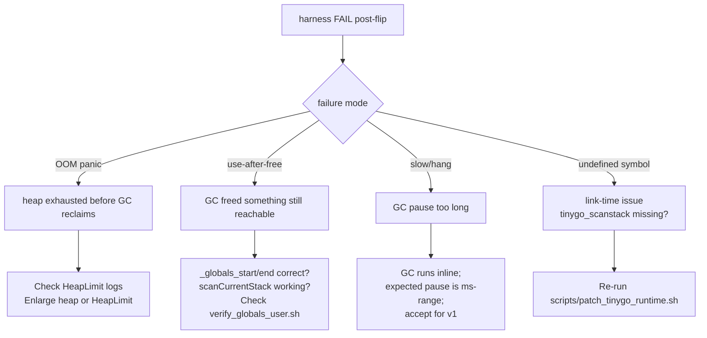

# Userspace `gc=conservative` — Verification Plan

Depends on `userspace_conservative_gc_overview.md`,
`..._linker.md`, `..._runtime.md`. Resolves blockers U6, U7, U8.

## 1. Goal

After every piece of plumbing from the linker + runtime docs
lands, flip `user/target.json:8` to `"gc": "conservative"` and
prove that all 10 user ELFs still boot + pass their harnesses.
Also prove that at least one program that previously failed
under `gc=leaking` now succeeds (demonstrating reclamation
works).

## 2. Per-Binary Test Matrix

For every current user ELF:

| # | ELF | Harness | Pre-flip pass? | GC-specific risk | Post-flip verification |
|---|---|---|---|---|---|
| 1 | `sh.elf` | `tmp/test_sendkey.sh 1` × 10 | Yes | Shell reads keyboard + forks children; no tight alloc loop | All 10 trials `pf=0 exit=3 cat=1` |
| 2 | `hello.elf` | `tmp/test_sendkey.sh 1` (invokes hello via shell) | Yes | Minimal; prints once, exits | Output still contains `Hello from gooos userspace` |
| 3 | `ls.elf` | `tmp/test_sendkey.sh 1` | Yes | Single `sys_fs_list` call, string print loop | Output still lists file names |
| 4 | `cat.elf` | `tmp/test_sendkey.sh 1` | Yes | Read + write loop | Output shows `hello.txt` content |
| 5 | `wc.elf` | `tmp/test_wc_pipe.sh` | Yes | Byte/word/line counter loops | Counts match expected values |
| 6 | `fdprobe.elf` | `tmp/test_fd_probe.sh` | Yes | Tests open/close/dup2/pipe syscalls | `contents=1 read_write=1 err=1 pf=0` |
| 7 | `goprobe.elf` | `tmp/test_goprobe.sh` | Yes | **Spawns ~5 goroutines, heavy chan ops** — GC sees goroutine stacks as heap allocations | `pf=0 begin=1 go_chan=1 select=1 time_sleep=1 yield=1 all=1` |
| 8 | `gochan.elf` | `tmp/test_gochan.sh` | Yes | **Pipeline + select demo; goroutine stacks pinned during execution** | `pf=0 sq=1/1/1/1/1 alpha=1 beta=1 fin=1` |
| 9 | `tinyc.elf` | `tmp/test_tinyc.sh` | Yes | **Tree-walk evaluator allocates AST nodes + Env maps per call; `fib(7)` fixture** | `pf=0 s45=2 fib13=1 forsum=1` + can optionally restore `fib(10)` fixture |
| 10 | `edit.elf` | `tmp/test_edit.sh` | Yes | **Allocations on every insert/delete**; short session fine | `pf=0 hello=1 result: PASS` |

Plus shell-feature harnesses that exercise multiple ELFs:

| Harness | Scope | Post-flip |
|---|---|---|
| `tmp/test_redirect.sh` | `echo > file` + `cat < file` + `wc < file` | `hello_lines=1 pf=0` |
| `tmp/test_pipe.sh` | 2- and 3-stage pipes | `pf=0 exit=3 hello_lines=1 world_lines=1` |
| `tmp/test_pipe_matrix.sh` | 4-way pipe combinations | every combo `pf=0` |

## 3. `maxFileData` Bump

### 3.1 Before the flip

Current `src/fs.go:12` says `maxFileData = 131072` (128 KiB).
Current peak: `tinyc.elf` at 126,512 bytes.

### 3.2 Conservative GC overhead estimate

TinyGo's `gc_conservative.go` adds:

- ~4–6 KiB of Go code (mark + sweep loops).
- A metadata bitmap sized ~`heapSize / blockSize / 4` bytes
  (TinyGo's `gc_conservative.go` uses 2 bits per block) —
  for 1 MiB heap with 16 B blocks: `1 MiB / 16 × 2 bits / 8 =
  16 KiB` of `.bss`.
- The synthetic ELF header (120 B of `.rodata`).
- Per-alloc round-down to 16 B block alignment — tiny ELF
  overhead.

Total ELF growth estimate: **~10 KiB**. `tinyc.elf` projected
to ~137 KiB post-flip — **exceeds 128 KiB cap**. `goprobe.elf`
(89 KiB) and `gochan.elf` (97 KiB) stay well under 128 KiB
but benefit from headroom for future growth.

### 3.3 New value

`maxFileData = 262144` (256 KiB):

- Covers 137 KiB `tinyc.elf` with 119 KiB headroom (47%).
- FS footprint: 32 × 256 KiB = **8 MiB** in kernel `.bss`.

Currently `verify-globals: OK (1 symbols inside [0x...089fa,
0x...473028))` — `0x473028 - 0x89fa = ~0x46a62e` ≈ 4.3 MiB.
Adding 4 MiB for the FS bump pushes the globals range to
~8.3 MiB. Kernel `.heap` region sits after that (per
`src/linker.ld:61-66`, 4 MiB reservation). Kernel identity map
is 1 GiB total. No budget concern.

### 3.4 Validation after bump

- `make build` clean.
- `scripts/verify_globals.sh tmp/kernel.bin` returns OK with
  the new upper bound.
- `ls -l user/build/*.elf` — every ELF well under 256 KiB.

## 4. `scripts/verify_globals_user.sh`

### 4.1 Rationale

The existing `scripts/verify_globals.sh` asserts that
`runtime.runqueue` / `sleepQueue` / `timerQueue` — which hold
`*task.Task` pointers the GC must scan — live inside the
kernel's `[_globals_start, _globals_end)` range. Under
`gc=conservative` the same assertion must hold for every user
ELF.

### 4.2 Proposed script

Generalize the existing script (`scripts/verify_globals.sh`,
full text at the existing path) to take an ELF path argument:

```bash
#!/usr/bin/env bash
# verify_globals_user.sh — assert TinyGo runtime queues in a
# user ELF live inside [_globals_start, _globals_end). Called
# once per ELF from user/Makefile after each ld.lld step.

set -euo pipefail
ELF=${1:?usage: verify_globals_user.sh <user.elf>}

start=$(nm "$ELF" | awk '$3 == "_globals_start" { print $1 }')
end=$(nm "$ELF"   | awk '$3 == "_globals_end"   { print $1 }')

if [[ -z "$start" || -z "$end" ]]; then
    echo "verify-globals-user: missing _globals_start/_globals_end in $ELF" >&2
    exit 1
fi

start_dec=$((16#$start))
end_dec=$((16#$end))

pattern='^runtime[.](runqueue|sleepQueue|timerQueue)$'

bad=0 checked=0
while read -r addr type name; do
    [[ -z "$addr" || -z "$name" ]] && continue
    a=$((16#$addr))
    if (( a < start_dec || a >= end_dec )); then
        printf 'verify-globals-user: %s @ 0x%s (%s) outside [0x%s, 0x%s) in %s\n' \
            "$name" "$addr" "$type" "$start" "$end" "$ELF" >&2
        bad=1
    fi
    checked=$((checked + 1))
done < <(nm "$ELF" | awk -v p="$pattern" '$2 ~ /^[bBdDrR]$/ && $3 ~ p { print $1, $2, $3 }')

if (( checked == 0 )); then
    # User ELFs may DCE unused queues; missing is not an error.
    echo "verify-globals-user: $ELF has no runtime queue symbols (OK — DCE)"
    exit 0
fi

if (( bad == 0 )); then
    echo "verify-globals-user: $ELF OK ($checked symbols inside [0x$start, 0x$end))"
fi

exit $bad
```

Note the tolerance difference vs. the kernel version:
`"$checked" == 0` is not an error because smaller user ELFs
may dead-code-eliminate the timer or sleep queue.

### 4.3 Makefile wiring

Extend the user Makefile's ELF pattern rule
(`user/Makefile:45-52`):

```diff
 $(BUILD)/%.elf: cmd/%/main.go gooos/*.go $(BUILD)/rt0.o ...
 	$(TINYGO) build -target=$(TARGET) -o $(BUILD)/$*_go.o ./cmd/$*
 	$(LD) -m elf_x86_64 -n -T $(LDSCRIPT) -o $@ $(BUILD)/rt0.o ... $(BUILD)/$*_go.o
+	bash ../scripts/verify_globals_user.sh $@
```

Path `../scripts/` because `user/Makefile` runs with CWD at
`user/`.

### 4.4 When to add the script

Land in TODO step 5 of the overview work plan, **before the
JSON flip**. At that point the user linker has
`_globals_start/end` defined, so the script produces
meaningful output even under `gc=leaking` (the queues exist
because `scheduler=tasks`). The script's job is to verify
that the queues stay in the scanned range — a pre-flip test
catches any drift.

## 5. Size-Audit Script Extension

`scripts/embed_elfs.sh` currently converts each `.elf` to a
Go byte array in `src/user_binaries.go`. No size check. Add a
pre-flight assertion:

```diff
 for elf in user/build/*.elf; do
+    size=$(stat -c %s "$elf")
+    if (( size > 262144 )); then  # new maxFileData
+        echo "embed-elfs: $elf is $size bytes > 262144 cap" >&2
+        exit 1
+    fi
     # ... existing embed logic ...
 done
```

Catches future regressions where a user ELF grows past the
cap without anyone noticing.

## 6. Rollback Plan

If any regression lands in production:

1. **Single-commit revert**: `git revert <commit-hash>` where
   `<commit-hash>` is the TODO-step-7 commit (`user/target.json`
   flip). This restores `gc=leaking` and unblocks builds
   immediately.
2. All the plumbing (linker symbols, asm stubs,
   `Process.HeapLimit`, `maxFileData` bump,
   `verify_globals_user.sh`) stays in place — they're
   GC-mode-agnostic and don't hurt under `gc=leaking`. The
   synthetic `__ehdr_start` and `_globals_*` brackets simply
   go unused.
3. Post-revert, investigate the specific regression. If
   it's a false-positive pin bloating the heap, the fix may
   be to enlarge the heap (bump 1 MiB → 2 MiB). If it's an
   ELF-size overflow, the fix is another `maxFileData` bump.

No per-ELF feature flag needed — the GC choice is a global
target-JSON setting. A feature flag would require maintaining
two user builds, doubling CI cost.

## 7. Regression Cadence

After the flip, run the full matrix (§2). Record each result
in `TODO_USGC.md` (created by the implementation session).
Per-harness success criteria as listed.

If any harness fails, the first triage step is:



## 8. Special Case: `fib(10)` in Tiny C

Currently `src/main.go` embeds `fib.tc` using `fib(7)` because
`fib(10)`'s 177 recursive calls exhaust the 256 KiB heap under
`gc=leaking`.

Post-flip, optionally revert `fib.tc` to `fib(10)` and
add an assertion to `tmp/test_tinyc.sh` that expects `55` as
the output. This is **the** demonstrative test that
reclamation works: `fib(10)` needs ~100 KiB of peak live heap
(each recursive frame deallocates on return under GC) vs.
~100 KiB × 177 calls = ~17 MiB total-allocated under leaking.

This is optional post-flip polish, not mandatory for the
flip itself to land. Record as a TODO follow-up in
`TODO_USGC.md`.

## 9. Files to Modify

| File | Change |
|---|---|
| `src/fs.go:12` | `maxFileData = 131072` → `262144` |
| `scripts/verify_globals_user.sh` | NEW — generalized version of `verify_globals.sh` |
| `scripts/embed_elfs.sh` | Add pre-flight 256 KiB size assertion |
| `user/Makefile:45-52` | Invoke `verify_globals_user.sh` after each `ld.lld` link step |
| `src/main.go` (optional post-flip) | Restore `fib(10)` in `fib.tc` fixture |
| `README.md` + `current_impl_doc/userland.md` + `current_impl_doc/memory.md` | Update user-GC status |

## 10. Verification (of this doc's scope)

The per-binary matrix in §2 IS the verification. If every row
is green post-flip, the migration is complete.

## 11. Dependencies

- `userspace_conservative_gc_linker.md` — `_globals_*`
  symbols must exist for `verify_globals_user.sh` to do
  anything useful.
- `userspace_conservative_gc_runtime.md` —
  `tinygo_scanCurrentStack` must exist or user ELFs won't
  link post-flip.

## 12. Open Questions

1. **Should the size-audit cap be parameterized** so it tracks
   `maxFileData`? Easy to do — `scripts/embed_elfs.sh` could
   `grep maxFileData src/fs.go` and read the constant. Low
   priority; explicit constant is fine for v1.
2. **Goroutine-stack false-positive pinning in `gochan` /
   `goprobe`** — these programs allocate multiple goroutine
   stacks. Conservative GC may keep an unreachable stack
   alive because its address bytes appear in another stack's
   scanned words. Acceptable for v1 (bounded by heap size);
   document as a known limitation.

## 13. Risk Register Delta

- **Retires**: `R-user-elf-overflow` (maxFileData bumped).
- **Adds**: `R-false-positive-pin` — conservative collector
  may keep some unreachable blocks live. Bounded by 1 MiB
  heap ceiling; accept.

## 14. Reviewer MINOR notes

Reviewer pass — see `overview.md §10` for the consolidated
list. This doc's specific follow-up:
- §3.2 bitmap estimate corrected to 2 bits/block (~16 KiB)
  (MINOR-4). Does not change the 256 KiB cap decision.
